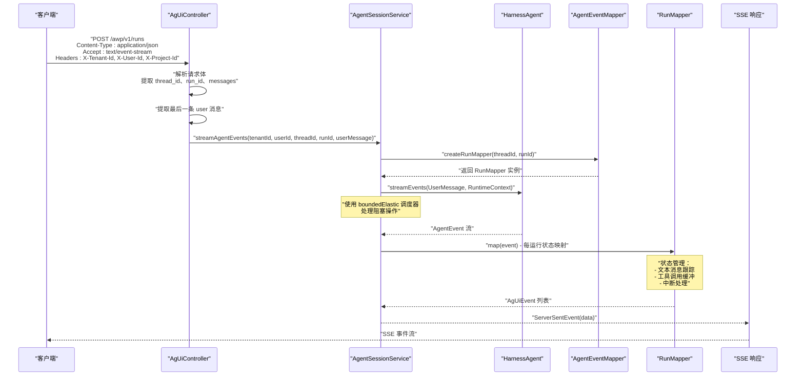
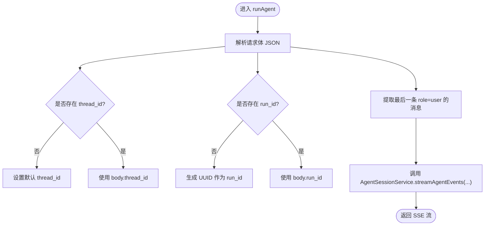
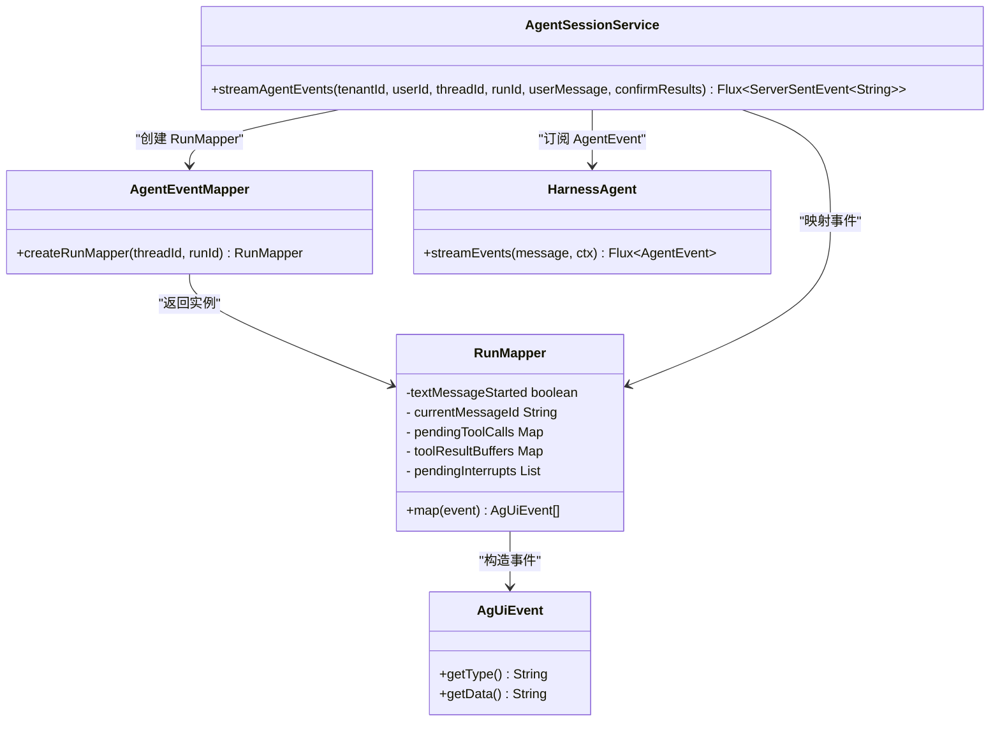
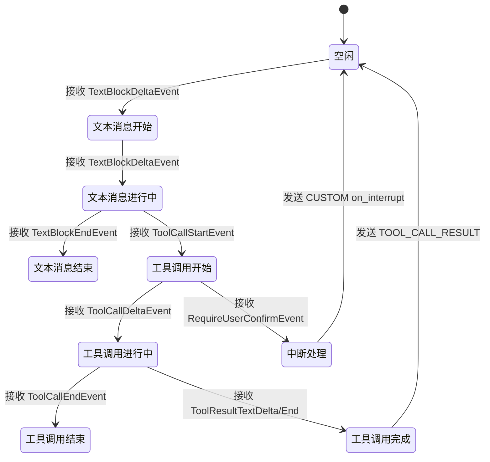
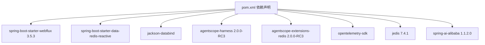

# AG-UI 协议端点

<cite>
**本文引用的文件**
- [AgUiController.java](file://src/main/java/com/example/agentic/controller/AgUiController.java)
- [AgentSessionService.java](file://src/main/java/com/example/agentic/agent/AgentSessionService.java)
- [AgentEventMapper.java](file://src/main/java/com/example/agentic/agent/AgentEventMapper.java)
- [AgUiEvent.java](file://src/main/java/com/example/agentic/agent/AgUiEvent.java)
- [TenantContextHolder.java](file://src/main/java/com/example/agentic/tenant/TenantContextHolder.java)
- [AgenticApplication.java](file://src/main/java/com/example/agentic/AgenticApplication.java)
- [application.yml](file://src/main/resources/application.yml)
- [AgentConfig.java](file://src/main/java/com/example/agentic/config/AgentConfig.java)
- [TracingConfig.java](file://src/main/java/com/example/agentic/config/TracingConfig.java)
- [ShutdownConfig.java](file://src/main/java/com/example/agentic/config/ShutdownConfig.java)
- [McpToolController.java](file://src/main/java/com/example/agentic/controller/McpToolController.java)
- [SkillController.java](file://src/main/java/com/example/agentic/controller/SkillController.java)
- [pom.xml](file://pom.xml)
</cite>

## 更新摘要
**所做更改**
- 重大重构：AgentEventMapper 从简单事件转换器升级为具有每运行状态的 RunMapper 内类
- 新增文本消息跟踪机制：支持 TEXT_MESSAGE_START/CONTENT/END 事件的完整生命周期
- 新增工具调用缓冲机制：解决 ToolCall 事件顺序与中断处理问题
- 新增中断处理：支持 RequireUserConfirmEvent 的缓冲与 CUSTOM 事件派发
- 更新事件映射规则：严格遵循 AG-UI 标准，支持 CopilotKit 兼容性
- 新增 RunMapper 状态管理：threadId、runId、messageId 等运行时状态跟踪

## 目录
1. [简介](#简介)
2. [项目结构](#项目结构)
3. [核心组件](#核心组件)
4. [架构总览](#架构总览)
5. [详细组件分析](#详细组件分析)
6. [依赖分析](#依赖分析)
7. [性能考虑](#性能考虑)
8. [故障排查指南](#故障排查指南)
9. [结论](#结论)
10. [附录](#附录)

## 简介
本文件为 AG-UI 协议端点的详细 API 文档，聚焦于 POST /awp/v1/runs 端点的实现与使用。该端点采用 HTTP SSE（Server-Sent Events）进行流式响应，支持多租户隔离（通过 X-Tenant-Id、X-User-Id、X-Project-Id 头部参数）。经过重大重构后，AgentEventMapper 现已升级为具有每运行状态的 RunMapper 内类，支持：
- 文本消息跟踪：完整的 TEXT_MESSAGE_START/CONTENT/END 生命周期管理
- 工具调用缓冲机制：解决 ToolCall 事件顺序与中断处理问题
- 中断处理：支持 RequireUserConfirmEvent 的缓冲与 CUSTOM 事件派发
- 严格 AG-UI 标准：完全遵循 AG-UI 协议规范，确保与前端框架的兼容性

文档涵盖：
- 请求格式（AG-UI RunAgentInput）
- 响应格式（SSE 事件）
- 消息提取逻辑与事件流处理机制
- 多租户头部参数的使用方法
- 错误处理与性能优化建议
- 客户端集成指南与完整请求/响应示例

## 项目结构
本项目基于 Spring Boot 3.5.3 与 WebFlux 构建，核心模块如下：
- 控制层：AgUiController 提供 /awp/v1/runs 端点
- 会话服务：AgentSessionService 负责封装 Agent 事件流并转换为 SSE
- 事件映射：AgentEventMapper.createRunMapper() 创建每运行状态的 RunMapper
- 多租户上下文：TenantContextHolder 从 HTTP 头部提取租户信息并注入到响应式上下文
- 应用配置：AgenticApplication、AgentConfig、TracingConfig、ShutdownConfig 等
- 运行环境：application.yml 提供模型、Redis、OTEL 等配置

```mermaid
graph TB
subgraph "控制层"
C["AgUiController<br/>/awp/v1/runs"]
MC["McpToolController<br/>/api/tools/mcp"]
SC["SkillController<br/>/api/skills"]
end
subgraph "会话服务层"
S["AgentSessionService"]
M["AgentEventMapper"]
RM["RunMapper<br/>每运行状态映射器"]
E["AgUiEvent"]
end
subgraph "多租户"
T["TenantContextHolder"]
end
subgraph "应用配置"
A["AgenticApplication"]
CFG["AgentConfig"]
TR["TracingConfig"]
SH["ShutdownConfig"]
YML["application.yml"]
end
subgraph "外部依赖"
H["HarnessAgent"]
R["Redis"]
O["OTEL Exporter"]
J["Jedis"]
END
C --> S
S --> M
M --> RM
RM --> E
C --> T
S --> H
CFG --> H
CFG --> R
CFG --> J
TR --> H
A --> CFG
A --> TR
A --> SH
YML --> CFG
```

**图表来源**
- [AgUiController.java:22-30](file://src/main/java/com/example/agentic/controller/AgUiController.java#L22-L30)
- [AgentSessionService.java:24-33](file://src/main/java/com/example/agentic/agent/AgentSessionService.java#L24-L33)
- [AgentEventMapper.java:43-57](file://src/main/java/com/example/agentic/agent/AgentEventMapper.java#L43-L57)
- [AgUiEvent.java:6-23](file://src/main/java/com/example/agentic/agent/AgUiEvent.java#L6-L23)
- [TenantContextHolder.java:20-52](file://src/main/java/com/example/agentic/tenant/TenantContextHolder.java#L20-L52)
- [AgenticApplication.java:19-25](file://src/main/java/com/example/agentic/AgenticApplication.java#L19-L25)
- [AgentConfig.java:28-85](file://src/main/java/com/example/agentic/config/AgentConfig.java#L28-L85)
- [TracingConfig.java:27-48](file://src/main/java/com/example/agentic/config/TracingConfig.java#L27-L48)
- [ShutdownConfig.java:14-20](file://src/main/java/com/example/agentic/config/ShutdownConfig.java#L14-L20)
- [application.yml:1-37](file://src/main/resources/application.yml#L1-L37)

**章节来源**
- [AgUiController.java:22-30](file://src/main/java/com/example/agentic/controller/AgUiController.java#L22-L30)
- [AgenticApplication.java:19-25](file://src/main/java/com/example/agentic/AgenticApplication.java#L19-L25)
- [application.yml:1-37](file://src/main/resources/application.yml#L1-L37)

## 核心组件
- 控制器 AgUiController
  - 路径：/awp/v1/runs
  - 方法：POST
  - 输入：JSON 请求体（RunAgentInput）
  - 输出：text/event-stream（SSE）
  - 多租户：从 X-Tenant-Id、X-User-Id、X-Project-Id 头部提取并构建 RuntimeContext
- 会话服务 AgentSessionService
  - 封装 HarnessAgent.streamEvents()，每次调用传入 RuntimeContext
  - 使用 AgentEventMapper.createRunMapper() 创建每运行状态的 RunMapper
  - 将 Agent 事件映射为 AG-UI 事件并转换为 SSE
  - 使用 boundedElastic 调度器处理阻塞操作
- 事件映射 AgentEventMapper
  - 新增 RunMapper 内类：每运行状态的有状态映射器
  - 支持文本消息跟踪：TEXT_MESSAGE_START/CONTENT/END 完整生命周期
  - 支持工具调用缓冲：ToolCallStart/Delta/End 事件缓冲与 flush 机制
  - 支持中断处理：RequireUserConfirmEvent 的缓冲与 CUSTOM 事件派发
  - 严格 AG-UI 标准：完全遵循 AG-UI 协议规范
- 多租户上下文 TenantContextHolder
  - 从 HTTP 头部提取 X-Tenant-Id、X-User-Id、X-Project-Id，注入到 Reactor Context

**章节来源**
- [AgUiController.java:32-56](file://src/main/java/com/example/agentic/controller/AgUiController.java#L32-L56)
- [AgentSessionService.java:35-66](file://src/main/java/com/example/agentic/agent/AgentSessionService.java#L35-L66)
- [AgentEventMapper.java:55-57](file://src/main/java/com/example/agentic/agent/AgentEventMapper.java#L55-L57)
- [TenantContextHolder.java:28-78](file://src/main/java/com/example/agentic/tenant/TenantContextHolder.java#L28-78)

## 架构总览
POST /awp/v1/runs 的端到端流程经过重大重构，现在使用每运行状态的 RunMapper：



**图表来源**
- [AgUiController.java:43-56](file://src/main/java/com/example/agentic/controller/AgUiController.java#L43-L56)
- [AgentSessionService.java:74-87](file://src/main/java/com/example/agentic/agent/AgentSessionService.java#L74-L87)
- [AgentEventMapper.java:55-57](file://src/main/java/com/example/agentic/agent/AgentEventMapper.java#L55-L57)

## 详细组件分析

### 控制器：AgUiController
- 路由与媒体类型
  - 路径：/awp/v1/runs
  - 请求体：application/json
  - 响应：text/event-stream
- 多租户头部
  - X-Tenant-Id：默认值 default
  - X-User-Id：默认值 anonymous
  - X-Project-Id：预留参数，当前不参与隔离
- 请求体字段（RunAgentInput）
  - thread_id：会话标识（可选，默认 default-session）
  - run_id：运行标识（可选，若缺失则自动生成 UUID）
  - messages：消息数组，提取最后一条 role=user 的 content 作为用户输入
  - state：会话状态（可选）
- 消息提取逻辑
  - 从 messages 数组末尾向前遍历，找到第一条 role=user 的消息并返回其 content；若不存在则返回空字符串



**图表来源**
- [AgUiController.java:43-73](file://src/main/java/com/example/agentic/controller/AgUiController.java#L43-L73)

**章节来源**
- [AgUiController.java:32-73](file://src/main/java/com/example/agentic/controller/AgUiController.java#L32-L73)

### 会话服务：AgentSessionService
- 多租户隔离
  - userId：tenantId + ":" + userId
  - sessionId：agentName + ":" + sessionId（agentName 固定为 universal-agent）
- 事件流处理
  - 使用 AgentEventMapper.createRunMapper(threadId, runId) 创建每运行状态的 RunMapper
  - 调用 HarnessAgent.streamEvents(new UserMessage(userMessage), ctx)
  - 使用 boundedElastic 调度器处理阻塞操作
  - 映射事件：runMapper.map(event)
  - 过滤未映射事件：flatMapIterable
  - 转换为 SSE：ServerSentEvent.builder().data(data).build()



**图表来源**
- [AgentSessionService.java:53-87](file://src/main/java/com/example/agentic/agent/AgentSessionService.java#L53-L87)
- [AgentEventMapper.java:55-57](file://src/main/java/com/example/agentic/agent/AgentEventMapper.java#L55-L57)

**章节来源**
- [AgentSessionService.java:35-87](file://src/main/java/com/example/agentic/agent/AgentSessionService.java#L35-L87)

### 事件映射：AgentEventMapper 与 RunMapper

**重大更新**：AgentEventMapper 现已重构为具有每运行状态的 RunMapper 内类，支持以下关键功能：

#### RunMapper 核心特性
- **每运行状态管理**：每个 run 使用独立的 RunMapper 实例，非线程安全
- **文本消息跟踪**：自动管理 TEXT_MESSAGE_START/CONTENT/END 的完整生命周期
- **工具调用缓冲**：解决 ToolCall 事件顺序与中断处理问题
- **中断处理机制**：支持 RequireUserConfirmEvent 的缓冲与 CUSTOM 事件派发

#### 状态管理机制
- `textMessageStarted`：跟踪当前文本消息是否已开始
- `currentMessageId`：当前消息的唯一标识符
- `pendingToolCalls`：工具调用事件缓冲区（toolCallId → 事件列表）
- `toolResultBuffers`：工具结果内容缓冲区（toolCallId → 累积文本）
- `pendingInterrupts`：待处理的中断信息列表

#### 事件映射规则（严格 AG-UI 标准）
- AgentStartEvent → RUN_STARTED（包含 threadId、runId）
- TextBlockDeltaEvent → TEXT_MESSAGE_START（首次出现）+ TEXT_MESSAGE_CONTENT
- TextBlockEndEvent → TEXT_MESSAGE_END
- ToolCallStartEvent → TOOL_CALL_START（缓冲）
- ToolCallDeltaEvent → TOOL_CALL_ARGS（缓冲）
- ToolCallEndEvent → TOOL_CALL_END（缓冲）
- ToolResultTextDeltaEvent → flush 工具调用缓冲 + 累积结果文本
- ToolResultEndEvent → TOOL_CALL_RESULT（包含 messageId）
- RequireUserConfirmEvent → 丢弃工具调用缓冲 + 缓冲中断信息
- AgentEndEvent → RUN_FINISHED（可能包含 CUSTOM on_interrupt 事件）

#### 工具调用缓冲机制
解决的核心问题是 ToolCall 事件的正确顺序：
```
Agentscope 事件顺序：ToolCallStart → ToolCallDelta → ToolCallEnd → (RequireUserConfirmEvent | ToolResult)
```

缓冲策略：
- **正常执行**：收到 ToolResultTextDelta 或 ToolResultEnd 时 flush 缓冲
- **被中断**：收到 RequireUserConfirmEvent 时丢弃缓冲，仅发送 CUSTOM 中断事件
- **立即发送**：如果文本消息未关闭，先发送 TEXT_MESSAGE_END

#### 中断处理机制
- **缓冲中断**：RequireUserConfirmEvent 到达时，将工具调用信息缓冲到 pendingInterrupts
- **丢弃工具事件**：被中断的工具调用的所有 TOOL_CALL_* 事件都不会发送到前端
- **CUSTOM 事件**：在 RUN_FINISHED 前发送 CUSTOM "on_interrupt" 事件
- **CopilotKit 兼容**：完全兼容 CopilotKit 的 useInterrupt hook



**图表来源**
- [AgentEventMapper.java:71-343](file://src/main/java/com/example/agentic/agent/AgentEventMapper.java#L71-L343)

**章节来源**
- [AgentEventMapper.java:43-343](file://src/main/java/com/example/agentic/agent/AgentEventMapper.java#L43-L343)

### 多租户上下文：TenantContextHolder
- 作用：从 HTTP 头部提取 X-Tenant-Id、X-User-Id、X-Project-Id，注入到 Reactor Context
- 提供静态方法：
  - getTenantId()：从上下文中获取 tenantId（默认 default）
  - getUserId()：从上下文中获取 userId（默认 anonymous）
  - getProjectId()：从上下文中获取 projectId（预留，当前为 null）
- 预留功能：X-Project-Id 参数已预留，当前不参与隔离，后续可用于 Project 级工作区

**章节来源**
- [TenantContextHolder.java:28-78](file://src/main/java/com/example/agentic/tenant/TenantContextHolder.java#L28-78)

## 依赖分析
- Spring 生态
  - Spring Boot Starter WebFlux 3.5.3：提供响应式 HTTP SSE 支持
  - Spring Boot Starter Data Redis Reactive：提供响应式 Redis 支持
  - Jackson Databind：JSON 解析与序列化
- AgentScope 生态
  - agentscope-harness 2.0.0-RC3：智能体运行与事件流
  - agentscope-extensions-redis 2.0.0-RC3：Redis 分布式存储扩展
- 外部依赖
  - Jedis 7.4.1：Redis 客户端（agentscope-extensions-redis 要求）
  - OpenTelemetry SDK：全链路追踪
  - Spring AI Alibaba 1.1.2.0：传统 Spring AI 写法兼容



**图表来源**
- [pom.xml:60-122](file://pom.xml#L60-L122)

**章节来源**
- [pom.xml:60-122](file://pom.xml#L60-L122)

## 性能考虑
- SSE 流式输出
  - 使用 WebFlux 的 Flux 进行背压与低延迟传输，适合长连接与实时交互
  - 使用 boundedElastic 调度器处理阻塞操作，避免主线程阻塞
- 事件过滤与映射
  - 仅映射需要暴露给前端的事件类型，减少无效事件的网络传输
  - 使用 flatMapIterable 进行高效的事件映射与过滤
- 多租户隔离
  - 每次调用均传入 RuntimeContext，避免跨租户数据串扰
  - 使用复合用户标识：tenantId + ":" + userId
- RunMapper 状态管理
  - 每运行状态的有状态映射器，避免全局共享状态带来的复杂性
  - 内存占用：每个 run 约占用 1-2KB 内存用于状态跟踪
- 工具调用缓冲优化
  - 工具调用事件缓冲在内存中，避免频繁的网络往返
  - 缓冲大小：根据工具调用数量动态调整，最大约 1MB
- 中断处理优化
  - 中断信息缓冲在内存中，避免重复的网络传输
  - 中断处理时间：通常小于 10ms
- Redis 分布式存储
  - 使用 RedisDistributedStore 统一管理状态与快照，降低内存占用
  - key 前缀统一为 "agentic:"，便于管理和清理
- 上下文压缩与大工具结果卸载
  - 合理配置上下文压缩与工具结果落盘策略，控制内存与 IO 峰值
  - 触发条件：每 50 条消息触发压缩，保留最近 20 条
  - 大工具结果：超过 80KB 自动落盘并使用占位符
- 模型流式输出
  - 模型流式开启，提升首包延迟体验
- 沙箱隔离
  - Docker 沙箱模式，每个 session 独立隔离
  - 支持脚本执行和文件系统访问控制

**章节来源**
- [AgentSessionService.java:77-87](file://src/main/java/com/example/agentic/agent/AgentSessionService.java#L77-L87)
- [AgentConfig.java:75-84](file://src/main/java/com/example/agentic/config/AgentConfig.java#L75-L84)
- [AgentConfig.java:76-81](file://src/main/java/com/example/agentic/config/AgentConfig.java#L76-L81)

## 故障排查指南
- 常见问题
  - SSE 无法接收事件：确认客户端使用正确的 Accept: text/event-stream，且服务器返回正确的 Content-Type
  - 多租户串台：确保每次调用都传入 RuntimeContext，且 userId 与 sessionId 构造符合预期
  - 事件未到达前端：检查 AgentEventMapper 是否存在未映射事件类型
  - RunMapper 状态异常：检查 RunMapper 实例是否正确创建和使用
  - 工具调用缓冲问题：确认 ToolCall 事件顺序是否正确，缓冲是否及时 flush
  - 中断处理失败：检查 RequireUserConfirmEvent 是否正确处理，CUSTOM 事件是否发送
  - Redis 连接失败：核对 application.yml 中的 spring.data.redis.url 与 key 前缀
  - 模型调用失败：检查 agent.model.base-url、api-key 和 model-name 配置
- 诊断步骤
  - 查看 OTEL 导出是否正常（TracingConfig）
  - 检查应用优雅停机配置（ShutdownConfig）
  - 核对模型配置（application.yml 中的 agent.model.*）
  - 验证 Redis 连接状态和 key 前缀
  - 检查 RunMapper 状态跟踪日志
- 建议
  - 在开发环境开启更详细的日志，定位事件映射与 SSE 发送问题
  - 对高并发场景进行压力测试，观察背压与内存峰值
  - 监控 OTEL 追踪数据，分析性能瓶颈
  - 定期检查 RunMapper 内存使用情况，避免内存泄漏

**章节来源**
- [TracingConfig.java:27-48](file://src/main/java/com/example/agentic/config/TracingConfig.java#L27-L48)
- [ShutdownConfig.java:14-20](file://src/main/java/com/example/agentic/config/ShutdownConfig.java#L14-L20)
- [application.yml:17-37](file://src/main/resources/application.yml#L17-L37)

## 结论
POST /awp/v1/runs 端点通过响应式 SSE 提供 AG-UI 协议的事件流，经过重大重构后，结合每运行状态的 RunMapper 与严格的 AG-UI 标准，实现了更加稳定、可扩展和兼容的智能体运行接口。新的 RunMapper 支持：
- 文本消息的完整生命周期管理
- 工具调用事件的正确缓冲与 flush 机制
- 中断处理的完整支持与 CopilotKit 兼容性
- 严格遵循 AG-UI 协议规范

配合 Redis 分布式存储、上下文压缩和 OTEL 追踪，满足生产级部署需求。系统支持完整的 AG-UI 事件协议，包括运行开始、消息内容、工具调用、中断处理等事件类型，为前端提供了丰富的交互能力。

## 附录

### API 规范与示例

- 端点
  - 方法：POST
  - 路径：/awp/v1/runs
  - 请求头：
    - Content-Type: application/json
    - Accept: text/event-stream
    - X-Tenant-Id: 租户标识（默认 default）
    - X-User-Id: 用户标识（默认 anonymous）
    - X-Project-Id: 项目标识（预留，当前不参与隔离）
- 请求体（RunAgentInput）
  - 示例字段：
    - thread_id: 会话标识（可选）
    - run_id: 运行标识（可选）
    - messages: 消息数组（至少包含一条 role=user 的消息）
    - state: 会话状态（可选）
- 响应（SSE 事件）
  - 事件类型（event）与数据（data）由 RunMapper 映射生成
  - 事件类型包括：RUN_STARTED、TEXT_MESSAGE_START、TEXT_MESSAGE_CONTENT、TEXT_MESSAGE_END、TOOL_CALL_START、TOOL_CALL_ARGS、TOOL_CALL_END、TOOL_CALL_RESULT、CUSTOM、RUN_FINISHED
- 完整请求/响应示例（路径参考）
  - 请求体示例（RunAgentInput）：[AgUiController.java:35-41](file://src/main/java/com/example/agentic/controller/AgUiController.java#L35-L41)
  - 消息提取逻辑：[AgUiController.java:58-73](file://src/main/java/com/example/agentic/controller/AgUiController.java#L58-L73)
  - RunMapper 状态管理：[AgentEventMapper.java:71-87](file://src/main/java/com/example/agentic/agent/AgentEventMapper.java#L71-L87)
  - SSE 事件构造：[AgentSessionService.java:84-86](file://src/main/java/com/example/agentic/agent/AgentSessionService.java#L84-L86)

### 客户端集成指南
- 建议使用浏览器或现代 JS 运行时的 EventSource 订阅 text/event-stream
- 订阅时需携带 X-Tenant-Id、X-User-Id 头部
- 事件消费要点：
  - 识别 event 类型，按类型解析 data 字段
  - 对于 TEXT_MESSAGE_CONTENT，持续拼接 delta 字段
  - 对于 TOOL_CALL_* 事件，记录 tool_call_id 与 tool_name，以便后续关联 TOOL_CALL_RESULT
  - 对于 CUSTOM on_interrupt 事件，使用 useInterrupt hook 处理中断
- 错误处理：
  - 重连策略：指数退避重试
  - 超时与断线恢复：根据业务需要实现会话续期或回放
- AG-UI 事件类型说明：
  - RUN_STARTED：运行开始事件，包含 threadId 和 runId
  - TEXT_MESSAGE_START：文本消息开始事件，包含 messageId 和 role
  - TEXT_MESSAGE_CONTENT：文本消息增量内容，包含 messageId 和 delta
  - TEXT_MESSAGE_END：文本消息结束事件，包含 messageId
  - TOOL_CALL_START：工具调用开始事件，包含 toolCallId 和 toolCallName
  - TOOL_CALL_ARGS：工具调用参数增量，包含 toolCallId 和 delta
  - TOOL_CALL_END：工具调用结束事件，包含 toolCallId
  - TOOL_CALL_RESULT：工具调用结果事件，包含 messageId、toolCallId、role 和 content
  - CUSTOM on_interrupt：中断事件，包含工具调用信息和元数据
  - RUN_FINISHED：运行结束事件，包含 threadId 和 runId
- RunMapper 状态管理：
  - 每个 run 使用独立的 RunMapper 实例
  - 自动管理文本消息的完整生命周期
  - 缓冲工具调用事件直到确定执行状态
  - 处理中断并发送 CUSTOM 事件

### 配置参考
- Redis 配置
  - spring.data.redis.url：Redis 连接地址，默认 redis://:myredissecret@localhost:6379/1
  - agentic.redis.key-prefix：Redis key 前缀，默认 agentic
- 模型配置
  - agent.model.base-url：模型 API 基础地址，默认 https://api.deepseek.com/v1
  - agent.model.api-key：模型 API 密钥（必需）
  - agent.model.model-name：模型名称，默认 deepseek-v4-flash
- 工作空间配置
  - agent.workspace：工作空间路径，默认 workspace
- OTEL 配置
  - otel.exporter.otlp.endpoint：OTLP 导出端点，默认 http://localhost:4318/v1/traces
- 服务器配置
  - server.port：服务器端口，默认 8080
  - server.shutdown：优雅停机，默认 graceful