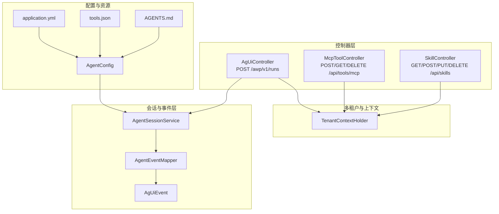
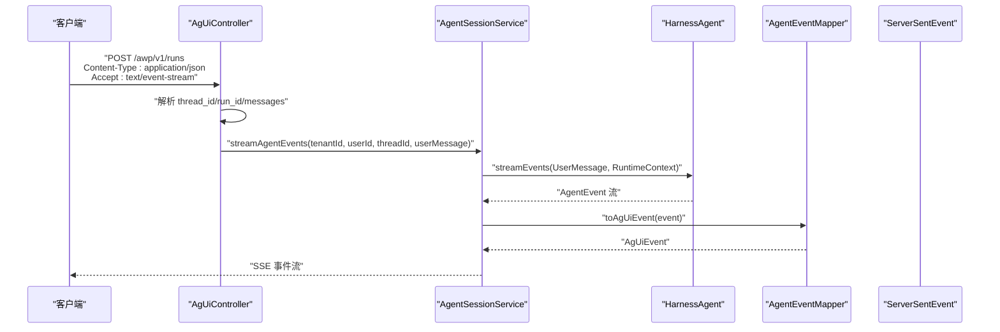
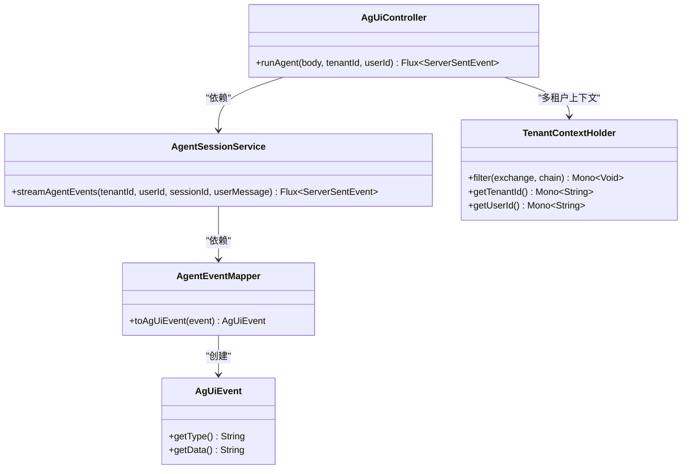

# API 参考

<cite>
**本文引用的文件**
- [AgUiController.java](file://src/main/java/com/example/agentic/controller/AgUiController.java)
- [McpToolController.java](file://src/main/java/com/example/agentic/controller/McpToolController.java)
- [SkillController.java](file://src/main/java/com/example/agentic/controller/SkillController.java)
- [AgentSessionService.java](file://src/main/java/com/example/agentic/agent/AgentSessionService.java)
- [AgentEventMapper.java](file://src/main/java/com/example/agentic/agent/AgentEventMapper.java)
- [AgUiEvent.java](file://src/main/java/com/example/agentic/agent/AgUiEvent.java)
- [TenantContextHolder.java](file://src/main/java/com/example/agentic/tenant/TenantContextHolder.java)
- [AgentConfig.java](file://src/main/java/com/example/agentic/config/AgentConfig.java)
- [application.yml](file://src/main/resources/application.yml)
- [tools.json](file://src/main/resources/workspace/tools.json)
- [AGENTS.md](file://src/main/resources/workspace/AGENTS.md)
</cite>

## 目录
1. [简介](#简介)
2. [项目结构](#项目结构)
3. [核心组件](#核心组件)
4. [架构总览](#架构总览)
5. [详细组件分析](#详细组件分析)
6. [依赖关系分析](#依赖关系分析)
7. [性能与扩展性](#性能与扩展性)
8. [故障排查指南](#故障排查指南)
9. [结论](#结论)
10. [附录](#附录)

## 简介
本文件为智能代理平台的完整 API 参考，覆盖以下接口：
- AG-UI 协议端点：POST /awp/v1/runs（SSE 流式输出）
- MCP 工具管理 API：POST/GET/DELETE /api/tools/mcp
- 技能控制器接口：GET/POST/PUT/DELETE /api/skills（工作区级别）

文档提供每个端点的 HTTP 方法、URL 模式、请求/响应格式、认证方式、参数说明、返回值定义、错误码说明与使用示例，并补充协议特定的调试与监控方法。

## 项目结构
- 控制器层：AgUiController、McpToolController、SkillController
- 会话与事件层：AgentSessionService、AgentEventMapper、AgUiEvent
- 多租户与上下文：TenantContextHolder
- 配置与启动：AgentConfig、application.yml
- 工作区资源：tools.json、AGENTS.md

图表来源
- [AgUiController.java:12-75](file://src/main/java/com/example/agentic/controller/AgUiController.java#L12-L75)
- [McpToolController.java:11-69](file://src/main/java/com/example/agentic/controller/McpToolController.java#L11-L69)
- [SkillController.java:17-104](file://src/main/java/com/example/agentic/controller/SkillController.java#L17-L104)
- [AgentSessionService.java:13-63](file://src/main/java/com/example/agentic/agent/AgentSessionService.java#L13-L63)
- [AgentEventMapper.java:15-120](file://src/main/java/com/example/agentic/agent/AgentEventMapper.java#L15-L120)
- [AgUiEvent.java:3-24](file://src/main/java/com/example/agentic/agent/AgUiEvent.java#L3-L24)
- [TenantContextHolder.java:10-59](file://src/main/java/com/example/agentic/tenant/TenantContextHolder.java#L10-L59)
- [AgentConfig.java:21-84](file://src/main/java/com/example/agentic/config/AgentConfig.java#L21-L84)
- [application.yml:1-25](file://src/main/resources/application.yml#L1-L25)
- [tools.json:1-12](file://src/main/resources/workspace/tools.json#L1-L12)
- [AGENTS.md:1-19](file://src/main/resources/workspace/AGENTS.md#L1-L19)

章节来源
- [AgUiController.java:12-75](file://src/main/java/com/example/agentic/controller/AgUiController.java#L12-L75)
- [McpToolController.java:11-69](file://src/main/java/com/example/agentic/controller/McpToolController.java#L11-L69)
- [SkillController.java:17-104](file://src/main/java/com/example/agentic/controller/SkillController.java#L17-L104)
- [AgentSessionService.java:13-63](file://src/main/java/com/example/agentic/agent/AgentSessionService.java#L13-L63)
- [AgentEventMapper.java:15-120](file://src/main/java/com/example/agentic/agent/AgentEventMapper.java#L15-L120)
- [AgUiEvent.java:3-24](file://src/main/java/com/example/agentic/agent/AgUiEvent.java#L3-L24)
- [TenantContextHolder.java:10-59](file://src/main/java/com/example/agentic/tenant/TenantContextHolder.java#L10-L59)
- [AgentConfig.java:21-84](file://src/main/java/com/example/agentic/config/AgentConfig.java#L21-L84)
- [application.yml:1-25](file://src/main/resources/application.yml#L1-L25)
- [tools.json:1-12](file://src/main/resources/workspace/tools.json#L1-L12)
- [AGENTS.md:1-19](file://src/main/resources/workspace/AGENTS.md#L1-L19)

## 核心组件
- AG-UI 协议端点：接收 AG-UI RunAgentInput，通过 SSE 输出 RUN_STARTED、TEXT_MESSAGE_CONTENT、TEXT_MESSAGE_END、TOOL_CALL_START、TOOL_CALL_END、TOOL_CALL_RESULT、RUN_FINISHED 等事件。
- MCP 工具管理：支持动态注册、列出与注销 MCP Server，便于运行时热插拔工具。
- 技能控制器：管理工作区 skills 目录下的技能文件，提供 CRUD 接口。
- 多租户与上下文：从 HTTP 头提取 X-Tenant-Id、X-User-Id，注入 Reactor Context，确保会话隔离。
- 配置与资源：通过 application.yml 配置模型、Redis、OTel 导出等；tools.json 定义允许的工具集。

章节来源
- [AgUiController.java:32-75](file://src/main/java/com/example/agentic/controller/AgUiController.java#L32-L75)
- [McpToolController.java:24-69](file://src/main/java/com/example/agentic/controller/McpToolController.java#L24-L69)
- [SkillController.java:43-104](file://src/main/java/com/example/agentic/controller/SkillController.java#L43-L104)
- [TenantContextHolder.java:16-59](file://src/main/java/com/example/agentic/tenant/TenantContextHolder.java#L16-L59)
- [AgentConfig.java:28-84](file://src/main/java/com/example/agentic/config/AgentConfig.java#L28-L84)
- [application.yml:1-25](file://src/main/resources/application.yml#L1-L25)
- [tools.json:1-12](file://src/main/resources/workspace/tools.json#L1-L12)

## 架构总览
下图展示 AG-UI 请求从控制器到事件流的端到端流程，以及多租户上下文如何贯穿其中。

图表来源
- [AgUiController.java:43-56](file://src/main/java/com/example/agentic/controller/AgUiController.java#L43-L56)
- [AgentSessionService.java:43-61](file://src/main/java/com/example/agentic/agent/AgentSessionService.java#L43-L61)
- [AgentEventMapper.java:45-97](file://src/main/java/com/example/agentic/agent/AgentEventMapper.java#L45-L97)

章节来源
- [AgUiController.java:43-56](file://src/main/java/com/example/agentic/controller/AgUiController.java#L43-L56)
- [AgentSessionService.java:43-61](file://src/main/java/com/example/agentic/agent/AgentSessionService.java#L43-L61)
- [AgentEventMapper.java:45-97](file://src/main/java/com/example/agentic/agent/AgentEventMapper.java#L45-L97)

## 详细组件分析

### AG-UI 协议端点
- 端点：POST /awp/v1/runs
- 认证与多租户：通过请求头 X-Tenant-Id、X-User-Id 提供多租户上下文，最终拼接为 RuntimeContext.userId 与 RuntimeContext.sessionId。
- 输入（RunAgentInput）：
  - thread_id：会话标识（可选，默认生成）
  - run_id：运行标识（可选，默认生成）
  - messages：消息数组，取最后一条 role=user 的内容作为用户输入
  - state：任意状态对象（可选）
- 输出：SSE 事件流，事件类型包括 RUN_STARTED、TEXT_MESSAGE_CONTENT、TEXT_MESSAGE_END、TOOL_CALL_START、TOOL_CALL_END、TOOL_CALL_RESULT、RUN_FINISHED。
- 成功响应：200 OK，Content-Type: text/event-stream
- 错误响应：由底层异常处理机制决定（Spring WebFlux 默认行为），常见如 400/404/500。
- 使用示例（curl）：
  - curl -N -H "Content-Type: application/json" -H "Accept: text/event-stream" -H "X-Tenant-Id: tenant1" -H "X-User-Id: user1" -d '{"thread_id":"session-xxx","run_id":"run-xxx","messages":[{"role":"user","content":"hello"}],"state":{}}' http://localhost:8080/awp/v1/runs

章节来源
- [AgUiController.java:12-75](file://src/main/java/com/example/agentic/controller/AgUiController.java#L12-L75)
- [AgentSessionService.java:43-61](file://src/main/java/com/example/agentic/agent/AgentSessionService.java#L43-L61)
- [AgentEventMapper.java:18-28](file://src/main/java/com/example/agentic/agent/AgentEventMapper.java#L18-L28)
- [TenantContextHolder.java:25-41](file://src/main/java/com/example/agentic/tenant/TenantContextHolder.java#L25-L41)

### MCP 工具管理 API
- 端点：POST /api/tools/mcp（注册）、GET /api/tools/mcp（列出）、DELETE /api/tools/mcp（注销）
- 认证：无特殊认证要求（基于 Spring Boot 默认配置）
- 请求体（注册）：
  - transport：传输方式（例如 "sse"）
  - url：MCP 服务器地址
- 响应体（注册）：
  - status：注册状态（如 "registered"）
  - transport：传输方式
  - url：注册的 MCP 服务器地址
- 响应体（列出）：以 transport URL 为键、状态为值的映射
- 响应体（注销）：包含状态与被移除的 url
- 成功状态码：200 OK（GET/DELETE）、201 Created（POST）
- 错误响应：如请求体缺失字段，可能返回 400；注销不存在的 URL 可能返回 404 或 200（取决于实现）
- 使用示例（curl）：
  - 注册：curl -X POST http://localhost:8080/api/tools/mcp -H "Content-Type: application/json" -d '{"transport":"sse","url":"http://localhost:3000/mcp"}'
  - 列表：curl http://localhost:8080/api/tools/mcp
  - 注销：curl -X DELETE http://localhost:8080/api/tools/mcp -H "Content-Type: application/json" -d '{"url":"http://localhost:3000/mcp"}'

章节来源
- [McpToolController.java:24-69](file://src/main/java/com/example/agentic/controller/McpToolController.java#L24-L69)

### 技能控制器接口
- 端点：GET/POST/PUT/DELETE /api/skills
- 认证：无特殊认证要求（基于 Spring Boot 默认配置）
- 工作区：技能文件位于工作区目录下的 skills 子目录（默认 workspace/skills）
- GET /api/skills：返回当前工作区下所有技能文件名列表
- POST /api/skills：创建新技能
  - 请求体：name（文件名，不含扩展名）、content（技能内容）
  - 成功：201 Created，返回字符串提示
- PUT /api/skills/{name}：更新现有技能
  - 路径参数：name（技能文件名，不含扩展名）
  - 请求体：content（新内容）
  - 成功：200 OK，返回字符串提示
- DELETE /api/skills/{name}：删除技能
  - 路径参数：name（技能文件名，不含扩展名）
  - 成功：200 OK，返回字符串提示
- 错误响应：当技能不存在或写入失败时，抛出异常（如 400/500）
- 使用示例（curl）：
  - 列表：curl http://localhost:8080/api/skills
  - 创建：curl -X POST http://localhost:8080/api/skills -H "Content-Type: application/json" -d '{"name":"test","content":"技能内容"}'
  - 更新：curl -X PUT http://localhost:8080/api/skills/test -H "Content-Type: application/json" -d '{"content":"新内容"}'
  - 删除：curl -X DELETE http://localhost:8080/api/skills/test

章节来源
- [SkillController.java:43-104](file://src/main/java/com/example/agentic/controller/SkillController.java#L43-L104)

### AG-UI 事件映射与 SSE 输出
- 事件映射规则（AgentEvent → AG-UI EventType）：
  - AgentStartEvent → RUN_STARTED
  - TextBlockDeltaEvent → TEXT_MESSAGE_CONTENT
  - TextBlockEndEvent → TEXT_MESSAGE_END
  - ToolCallStartEvent → TOOL_CALL_START
  - ToolCallEndEvent → TOOL_CALL_END
  - ToolResultEndEvent → TOOL_CALL_RESULT
  - AgentEndEvent → RUN_FINISHED
- 输出：每个事件封装为 ServerSentEvent，事件类型为 AG-UI 事件名，数据为 JSON 字符串。

章节来源
- [AgentEventMapper.java:18-28](file://src/main/java/com/example/agentic/agent/AgentEventMapper.java#L18-L28)
- [AgentEventMapper.java:45-97](file://src/main/java/com/example/agentic/agent/AgentEventMapper.java#L45-L97)
- [AgUiEvent.java:6-24](file://src/main/java/com/example/agentic/agent/AgUiEvent.java#L6-L24)

### 多租户与上下文注入
- 从请求头提取 X-Tenant-Id、X-User-Id，注入到 Reactor Context，后续可在响应式链路中读取。
- 会话隔离：RuntimeContext.userId = tenantId + ":" + userId；sessionId = "universal-agent" + ":" + threadId。

章节来源
- [TenantContextHolder.java:16-59](file://src/main/java/com/example/agentic/tenant/TenantContextHolder.java#L16-L59)
- [AgentSessionService.java:43-51](file://src/main/java/com/example/agentic/agent/AgentSessionService.java#L43-L51)

## 依赖关系分析
- 控制器依赖服务与映射器，服务依赖 HarnessAgent 与事件映射器，形成清晰的分层。
- 多租户过滤器在请求进入控制器之前注入上下文，确保下游逻辑可感知租户与用户。
- 配置类负责装配模型、存储、沙箱与中间件，统一支撑事件流与工具调用。

图表来源
- [AgUiController.java:22-30](file://src/main/java/com/example/agentic/controller/AgUiController.java#L22-L30)
- [AgentSessionService.java:24-32](file://src/main/java/com/example/agentic/agent/AgentSessionService.java#L24-L32)
- [AgentEventMapper.java:30-37](file://src/main/java/com/example/agentic/agent/AgentEventMapper.java#L30-L37)
- [AgUiEvent.java:6-24](file://src/main/java/com/example/agentic/agent/AgUiEvent.java#L6-L24)
- [TenantContextHolder.java:16-41](file://src/main/java/com/example/agentic/tenant/TenantContextHolder.java#L16-L41)

章节来源
- [AgUiController.java:22-30](file://src/main/java/com/example/agentic/controller/AgUiController.java#L22-L30)
- [AgentSessionService.java:24-32](file://src/main/java/com/example/agentic/agent/AgentSessionService.java#L24-L32)
- [AgentEventMapper.java:30-37](file://src/main/java/com/example/agentic/agent/AgentEventMapper.java#L30-L37)
- [AgUiEvent.java:6-24](file://src/main/java/com/example/agentic/agent/AgUiEvent.java#L6-L24)
- [TenantContextHolder.java:16-41](file://src/main/java/com/example/agentic/tenant/TenantContextHolder.java#L16-L41)

## 性能与扩展性
- SSE 流式输出：适合长连接与实时反馈，注意客户端正确处理连接中断与重连。
- 事件压缩与大工具结果卸载：配置中启用了上下文压缩与工具结果落盘策略，有助于控制内存占用与提升吞吐。
- 沙箱隔离：DockerFilesystemSpec 限制工作区投影根目录，减少不必要的文件暴露，提高安全性与稳定性。
- 分布式存储：使用 RedisDistributedStore 统一状态与快照存储，支持水平扩展。

章节来源
- [AgentConfig.java:72-79](file://src/main/java/com/example/agentic/config/AgentConfig.java#L72-L79)
- [AgentConfig.java:67-71](file://src/main/java/com/example/agentic/config/AgentConfig.java#L67-L71)
- [AgentConfig.java:40-42](file://src/main/java/com/example/agentic/config/AgentConfig.java#L40-L42)

## 故障排查指南
- AG-UI SSE 无输出
  - 检查客户端是否设置 Accept: text/event-stream
  - 确认 X-Tenant-Id、X-User-Id 是否正确传递
  - 查看后端日志是否存在事件映射异常
- MCP 注册失败
  - 确认 transport 与 url 字段存在且有效
  - 检查目标 MCP 服务可达性
- 技能 CRUD 异常
  - 确认工作区目录存在且可写
  - 检查文件名与内容是否符合预期
- 监控与追踪
  - 启用 OTel 导出至本地或远端端点
  - 结合 Redis 与日志观察事件流与工具调用情况

章节来源
- [application.yml:17-21](file://src/main/resources/application.yml#L17-L21)
- [McpToolController.java:30-46](file://src/main/java/com/example/agentic/controller/McpToolController.java#L30-L46)
- [SkillController.java:63-102](file://src/main/java/com/example/agentic/controller/SkillController.java#L63-L102)

## 结论
本文档系统性地梳理了 AG-UI 协议端点、MCP 工具管理 API 与技能控制器接口，明确了请求/响应模式、认证方式、参数与返回值、错误码与使用示例，并提供了架构与依赖关系图示及调试建议。建议在生产环境中结合 OTel、Redis 与沙箱配置，确保可观测性与安全性。

## 附录

### AG-UI 事件类型对照表
- AgentStartEvent → RUN_STARTED
- TextBlockDeltaEvent → TEXT_MESSAGE_CONTENT
- TextBlockEndEvent → TEXT_MESSAGE_END
- ToolCallStartEvent → TOOL_CALL_START
- ToolCallEndEvent → TOOL_CALL_END
- ToolResultEndEvent → TOOL_CALL_RESULT
- AgentEndEvent → RUN_FINISHED

章节来源
- [AgentEventMapper.java:18-28](file://src/main/java/com/example/agentic/agent/AgentEventMapper.java#L18-L28)

### 工具白名单（示例）
- 允许工具：read_file、write_file、run_command、memory_search、agent_spawn、read_skill、mcp:*

章节来源
- [tools.json:1-12](file://src/main/resources/workspace/tools.json#L1-12)