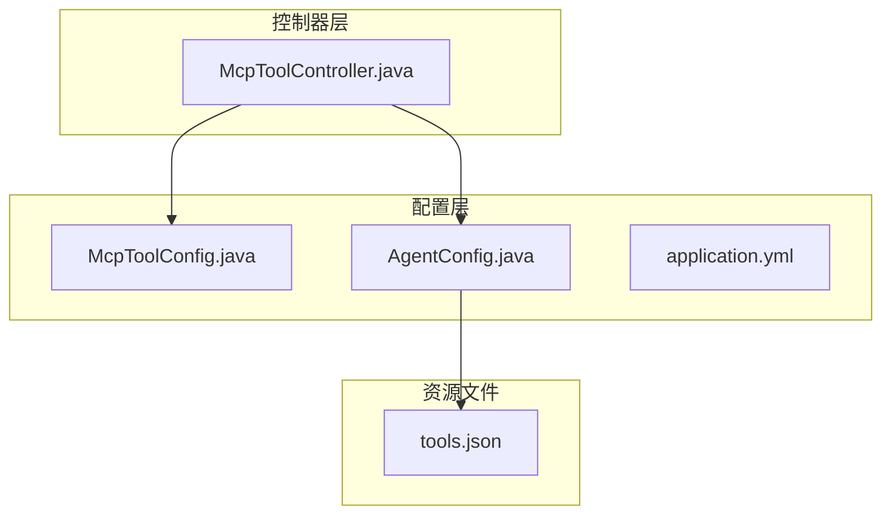
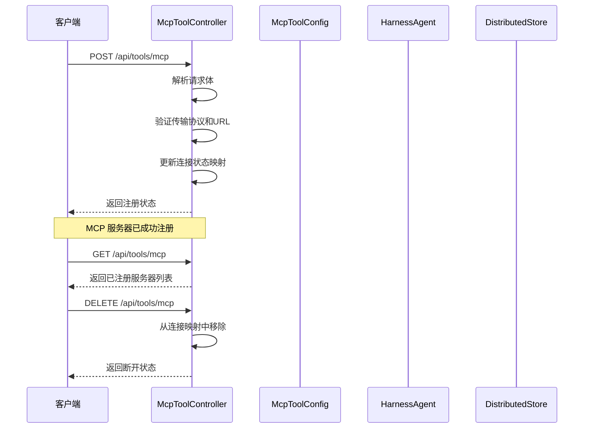
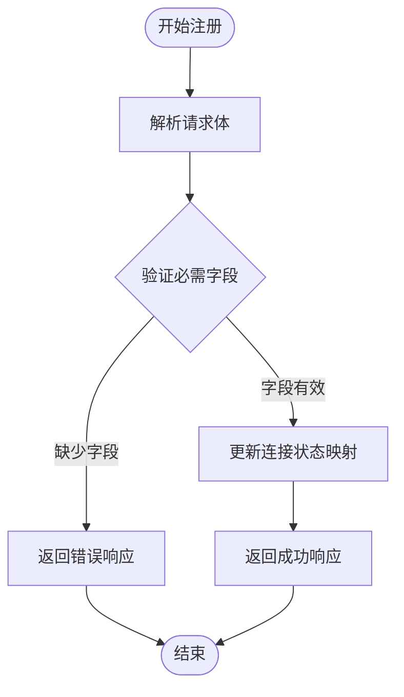
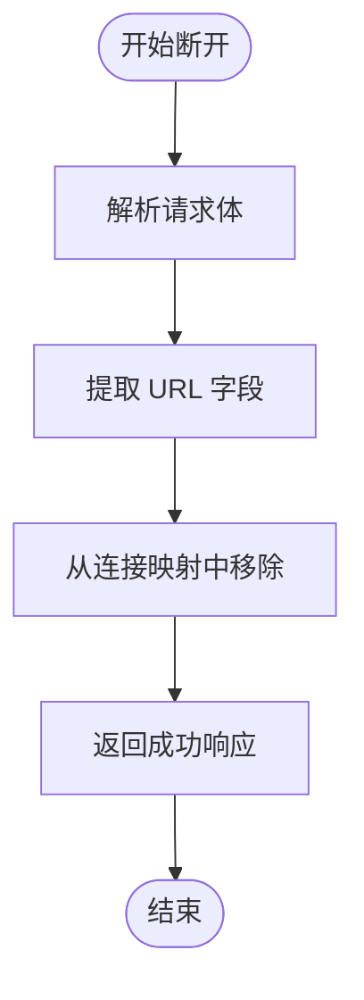
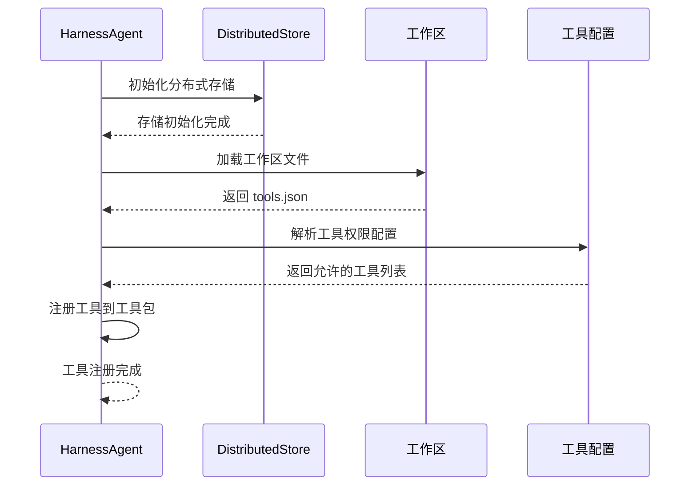
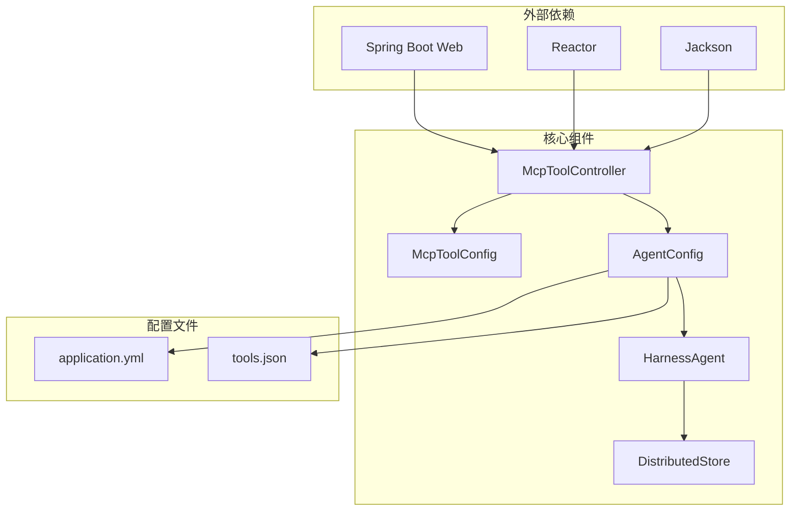

# MCP 工具管理 API

<cite>
**本文档引用的文件**
- [McpToolController.java](file://src/main/java/com/example/agentic/controller/McpToolController.java)
- [McpToolConfig.java](file://src/main/java/com/example/agentic/config/McpToolConfig.java)
- [AgentConfig.java](file://src/main/java/com/example/agentic/config/AgentConfig.java)
- [application.yml](file://src/main/resources/application.yml)
- [tools.json](file://src/main/resources/workspace/tools.json)
</cite>

## 更新摘要
**变更内容**
- 新增 McpToolController 组件，实现完整的 MCP 工具动态注册与管理功能
- 实现三个核心 API 端点：POST /api/tools/mcp、GET /api/tools/mcp、DELETE /api/tools/mcp
- 支持运行时热插拔 MCP 服务器连接管理
- 集成工具权限控制系统，支持 MCP 工具的细粒度权限控制
- 提供响应式编程模型，支持高并发场景

## 目录
1. [简介](#简介)
2. [项目结构](#项目结构)
3. [核心组件](#核心组件)
4. [架构概览](#架构概览)
5. [详细组件分析](#详细组件分析)
6. [依赖关系分析](#依赖关系分析)
7. [性能考虑](#性能考虑)
8. [故障排除指南](#故障排除指南)
9. [结论](#结论)

## 简介

MCP（Model Context Protocol）工具管理 API 是一个用于动态管理 MCP 服务器连接的 RESTful 接口系统。该系统支持在运行时热插拔 MCP 服务器连接，允许注册后的 MCP 工具在对话中被智能代理自动调用。

该 API 提供了三个核心端点：
- POST /api/tools/mcp：动态注册 MCP 服务器
- GET /api/tools/mcp：列出已注册的 MCP 服务器
- DELETE /api/tools/mcp：断开并移除 MCP 服务器

**更新** 新增完整的 McpToolController 组件，提供响应式编程模型和高并发支持。

## 项目结构

该项目采用标准的 Spring Boot 项目结构，MCP 工具管理功能位于以下关键目录中：



**图表来源**
- [McpToolController.java:1-69](file://src/main/java/com/example/agentic/controller/McpToolController.java#L1-L69)
- [McpToolConfig.java:1-25](file://src/main/java/com/example/agentic/config/McpToolConfig.java#L1-L25)
- [AgentConfig.java:1-87](file://src/main/java/com/example/agentic/config/AgentConfig.java#L1-L87)

**章节来源**
- [McpToolController.java:1-69](file://src/main/java/com/example/agentic/controller/McpToolController.java#L1-L69)
- [McpToolConfig.java:1-25](file://src/main/java/com/example/agentic/config/McpToolConfig.java#L1-L25)
- [AgentConfig.java:1-87](file://src/main/java/com/example/agentic/config/AgentConfig.java#L1-L87)

## 核心组件

### MCP 工具控制器

McpToolController 是整个 MCP 工具管理 API 的核心控制器，负责处理所有 MCP 相关的 REST 请求。

**主要特性：**
- 支持运行时热插拔 MCP 服务器连接
- 提供 MCP 服务器状态管理
- 维护 MCP 连接池状态
- 返回标准化的响应格式
- 基于 Reactor 的响应式编程模型

**数据结构：**
- `registeredMcpServers`: ConcurrentHashMap 存储已注册的 MCP 服务器信息
- 键：MCP 服务器 URL
- 值：连接状态字符串

**章节来源**
- [McpToolController.java:17-22](file://src/main/java/com/example/agentic/controller/McpToolController.java#L17-L22)

### MCP 工具配置

McpToolConfig 提供了 MCP 工具注册的配置支持，包括静态和动态两种注册方式。

**配置选项：**
- 静态注册：通过配置文件定义 MCP Server 地址，启动时自动连接
- 动态注册：通过 REST API POST /api/tools/mcp 热插拔

**章节来源**
- [McpToolConfig.java:5-13](file://src/main/java/com/example/agentic/config/McpToolConfig.java#L5-L13)

## 架构概览

MCP 工具管理 API 的整体架构设计如下：



**图表来源**
- [McpToolController.java:24-67](file://src/main/java/com/example/agentic/controller/McpToolController.java#L24-L67)
- [McpToolConfig.java:17-23](file://src/main/java/com/example/agentic/config/McpToolConfig.java#L17-L23)

## 详细组件分析

### POST /api/tools/mcp - 动态注册 MCP 服务器

#### 请求格式

**请求头：**
- Content-Type: application/json

**请求体：**
```json
{
  "transport": "sse",
  "url": "http://localhost:3000/mcp"
}
```

**字段说明：**
- `transport`：传输协议类型，默认支持 "sse"
- `url`：MCP 服务器的完整 URL 地址

#### 响应格式

**成功响应：**
```json
{
  "status": "registered",
  "transport": "sse",
  "url": "http://localhost:3000/mcp"
}
```

**错误响应：**
```json
{
  "error": "Invalid request body",
  "message": "Missing required field: transport or url"
}
```

#### 处理流程



**图表来源**
- [McpToolController.java:30-46](file://src/main/java/com/example/agentic/controller/McpToolController.java#L30-L46)

**章节来源**
- [McpToolController.java:24-46](file://src/main/java/com/example/agentic/controller/McpToolController.java#L24-L46)

### GET /api/tools/mcp - 列出 MCP 服务器

#### 请求格式

**请求头：**
- 无需特殊头部

#### 响应格式

**成功响应：**
```json
{
  "http://localhost:3000/mcp": "connected",
  "https://mcp-server.example.com/mcp": "connected"
}
```

**响应说明：**
- 键：MCP 服务器的 URL
- 值：当前连接状态（如 "connected"）

#### 处理逻辑

该端点直接返回内存中的 MCP 服务器连接状态映射，提供实时的状态查询能力。

**章节来源**
- [McpToolController.java:48-54](file://src/main/java/com/example/agentic/controller/McpToolController.java#L48-L54)

### DELETE /api/tools/mcp - 断开 MCP 服务器

#### 请求格式

**请求头：**
- Content-Type: application/json

**请求体：**
```json
{
  "url": "http://localhost:3000/mcp"
}
```

#### 响应格式

**成功响应：**
```json
{
  "status": "unregistered",
  "url": "http://localhost:3000/mcp"
}
```

#### 处理流程



**图表来源**
- [McpToolController.java:56-67](file://src/main/java/com/example/agentic/controller/McpToolController.java#L56-L67)

**章节来源**
- [McpToolController.java:56-67](file://src/main/java/com/example/agentic/controller/McpToolController.java#L56-L67)

### MCP 服务器配置格式

#### 静态配置

MCP 工具支持通过配置文件进行静态注册：

```yaml
# application.yml 中的相关配置
agentic:
  mcp:
    servers:
      - url: "http://localhost:3000/mcp"
        transport: "sse"
      - url: "https://mcp-server.example.com/mcp"
        transport: "sse"
```

#### 动态配置

通过 API 进行动态注册时，需要提供以下信息：
- `transport`: 传输协议类型
- `url`: MCP 服务器地址

**章节来源**
- [McpToolConfig.java:17-23](file://src/main/java/com/example/agentic/config/McpToolConfig.java#L17-L23)

### 工具权限控制机制

系统通过 tools.json 文件实现工具权限控制：

```json
{
  "allow": [
    "read_file",
    "write_file", 
    "run_command",
    "memory_search",
    "agent_spawn",
    "read_skill",
    "mcp:*"
  ]
}
```

**权限规则：**
- `"mcp:*"` 表示允许所有 MCP 相关操作
- 具体工具名称表示允许特定工具调用
- 未在允许列表中的工具将被拒绝访问

**章节来源**
- [tools.json:1-12](file://src/main/resources/workspace/tools.json#L1-L12)

### 动态工具注册流程

#### 工具发现和加载过程



**图表来源**
- [AgentConfig.java:47-78](file://src/main/java/com/example/agentic/config/AgentConfig.java#L47-L78)

#### 与 tools.json 的关系

AgentConfig 中明确配置了工作区文件的投射根目录，其中包括 tools.json：

```java
.filesystem(((DockerFilesystemSpec) new DockerFilesystemSpec()
        .image(sandboxImage))
        .isolationScope(IsolationScope.SESSION)
        .workspaceProjectionRoots(List.of(
                "AGENTS.md", "skills", "knowledge", "tools.json")))
```

这确保了 MCP 工具配置能够被正确加载和使用。

**章节来源**
- [AgentConfig.java:70-74](file://src/main/java/com/example/agentic/config/AgentConfig.java#L70-L74)

## 依赖关系分析

### 组件依赖图



**图表来源**
- [McpToolController.java:1-69](file://src/main/java/com/example/agentic/controller/McpToolController.java#L1-L69)
- [AgentConfig.java:1-87](file://src/main/java/com/example/agentic/config/AgentConfig.java#L1-L87)

### 外部依赖

系统依赖以下关键外部组件：

**Spring Boot 生态系统：**
- Spring WebFlux：提供响应式编程模型
- Jackson：JSON 序列化/反序列化
- Reactor：响应式流处理

**AgentScope 框架：**
- HarnessAgent：智能代理核心引擎
- DistributedStore：分布式存储解决方案
- DockerFilesystemSpec：容器化文件系统

**章节来源**
- [McpToolController.java:1-69](file://src/main/java/com/example/agentic/controller/McpToolController.java#L1-L69)
- [AgentConfig.java:1-87](file://src/main/java/com/example/agentic/config/AgentConfig.java#L1-L87)

## 性能考虑

### 并发处理

系统采用 ConcurrentHashMap 来存储 MCP 服务器连接状态，确保多线程环境下的安全访问：

- **线程安全**：ConcurrentHashMap 提供原子性的读写操作
- **高性能**：避免锁竞争，提高并发性能
- **内存效率**：按需存储，减少内存占用

### 异步处理

所有 API 端点都使用 Reactor 的 Mono 类型，提供非阻塞的异步处理能力：

- **响应式编程**：避免阻塞线程，提高吞吐量
- **背压处理**：自动处理流量控制
- **资源优化**：减少线程池开销

### 缓存策略

MCP 服务器状态信息存储在内存中，适合短期缓存：

- **快速访问**：内存访问速度极快
- **简单实现**：避免复杂的缓存管理
- **状态一致性**：与实际连接状态保持同步

## 故障排除指南

### 常见问题及解决方案

#### 1. MCP 服务器连接失败

**症状：** 注册后无法正常通信

**可能原因：**
- MCP 服务器地址不可达
- 网络防火墙阻止连接
- 服务器证书验证失败

**解决步骤：**
1. 验证 MCP 服务器 URL 格式
2. 检查网络连通性
3. 确认服务器 SSL 证书
4. 查看服务器日志

#### 2. 权限不足错误

**症状：** 工具调用被拒绝

**可能原因：**
- tools.json 中缺少相应的权限声明
- 权限配置格式错误

**解决步骤：**
1. 检查 tools.json 文件内容
2. 添加必要的权限条目
3. 重启应用使配置生效

#### 3. 并发访问冲突

**症状：** 注册或断开操作异常

**可能原因：**
- 多个客户端同时操作同一 MCP 服务器
- 状态不一致

**解决步骤：**
1. 使用幂等操作
2. 实施重试机制
3. 监控连接状态

**章节来源**
- [McpToolController.java:37-41](file://src/main/java/com/example/agentic/controller/McpToolController.java#L37-L41)
- [McpToolController.java:64](file://src/main/java/com/example/agentic/controller/McpToolController.java#L64)

### 调试建议

#### 日志监控

建议启用以下级别的日志：
- INFO：常规操作日志
- WARN：潜在问题警告
- ERROR：错误和异常

#### 性能监控

监控关键指标：
- 请求响应时间
- 并发连接数
- 内存使用情况
- 网络延迟

## 结论

MCP 工具管理 API 提供了一个完整、灵活且高效的 MCP 服务器生命周期管理解决方案。通过动态注册机制，系统能够在不重启服务的情况下添加或移除 MCP 服务器，满足了现代 AI 应用对工具灵活性的需求。

**主要优势：**
1. **动态性**：支持运行时热插拔，无需重启服务
2. **安全性**：通过 tools.json 实现细粒度的权限控制
3. **可扩展性**：基于 Spring Boot 和 Reactor 的响应式架构
4. **可靠性**：分布式存储和状态管理确保系统稳定性

**未来改进方向：**
1. 完善 MCP 客户端的实际集成
2. 增强错误处理和重试机制
3. 添加更详细的监控和告警功能
4. 支持更多传输协议和认证方式

该 API 为构建智能化的 AI 应用提供了坚实的基础，使得 MCP 工具能够无缝集成到现有的代理系统中。

**更新** 新增的 McpToolController 组件提供了完整的响应式编程支持，为未来的 MCP 客户端集成奠定了坚实基础。