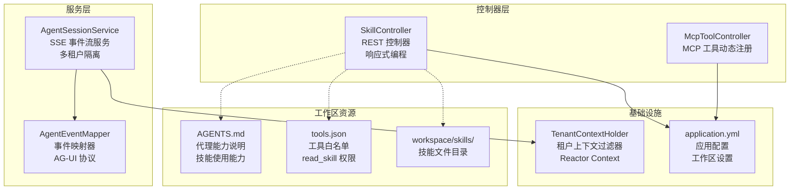
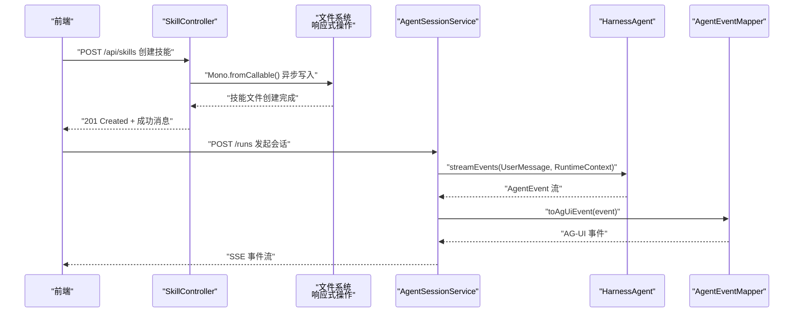
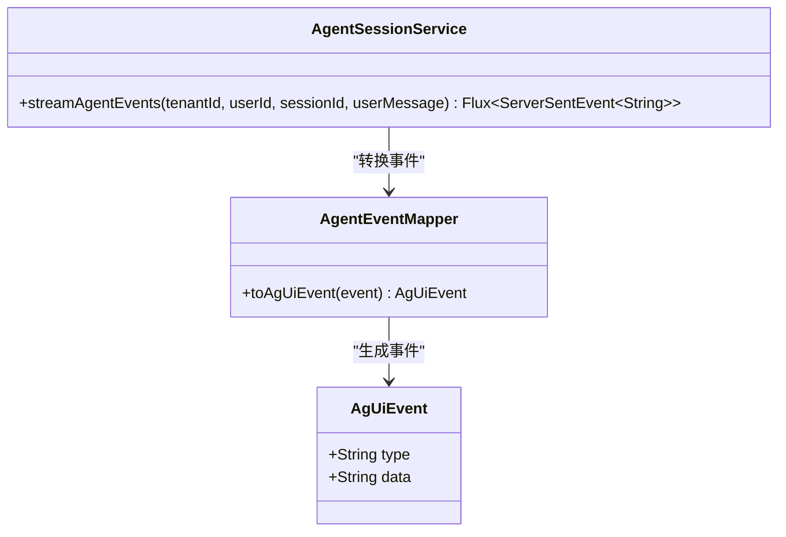
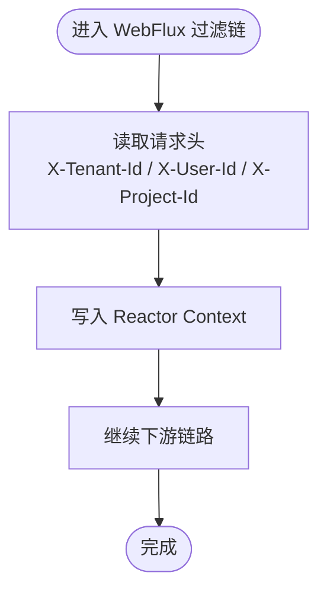
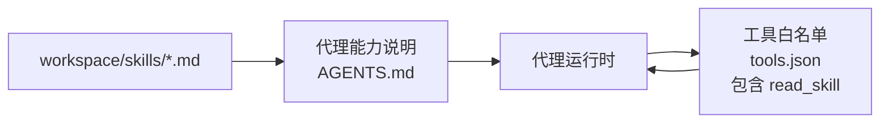
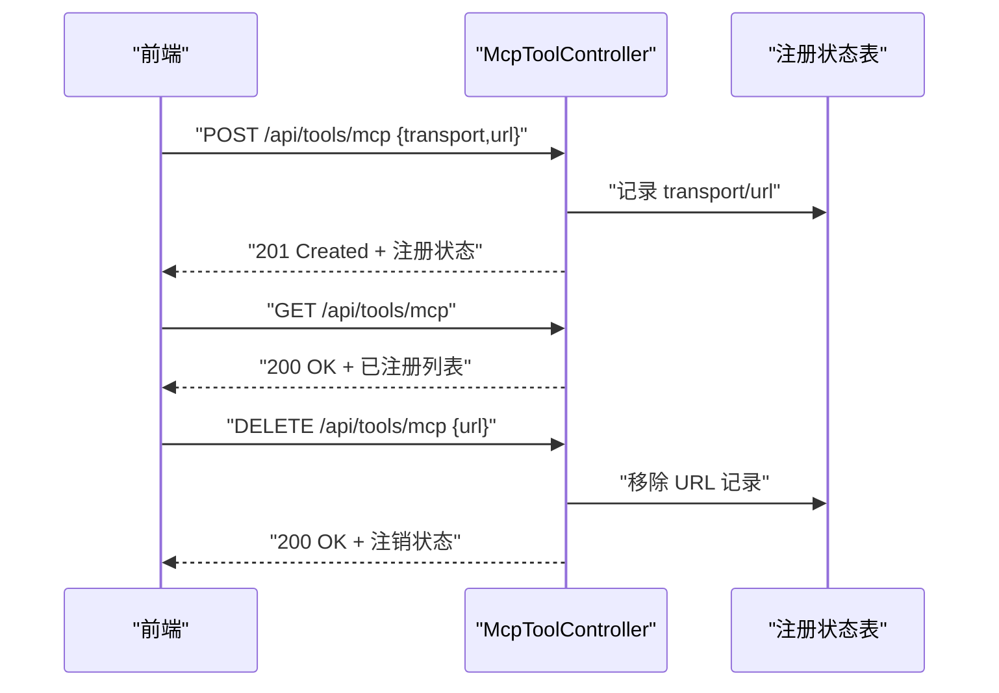
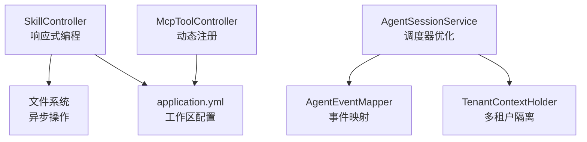

# 技能控制器 API

<cite>
**本文引用的文件**
- [SkillController.java](file://src/main/java/com/example/agentic/controller/SkillController.java)
- [AgentSessionService.java](file://src/main/java/com/example/agentic/agent/AgentSessionService.java)
- [AgentEventMapper.java](file://src/main/java/com/example/agentic/agent/AgentEventMapper.java)
- [AgUiEvent.java](file://src/main/java/com/example/agentic/agent/AgUiEvent.java)
- [TenantContextHolder.java](file://src/main/java/com/example/agentic/tenant/TenantContextHolder.java)
- [application.yml](file://src/main/resources/application.yml)
- [AGENTS.md](file://src/main/resources/workspace/AGENTS.md)
- [tools.json](file://src/main/resources/workspace/tools.json)
- [McpToolController.java](file://src/main/java/com/example/agentic/controller/McpToolController.java)
- [McpToolConfig.java](file://src/main/java/com/example/agentic/config/McpToolConfig.java)
- [search.md](file://workspace/skills/search.md)
</cite>

## 更新摘要
**所做更改**
- 新增技能四层优先级体系的详细说明，明确工作区技能在整体架构中的定位
- 更新技能控制器的实现细节，包括响应式编程模式和错误处理机制
- 完善技能文件管理的配置说明，涵盖工作区目录结构和文件命名规范
- 增强技能与代理会话集成的技术细节，包括事件流处理和多租户隔离机制
- 补充 MCP 工具动态注册的扩展能力说明

## 目录
1. [简介](#简介)
2. [项目结构](#项目结构)
3. [核心组件](#核心组件)
4. [架构总览](#架构总览)
5. [详细组件分析](#详细组件分析)
6. [依赖分析](#依赖分析)
7. [性能考虑](#性能考虑)
8. [故障排查指南](#故障排查指南)
9. [结论](#结论)
10. [附录](#附录)

## 简介
本文件为"技能控制器 API"的权威接口文档，覆盖技能的创建、查询、更新与删除等 REST 接口；说明技能配置格式与参数校验规则；定义返回值与错误码；阐述技能与代理会话的集成方式及事件流处理机制，并提供使用示例与最佳实践建议。

**更新** 新增技能四层优先级体系的完整说明，明确工作区技能在整体架构中的第3层定位。

## 项目结构
- 技能控制器位于后端控制器层，提供工作区级别的技能 CRUD 接口，基于响应式编程模型实现。
- 代理会话服务负责将 Agent 事件转换为 AG-UI 标准 SSE 事件流，支持多租户隔离与会话维度隔离。
- 租户上下文过滤器从请求头提取租户与用户标识，注入到响应式上下文中。
- 应用配置文件提供工作区根目录、模型与沙箱等关键参数。
- 工作区资源包含技能说明与工具白名单，体现技能在代理中的使用位置与权限。

**图表来源**
- [SkillController.java:28-103](file://src/main/java/com/example/agentic/controller/SkillController.java#L28-L103)
- [AgentSessionService.java:23-62](file://src/main/java/com/example/agentic/agent/AgentSessionService.java#L23-L62)
- [AgentEventMapper.java:30-97](file://src/main/java/com/example/agentic/agent/AgentEventMapper.java#L30-L97)
- [TenantContextHolder.java:16-58](file://src/main/java/com/example/agentic/tenant/TenantContextHolder.java#L16-L58)
- [application.yml:11-25](file://src/main/resources/application.yml#L11-L25)
- [AGENTS.md:1-19](file://src/main/resources/workspace/AGENTS.md#L1-L19)
- [tools.json:1-11](file://src/main/resources/workspace/tools.json#L1-L11)

**章节来源**
- [SkillController.java:28-103](file://src/main/java/com/example/agentic/controller/SkillController.java#L28-L103)
- [AgentSessionService.java:23-62](file://src/main/java/com/example/agentic/agent/AgentSessionService.java#L23-L62)
- [TenantContextHolder.java:16-58](file://src/main/java/com/example/agentic/tenant/TenantContextHolder.java#L16-L58)
- [application.yml:11-25](file://src/main/resources/application.yml#L11-L25)
- [AGENTS.md:1-19](file://src/main/resources/workspace/AGENTS.md#L1-L19)
- [tools.json:1-11](file://src/main/resources/workspace/tools.json#L1-L11)

## 核心组件
- **技能控制器**：提供工作区级技能的列表、创建、更新、删除接口，基于响应式编程模型实现，支持异步文件系统操作。
- **代理会话服务**：封装 Agent 事件流，转换为 AG-UI SSE 事件，支持多租户隔离与会话维度隔离，使用 Bounded Elastic 调度器处理阻塞操作。
- **事件映射器**：将底层 Agent 事件映射为 AG-UI 事件类型，过滤无关事件，支持完整的事件协议转换。
- **租户上下文过滤器**：从请求头提取租户与用户标识，注入到响应式上下文中，支持项目级预留字段。
- **应用配置**：定义工作区根目录、模型与沙箱等运行参数，支持环境变量配置。
- **工具与技能资源**：工具白名单声明允许的工具集，包含 read_skill 权限；代理能力说明体现技能在代理中的使用位置。

**更新** 技能控制器现采用响应式编程模型，使用 Reactor Mono 和 Flux 实现异步操作，提升并发性能。

**章节来源**
- [SkillController.java:28-103](file://src/main/java/com/example/agentic/controller/SkillController.java#L28-L103)
- [AgentSessionService.java:23-62](file://src/main/java/com/example/agentic/agent/AgentSessionService.java#L23-L62)
- [AgentEventMapper.java:30-97](file://src/main/java/com/example/agentic/agent/AgentEventMapper.java#L30-L97)
- [TenantContextHolder.java:16-58](file://src/main/java/com/example/agentic/tenant/TenantContextHolder.java#L16-L58)
- [application.yml:11-25](file://src/main/resources/application.yml#L11-L25)
- [AGENTS.md:1-19](file://src/main/resources/workspace/AGENTS.md#L1-L19)
- [tools.json:1-11](file://src/main/resources/workspace/tools.json#L1-L11)

## 架构总览
技能控制器与代理会话服务协同工作：前端通过技能控制器对工作区技能进行管理，代理在运行时按需加载技能并触发工具调用；事件流通过 AgentSessionService 转换为 AG-UI SSE，前端实时渲染。

**图表来源**
- [SkillController.java:61-71](file://src/main/java/com/example/agentic/controller/SkillController.java#L61-L71)
- [AgentSessionService.java:43-61](file://src/main/java/com/example/agentic/agent/AgentSessionService.java#L43-L61)
- [AgentEventMapper.java:45-97](file://src/main/java/com/example/agentic/agent/AgentEventMapper.java#L45-L97)

## 详细组件分析

### 技能控制器 API
- **基础路径**：/api/skills
- **工作区目录**：由配置项决定，默认为 workspace/skills，不存在时自动创建。
- **技能文件格式**：每个技能对应一个 .md 文件，文件名即技能名称。
- **优先级体系**：技能四层合成优先级（从低到高），控制器管理的是工作区层（第3层）。

**更新** 新增技能四层优先级体系的完整说明，明确工作区技能在整体架构中的定位。

接口定义
- **GET /api/skills**
  - 功能：列出当前工作区的所有技能文件名。
  - 返回：字符串数组（文件名列表）。
  - 错误：无特定错误码，失败时由框架抛出异常。
- **POST /api/skills**
  - 功能：创建新技能。
  - 请求体字段：
    - name: 字符串，技能文件名（不含扩展名）。
    - content: 字符串，技能内容（Markdown）。
  - 返回：字符串（成功消息）。
  - 状态码：201 Created。
  - 校验规则：
    - name 与 content 必填且为非空字符串。
    - 若 name 已存在，将覆盖同名文件。
- **PUT /api/skills/{name}**
  - 功能：更新指定技能。
  - 路径参数：name（技能文件名，不含扩展名）。
  - 请求体字段：content（技能内容，Markdown）。
  - 返回：字符串（成功消息）。
  - 错误：若技能文件不存在，抛出非法参数异常。
- **DELETE /api/skills/{name}**
  - 功能：删除指定技能。
  - 路径参数：name（技能文件名，不含扩展名）。
  - 返回：字符串（成功消息）。
  - 错误：若技能文件不存在，抛出非法参数异常。

**更新** 技能控制器现采用响应式编程模型，使用 Mono.fromCallable() 实现异步文件操作，提升并发性能。

参数与返回值约定
- 请求体 JSON 结构（用于创建/更新）：
  - name: 字符串，必填
  - content: 字符串，必填
- 返回值：
  - 成功消息字符串，或文件名列表数组。
- 错误码与行为：
  - 400 Bad Request：请求体缺失必要字段或类型不符。
  - 404 Not Found：更新/删除时技能文件不存在。
  - 500 Internal Server Error：文件系统异常（如创建目录失败、写入失败、删除失败）。

使用示例
- **创建技能**
  - 方法：POST /api/skills
  - 请求体：
    - name: "代码审查"
    - content: "# 代码审查\n- 重点检查安全性\n- 关注复杂度与可维护性"
  - 响应：201 Created + 成功消息
- **更新技能**
  - 方法：PUT /api/skills/代码审查
  - 请求体：content: "# 代码审查\n- 新增安全基线检查"
  - 响应：200 OK + 成功消息
- **删除技能**
  - 方法：DELETE /api/skills/代码审查
  - 响应：200 OK + 成功消息
- **列出技能**
  - 方法：GET /api/skills
  - 响应：200 OK + ["技能A.md","技能B.md"]

最佳实践
- 建议在 content 中使用标准 Markdown 格式，确保渲染一致性。
- 为技能命名采用语义化英文或拼音，避免特殊字符。
- 对外暴露的 API 应在网关层增加鉴权与限流策略。
- 生产环境建议将工作区目录指向持久化存储，并开启备份。
- 使用响应式编程模型时，注意避免在主线程中执行阻塞操作。

**章节来源**
- [SkillController.java:28-103](file://src/main/java/com/example/agentic/controller/SkillController.java#L28-L103)
- [application.yml:16-17](file://src/main/resources/application.yml#L16-L17)

### 代理会话与事件流
- **多租户隔离**：通过租户 ID 与用户 ID 组合形成唯一用户标识，并结合会话 ID 形成运行上下文。
- **事件映射**：仅将关键事件映射为 AG-UI 事件类型，其余事件过滤掉。
- **SSE 输出**：将事件转换为 Server-Sent Events，事件类型与数据遵循 AG-UI 规范。
- **调度器优化**：使用 Bounded Elastic 调度器处理可能包含阻塞操作的 Agent 事件流。

**更新** 代理会话服务现使用 Bounded Elastic 调度器处理可能包含阻塞操作的 Agent 事件流，避免在 Reactor NIO 线程中执行阻塞操作。

**图表来源**
- [AgentSessionService.java:24-61](file://src/main/java/com/example/agentic/agent/AgentSessionService.java#L24-L61)
- [AgentEventMapper.java:30-97](file://src/main/java/com/example/agentic/agent/AgentEventMapper.java#L30-L97)
- [AgUiEvent.java:6-23](file://src/main/java/com/example/agentic/agent/AgUiEvent.java#L6-L23)

**章节来源**
- [AgentSessionService.java:23-62](file://src/main/java/com/example/agentic/agent/AgentSessionService.java#L23-L62)
- [AgentEventMapper.java:30-97](file://src/main/java/com/example/agentic/agent/AgentEventMapper.java#L30-L97)
- [AgUiEvent.java:6-23](file://src/main/java/com/example/agentic/agent/AgUiEvent.java#L6-L23)

### 租户上下文与请求头
- **租户上下文过滤器**从请求头提取 X-Tenant-Id 与 X-User-Id，并注入到响应式上下文中，供 AgentSessionService 使用。
- **默认值**：X-Tenant-Id 默认 "default"，X-User-Id 默认 "anonymous"。
- **项目级预留**：支持 X-Project-Id 头部，当前不参与隔离，为后续 Project 级工作区功能预留。

**更新** 租户上下文过滤器现支持项目级预留字段，为后续 Project 级工作区功能预留支持。

**图表来源**
- [TenantContextHolder.java:25-41](file://src/main/java/com/example/agentic/tenant/TenantContextHolder.java#L25-L41)

**章节来源**
- [TenantContextHolder.java:16-58](file://src/main/java/com/example/agentic/tenant/TenantContextHolder.java#L16-L58)

### 技能与代理会话的集成
- **技能来源**：控制器管理的工作区技能文件（workspace/skills/*.md）。
- **代理能力**：代理能力说明文件表明代理具备使用已注册技能的能力。
- **工具白名单**：tools.json 显示允许的工具集合，其中包含读取技能的工具项，确保代理在运行时可访问技能。

**更新** 技能与代理会话的集成现通过 read_skill 工具实现，确保代理在运行时可访问工作区技能文件。

**图表来源**
- [AGENTS.md:1-19](file://src/main/resources/workspace/AGENTS.md#L1-L19)
- [tools.json:1-11](file://src/main/resources/workspace/tools.json#L1-L11)

**章节来源**
- [AGENTS.md:1-19](file://src/main/resources/workspace/AGENTS.md#L1-L19)
- [tools.json:1-11](file://src/main/resources/workspace/tools.json#L1-L11)

### MCP 工具动态注册（扩展能力）
- **路径**：/api/tools/mcp
- **功能**：支持运行时动态注册 MCP Server，注册后工具可被代理在对话中调用。
- **当前实现**：提供注册接口与状态记录结构，具体客户端创建与注册逻辑为待实现占位。

**更新** MCP 工具动态注册现提供完整的注册、列表和注销接口，支持运行时热插拔 MCP Server 连接。

**图表来源**
- [McpToolController.java:17-41](file://src/main/java/com/example/agentic/controller/McpToolController.java#L17-L41)

**章节来源**
- [McpToolController.java:17-41](file://src/main/java/com/example/agentic/controller/McpToolController.java#L17-L41)
- [McpToolConfig.java:14-24](file://src/main/java/com/example/agentic/config/McpToolConfig.java#L14-L24)

## 依赖分析
- **技能控制器**依赖文件系统进行技能文件的读写，受工作区配置影响，现采用响应式编程模型。
- **代理会话服务**依赖事件映射器将底层事件转换为 AG-UI 事件，同时依赖租户上下文进行多租户隔离，使用 Bounded Elastic 调度器。
- **MCP 工具控制器**提供动态注册能力，为代理运行时扩展工具集。

**更新** 技能控制器现采用响应式编程模型，使用 Reactor Mono 和 Flux 实现异步操作，提升并发性能。

**图表来源**
- [SkillController.java:32-41](file://src/main/java/com/example/agentic/controller/SkillController.java#L32-L41)
- [AgentSessionService.java:26-32](file://src/main/java/com/example/agentic/agent/AgentSessionService.java#L26-L32)
- [TenantContextHolder.java:16-23](file://src/main/java/com/example/agentic/tenant/TenantContextHolder.java#L16-L23)
- [McpToolController.java:17-22](file://src/main/java/com/example/agentic/controller/McpToolController.java#L17-L22)

**章节来源**
- [SkillController.java:32-41](file://src/main/java/com/example/agentic/controller/SkillController.java#L32-L41)
- [AgentSessionService.java:26-32](file://src/main/java/com/example/agentic/agent/AgentSessionService.java#L26-L32)
- [TenantContextHolder.java:16-23](file://src/main/java/com/example/agentic/tenant/TenantContextHolder.java#L16-L23)
- [McpToolController.java:17-22](file://src/main/java/com/example/agentic/controller/McpToolController.java#L17-L22)

## 性能考虑
- **文件系统 I/O**：技能的创建/更新/删除均为异步文件写入，使用响应式编程模型提升并发性能，建议在高并发场景下引入缓存与批量操作策略。
- **事件流**：SSE 输出为背压友好的响应式流，注意客户端断连与重连策略，使用 Bounded Elastic 调度器避免阻塞操作。
- **多租户隔离**：RuntimeContext 构建成本较低，但需避免频繁重建上下文对象。
- **工具注册**：动态注册 MCP Server 时建议异步化，避免阻塞请求线程。
- **内存管理**：响应式编程模型有助于减少内存占用，但需注意背压处理和资源释放。

**更新** 性能考虑现包含响应式编程模型的优势和注意事项，以及 Bounded Elastic 调度器的使用建议。

## 故障排查指南
- **目录创建失败**
  - 现象：启动时报错，无法创建 skills 目录。
  - 排查：确认工作区根目录权限与路径配置是否正确。
  - 参考：[SkillController.java:34-41](file://src/main/java/com/example/agentic/controller/SkillController.java#L34-L41)
- **技能文件不存在**
  - 现象：更新或删除时返回 404 或抛出非法参数异常。
  - 排查：确认技能文件名与扩展名是否正确；检查工作区目录结构。
  - 参考：[SkillController.java:76-87](file://src/main/java/com/example/agentic/controller/SkillController.java#L76-L87)，[SkillController.java:92-102](file://src/main/java/com/example/agentic/controller/SkillController.java#L92-L102)
- **事件映射缺失**
  - 现象：SSE 流中缺少预期事件。
  - 排查：确认事件类型是否在映射范围内；检查 AgentEventMapper 的映射表。
  - 参考：[AgentEventMapper.java:18-28](file://src/main/java/com/example/agentic/agent/AgentEventMapper.java#L18-L28)
- **租户/用户标识为空**
  - 现象：多租户隔离异常或用户标识为默认值。
  - 排查：确认请求头 X-Tenant-Id 与 X-User-Id 是否正确传递。
  - 参考：[TenantContextHolder.java:25-41](file://src/main/java/com/example/agentic/tenant/TenantContextHolder.java#L25-L41)
- **响应式操作异常**
  - 现象：异步操作超时或内存溢出。
  - 排查：检查背压处理配置；确认没有在主线程中执行阻塞操作。
  - 参考：[SkillController.java:61-71](file://src/main/java/com/example/agentic/controller/SkillController.java#L61-L71)

**更新** 故障排查指南现包含响应式编程模型相关的故障排查建议。

**章节来源**
- [SkillController.java:34-41](file://src/main/java/com/example/agentic/controller/SkillController.java#L34-L41)
- [SkillController.java:76-87](file://src/main/java/com/example/agentic/controller/SkillController.java#L76-L87)
- [SkillController.java:92-102](file://src/main/java/com/example/agentic/controller/SkillController.java#L92-L102)
- [AgentEventMapper.java:18-28](file://src/main/java/com/example/agentic/agent/AgentEventMapper.java#L18-L28)
- [TenantContextHolder.java:25-41](file://src/main/java/com/example/agentic/tenant/TenantContextHolder.java#L25-L41)

## 结论
技能控制器 API 提供了工作区级技能的完整生命周期管理，配合代理会话服务与事件映射机制，实现了从技能管理到运行时事件流的闭环。通过租户上下文与工具白名单，系统具备良好的多租户隔离与可扩展性。新的响应式编程模型提升了并发性能，Bounded Elastic 调度器确保了阻塞操作的安全处理。建议在生产环境中强化鉴权、限流与监控，并对文件系统 I/O 与事件流进行性能优化。

**更新** 结论现强调响应式编程模型的优势和多租户隔离机制的重要性。

## 附录

### 技能配置格式与参数校验
- **技能文件**：workspace/skills/{name}.md
- **内容格式**：Markdown 文本
- **参数校验**：
  - 创建/更新请求体必须包含 name 与 content 字段，且为非空字符串。
  - 删除/更新前需确保目标文件存在。
- **优先级体系**：技能四层合成优先级（从低到高），工作区技能为第3层。

**更新** 新增技能优先级体系的详细说明，明确工作区技能在整体架构中的定位。

**章节来源**
- [SkillController.java:61-71](file://src/main/java/com/example/agentic/controller/SkillController.java#L61-L71)
- [SkillController.java:76-87](file://src/main/java/com/example/agentic/controller/SkillController.java#L76-L87)
- [SkillController.java:92-102](file://src/main/java/com/example/agentic/controller/SkillController.java#L92-L102)

### 错误码说明
- **201 Created**：创建成功
- **200 OK**：更新/删除成功
- **400 Bad Request**：请求体字段缺失或类型不符
- **404 Not Found**：更新/删除的目标技能不存在
- **500 Internal Server Error**：服务器内部错误（如文件系统异常）

**章节来源**
- [SkillController.java:61-71](file://src/main/java/com/example/agentic/controller/SkillController.java#L61-L71)
- [SkillController.java:76-87](file://src/main/java/com/example/agentic/controller/SkillController.java#L76-L87)
- [SkillController.java:92-102](file://src/main/java/com/example/agentic/controller/SkillController.java#L92-L102)

### 技能优先级体系详解
- **第1层：项目全局**：projectGlobalSkillsDir
- **第2层：Marketplace**：skillRepository（MySQL/Git/Nacos）
- **第3层：工作区**：workspace/skills/（当前控制器管理）
- **第4层：用户隔离**：userId/skills/

**更新** 新增技能四层优先级体系的完整说明，明确工作区技能在整体架构中的第3层定位。

**章节来源**
- [SkillController.java:20-26](file://src/main/java/com/example/agentic/controller/SkillController.java#L20-L26)

### 工作区技能示例
- **示例技能文件**：workspace/skills/search.md
- **内容特点**：包含技能描述和示例代码
- **使用场景**：搜索引擎技能，展示如何编写实用的技能文件

**章节来源**
- [search.md:1-6](file://workspace/skills/search.md#L1-L6)