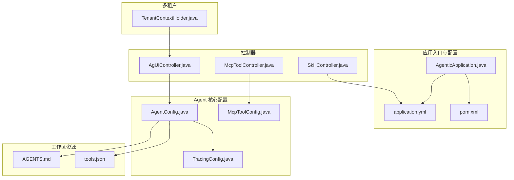
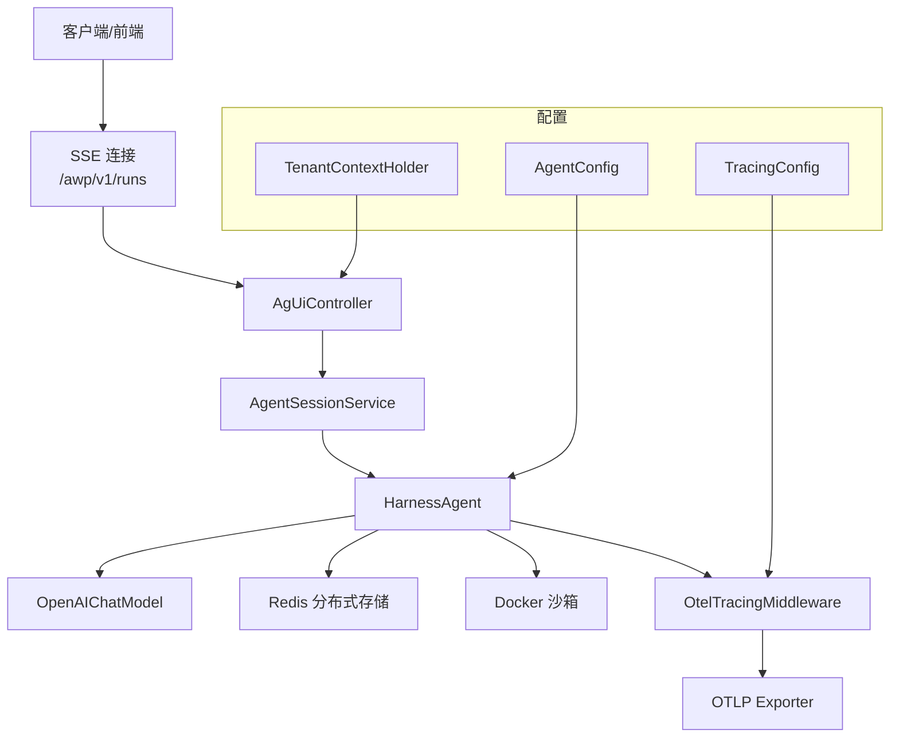
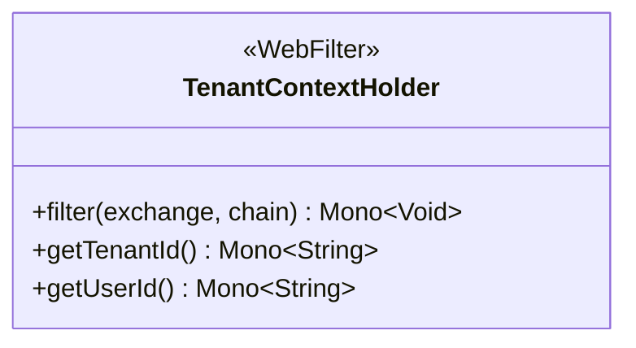
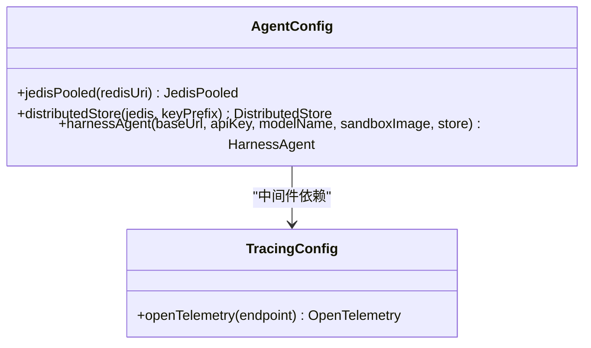
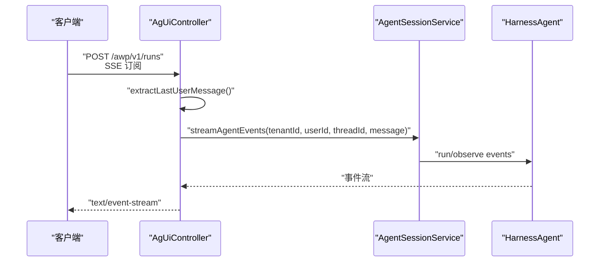
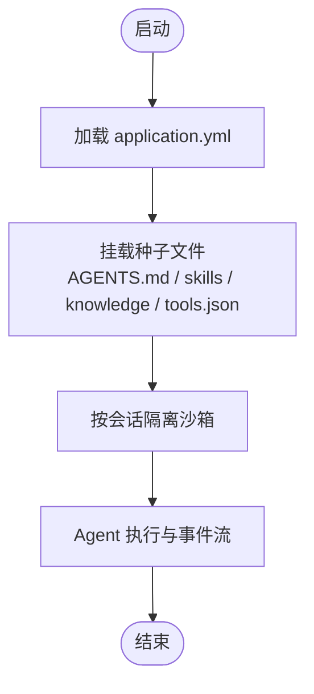
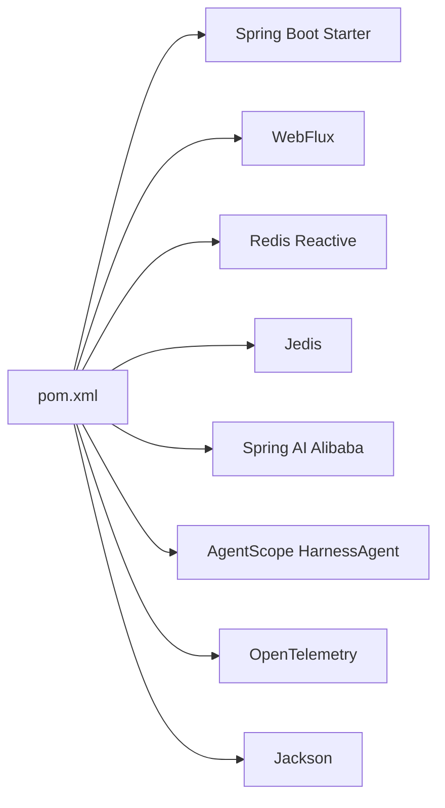

# 开发指南

<cite>
**本文引用的文件**
- [AgenticApplication.java](file://src/main/java/com/example/agentic/AgenticApplication.java)
- [application.yml](file://src/main/resources/application.yml)
- [pom.xml](file://pom.xml)
- [TenantContextHolder.java](file://src/main/java/com/example/agentic/tenant/TenantContextHolder.java)
- [AgentConfig.java](file://src/main/java/com/example/agentic/config/AgentConfig.java)
- [McpToolConfig.java](file://src/main/java/com/example/agentic/config/McpToolConfig.java)
- [TracingConfig.java](file://src/main/java/com/example/agentic/config/TracingConfig.java)
- [AgUiController.java](file://src/main/java/com/example/agentic/controller/AgUiController.java)
- [McpToolController.java](file://src/main/java/com/example/agentic/controller/McpToolController.java)
- [SkillController.java](file://src/main/java/com/example/agentic/controller/SkillController.java)
- [AGENTS.md](file://src/main/resources/workspace/AGENTS.md)
- [tools.json](file://src/main/resources/workspace/tools.json)
</cite>

## 目录
1. [简介](#简介)
2. [项目结构](#项目结构)
3. [核心组件](#核心组件)
4. [架构总览](#架构总览)
5. [详细组件分析](#详细组件分析)
6. [依赖分析](#依赖分析)
7. [性能考虑](#性能考虑)
8. [故障排查指南](#故障排查指南)
9. [结论](#结论)
10. [附录](#附录)

## 简介
本开发指南面向参与“通用智能体平台”项目的开发者，目标是帮助你快速搭建开发环境、理解代码结构与设计模式、掌握编码规范与测试策略，并建立可持续的贡献流程。项目基于 Spring Boot 3、Spring WebFlux、AgentScope HarnessAgent 2.0、Redis 分布式存储、OpenTelemetry 全链路追踪以及 Docker 沙箱能力，提供 AG-UI 协议的 SSE 流式输出、MCP 工具动态注册、技能（Skill）工作区管理等能力。

## 项目结构
项目采用典型的 Spring Boot Maven 结构，源码位于 src/main/java，资源位于 src/main/resources；测试位于 src/test/java。核心模块包括：
- 应用入口与配置：AgenticApplication、application.yml、pom.xml
- 多租户上下文：TenantContextHolder
- Agent 核心配置：AgentConfig、McpToolConfig、TracingConfig
- 控制器层：AgUiController、McpToolController、SkillController
- 工作区资源：workspace 下的 AGENTS.md、tools.json 以及 skills/knowledge 等目录

**图示来源**
- [AgenticApplication.java:1-23](file://src/main/java/com/example/agentic/AgenticApplication.java#L1-L23)
- [application.yml:1-30](file://src/main/resources/application.yml#L1-L30)
- [pom.xml:1-131](file://pom.xml#L1-L131)
- [TenantContextHolder.java:1-59](file://src/main/java/com/example/agentic/tenant/TenantContextHolder.java#L1-L59)
- [AgentConfig.java:1-87](file://src/main/java/com/example/agentic/config/AgentConfig.java#L1-L87)
- [McpToolConfig.java:1-25](file://src/main/java/com/example/agentic/config/McpToolConfig.java#L1-L25)
- [TracingConfig.java:1-45](file://src/main/java/com/example/agentic/config/TracingConfig.java#L1-L45)
- [AgUiController.java:1-75](file://src/main/java/com/example/agentic/controller/AgUiController.java#L1-L75)
- [McpToolController.java:1-69](file://src/main/java/com/example/agentic/controller/McpToolController.java#L1-L69)
- [SkillController.java:1-104](file://src/main/java/com/example/agentic/controller/SkillController.java#L1-L104)
- [AGENTS.md](file://src/main/resources/workspace/AGENTS.md)
- [tools.json](file://src/main/resources/workspace/tools.json)

**章节来源**
- [AgenticApplication.java:1-23](file://src/main/java/com/example/agentic/AgenticApplication.java#L1-L23)
- [application.yml:1-30](file://src/main/resources/application.yml#L1-L30)
- [pom.xml:1-131](file://pom.xml#L1-L131)

## 核心组件
- 应用入口与启动：应用入口类负责加载 Spring Boot 上下文，结合 application.yml 完成外部化配置。
- 多租户上下文：通过 WebFilter 将 X-Tenant-Id、X-User-Id 注入 Reactor Context，供后续处理链使用。
- Agent 核心配置：集中配置模型、工作区、分布式存储、沙箱、上下文压缩、工具结果卸载与 OTEL 中间件。
- 控制器层：提供 AG-UI SSE 运行端点、MCP 工具动态注册接口、工作区技能 CRUD 接口。
- 工作区资源：AGENTS.md 作为智能体说明，tools.json 为工具清单，skills/knowledge 为可挂载到沙箱的种子文件。

**章节来源**
- [TenantContextHolder.java:10-59](file://src/main/java/com/example/agentic/tenant/TenantContextHolder.java#L10-L59)
- [AgentConfig.java:21-87](file://src/main/java/com/example/agentic/config/AgentConfig.java#L21-L87)
- [AgUiController.java:12-75](file://src/main/java/com/example/agentic/controller/AgUiController.java#L12-L75)
- [McpToolController.java:11-69](file://src/main/java/com/example/agentic/controller/McpToolController.java#L11-L69)
- [SkillController.java:17-104](file://src/main/java/com/example/agentic/controller/SkillController.java#L17-L104)
- [AGENTS.md](file://src/main/resources/workspace/AGENTS.md)
- [tools.json](file://src/main/resources/workspace/tools.json)

## 架构总览
系统采用响应式 WebFlux 架构，控制器返回 ServerSentEvent 流，Agent 通过 HarnessAgent 与模型交互，分布式状态由 Redis 存储，Tracing 通过 OTEL 导出至外部系统。

**图示来源**
- [AgUiController.java:22-75](file://src/main/java/com/example/agentic/controller/AgUiController.java#L22-L75)
- [AgentConfig.java:28-87](file://src/main/java/com/example/agentic/config/AgentConfig.java#L28-L87)
- [TracingConfig.java:22-45](file://src/main/java/com/example/agentic/config/TracingConfig.java#L22-L45)
- [TenantContextHolder.java:16-59](file://src/main/java/com/example/agentic/tenant/TenantContextHolder.java#L16-L59)

## 详细组件分析

### 多租户上下文（TenantContextHolder）
- 职责：从请求头读取租户与用户标识，写入 Reactor Context，供后续链路获取。
- 关键点：支持默认值与空值安全；通过静态方法从上下文中提取租户与用户 ID。
- 设计模式：责任链中的过滤器（WebFilter），配合响应式上下文传播。

**图示来源**
- [TenantContextHolder.java:16-59](file://src/main/java/com/example/agentic/tenant/TenantContextHolder.java#L16-L59)

**章节来源**
- [TenantContextHolder.java:10-59](file://src/main/java/com/example/agentic/tenant/TenantContextHolder.java#L10-L59)

### Agent 核心配置（AgentConfig）
- 职责：装配 HarnessAgent，统一配置模型、工作区、分布式存储、沙箱、压缩与卸载策略、中间件。
- 关键点：使用 RedisDistributedStore 自动注入 stateStore/baseStore/snapshotSpec/executionGuard；DockerFilesystemSpec 严格控制隔离范围与挂载根目录；开启流式输出与 OTEL 中间件。
- 设计模式：工厂/装配器（@Configuration + @Bean），集中配置与解耦。

**图示来源**
- [AgentConfig.java:28-87](file://src/main/java/com/example/agentic/config/AgentConfig.java#L28-L87)
- [TracingConfig.java:22-45](file://src/main/java/com/example/agentic/config/TracingConfig.java#L22-L45)

**章节来源**
- [AgentConfig.java:21-87](file://src/main/java/com/example/agentic/config/AgentConfig.java#L21-L87)

### 控制器层（AgUiController、McpToolController、SkillController）
- AgUiController：实现 AG-UI SSE 运行端点，解析请求体中的 thread_id/run_id/messages，提取最后一条用户消息，驱动 Agent 事件流。
- McpToolController：提供 MCP Server 的动态注册/查询/注销接口，便于运行时热插拔工具。
- SkillController：对工作区 skills 目录进行 CRUD 操作，支撑 Agent 的技能装载。

**图示来源**
- [AgUiController.java:32-75](file://src/main/java/com/example/agentic/controller/AgUiController.java#L32-L75)

**章节来源**
- [AgUiController.java:12-75](file://src/main/java/com/example/agentic/controller/AgUiController.java#L12-L75)
- [McpToolController.java:11-69](file://src/main/java/com/example/agentic/controller/McpToolController.java#L11-L69)
- [SkillController.java:17-104](file://src/main/java/com/example/agentic/controller/SkillController.java#L17-L104)

### 工作区资源与沙箱挂载
- 工作区路径来自配置项，包含 AGENTS.md、tools.json 以及 skills/knowledge 目录。
- 沙箱通过 DockerFilesystemSpec 将指定种子文件投影到容器内，隔离粒度为会话级别。

**图示来源**
- [application.yml:7-21](file://src/main/resources/application.yml#L7-L21)
- [AgentConfig.java:68-75](file://src/main/java/com/example/agentic/config/AgentConfig.java#L68-L75)
- [AGENTS.md](file://src/main/resources/workspace/AGENTS.md)
- [tools.json](file://src/main/resources/workspace/tools.json)

**章节来源**
- [application.yml:7-21](file://src/main/resources/application.yml#L7-L21)
- [AgentConfig.java:68-75](file://src/main/java/com/example/agentic/config/AgentConfig.java#L68-L75)

## 依赖分析
- 构建与运行：Spring Boot 3、WebFlux、Jackson、Redis Reactive、Jedis、Spring Boot Test。
- 智能体与模型：AgentScope HarnessAgent 2.0、Spring AI Alibaba、OpenAI Chat Model。
- 追踪与导出：OpenTelemetry SDK、OTLP Exporter。
- 依赖管理：通过 BOM 统一版本，确保兼容性。

**图示来源**
- [pom.xml:57-119](file://pom.xml#L57-L119)

**章节来源**
- [pom.xml:20-55](file://pom.xml#L20-L55)
- [pom.xml:57-119](file://pom.xml#L57-L119)

## 性能考虑
- 响应式流式输出：使用 WebFlux 与 SSE，降低内存占用与延迟。
- 分布式状态：Redis 作为共享状态存储，避免 Agent 有状态实例带来的扩展瓶颈。
- 上下文压缩与工具结果卸载：减少长对话上下文体积，提升吞吐。
- 沙箱隔离：按会话隔离，避免跨会话干扰，同时限制挂载目录，降低容器开销。
- 追踪采样：批量导出与合理资源标签，平衡可观测性与性能。

[本节为通用指导，无需列出具体文件来源]

## 故障排查指南
- 端口与优雅停机：确认 server.port 与 graceful shutdown 配置是否符合预期。
- Redis 连接：检查 REDIS_URI 与数据库索引，确保 key 前缀与隔离策略正确。
- 模型访问：核对 DEEPSEEK_BASE_URL、DEEPSEEK_API_KEY、DEEPSEEK_MODEL 是否设置。
- OTLP 导出：验证 LANGFUSE_OTEL_ENDPOINT 是否可达。
- 多租户头缺失：若未携带 X-Tenant-Id/X-User-Id，上下文默认值将生效。
- MCP 注册：动态注册接口为占位实现，实际注册逻辑需在业务层完成。
- 技能 CRUD：确保 workspace/skills 目录存在且具备写权限。

**章节来源**
- [application.yml:1-30](file://src/main/resources/application.yml#L1-L30)
- [TenantContextHolder.java:19-58](file://src/main/java/com/example/agentic/tenant/TenantContextHolder.java#L19-L58)
- [McpToolController.java:24-67](file://src/main/java/com/example/agentic/controller/McpToolController.java#L24-L67)
- [SkillController.java:32-102](file://src/main/java/com/example/agentic/controller/SkillController.java#L32-L102)

## 结论
本项目以响应式架构为核心，结合 AgentScope HarnessAgent 的无状态单例能力、Redis 分布式存储与 Docker 沙箱，提供了可扩展、可观测、可运维的智能体平台基础。遵循本文的开发与测试规范，可高效迭代功能并保持系统稳定性。

[本节为总结性内容，无需列出具体文件来源]

## 附录

### 开发环境搭建步骤
- JDK 17+、Maven、Docker、Redis、OTel Collector/Langfuse（可选）
- 克隆仓库后，使用 Maven 构建与运行
- 设置必要的环境变量（如 REDIS_URI、DEEPSEEK_*、AGENT_WORKSPACE 等）

**章节来源**
- [pom.xml:20-26](file://pom.xml#L20-L26)
- [application.yml:1-30](file://src/main/resources/application.yml#L1-L30)

### IDE 配置建议
- 使用支持 Java 17 与 Maven 的 IDE（如 IntelliJ IDEA）
- 启用 Lombok（如使用）与注解处理器
- 配置 Maven 生命周期与运行配置文件
- 为 WebFlux 与响应式编程风格启用合适的代码模板与检查规则

[本节为通用指导，无需列出具体文件来源]

### 代码规范
- 包名与模块分层清晰，控制器/配置/领域/工具分别归类
- 使用响应式类型（Mono/Flux）表达异步与流式数据
- 配置项集中于 application.yml，避免硬编码
- 控制器方法职责单一，异常通过响应式错误传播或明确状态码
- 日志与追踪贯穿请求链路，便于定位问题

[本节为通用指导，无需列出具体文件来源]

### 单元测试与集成测试
- 单元测试：针对控制器与工具类，使用 Spring Boot Test 与 WebTestClient 或响应式测试工具
- 集成测试：启动完整上下文，验证 AG-UI SSE、MCP 注册、技能 CRUD 端到端流程
- Mock 与假数据：对 Redis、模型调用进行 Mock，保证测试稳定与可重复

[本节为通用指导，无需列出具体文件来源]

### 持续集成（CI）配置建议
- 构建：Maven 编译与打包
- 测试：执行单元测试与集成测试
- 安全扫描：依赖漏洞扫描与代码质量检查
- 容器镜像：可选构建镜像并推送制品库
- 环境：预置 Redis、OTel Collector/Langfuse 以便集成测试

[本节为通用指导，无需列出具体文件来源]

### 代码贡献流程
- Fork 仓库并在本地创建特性分支
- 提交前执行格式化与静态检查
- 编写清晰的提交信息与变更说明
- 发起 Pull Request，描述改动动机、影响范围与测试情况
- 至少一名维护者审查并合并

[本节为通用指导，无需列出具体文件来源]

### Pull Request 规范与代码审查标准
- PR 描述：背景、方案、风险与回滚预案
- 代码审查：关注正确性、可读性、性能与安全性
- 测试覆盖：新增功能配套测试，修复缺陷补充回归测试
- 文档更新：必要时同步更新配置说明与资源文件

[本节为通用指导，无需列出具体文件来源]