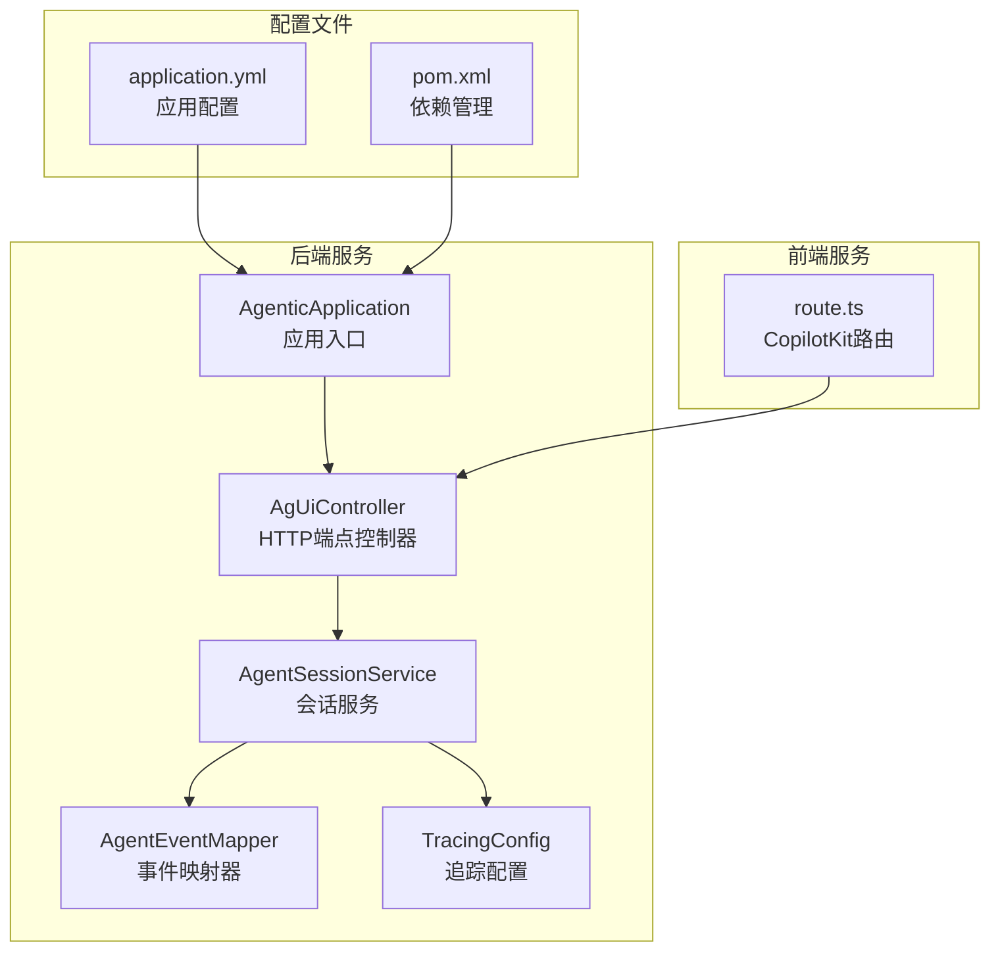
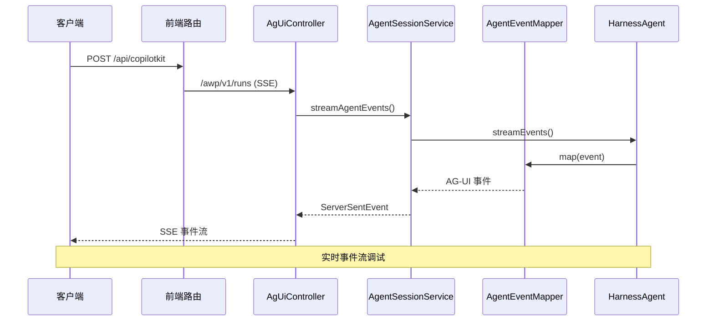
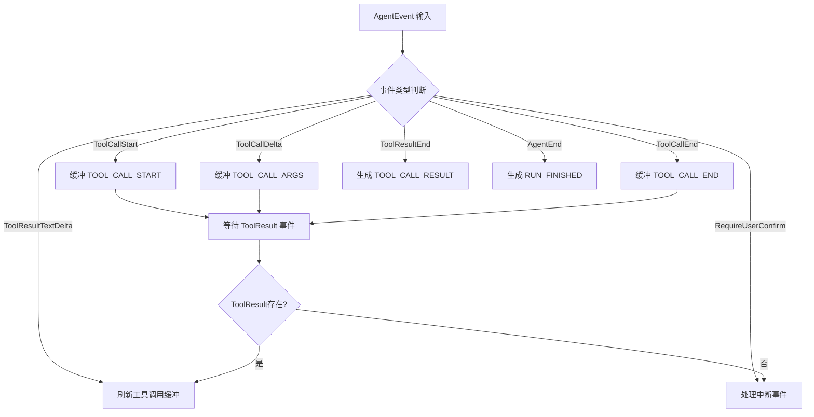
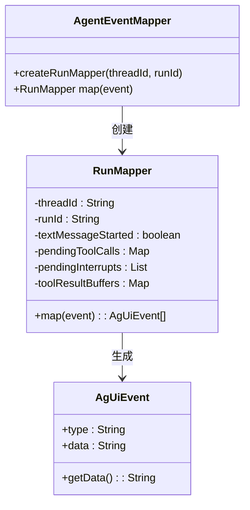
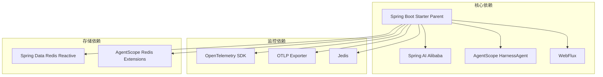

# 调试工具

<cite>
**本文档引用的文件**
- [AgenticApplication.java](file://src/main/java/com/example/agentic/AgenticApplication.java)
- [AgUiController.java](file://src/main/java/com/example/agentic/controller/AgUiController.java)
- [AgentSessionService.java](file://src/main/java/com/example/agentic/agent/AgentSessionService.java)
- [AgentEventMapper.java](file://src/main/java/com/example/agentic/agent/AgentEventMapper.java)
- [TracingConfig.java](file://src/main/java/com/example/agentic/config/TracingConfig.java)
- [application.yml](file://src/main/resources/application.yml)
- [route.ts](file://frontend/app/api/copilotkit/route.ts)
- [pom.xml](file://pom.xml)
</cite>

## 目录
1. [简介](#简介)
2. [项目结构](#项目结构)
3. [核心组件](#核心组件)
4. [架构概览](#架构概览)
5. [详细组件分析](#详细组件分析)
6. [依赖分析](#依赖分析)
7. [性能考虑](#性能考虑)
8. [故障排除指南](#故障排除指南)
9. [结论](#结论)

## 简介

这是一个基于 AgentScope HarnessAgent 的智能体调试工具系统。该系统提供了完整的智能体调试功能，包括事件流监控、工具调用跟踪、用户确认流程调试以及分布式追踪集成。

系统采用 Spring Boot + WebFlux 架构，通过 Server-Sent Events (SSE) 实时传输智能体事件，支持多种调试场景：

- **事件流调试**：实时监控智能体事件流
- **工具调用调试**：跟踪工具执行过程
- **用户确认调试**：调试用户交互确认流程
- **分布式追踪**：集成 OpenTelemetry 进行全链路追踪

## 项目结构



**图表来源**
- [AgenticApplication.java:1-26](file://src/main/java/com/example/agentic/AgenticApplication.java#L1-L26)
- [AgUiController.java:1-275](file://src/main/java/com/example/agentic/controller/AgUiController.java#L1-L275)
- [AgentSessionService.java:1-97](file://src/main/java/com/example/agentic/agent/AgentSessionService.java#L1-L97)

**章节来源**
- [AgenticApplication.java:1-26](file://src/main/java/com/example/agentic/AgenticApplication.java#L1-L26)
- [application.yml:1-37](file://src/main/resources/application.yml#L1-L37)
- [pom.xml:1-134](file://pom.xml#L1-L134)

## 核心组件

### 应用入口组件

应用入口类负责启动整个智能体平台，集成了多种技术栈：

- **Spring AI Alibaba 1.1.2.0**：提供传统 Spring AI 兼容性
- **AgentScope HarnessAgent 2.0.0-RC3**：智能体核心引擎
- **Spring Boot WebFlux**：支持 SSE 流式输出
- **Redis**：多租户会话持久化
- **OpenTelemetry**：全链路追踪

### 控制器组件

AgUiController 提供标准的 AG-UI 协议端点，支持以下功能：

- **POST /awp/v1/runs**：标准运行端点
- **多租户支持**：通过 X-Tenant-Id 和 X-User-Id 头部提取
- **HITL 恢复**：支持标准 resume 字段和旧版 confirm_results
- **消息处理**：提取最后一条用户消息

### 会话服务组件

AgentSessionService 是 SSE 流式输出的核心，负责：

- **多租户隔离**：使用 RuntimeContext 保证租户隔离
- **事件流处理**：封装 HarnessAgent.streamEvents()
- **状态管理**：每运行创建有状态的 AgentEventMapper.RunMapper
- **日志记录**：详细的事件调试日志

### 事件映射组件

AgentEventMapper 负责将 AgentScope 内部事件转换为 AG-UI 标准事件：

- **事件缓冲机制**：解决工具调用事件顺序问题
- **多格式支持**：支持 AG-UI 标准和 CopilotKit 格式
- **中断处理**：正确处理 RequireUserConfirmEvent
- **SSE 格式**：仅发送 data: 行，符合 AG-UI 客户端期望

**章节来源**
- [AgUiController.java:1-275](file://src/main/java/com/example/agentic/controller/AgUiController.java#L1-L275)
- [AgentSessionService.java:1-97](file://src/main/java/com/example/agentic/agent/AgentSessionService.java#L1-L97)
- [AgentEventMapper.java:1-344](file://src/main/java/com/example/agentic/agent/AgentEventMapper.java#L1-L344)

## 架构概览



**图表来源**
- [route.ts:1-35](file://frontend/app/api/copilotkit/route.ts#L1-L35)
- [AgUiController.java:59-83](file://src/main/java/com/example/agentic/controller/AgUiController.java#L59-L83)
- [AgentSessionService.java:53-87](file://src/main/java/com/example/agentic/agent/AgentSessionService.java#L53-L87)

## 详细组件分析

### 事件映射器详细分析

AgentEventMapper 的 RunMapper 类实现了复杂的事件缓冲和映射逻辑：



**图表来源**
- [AgentEventMapper.java:95-128](file://src/main/java/com/example/agentic/agent/AgentEventMapper.java#L95-L128)
- [AgentEventMapper.java:224-292](file://src/main/java/com/example/agentic/agent/AgentEventMapper.java#L224-L292)

### 调试事件流分析

系统提供了多层次的事件调试能力：

#### 1. 事件流监控



**图表来源**
- [AgentEventMapper.java:55-57](file://src/main/java/com/example/agentic/agent/AgentEventMapper.java#L55-L57)
- [AgentEventMapper.java:71-87](file://src/main/java/com/example/agentic/agent/AgentEventMapper.java#L71-L87)

#### 2. 工具调用调试

系统能够精确跟踪工具调用的每个阶段：

- **TOOL_CALL_START**：工具调用开始
- **TOOL_CALL_ARGS**：参数传递
- **TOOL_CALL_END**：调用结束
- **TOOL_CALL_RESULT**：结果返回

#### 3. 用户确认调试

支持多种用户确认格式：

- **标准 AG-UI 格式**：`{"interruptId":"xxx","status":"resolved","payload":{"approved":true}}`
- **CopilotKit 格式**：通过 forwardedProps.command.resume
- **旧版格式**：confirm_results 数组

**章节来源**
- [AgentEventMapper.java:1-344](file://src/main/java/com/example/agentic/agent/AgentEventMapper.java#L1-L344)
- [AgUiController.java:86-243](file://src/main/java/com/example/agentic/controller/AgUiController.java#L86-L243)

### 分布式追踪集成

系统集成了 OpenTelemetry 进行全链路追踪：

```mermaid
graph LR
subgraph "追踪层级"
A[/awp/v1/runs]
B[agent.run]
C[model.call]
D[tool.call]
end
subgraph "追踪导出"
E[OTLP/HTTP]
F[Langfuse]
G[AgentScope Studio]
end
A --> B --> C --> D
D --> E
E --> F
E --> G
```

**图表来源**
- [TracingConfig.java:25](file://src/main/java/com/example/agentic/config/TracingConfig.java#L25)
- [TracingConfig.java:30-48](file://src/main/java/com/example/agentic/config/TracingConfig.java#L30-L48)

**章节来源**
- [TracingConfig.java:1-50](file://src/main/java/com/example/agentic/config/TracingConfig.java#L1-L50)
- [application.yml:27-32](file://src/main/resources/application.yml#L27-L32)

## 依赖分析

### Maven 依赖结构



**图表来源**
- [pom.xml:60-122](file://pom.xml#L60-L122)

### 配置依赖关系

系统配置文件定义了关键的调试参数：

- **Redis 配置**：数据库分离和密钥前缀
- **模型配置**：DeepSeek API 设置
- **追踪配置**：OTLP 端点设置
- **服务器配置**：优雅关闭和端口设置

**章节来源**
- [application.yml:1-37](file://src/main/resources/application.yml#L1-L37)
- [pom.xml:1-134](file://pom.xml#L1-L134)

## 性能考虑

### 流式处理优化

系统采用 Reactor 框架进行高性能流式处理：

- **boundedElastic 调度器**：为长时间运行的 Agent 任务提供专用线程池
- **事件缓冲**：减少网络往返次数
- **内存管理**：工具结果大对象的卸载机制

### 资源管理

- **连接池**：Jedis 连接池配置
- **内存限制**：工具结果大小限制（80KB）
- **消息压缩**：历史消息压缩保留策略

## 故障排除指南

### 常见调试场景

#### 1. 事件流问题排查

**症状**：SSE 事件流中断或丢失
**排查步骤**：
1. 检查 AgentSessionService 日志中的 `[AG-EVENT]` 记录
2. 验证事件映射器的状态变量（textMessageStarted、pendingToolCalls）
3. 确认工具调用缓冲是否正确刷新

#### 2. 工具调用调试

**症状**：工具调用结果异常
**排查步骤**：
1. 检查 TOOL_CALL_ARGS 事件是否完整
2. 验证 TOOL_CALL_RESULT 的 content 字段
3. 查看工具结果缓冲区的内容累积

#### 3. 用户确认流程调试

**症状**：HITL 确认不生效
**排查步骤**：
1. 验证 resume 字段格式正确性
2. 检查 ConfirmResult 对象的 approved 状态
3. 确认 ToolUseBlock 的 metadata 信息

#### 4. 追踪问题排查

**症状**：分布式追踪数据缺失
**排查步骤**：
1. 检查 OTLP 端点配置
2. 验证追踪中间件是否正确注入
3. 确认 Span 层级结构

**章节来源**
- [AgentSessionService.java:80-82](file://src/main/java/com/example/agentic/agent/AgentSessionService.java#L80-L82)
- [AgentEventMapper.java:224-292](file://src/main/java/com/example/agentic/agent/AgentEventMapper.java#L224-L292)
- [TracingConfig.java:14-26](file://src/main/java/com/example/agentic/config/TracingConfig.java#L14-L26)

## 结论

该调试工具系统提供了全面的智能体调试能力，通过以下关键特性实现高效的调试体验：

- **实时事件流**：基于 SSE 的实时事件监控
- **多格式支持**：兼容 AG-UI 和 CopilotKit 两种协议格式
- **完整追踪**：OpenTelemetry 集成提供全链路可视化
- **灵活配置**：丰富的配置选项支持不同调试场景
- **性能优化**：Reactors 流式处理确保高吞吐量

系统的设计充分考虑了智能体调试的复杂性和多样性，为开发者提供了强大的调试工具和深入的系统洞察能力。