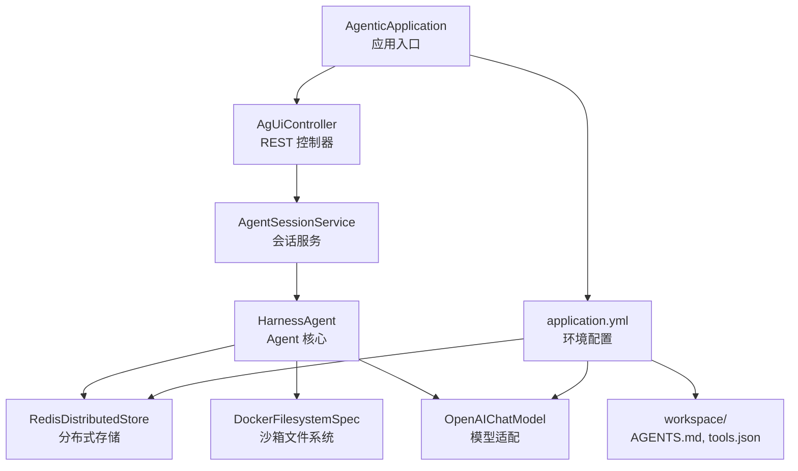
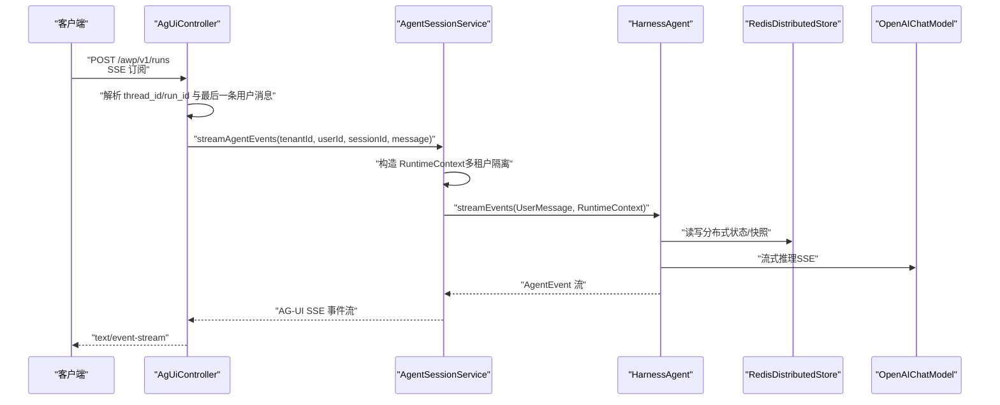
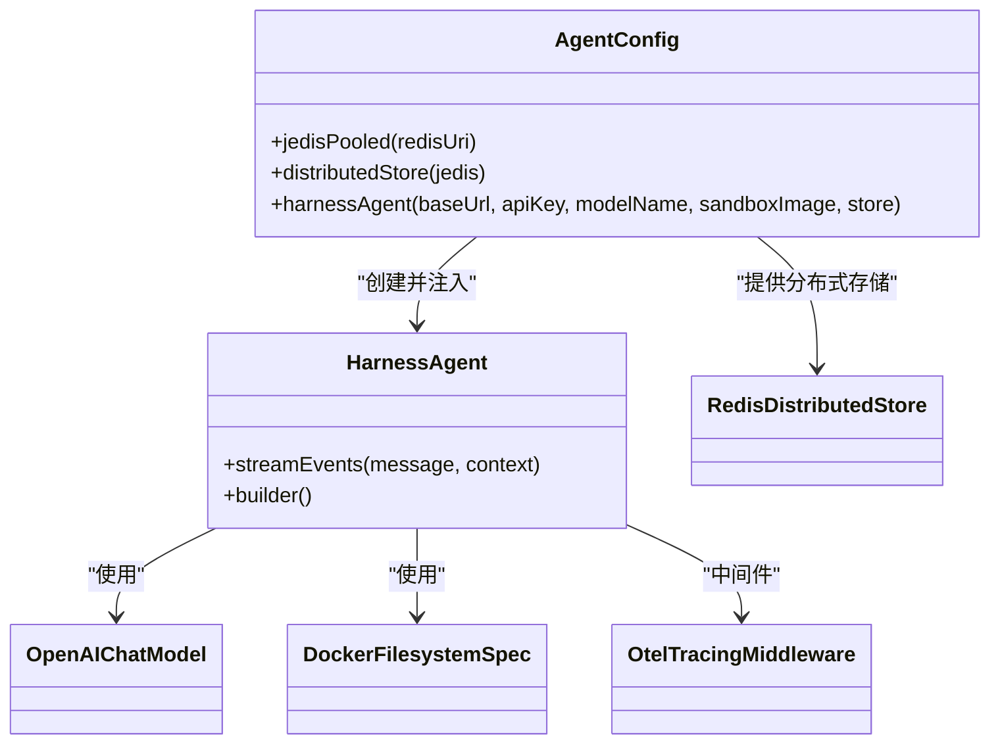
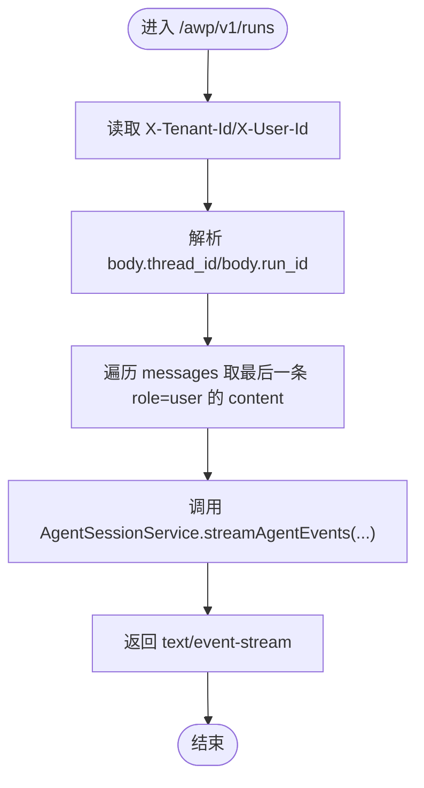
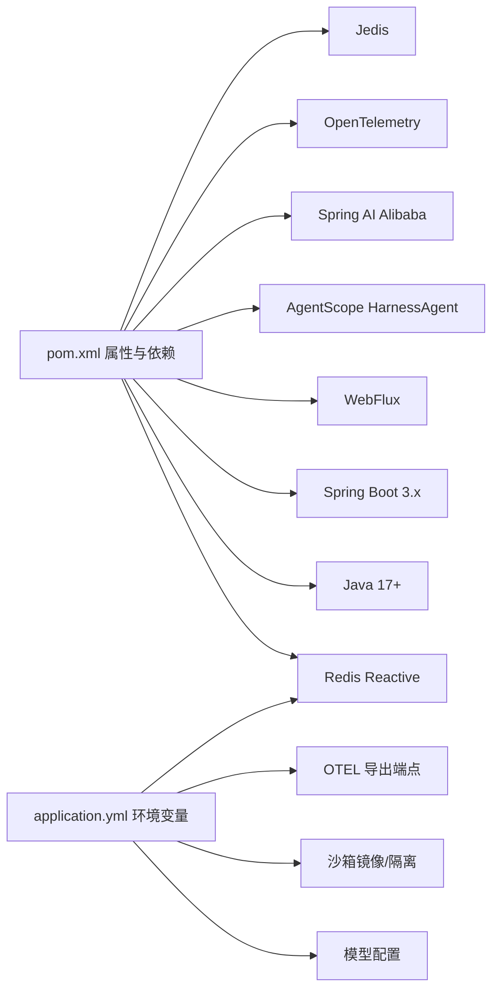

# 快速开始

<cite>
**本文引用的文件**
- [pom.xml](file://pom.xml)
- [application.yml](file://src/main/resources/application.yml)
- [AgenticApplication.java](file://src/main/java/com/example/agentic/AgenticApplication.java)
- [AgentConfig.java](file://src/main/java/com/example/agentic/config/AgentConfig.java)
- [AgentSessionService.java](file://src/main/java/com/example/agentic/agent/AgentSessionService.java)
- [AgUiController.java](file://src/main/java/com/example/agentic/controller/AgUiController.java)
- [AGENTS.md](file://src/main/resources/workspace/AGENTS.md)
- [tools.json](file://src/main/resources/workspace/tools.json)
</cite>

## 目录
1. [简介](#简介)
2. [项目结构](#项目结构)
3. [核心组件](#核心组件)
4. [架构总览](#架构总览)
5. [详细组件分析](#详细组件分析)
6. [依赖分析](#依赖分析)
7. [性能考虑](#性能考虑)
8. [故障排查指南](#故障排查指南)
9. [结论](#结论)
10. [附录](#附录)

## 简介
本指南面向首次接触智能代理平台的新开发者，目标是在约 15 分钟内完成环境准备、项目构建与启动，并通过一个最小可行的 Hello World 示例创建第一个代理会话。平台基于 Spring Boot 3、Spring WebFlux（SSE）、AgentScope HarnessAgent 2.0、Redis 分布式存储与 OpenTelemetry 链路追踪，提供多租户隔离、容器沙箱与流式响应能力。

## 项目结构
该仓库采用标准 Spring Boot 结构，核心源码位于 src/main/java，资源位于 src/main/resources。关键模块包括：
- 应用入口：AgenticApplication
- 配置：AgentConfig（HarnessAgent、Redis、沙箱、上下文压缩、Tracing）
- 控制器：AgUiController（实现 AG-UI SSE 运行端点）
- 会话服务：AgentSessionService（封装流式事件、多租户 RuntimeContext）
- 资源：application.yml（环境变量驱动的配置）、workspace（AGENTS.md、tools.json）

图表来源
- [AgenticApplication.java:1-23](file://src/main/java/com/example/agentic/AgenticApplication.java#L1-L23)
- [AgUiController.java:1-75](file://src/main/java/com/example/agentic/controller/AgUiController.java#L1-L75)
- [AgentSessionService.java:1-63](file://src/main/java/com/example/agentic/agent/AgentSessionService.java#L1-L63)
- [AgentConfig.java:1-84](file://src/main/java/com/example/agentic/config/AgentConfig.java#L1-L84)
- [application.yml:1-24](file://src/main/resources/application.yml#L1-L24)
- [AGENTS.md:1-19](file://src/main/resources/workspace/AGENTS.md#L1-L19)
- [tools.json:1-12](file://src/main/resources/workspace/tools.json#L1-L12)

章节来源
- [AgenticApplication.java:1-23](file://src/main/java/com/example/agentic/AgenticApplication.java#L1-L23)
- [application.yml:1-24](file://src/main/resources/application.yml#L1-L24)

## 核心组件
- 应用入口与启动
  - 启动类负责加载 Spring Boot 应用上下文，端口默认 8080。
- 配置与 Bean 注册
  - AgentConfig 注册 Redis 连接池、分布式存储、HarnessAgent、沙箱文件系统、上下文压缩策略、工具结果卸载策略与 OTEL Tracing 中间件。
- 会话与事件流
  - AgentSessionService 将用户消息与多租户 RuntimeContext 绑定，调用 HarnessAgent.streamEvents 并映射为 AG-UI SSE 格式。
- AG-UI 协议端点
  - AgUiController 接收 AG-UI 请求体，解析 thread_id/run_id 与最后一条用户消息，转发给会话服务。

章节来源
- [AgentConfig.java:1-84](file://src/main/java/com/example/agentic/config/AgentConfig.java#L1-L84)
- [AgentSessionService.java:1-63](file://src/main/java/com/example/agentic/agent/AgentSessionService.java#L1-L63)
- [AgUiController.java:1-75](file://src/main/java/com/example/agentic/controller/AgUiController.java#L1-L75)

## 架构总览
平台以“控制器 → 会话服务 → Agent 核心”的分层组织，结合 Redis 实现多租户 Session 持久化，使用 Docker 沙箱隔离执行环境，通过 OpenTelemetry 输出链路追踪数据。

图表来源
- [AgUiController.java:32-56](file://src/main/java/com/example/agentic/controller/AgUiController.java#L32-L56)
- [AgentSessionService.java:43-61](file://src/main/java/com/example/agentic/agent/AgentSessionService.java#L43-L61)
- [AgentConfig.java:44-82](file://src/main/java/com/example/agentic/config/AgentConfig.java#L44-L82)

## 详细组件分析

### 组件一：应用入口与启动
- 负责加载 Spring Boot 应用上下文，绑定端口与优雅停机策略。
- 默认端口 8080，可通过环境变量覆盖。

章节来源
- [AgenticApplication.java:16-22](file://src/main/java/com/example/agentic/AgenticApplication.java#L16-L22)
- [application.yml:21-24](file://src/main/resources/application.yml#L21-L24)

### 组件二：Agent 配置与依赖注入
- Redis 连接池与分布式存储：通过 JedisPooled 与 RedisDistributedStore 实现状态持久化与快照管理。
- HarnessAgent 构建：设置模型适配器、工作区、沙箱文件系统、上下文压缩与工具结果卸载策略，并启用 OTEL Tracing 中间件。
- 沙箱隔离：按会话隔离（SESSION），限定可投射到沙箱的工作区种子文件。

图表来源
- [AgentConfig.java:34-82](file://src/main/java/com/example/agentic/config/AgentConfig.java#L34-L82)

章节来源
- [AgentConfig.java:28-84](file://src/main/java/com/example/agentic/config/AgentConfig.java#L28-L84)

### 组件三：会话服务与事件流
- 多租户隔离：通过 RuntimeContext.userId 与 sessionId 组合，确保不同租户与会话互不干扰。
- 事件映射：将 AgentEvent 映射为 AG-UI SSE 事件格式，过滤空值并构建 ServerSentEvent。

章节来源
- [AgentSessionService.java:13-63](file://src/main/java/com/example/agentic/agent/AgentSessionService.java#L13-L63)

### 组件四：AG-UI 协议端点
- 端点：POST /awp/v1/runs，Accept: text/event-stream。
- 请求头：X-Tenant-Id、X-User-Id；请求体：包含 thread_id、run_id 与 messages 数组。
- 逻辑：提取最后一条用户消息，调用会话服务生成 SSE 事件流。

图表来源
- [AgUiController.java:43-73](file://src/main/java/com/example/agentic/controller/AgUiController.java#L43-L73)

章节来源
- [AgUiController.java:12-75](file://src/main/java/com/example/agentic/controller/AgUiController.java#L12-L75)

## 依赖分析
- Java 与构建
  - Java 版本：17+
  - Maven 插件：spring-boot-maven-plugin
- 运行时依赖
  - Spring Boot WebFlux（SSE）
  - Spring Data Redis Reactive（Reactive Redis）
  - AgentScope HarnessAgent 与 Redis 扩展
  - Spring AI Alibaba（DashScope）
  - OpenTelemetry SDK 与 OTLP 导出器
  - Jedis 客户端
- 配置来源
  - application.yml 通过环境变量驱动 Redis、模型、沙箱与 OTEL 等配置。

图表来源
- [pom.xml:20-129](file://pom.xml#L20-L129)
- [application.yml:1-24](file://src/main/resources/application.yml#L1-L24)

章节来源
- [pom.xml:20-129](file://pom.xml#L20-L129)
- [application.yml:1-24](file://src/main/resources/application.yml#L1-L24)

## 性能考虑
- SSE 流式输出：使用 WebFlux 与 Reactor，避免阻塞，适合长连接与高并发。
- 上下文压缩：定期压缩对话历史，降低模型输入成本。
- 工具结果卸载：对大体积工具结果进行落盘与占位符替换，减少内存占用。
- 沙箱隔离：按会话隔离，避免跨会话状态污染，提升稳定性。

## 故障排查指南
- 端口冲突
  - 现象：启动失败或端口被占用。
  - 解决：修改 server.port 或释放端口。
  - 参考：[application.yml:21-24](file://src/main/resources/application.yml#L21-L24)
- Redis 连接失败
  - 现象：无法连接 Redis 或认证失败。
  - 解决：检查 REDIS_URI 环境变量或 spring.data.redis.url。
  - 参考：[application.yml:2-4](file://src/main/resources/application.yml#L2-L4)，[AgentConfig.java:34-42](file://src/main/java/com/example/agentic/config/AgentConfig.java#L34-L42)
- 模型鉴权失败
  - 现象：模型调用报错（如 API Key 无效）。
  - 解决：设置 DEEPSEEK_API_KEY；核对 base-url 与 model-name。
  - 参考：[application.yml:8-11](file://src/main/resources/application.yml#L8-L11)，[AgentConfig.java:44-61](file://src/main/java/com/example/agentic/config/AgentConfig.java#L44-L61)
- Docker 沙箱不可用
  - 现象：沙箱初始化失败或权限不足。
  - 解决：确保本地 Docker 可用且具备拉取镜像权限；必要时调整沙箱镜像与隔离范围。
  - 参考：[application.yml:12-14](file://src/main/resources/application.yml#L12-L14)，[AgentConfig.java:66-71](file://src/main/java/com/example/agentic/config/AgentConfig.java#L66-L71)
- OTEL 导出失败
  - 现象：链路追踪未上报。
  - 解决：检查 LANGFUSE_OTEL_ENDPOINT 是否可达。
  - 参考：[application.yml:16-19](file://src/main/resources/application.yml#L16-L19)
- AG-UI 请求参数缺失
  - 现象：400 错误或无响应。
  - 解决：确保请求体包含 messages 数组，且至少含一条 role=user 的消息；正确设置 X-Tenant-Id 与 X-User-Id。
  - 参考：[AgUiController.java:43-73](file://src/main/java/com/example/agentic/controller/AgUiController.java#L43-L73)

## 结论
通过本快速开始指南，您已了解项目的整体架构、核心组件与配置要点，并能在 15 分钟内完成环境准备、构建与启动，以及创建第一个 AG-UI 会话。建议后续深入学习 AgentScope 的技能与工具扩展、沙箱隔离策略与 OTEL 链路追踪实践。

## 附录

### 环境要求
- Java：17 或以上
- Maven：用于构建与打包
- Redis：用于分布式状态存储（可使用本地或远程实例）
- Docker：用于沙箱隔离（可选，但推荐）
- OpenTelemetry Collector：用于链路追踪导出（可选）

章节来源
- [pom.xml:20-26](file://pom.xml#L20-L26)
- [application.yml:2-4](file://src/main/resources/application.yml#L2-L4)
- [application.yml:12-14](file://src/main/resources/application.yml#L12-L14)
- [application.yml:16-19](file://src/main/resources/application.yml#L16-L19)

### 安装与构建
- 克隆仓库后，使用 Maven 进行构建与打包。
- 构建插件已在 POM 中配置，可直接使用 Spring Boot Maven 插件进行打包。

章节来源
- [pom.xml:121-129](file://pom.xml#L121-L129)

### 基本配置
- Redis 连接：通过 spring.data.redis.url 或 REDIS_URI 设置。
- Agent 工作区：通过 agent.workspace 设置（开发可用相对路径，生产建议绝对路径）。
- 模型配置：agent.model.base-url、agent.model.api-key、agent.model.model-name。
- 沙箱镜像与隔离：agent.sandbox.image、agent.sandbox.isolation-scope。
- OTEL 导出端点：otel.exporter.otlp.endpoint。
- 服务器端口与优雅停机：server.port、server.shutdown。

章节来源
- [application.yml:1-24](file://src/main/resources/application.yml#L1-L24)

### 启动命令
- 使用 Maven 启动 Spring Boot 应用（默认端口 8080）。
- 如需自定义端口，可在启动时设置 server.port 或通过环境变量覆盖。

章节来源
- [AgenticApplication.java:19-21](file://src/main/java/com/example/agentic/AgenticApplication.java#L19-L21)
- [application.yml:21-24](file://src/main/resources/application.yml#L21-L24)

### 验证步骤
- 启动应用后，访问 /awp/v1/runs 端点，发送 AG-UI 格式的请求体，订阅 text/event-stream。
- 确认收到 SSE 事件流，且事件类型与数据符合预期。

章节来源
- [AgUiController.java:43-56](file://src/main/java/com/example/agentic/controller/AgUiController.java#L43-L56)

### Hello World 示例（创建第一个代理会话）
- 准备请求头
  - X-Tenant-Id：租户标识
  - X-User-Id：用户标识
- 准备请求体
  - 包含 thread_id、run_id 与 messages 数组，其中至少包含一条 role=user 的消息。
- 发送请求
  - POST /awp/v1/runs，Accept: text/event-stream
- 观察响应
  - 逐步接收 SSE 事件，直至完成一次完整会话。

章节来源
- [AgUiController.java:32-56](file://src/main/java/com/example/agentic/controller/AgUiController.java#L32-L56)
- [AgentSessionService.java:43-61](file://src/main/java/com/example/agentic/agent/AgentSessionService.java#L43-L61)

### 常见初始配置问题与解决方案
- Redis 连接失败：检查 REDIS_URI 或 spring.data.redis.url。
- 模型鉴权失败：检查 DEEPSEEK_API_KEY 与 base-url。
- 端口冲突：修改 server.port。
- Docker 沙箱不可用：确保本地 Docker 可用。
- OTEL 导出失败：检查 LANGFUSE_OTEL_ENDPOINT。

章节来源
- [application.yml:2-4](file://src/main/resources/application.yml#L2-L4)
- [application.yml:8-11](file://src/main/resources/application.yml#L8-L11)
- [application.yml:16-19](file://src/main/resources/application.yml#L16-L19)
- [application.yml:21-24](file://src/main/resources/application.yml#L21-L24)