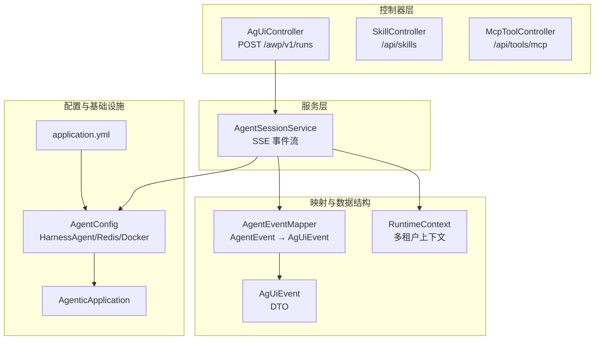
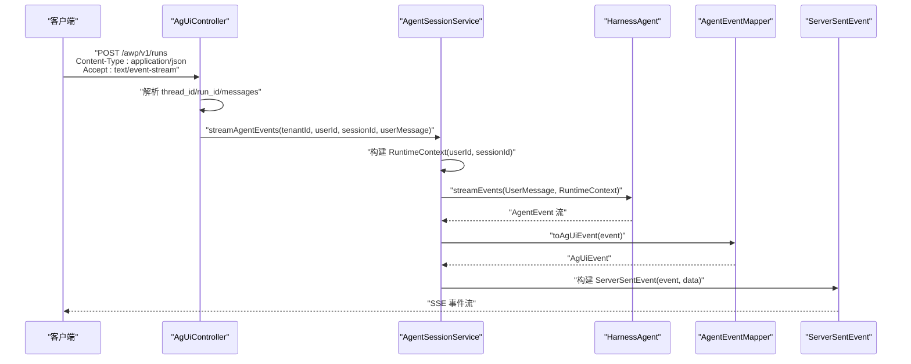
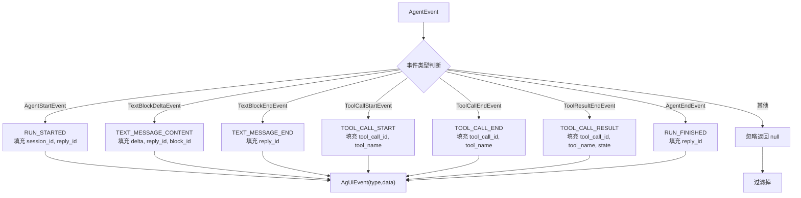
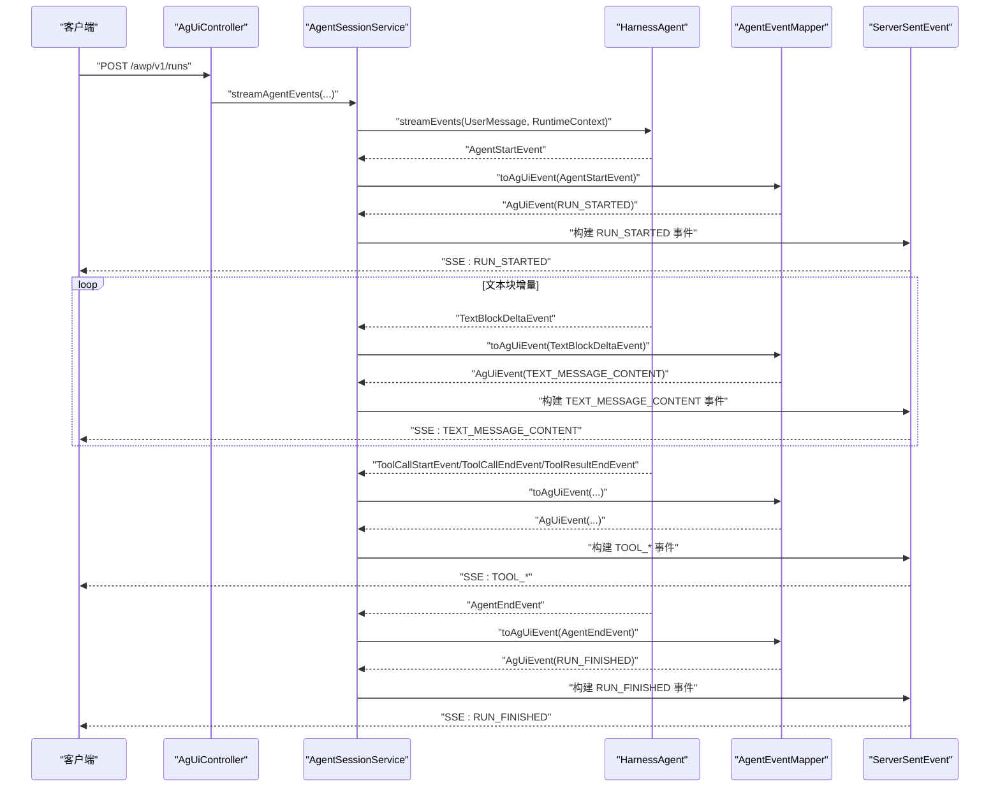
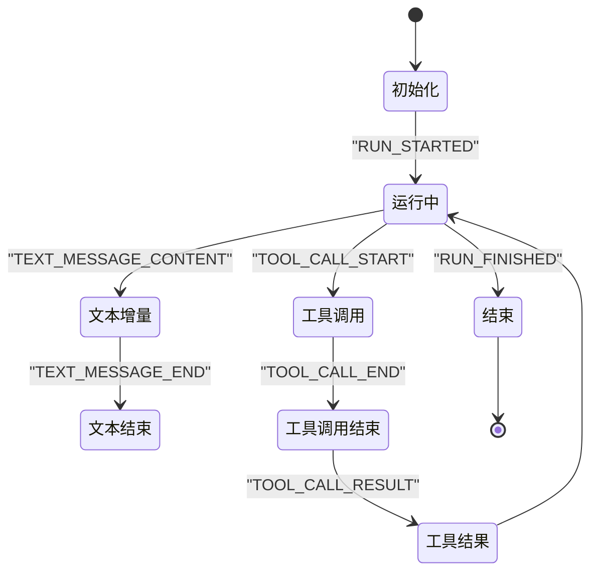
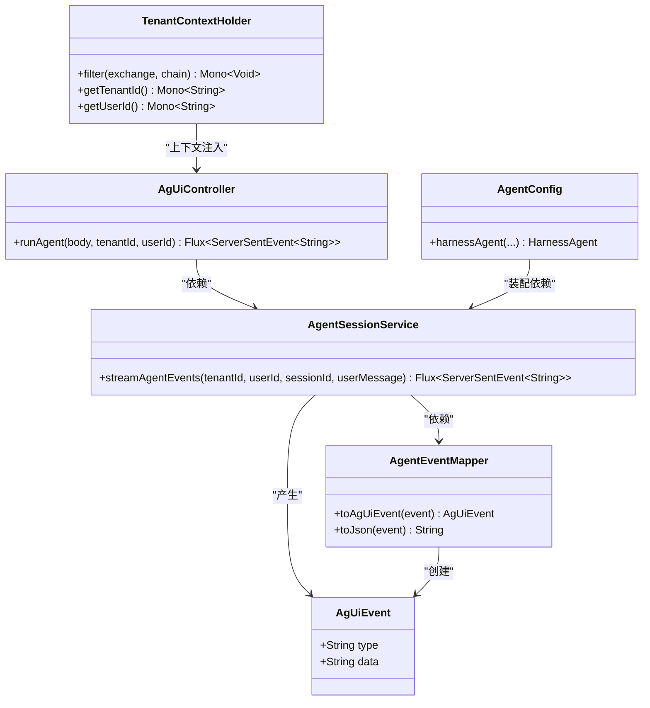
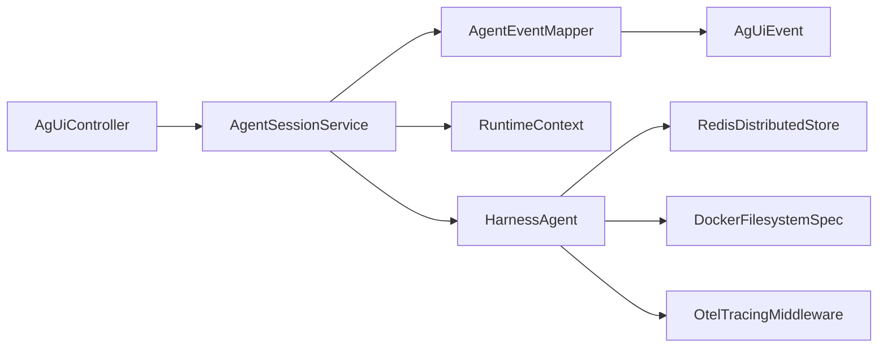

# 数据流

<cite>
**本文引用的文件**
- [AgUiEvent.java](file://src/main/java/com/example/agentic/agent/AgUiEvent.java)
- [AgentEventMapper.java](file://src/main/java/com/example/agentic/agent/AgentEventMapper.java)
- [AgentSessionService.java](file://src/main/java/com/example/agentic/agent/AgentSessionService.java)
- [AgUiController.java](file://src/main/java/com/example/agentic/controller/AgUiController.java)
- [TenantContextHolder.java](file://src/main/java/com/example/agentic/tenant/TenantContextHolder.java)
- [AgentConfig.java](file://src/main/java/com/example/agentic/config/AgentConfig.java)
- [AgenticApplication.java](file://src/main/java/com/example/agentic/AgenticApplication.java)
- [application.yml](file://src/main/resources/application.yml)
- [SkillController.java](file://src/main/java/com/example/agentic/controller/SkillController.java)
- [McpToolController.java](file://src/main/java/com/example/agentic/controller/McpToolController.java)
- [McpToolConfig.java](file://src/main/java/com/example/agentic/config/McpToolConfig.java)
- [tools.json](file://src/main/resources/workspace/tools.json)
- [AGENTS.md](file://src/main/resources/workspace/AGENTS.md)
</cite>

## 目录
1. [简介](#简介)
2. [项目结构](#项目结构)
3. [核心组件](#核心组件)
4. [架构总览](#架构总览)
5. [详细组件分析](#详细组件分析)
6. [依赖分析](#依赖分析)
7. [性能考虑](#性能考虑)
8. [故障排查指南](#故障排查指南)
9. [结论](#结论)
10. [附录](#附录)

## 简介
本文件面向智能代理平台的数据流文档目标，系统性梳理从请求接收到底层代理执行的完整数据路径，重点覆盖：
- 事件驱动的数据处理机制
- Server-Sent Events（SSE）流式传输
- 异步事件处理与多租户隔离
- 关键数据结构 AgUiEvent、RuntimeContext 的流转与转换
- 数据转换图、事件时序图、状态转换图
- 数据验证、错误处理与异常传播机制

## 项目结构
该系统采用 Spring Boot WebFlux 架构，控制器负责接收 AG-UI 协议请求，服务层封装事件流式输出，映射器负责将底层 AgentScope 事件转换为 AG-UI 事件，配置层提供模型、存储、沙箱等基础设施。

图表来源
- [AgUiController.java:22-75](file://src/main/java/com/example/agentic/controller/AgUiController.java#L22-L75)
- [AgentSessionService.java:23-62](file://src/main/java/com/example/agentic/agent/AgentSessionService.java#L23-L62)
- [AgentEventMapper.java:31-120](file://src/main/java/com/example/agentic/agent/AgentEventMapper.java#L31-L120)
- [AgUiEvent.java:6-24](file://src/main/java/com/example/agentic/agent/AgUiEvent.java#L6-L24)
- [AgentConfig.java:28-87](file://src/main/java/com/example/agentic/config/AgentConfig.java#L28-L87)
- [AgenticApplication.java:19-26](file://src/main/java/com/example/agentic/AgenticApplication.java#L19-L26)
- [application.yml:1-34](file://src/main/resources/application.yml#L1-L34)

章节来源
- [AgUiController.java:22-75](file://src/main/java/com/example/agentic/controller/AgUiController.java#L22-L75)
- [AgentSessionService.java:23-62](file://src/main/java/com/example/agentic/agent/AgentSessionService.java#L23-L62)
- [AgentEventMapper.java:31-120](file://src/main/java/com/example/agentic/agent/AgentEventMapper.java#L31-L120)
- [AgUiEvent.java:6-24](file://src/main/java/com/example/agentic/agent/AgUiEvent.java#L6-L24)
- [AgentConfig.java:28-87](file://src/main/java/com/example/agentic/config/AgentConfig.java#L28-L87)
- [AgenticApplication.java:19-26](file://src/main/java/com/example/agentic/AgenticApplication.java#L19-L26)
- [application.yml:1-34](file://src/main/resources/application.yml#L1-L34)

## 核心组件
- AgUiEvent：AG-UI 协议事件的轻量 DTO，包含事件类型与 JSON 数据字符串。
- AgentEventMapper：将 AgentScope 事件转换为 AG-UI 事件，实现事件类型映射与字段安全填充。
- AgentSessionService：封装事件流式输出，构建 RuntimeContext，调用底层 HarnessAgent 并转换为 SSE。
- AgUiController：暴露 AG-UI 协议端点，解析请求体与头部，提取用户消息并委托服务层。
- TenantContextHolder：WebFilter，从 HTTP 头部提取租户与用户信息，注入 Reactor Context。
- AgentConfig：装配 HarnessAgent、Redis 分布式存储、Docker 沙箱、上下文压缩与中间件。
- application.yml：系统配置，包括 Redis、模型、沙箱镜像、OTEL 导出器等。

章节来源
- [AgUiEvent.java:6-24](file://src/main/java/com/example/agentic/agent/AgUiEvent.java#L6-L24)
- [AgentEventMapper.java:31-120](file://src/main/java/com/example/agentic/agent/AgentEventMapper.java#L31-L120)
- [AgentSessionService.java:23-62](file://src/main/java/com/example/agentic/agent/AgentSessionService.java#L23-L62)
- [AgUiController.java:22-75](file://src/main/java/com/example/agentic/controller/AgUiController.java#L22-L75)
- [TenantContextHolder.java:16-59](file://src/main/java/com/example/agentic/tenant/TenantContextHolder.java#L16-L59)
- [AgentConfig.java:28-87](file://src/main/java/com/example/agentic/config/AgentConfig.java#L28-L87)
- [application.yml:1-34](file://src/main/resources/application.yml#L1-L34)

## 架构总览
系统采用“请求 → 控制器 → 服务 → 映射器 → SSE 输出”的响应式流水线，结合多租户隔离与事件驱动的流式传输。

图表来源
- [AgUiController.java:43-56](file://src/main/java/com/example/agentic/controller/AgUiController.java#L43-L56)
- [AgentSessionService.java:43-61](file://src/main/java/com/example/agentic/agent/AgentSessionService.java#L43-L61)
- [AgentEventMapper.java:45-97](file://src/main/java/com/example/agentic/agent/AgentEventMapper.java#L45-L97)

## 详细组件分析

### 组件一：AgUiController（AG-UI 协议端点）
职责与流程
- 接收 AG-UI RunAgentInput 请求体，提取 thread_id、run_id、messages。
- 从请求头读取 X-Tenant-Id、X-User-Id，构造 RuntimeContext。
- 从 messages 最后一条 role=user 的消息作为用户输入。
- 委托 AgentSessionService 生成 SSE 事件流。

关键点
- 多租户来源：X-Tenant-Id、X-User-Id。
- 输入验证：messages 存在性与数组校验；缺失时回退默认值。
- 返回类型：MediaType.TEXT_EVENT_STREAM_VALUE，确保客户端以 SSE 接收。

章节来源
- [AgUiController.java:43-75](file://src/main/java/com/example/agentic/controller/AgUiController.java#L43-L75)

### 组件二：AgentSessionService（SSE 事件流）
职责与流程
- 构建 RuntimeContext：userId 为 tenantId:userId 拼接；sessionId 为 agentName:sessionId。
- 调用 HarnessAgent.streamEvents(UserMessage, RuntimeContext)，获得 AgentEvent 流。
- 使用 AgentEventMapper 将事件转换为 AgUiEvent，并过滤未映射事件。
- 将 AgUiEvent 包装为 ServerSentEvent，事件名对应 AG-UI 事件类型，数据为 JSON 字符串。

关键点
- 多租户隔离：每次调用必须传入 RuntimeContext，避免串台。
- 事件过滤：仅输出映射到 AG-UI 的事件，其余忽略。
- SSE 构建：事件名与数据分别来自 AgUiEvent 的 type 与 data。

章节来源
- [AgentSessionService.java:43-62](file://src/main/java/com/example/agentic/agent/AgentSessionService.java#L43-L62)

### 组件三：AgentEventMapper（事件映射器）
职责与流程
- 将 AgentScope 的 AgentEvent 转换为 AgUiEvent。
- 映射关系（节选）：AgentStartEvent → RUN_STARTED；TextBlockDeltaEvent → TEXT_MESSAGE_CONTENT；TextBlockEndEvent → TEXT_MESSAGE_END；ToolCallStartEvent → TOOL_CALL_START；ToolCallEndEvent → TOOL_CALL_END；ToolResultEndEvent → TOOL_CALL_RESULT；AgentEndEvent → RUN_FINISHED。
- 安全填充：空值统一转为空字符串；部分事件反射读取扩展字段（如 TextBlockEndEvent 的 reply_id）。
- 序列化：toJson 将 AgUiEvent 的 data 字段直接输出为 JSON 字符串。

复杂度与性能
- 时间复杂度：O(n) 遍历事件流；每个事件映射为常数时间。
- 空间复杂度：O(1) 除临时 JSON 节点外，无额外分配。

章节来源
- [AgentEventMapper.java:45-120](file://src/main/java/com/example/agentic/agent/AgentEventMapper.java#L45-L120)

### 组件四：AgUiEvent（数据结构）
职责与流程
- 作为 AG-UI 事件的最小表达单元，包含 type 与 data。
- data 为 JSON 字符串，由映射器按事件类型组装。

复杂度与性能
- 结构简单，序列化开销极低。

章节来源
- [AgUiEvent.java:6-24](file://src/main/java/com/example/agentic/agent/AgUiEvent.java#L6-L24)

### 组件五：TenantContextHolder（多租户上下文）
职责与流程
- WebFilter：从请求头提取 X-Tenant-Id、X-User-Id，写入 Reactor Context。
- 提供静态方法从上下文中读取租户与用户标识，便于后续链路使用。

章节来源
- [TenantContextHolder.java:25-59](file://src/main/java/com/example/agentic/tenant/TenantContextHolder.java#L25-L59)

### 组件六：AgentConfig（基础设施装配）
职责与流程
- Redis 分布式存储：基于 JedisPooled 的 RedisDistributedStore。
- HarnessAgent：配置模型（OpenAI Chat）、工作区、分布式存储、Docker 沙箱、上下文压缩、工具结果卸载、OTEL 中间件。
- 沙箱隔离：IsolationScope.SESSION，工作区投影根目录限定。

章节来源
- [AgentConfig.java:47-85](file://src/main/java/com/example/agentic/config/AgentConfig.java#L47-L85)
- [application.yml:16-25](file://src/main/resources/application.yml#L16-L25)

### 数据转换图（事件映射）

图表来源
- [AgentEventMapper.java:45-97](file://src/main/java/com/example/agentic/agent/AgentEventMapper.java#L45-L97)

### 事件时序图（SSE 流式传输）

图表来源
- [AgUiController.java:43-56](file://src/main/java/com/example/agentic/controller/AgUiController.java#L43-L56)
- [AgentSessionService.java:43-61](file://src/main/java/com/example/agentic/agent/AgentSessionService.java#L43-L61)
- [AgentEventMapper.java:45-97](file://src/main/java/com/example/agentic/agent/AgentEventMapper.java#L45-L97)

### 状态转换图（会话生命周期）

图表来源
- [AgentEventMapper.java:46-94](file://src/main/java/com/example/agentic/agent/AgentEventMapper.java#L46-L94)

### 类图（关键数据结构与关系）

图表来源
- [AgUiEvent.java:6-24](file://src/main/java/com/example/agentic/agent/AgUiEvent.java#L6-L24)
- [AgentEventMapper.java:31-120](file://src/main/java/com/example/agentic/agent/AgentEventMapper.java#L31-L120)
- [AgentSessionService.java:23-62](file://src/main/java/com/example/agentic/agent/AgentSessionService.java#L23-L62)
- [AgUiController.java:22-75](file://src/main/java/com/example/agentic/controller/AgUiController.java#L22-L75)
- [TenantContextHolder.java:16-59](file://src/main/java/com/example/agentic/tenant/TenantContextHolder.java#L16-L59)
- [AgentConfig.java:28-87](file://src/main/java/com/example/agentic/config/AgentConfig.java#L28-L87)

## 依赖分析
- 控制器依赖服务层，服务层依赖映射器与底层 Agent。
- 映射器依赖 Jackson ObjectMapper 与 AgentScope 事件类型。
- 服务层依赖 HarnessAgent 与 RuntimeContext。
- 配置层提供 Redis、模型、沙箱、中间件等基础设施。
- WebFlux 响应式链路贯穿，SSE 事件流天然支持背压与异步。

图表来源
- [AgUiController.java:22-75](file://src/main/java/com/example/agentic/controller/AgUiController.java#L22-L75)
- [AgentSessionService.java:23-62](file://src/main/java/com/example/agentic/agent/AgentSessionService.java#L23-L62)
- [AgentEventMapper.java:31-120](file://src/main/java/com/example/agentic/agent/AgentEventMapper.java#L31-L120)
- [AgentConfig.java:47-85](file://src/main/java/com/example/agentic/config/AgentConfig.java#L47-L85)

章节来源
- [AgUiController.java:22-75](file://src/main/java/com/example/agentic/controller/AgUiController.java#L22-L75)
- [AgentSessionService.java:23-62](file://src/main/java/com/example/agentic/agent/AgentSessionService.java#L23-L62)
- [AgentEventMapper.java:31-120](file://src/main/java/com/example/agentic/agent/AgentEventMapper.java#L31-L120)
- [AgentConfig.java:28-87](file://src/main/java/com/example/agentic/config/AgentConfig.java#L28-L87)

## 性能考虑
- 流式处理：使用 Reactor Flux 与 SSE，避免一次性聚合大量事件，降低内存峰值。
- 事件过滤：仅输出映射到 AG-UI 的事件，减少无效数据传输。
- 安全填充：空值统一处理，避免空指针与异常传播。
- 多租户隔离：RuntimeContext 每次调用都传入，避免重复构建上下文带来的开销。
- 沙箱与存储：Docker 沙箱与 Redis 分布式存储提升隔离性与可扩展性。
- 上下文压缩与工具结果卸载：控制历史消息规模与大结果落盘，降低带宽与内存压力。

## 故障排查指南
- 请求头缺失
  - 现象：租户或用户标识为空。
  - 处理：AgUiController 默认值 fallback；建议在网关层统一注入。
  - 参考：[AgUiController.java:46-47](file://src/main/java/com/example/agentic/controller/AgUiController.java#L46-L47)
- 请求体格式错误
  - 现象：messages 缺失或非数组。
  - 处理：extractLastUserMessage 返回空字符串，导致无有效用户消息。
  - 参考：[AgUiController.java:61-73](file://src/main/java/com/example/agentic/controller/AgUiController.java#L61-L73)
- 事件未映射
  - 现象：某些 AgentScope 事件未出现在 AG-UI 流中。
  - 处理：AgentEventMapper 对未映射事件返回 null，服务层已过滤。
  - 参考：[AgentEventMapper.java:95-97](file://src/main/java/com/example/agentic/agent/AgentEventMapper.java#L95-L97)
- SSE 未收到事件
  - 现象：客户端未收到任何事件。
  - 处理：检查 RuntimeContext 是否正确传入；确认 AgentStartEvent 是否正常触发。
  - 参考：[AgentSessionService.java:48-51](file://src/main/java/com/example/agentic/agent/AgentSessionService.java#L48-L51)
- 模型或 API Key 配置
  - 现象：推理失败或鉴权错误。
  - 处理：核对 application.yml 中模型基础地址、API Key、模型名称。
  - 参考：[application.yml:18-21](file://src/main/resources/application.yml#L18-L21)
- 沙箱隔离问题
  - 现象：跨租户数据泄漏或会话冲突。
  - 处理：确认 IsolationScope 与 sessionId 构造规则；避免修改上线后隔离范围。
  - 参考：[AgentSessionService.java:48-51](file://src/main/java/com/example/agentic/agent/AgentSessionService.java#L48-L51)、[AgentConfig.java:70-74](file://src/main/java/com/example/agentic/config/AgentConfig.java#L70-L74)

章节来源
- [AgUiController.java:46-73](file://src/main/java/com/example/agentic/controller/AgUiController.java#L46-L73)
- [AgentEventMapper.java:95-97](file://src/main/java/com/example/agentic/agent/AgentEventMapper.java#L95-L97)
- [AgentSessionService.java:48-51](file://src/main/java/com/example/agentic/agent/AgentSessionService.java#L48-L51)
- [application.yml:18-21](file://src/main/resources/application.yml#L18-L21)

## 结论
本系统通过清晰的分层设计与事件驱动的响应式流水线，实现了从 AG-UI 协议请求到底层代理执行的完整数据流。多租户隔离、SSE 流式传输与事件映射器共同保障了可扩展性与可观测性。通过合理的数据验证、错误处理与异常传播机制，系统在复杂场景下仍能保持稳定与高效。

## 附录
- 工作区与技能
  - 工作区目录：workspace/skills、workspace/knowledge、workspace/AGENTS.md、workspace/tools.json。
  - 技能 CRUD：/api/skills 提供列出、创建、更新、删除操作。
  - MCP 工具：/api/tools/mcp 支持动态注册（占位，实际注册逻辑待实现）。
- 配置要点
  - Redis：用于分布式状态存储，key 前缀可在 application.yml 中配置。
  - 模型：DeepSeek 示例配置，可通过环境变量覆盖。
  - 沙箱：Docker 镜像与隔离范围可配置。
  - OTEL：导出器端点可配置，便于链路追踪。

章节来源
- [SkillController.java:28-103](file://src/main/java/com/example/agentic/controller/SkillController.java#L28-L103)
- [McpToolController.java:17-41](file://src/main/java/com/example/agentic/controller/McpToolController.java#L17-L41)
- [McpToolConfig.java:14-24](file://src/main/java/com/example/agentic/config/McpToolConfig.java#L14-L24)
- [application.yml:1-34](file://src/main/resources/application.yml#L1-L34)
- [tools.json:1-11](file://src/main/resources/workspace/tools.json#L1-L11)
- [AGENTS.md:1-19](file://src/main/resources/workspace/AGENTS.md#L1-L19)