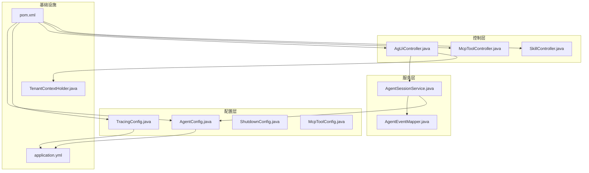
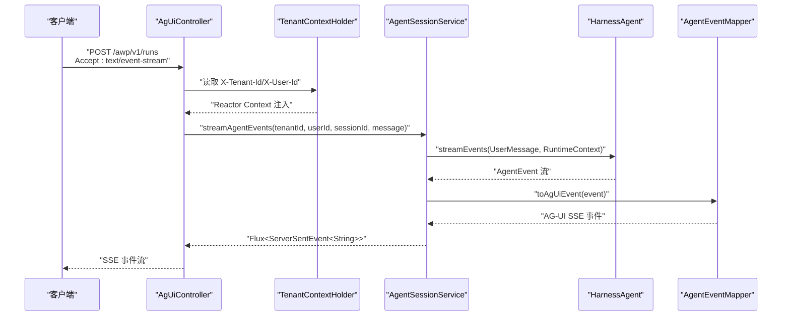
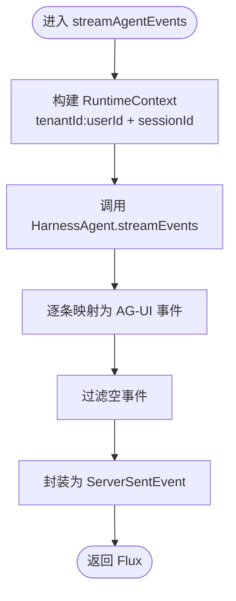
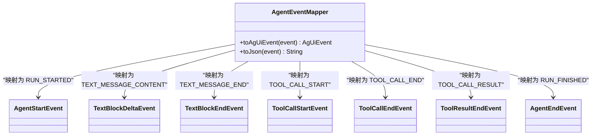
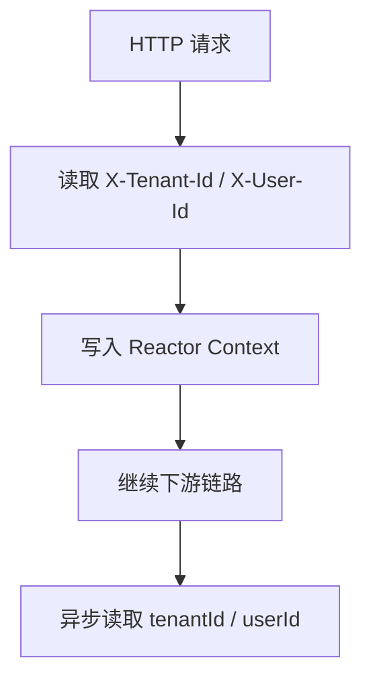
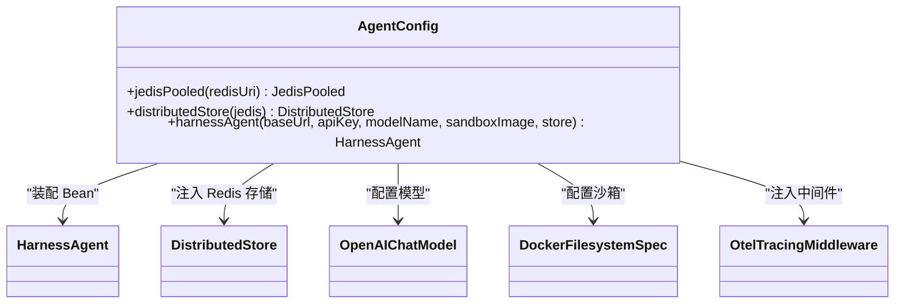
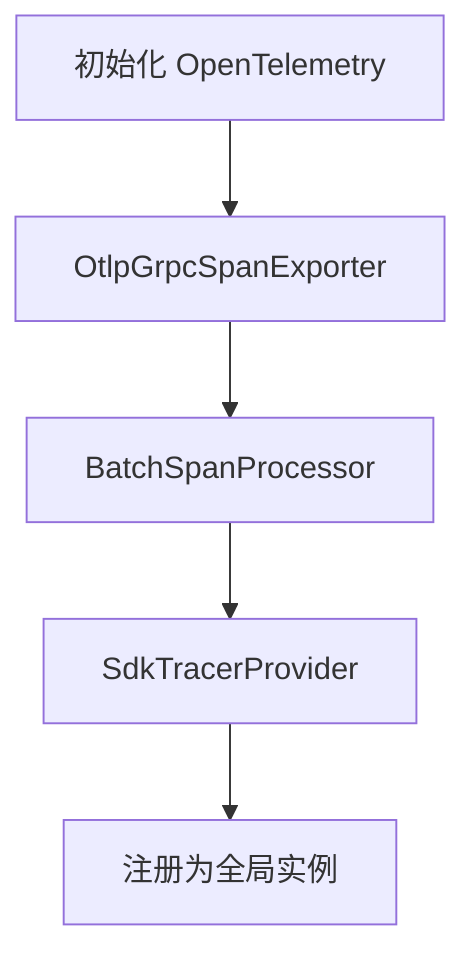
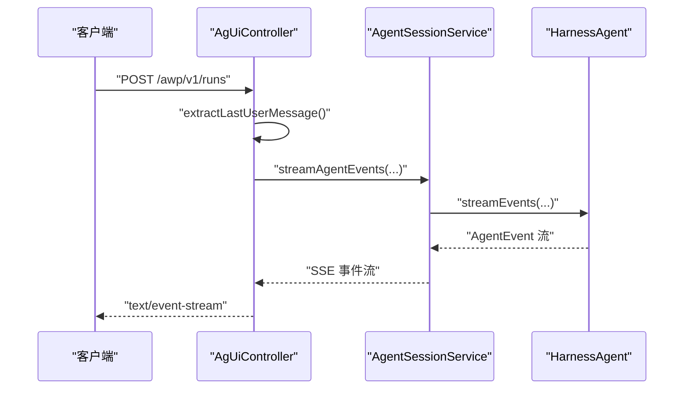
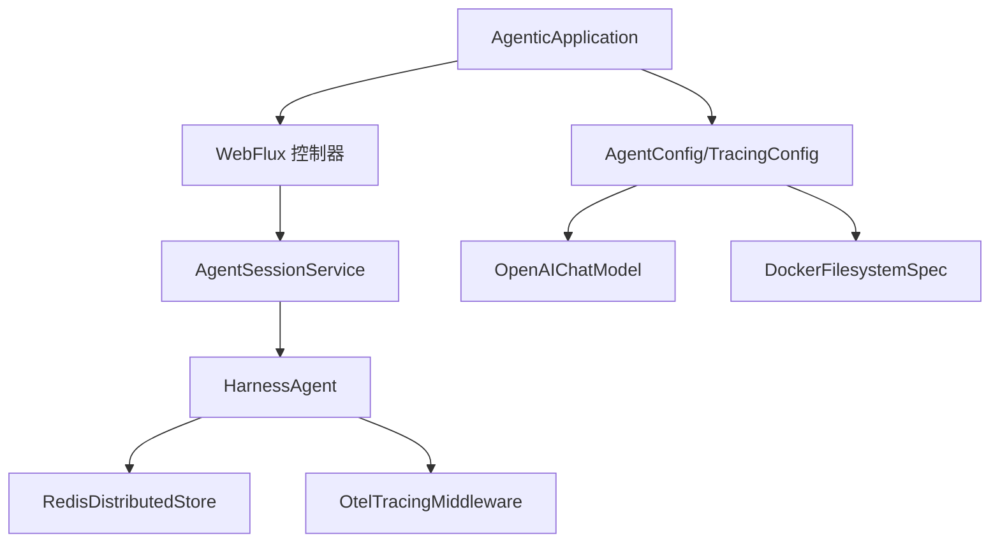

# 架构设计

<cite>
**本文引用的文件**
- [AgenticApplication.java](file://src/main/java/com/example/agentic/AgenticApplication.java)
- [application.yml](file://src/main/resources/application.yml)
- [pom.xml](file://pom.xml)
- [AgentSessionService.java](file://src/main/java/com/example/agentic/agent/AgentSessionService.java)
- [AgentEventMapper.java](file://src/main/java/com/example/agentic/agent/AgentEventMapper.java)
- [TenantContextHolder.java](file://src/main/java/com/example/agentic/tenant/TenantContextHolder.java)
- [AgentConfig.java](file://src/main/java/com/example/agentic/config/AgentConfig.java)
- [TracingConfig.java](file://src/main/java/com/example/agentic/config/TracingConfig.java)
- [AgUiController.java](file://src/main/java/com/example/agentic/controller/AgUiController.java)
- [McpToolController.java](file://src/main/java/com/example/agentic/controller/McpToolController.java)
- [SkillController.java](file://src/main/java/com/example/agentic/controller/SkillController.java)
- [McpToolConfig.java](file://src/main/java/com/example/agentic/config/McpToolConfig.java)
- [ShutdownConfig.java](file://src/main/java/com/example/agentic/config/ShutdownConfig.java)
- [AGENTS.md](file://src/main/resources/workspace/AGENTS.md)
- [tools.json](file://src/main/resources/workspace/tools.json)
</cite>

## 目录
1. [引言](#引言)
2. [项目结构](#项目结构)
3. [核心组件](#核心组件)
4. [架构总览](#架构总览)
5. [详细组件分析](#详细组件分析)
6. [依赖分析](#依赖分析)
7. [性能考虑](#性能考虑)
8. [故障排查指南](#故障排查指南)
9. [结论](#结论)
10. [附录](#附录)

## 引言
本项目为“通用智能体平台”，以 AgentScope HarnessAgent 为核心，结合 Spring AI Alibaba 与 Spring Boot WebFlux，构建一个具备响应式流式输出、多租户隔离、分布式状态存储、可观测性与可扩展工具生态的智能代理系统。平台通过 AG-UI 协议提供标准 SSE 端点，支持 MCP 工具动态注册与工作区技能管理，并通过 Redis 实现多租户会话持久化与状态共享。

技术栈与关键特性概览：
- 启动入口与应用元信息：AgenticApplication
- Web 层：基于 WebFlux 的响应式 REST 控制器
- 智能体内核：HarnessAgent（AgentScope 2.0+）
- 事件映射：AgentEvent → AG-UI SSE 事件
- 多租户上下文：Reactor Context + WebFilter
- 分布式存储：Redis（AgentScope Redis 扩展）
- 可观测性：OpenTelemetry（OTLP 导出至 Langfuse/Studio）
- 优雅停机：Spring Boot 3.x graceful shutdown + AgentScope ShutdownManager

章节来源
- [AgenticApplication.java:1-23](file://src/main/java/com/example/agentic/AgenticApplication.java#L1-L23)

## 项目结构
项目采用按功能域分层的模块化组织方式，核心目录与职责如下：
- config：应用配置与 Bean 定义（Agent、Tracing、Shutdown、MCP 配置）
- controller：对外暴露的 REST API（AG-UI、MCP 工具、Skill）
- agent：智能体会话与事件映射逻辑
- tenant：多租户上下文传递（WebFilter + Reactor Context）
- resources：配置文件与工作区资源（application.yml、workspace/*）

图示来源
- [AgentConfig.java:28-84](file://src/main/java/com/example/agentic/config/AgentConfig.java#L28-L84)
- [TracingConfig.java:22-45](file://src/main/java/com/example/agentic/config/TracingConfig.java#L22-L45)
- [AgUiController.java:22-75](file://src/main/java/com/example/agentic/controller/AgUiController.java#L22-L75)
- [AgentSessionService.java:13-63](file://src/main/java/com/example/agentic/agent/AgentSessionService.java#L13-L63)
- [AgentEventMapper.java:15-120](file://src/main/java/com/example/agentic/agent/AgentEventMapper.java#L15-L120)
- [TenantContextHolder.java:10-59](file://src/main/java/com/example/agentic/tenant/TenantContextHolder.java#L10-L59)
- [application.yml:1-24](file://src/main/resources/application.yml#L1-L24)
- [pom.xml:1-131](file://pom.xml#L1-L131)

章节来源
- [pom.xml:1-131](file://pom.xml#L1-L131)
- [application.yml:1-24](file://src/main/resources/application.yml#L1-L24)

## 核心组件
- 应用入口与元信息：AgenticApplication
- 智能体会话服务：AgentSessionService（封装 HarnessAgent.streamEvents，构建 RuntimeContext，映射为 SSE）
- 事件映射器：AgentEventMapper（将 AgentScope 事件转换为 AG-UI SSE 事件）
- 多租户上下文：TenantContextHolder（WebFilter 注入 Reactor Context，供下游使用）
- Agent 配置：AgentConfig（模型、工作区、分布式存储、沙箱、中间件等）
- Tracing 配置：TracingConfig（OTLP 导出至外部系统）
- 控制器：
  - AgUiController：AG-UI SSE 端点
  - McpToolController：MCP 工具动态注册/查询/移除
  - SkillController：工作区技能 CRUD
- 配置与生命周期：McpToolConfig、ShutdownConfig

章节来源
- [AgenticApplication.java:6-15](file://src/main/java/com/example/agentic/AgenticApplication.java#L6-L15)
- [AgentSessionService.java:13-63](file://src/main/java/com/example/agentic/agent/AgentSessionService.java#L13-L63)
- [AgentEventMapper.java:15-120](file://src/main/java/com/example/agentic/agent/AgentEventMapper.java#L15-L120)
- [TenantContextHolder.java:10-59](file://src/main/java/com/example/agentic/tenant/TenantContextHolder.java#L10-L59)
- [AgentConfig.java:21-84](file://src/main/java/com/example/agentic/config/AgentConfig.java#L21-L84)
- [TracingConfig.java:13-45](file://src/main/java/com/example/agentic/config/TracingConfig.java#L13-L45)
- [AgUiController.java:12-75](file://src/main/java/com/example/agentic/controller/AgUiController.java#L12-L75)
- [McpToolController.java:11-69](file://src/main/java/com/example/agentic/controller/McpToolController.java#L11-L69)
- [SkillController.java:17-104](file://src/main/java/com/example/agentic/controller/SkillController.java#L17-L104)
- [McpToolConfig.java:5-25](file://src/main/java/com/example/agentic/config/McpToolConfig.java#L5-L25)
- [ShutdownConfig.java:5-21](file://src/main/java/com/example/agentic/config/ShutdownConfig.java#L5-L21)

## 架构总览
系统采用分层架构与模块化设计，结合响应式编程模型（WebFlux + Reactor）实现高吞吐、低延迟的 SSE 事件流。核心交互链路如下：

图示来源
- [AgUiController.java:43-56](file://src/main/java/com/example/agentic/controller/AgUiController.java#L43-L56)
- [TenantContextHolder.java:25-41](file://src/main/java/com/example/agentic/tenant/TenantContextHolder.java#L25-L41)
- [AgentSessionService.java:43-61](file://src/main/java/com/example/agentic/agent/AgentSessionService.java#L43-L61)
- [AgentEventMapper.java:45-97](file://src/main/java/com/example/agentic/agent/AgentEventMapper.java#L45-L97)

## 详细组件分析

### 组件一：智能体会话服务（AgentSessionService）
职责与流程：
- 从请求参数与 Reactor Context 构建 RuntimeContext，确保多租户与会话隔离
- 调用 HarnessAgent.streamEvents 获取事件流
- 使用 AgentEventMapper 转换为 AG-UI 事件
- 过滤空值并封装为 ServerSentEvent

图示来源
- [AgentSessionService.java:43-61](file://src/main/java/com/example/agentic/agent/AgentSessionService.java#L43-L61)
- [AgentEventMapper.java:45-97](file://src/main/java/com/example/agentic/agent/AgentEventMapper.java#L45-L97)

章节来源
- [AgentSessionService.java:13-63](file://src/main/java/com/example/agentic/agent/AgentSessionService.java#L13-L63)

### 组件二：事件映射器（AgentEventMapper）
职责与映射规则：
- 将 AgentScope 的多种事件类型映射为 AG-UI 事件类型
- 对未映射或内部事件进行过滤
- 提供 JSON 序列化辅助

图示来源
- [AgentEventMapper.java:15-120](file://src/main/java/com/example/agentic/agent/AgentEventMapper.java#L15-L120)

章节来源
- [AgentEventMapper.java:15-120](file://src/main/java/com/example/agentic/agent/AgentEventMapper.java#L15-L120)

### 组件三：多租户上下文（TenantContextHolder）
职责与实现要点：
- 从 HTTP 头部提取 X-Tenant-Id 与 X-User-Id
- 注入 Reactor Context，下游可异步获取
- 提供静态方法从上下文中读取租户与用户标识

图示来源
- [TenantContextHolder.java:25-41](file://src/main/java/com/example/agentic/tenant/TenantContextHolder.java#L25-L41)
- [TenantContextHolder.java:46-57](file://src/main/java/com/example/agentic/tenant/TenantContextHolder.java#L46-L57)

章节来源
- [TenantContextHolder.java:10-59](file://src/main/java/com/example/agentic/tenant/TenantContextHolder.java#L10-L59)

### 组件四：Agent 配置（AgentConfig）
职责与关键配置项：
- 模型：OpenAI Chat Model（DeepSeek 示例）
- 工作区：本地路径，由 application.yml 注入
- 分布式存储：RedisDistributedStore（统一注入 state/base/snapshot/executionGuard）
- 沙箱：DockerFilesystemSpec（隔离级别 SESSION，投影根目录受控）
- 中间件：OtelTracingMiddleware（链路追踪）
- 上下文压缩与大工具结果卸载：CompactionConfig、ToolResultEvictionConfig

图示来源
- [AgentConfig.java:34-82](file://src/main/java/com/example/agentic/config/AgentConfig.java#L34-L82)

章节来源
- [AgentConfig.java:21-84](file://src/main/java/com/example/agentic/config/AgentConfig.java#L21-L84)

### 组件五：Tracing 配置（TracingConfig）
职责与导出策略：
- 创建 OpenTelemetry SDK 实例
- 通过 BatchSpanProcessor 将 Span 导出至 OTLP 端点
- 与 AgentScope 的 OtelTracingMiddleware 协同，形成完整链路追踪

图示来源
- [TracingConfig.java:25-43](file://src/main/java/com/example/agentic/config/TracingConfig.java#L25-L43)

章节来源
- [TracingConfig.java:13-45](file://src/main/java/com/example/agentic/config/TracingConfig.java#L13-L45)

### 组件六：控制器（AgUiController、McpToolController、SkillController）
- AgUiController：实现 AG-UI SSE 端点，解析请求体中的 thread_id/run_id/messages，提取最后一条用户消息并交由 AgentSessionService 处理
- McpToolController：提供 MCP Server 的动态注册、查询与移除接口，便于运行时热插拔工具
- SkillController：对工作区 skills 目录进行 CRUD 操作，支撑技能的本地化管理

图示来源
- [AgUiController.java:43-56](file://src/main/java/com/example/agentic/controller/AgUiController.java#L43-L56)
- [AgentSessionService.java:43-61](file://src/main/java/com/example/agentic/agent/AgentSessionService.java#L43-L61)

章节来源
- [AgUiController.java:12-75](file://src/main/java/com/example/agentic/controller/AgUiController.java#L12-L75)
- [McpToolController.java:11-69](file://src/main/java/com/example/agentic/controller/McpToolController.java#L11-L69)
- [SkillController.java:17-104](file://src/main/java/com/example/agentic/controller/SkillController.java#L17-L104)

## 依赖分析
技术栈与第三方依赖影响：
- Spring Boot 3.5.3 + WebFlux：提供响应式 HTTP 与 SSE 支持
- Spring AI Alibaba 1.1.2.0 + Spring AI 1.1.2：兼容传统 Spring AI 写法，适配 DashScope 等模型
- AgentScope HarnessAgent 2.0.0-RC3：智能体核心，支持分布式状态、沙箱隔离、中间件链
- Redis（Jedis）：多租户 Session 持久化与分布式存储
- OpenTelemetry 1.40.0：链路追踪与指标导出
- Maven 依赖管理：通过 BOM 管理版本，确保兼容性

图示来源
- [pom.xml:57-119](file://pom.xml#L57-L119)
- [AgentConfig.java:54-82](file://src/main/java/com/example/agentic/config/AgentConfig.java#L54-L82)
- [TracingConfig.java:25-43](file://src/main/java/com/example/agentic/config/TracingConfig.java#L25-L43)

章节来源
- [pom.xml:28-55](file://pom.xml#L28-L55)
- [pom.xml:57-119](file://pom.xml#L57-L119)

## 性能考虑
- 响应式流式输出：使用 WebFlux 与 SSE，避免阻塞 IO，提升吞吐与延迟表现
- 事件驱动与背压：Reactor 背压机制保障在高并发下的稳定性
- 分布式状态与无状态 Agent：Agent 实例单例并发服务多会话，降低内存占用
- 沙箱隔离与资源控制：DockerFilesystemSpec 限制工作区投影与隔离级别，减少跨会话干扰
- 上下文压缩与大结果卸载：减少历史消息长度与工具结果体积，优化 LLM 输入成本
- Redis 持久化：在多实例部署场景下提供一致的状态访问

## 故障排查指南
- SSE 无事件输出
  - 检查 AG-UI 端点请求头是否包含 X-Tenant-Id 与 X-User-Id
  - 确认 AgentSessionService 是否正确构建 RuntimeContext
  - 核对 AgentEventMapper 是否过滤了事件类型
- 事件类型异常
  - 确认 AgentScope 事件类型与映射表一致
  - 检查中间件链是否正确注入 OtelTracingMiddleware
- 工具不可用
  - 检查 tools.json 中 allow 列表是否包含对应工具
  - 若使用 MCP，确认 McpToolController 的注册状态
- 模型调用失败
  - 核对 application.yml 中模型 base-url、api-key、model-name
  - 检查网络连通性与鉴权
- 优雅停机
  - application.yml 已设置 graceful shutdown
  - AgentScope ShutdownManager 默认注册 JVM hook，必要时可扩展自定义等待时间

章节来源
- [AgUiController.java:46-55](file://src/main/java/com/example/agentic/controller/AgUiController.java#L46-L55)
- [AgentSessionService.java:48-51](file://src/main/java/com/example/agentic/agent/AgentSessionService.java#L48-L51)
- [AgentEventMapper.java:18-28](file://src/main/java/com/example/agentic/agent/AgentEventMapper.java#L18-L28)
- [AgentConfig.java:79-81](file://src/main/java/com/example/agentic/config/AgentConfig.java#L79-L81)
- [application.yml:8-11](file://src/main/resources/application.yml#L8-L11)
- [application.yml:21-23](file://src/main/resources/application.yml#L21-L23)
- [ShutdownConfig.java:17-19](file://src/main/java/com/example/agentic/config/ShutdownConfig.java#L17-L19)
- [tools.json:1-12](file://src/main/resources/workspace/tools.json#L1-L12)

## 结论
本架构以 AgentScope HarnessAgent 为核心，结合 Spring Boot WebFlux 的响应式模型，实现了高并发、低延迟的智能体 SSE 事件流。通过多租户上下文注入、分布式存储与沙箱隔离，平台在可扩展性与安全性方面具备良好基础。配合 OpenTelemetry 的链路追踪与工具生态的动态注册能力，平台既满足工程化落地需求，也为后续演进预留了充足空间。

## 附录
- 系统边界
  - 外部系统：Langfuse/Studio（OTLP 导出）、DeepSeek API（模型推理）、MCP Server（工具生态）
  - 内部模块：Web 控制器、Agent 会话服务、事件映射器、多租户上下文、配置与存储
- 设计原则
  - 分层清晰：配置、控制、服务、基础设施分离
  - 模块化：按功能域划分，依赖倒置，便于替换与扩展
  - 响应式：全链路非阻塞，充分利用背压与事件驱动
  - 可观测：中间件与 SDK 双通道追踪，覆盖端到端调用链
  - 可靠性：优雅停机、上下文压缩、大结果卸载、沙箱隔离