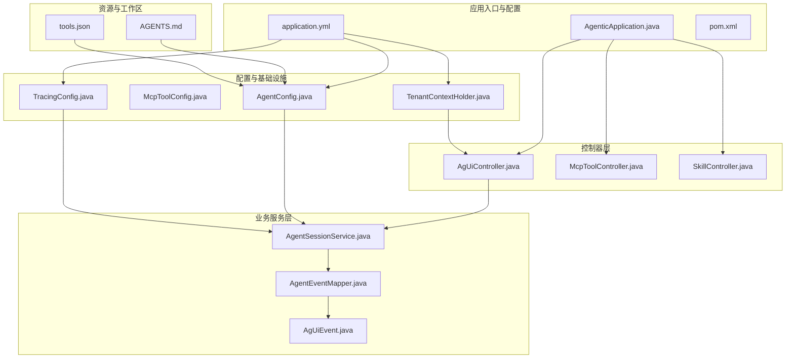
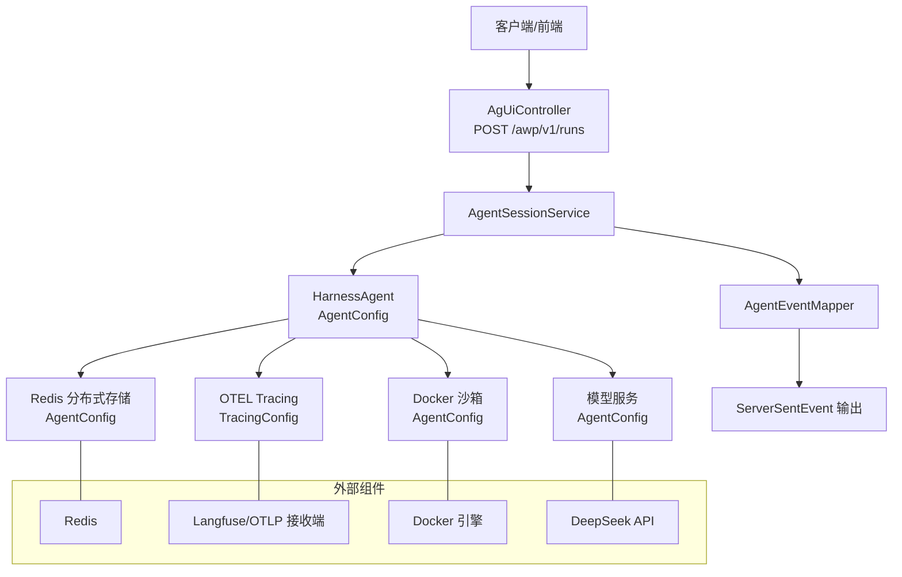
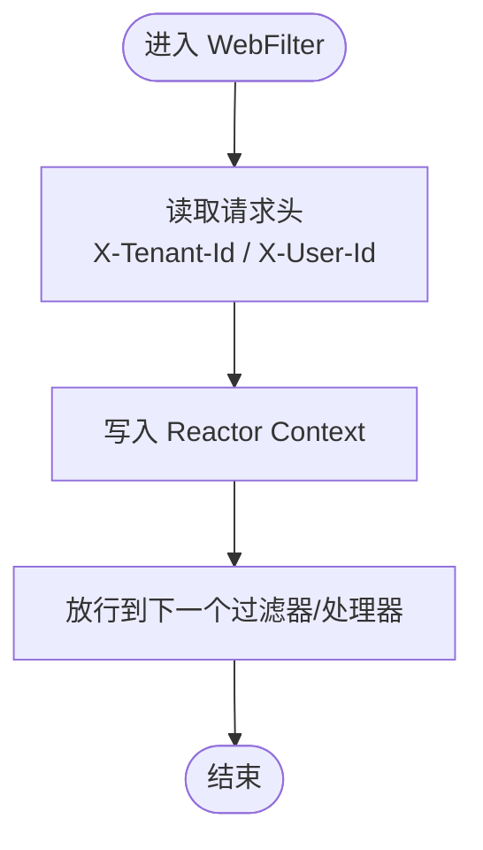
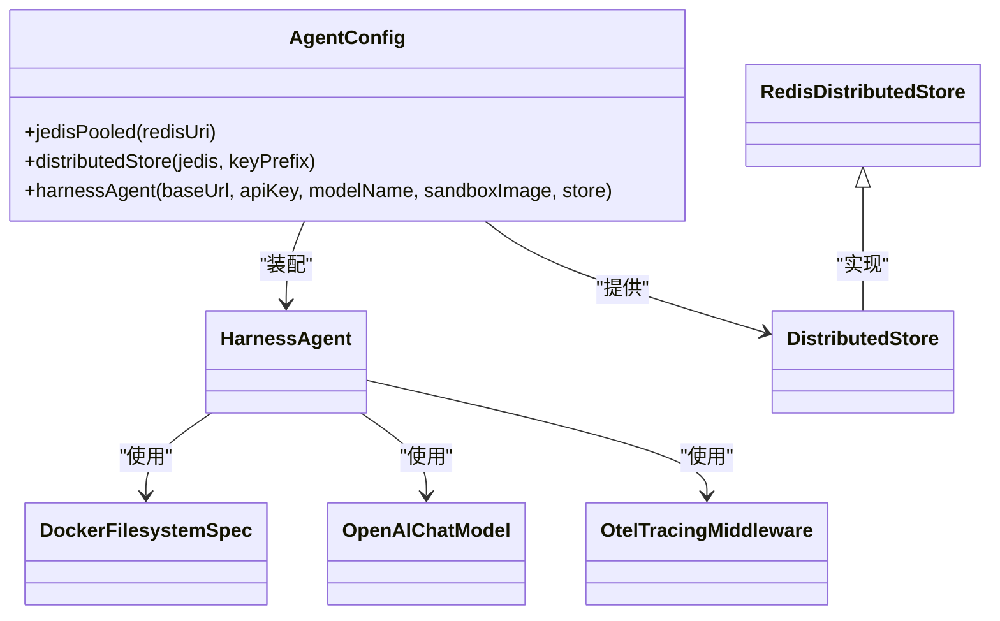
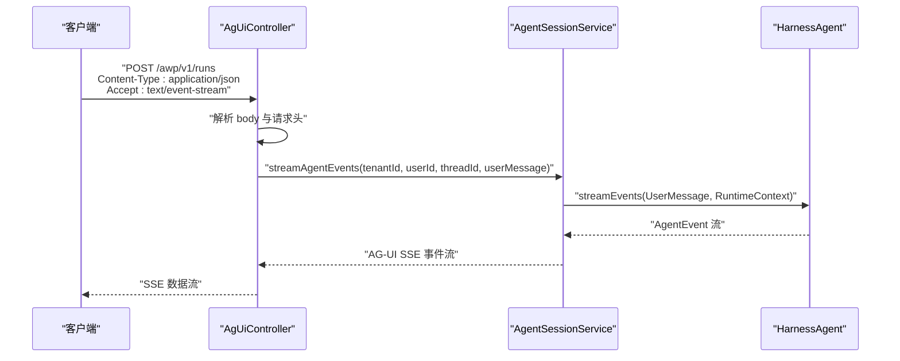
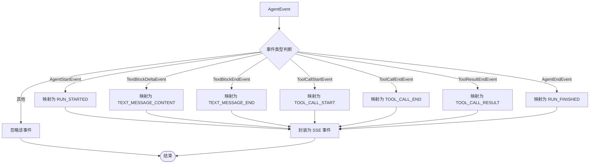
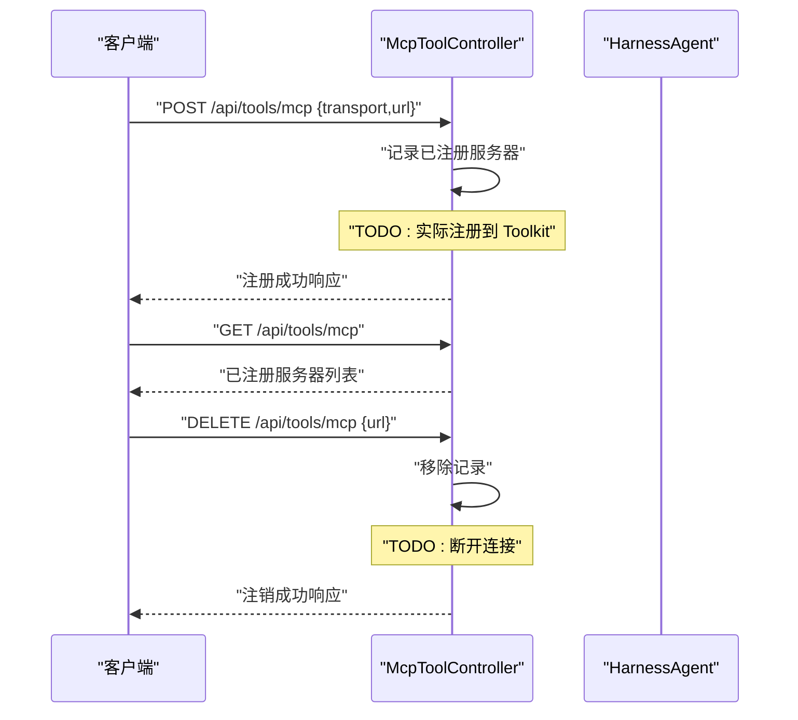
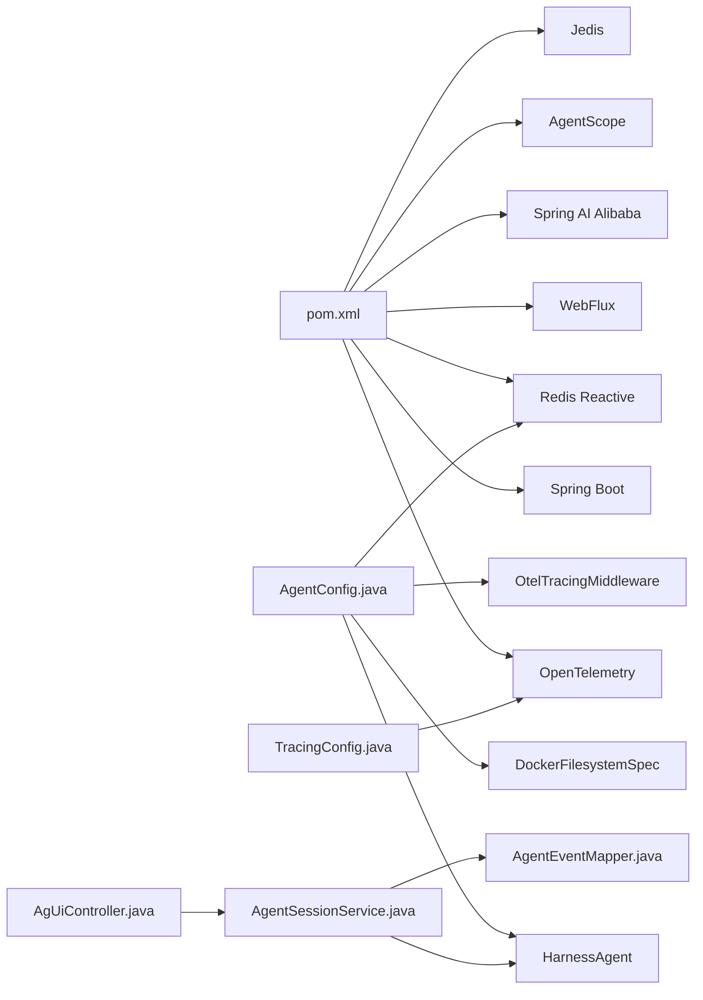

# 系统概览

<cite>
**本文引用的文件**
- [AgenticApplication.java](file://src/main/java/com/example/agentic/AgenticApplication.java)
- [application.yml](file://src/main/resources/application.yml)
- [pom.xml](file://pom.xml)
- [TenantContextHolder.java](file://src/main/java/com/example/agentic/tenant/TenantContextHolder.java)
- [AgentConfig.java](file://src/main/java/com/example/agentic/config/AgentConfig.java)
- [McpToolConfig.java](file://src/main/java/com/example/agentic/config/McpToolConfig.java)
- [TracingConfig.java](file://src/main/java/com/example/agentic/config/TracingConfig.java)
- [AgUiController.java](file://src/main/java/com/example/agentic/controller/AgUiController.java)
- [McpToolController.java](file://src/main/java/com/example/agentic/controller/McpToolController.java)
- [SkillController.java](file://src/main/java/com/example/agentic/controller/SkillController.java)
- [AgentSessionService.java](file://src/main/java/com/example/agentic/agent/AgentSessionService.java)
- [AgUiEvent.java](file://src/main/java/com/example/agentic/agent/AgUiEvent.java)
- [AgentEventMapper.java](file://src/main/java/com/example/agentic/agent/AgentEventMapper.java)
- [AGENTS.md](file://src/main/resources/workspace/AGENTS.md)
- [tools.json](file://src/main/resources/workspace/tools.json)
</cite>

## 目录
1. [引言](#引言)
2. [项目结构](#项目结构)
3. [核心组件](#核心组件)
4. [架构总览](#架构总览)
5. [详细组件分析](#详细组件分析)
6. [依赖分析](#依赖分析)
7. [性能考虑](#性能考虑)
8. [故障排查指南](#故障排查指南)
9. [结论](#结论)
10. [附录](#附录)

## 引言
本文件为“通用智能体平台”的系统概览文档，面向平台使用者与实施运维人员，提供整体架构、核心组件、技术栈选型与作用、系统边界、部署架构与运行环境要求，以及非功能性需求（性能、可扩展性、安全性）的说明。平台基于 Spring Boot 3 + Spring WebFlux 实现 AG-UI 协议的 SSE 流式交互，集成 AgentScope HarnessAgent 2.0 作为智能体内核，并通过 Redis 实现多租户 Session 持久化与隔离；同时内置 OpenTelemetry Tracing 以支持全链路可观测性。

## 项目结构
项目采用按职责分层的组织方式：
- 应用入口与配置：AgenticApplication、application.yml、pom.xml
- 控制器层：AgUiController、McpToolController、SkillController
- 业务服务层：AgentSessionService、AgentEventMapper
- 配置与基础设施：AgentConfig、McpToolConfig、TracingConfig、TenantContextHolder
- 资源与工作区：workspace 下的 AGENTS.md、tools.json 与技能目录

图表来源
- [AgenticApplication.java:1-23](file://src/main/java/com/example/agentic/AgenticApplication.java#L1-L23)
- [application.yml:1-30](file://src/main/resources/application.yml#L1-L30)
- [pom.xml:1-131](file://pom.xml#L1-L131)
- [AgUiController.java:1-75](file://src/main/java/com/example/agentic/controller/AgUiController.java#L1-L75)
- [McpToolController.java:1-69](file://src/main/java/com/example/agentic/controller/McpToolController.java#L1-L69)
- [SkillController.java:1-104](file://src/main/java/com/example/agentic/controller/SkillController.java#L1-L104)
- [AgentSessionService.java:1-63](file://src/main/java/com/example/agentic/agent/AgentSessionService.java#L1-L63)
- [AgentEventMapper.java:1-120](file://src/main/java/com/example/agentic/agent/AgentEventMapper.java#L1-L120)
- [AgUiEvent.java:1-24](file://src/main/java/com/example/agentic/agent/AgUiEvent.java#L1-L24)
- [AgentConfig.java:1-87](file://src/main/java/com/example/agentic/config/AgentConfig.java#L1-L87)
- [McpToolConfig.java:1-25](file://src/main/java/com/example/agentic/config/McpToolConfig.java#L1-L25)
- [TracingConfig.java:1-45](file://src/main/java/com/example/agentic/config/TracingConfig.java#L1-L45)
- [TenantContextHolder.java:1-59](file://src/main/java/com/example/agentic/tenant/TenantContextHolder.java#L1-L59)
- [AGENTS.md:1-19](file://src/main/resources/workspace/AGENTS.md#L1-L19)
- [tools.json:1-12](file://src/main/resources/workspace/tools.json#L1-L12)

章节来源
- [AgenticApplication.java:1-23](file://src/main/java/com/example/agentic/AgenticApplication.java#L1-L23)
- [application.yml:1-30](file://src/main/resources/application.yml#L1-L30)
- [pom.xml:1-131](file://pom.xml#L1-L131)

## 核心组件
- 应用入口与启动
  - 应用入口类负责加载 Spring Boot 容器，开启 WebFlux 与响应式上下文。
- 多租户 Web 过滤器
  - 从请求头提取租户与用户标识，注入到 Reactor Context，确保后续链路可感知多租户。
- 智能体配置
  - 统一装配 HarnessAgent，包含模型客户端、工作区、分布式存储、沙箱文件系统、中间件（Tracing）、上下文压缩与大工具结果卸载策略。
- 控制器层
  - AG-UI 运行端点：接收 AG-UI RunAgentInput，解析最后一条用户消息，驱动 Agent 事件流。
  - MCP 工具动态注册端点：支持运行时热插拔 MCP Server。
  - Skill CRUD 端点：管理工作区级别的技能文件。
- 会话服务与事件映射
  - 构造 RuntimeContext，调用 HarnessAgent.streamEvents，将 Agent 事件映射为 AG-UI SSE 事件。
- 链路追踪
  - 创建 OpenTelemetry SDK，将 Span 导出至兼容 OTLP 的观测平台（如 Langfuse）。

章节来源
- [TenantContextHolder.java:1-59](file://src/main/java/com/example/agentic/tenant/TenantContextHolder.java#L1-L59)
- [AgentConfig.java:1-87](file://src/main/java/com/example/agentic/config/AgentConfig.java#L1-L87)
- [AgUiController.java:1-75](file://src/main/java/com/example/agentic/controller/AgUiController.java#L1-L75)
- [McpToolController.java:1-69](file://src/main/java/com/example/agentic/controller/McpToolController.java#L1-L69)
- [SkillController.java:1-104](file://src/main/java/com/example/agentic/controller/SkillController.java#L1-L104)
- [AgentSessionService.java:1-63](file://src/main/java/com/example/agentic/agent/AgentSessionService.java#L1-L63)
- [AgentEventMapper.java:1-120](file://src/main/java/com/example/agentic/agent/AgentEventMapper.java#L1-L120)
- [TracingConfig.java:1-45](file://src/main/java/com/example/agentic/config/TracingConfig.java#L1-L45)

## 架构总览
系统采用“控制器-服务-智能体内核-外部组件”的分层架构，结合响应式编程实现 SSE 流式输出。多租户通过请求头注入与 RuntimeContext 构建实现隔离；Redis 用于分布式状态与会话持久化；AgentScope 提供统一的智能体生命周期与事件模型；Tracing 保障可观测性。

图表来源
- [AgUiController.java:1-75](file://src/main/java/com/example/agentic/controller/AgUiController.java#L1-L75)
- [AgentSessionService.java:1-63](file://src/main/java/com/example/agentic/agent/AgentSessionService.java#L1-L63)
- [AgentConfig.java:1-87](file://src/main/java/com/example/agentic/config/AgentConfig.java#L1-L87)
- [TracingConfig.java:1-45](file://src/main/java/com/example/agentic/config/TracingConfig.java#L1-L45)
- [application.yml:1-30](file://src/main/resources/application.yml#L1-L30)

## 详细组件分析

### 组件：多租户 Web 过滤器
- 职责：从请求头读取租户与用户标识，写入 Reactor Context，供后续链路使用。
- 关键点：使用 deferContextual 获取上下文中的租户/用户信息，避免硬编码或全局状态。

图表来源
- [TenantContextHolder.java:1-59](file://src/main/java/com/example/agentic/tenant/TenantContextHolder.java#L1-L59)

章节来源
- [TenantContextHolder.java:1-59](file://src/main/java/com/example/agentic/tenant/TenantContextHolder.java#L1-L59)

### 组件：智能体配置（AgentConfig）
- 职责：装配 HarnessAgent，统一配置模型、工作区、分布式存储、沙箱、中间件与压缩策略。
- 关键点：RedisDistributedStore 自动注入 state/baseStore/snapshotSpec/executionGuard；DockerFilesystemSpec 指定隔离范围与工作区投射根；OtelTracingMiddleware 注入 Tracing。

图表来源
- [AgentConfig.java:1-87](file://src/main/java/com/example/agentic/config/AgentConfig.java#L1-L87)

章节来源
- [AgentConfig.java:1-87](file://src/main/java/com/example/agentic/config/AgentConfig.java#L1-L87)

### 组件：AG-UI 运行端点（AgUiController）
- 职责：接收 AG-UI RunAgentInput，解析 thread_id/run_id/messages，构造 RuntimeContext，调用 AgentSessionService 返回 SSE 流。
- 关键点：Accept: text/event-stream；从 X-Tenant-Id、X-User-Id 提取多租户信息；提取最后一条用户消息作为输入。

图表来源
- [AgUiController.java:1-75](file://src/main/java/com/example/agentic/controller/AgUiController.java#L1-L75)
- [AgentSessionService.java:1-63](file://src/main/java/com/example/agentic/agent/AgentSessionService.java#L1-L63)

章节来源
- [AgUiController.java:1-75](file://src/main/java/com/example/agentic/controller/AgUiController.java#L1-L75)
- [AgentSessionService.java:1-63](file://src/main/java/com/example/agentic/agent/AgentSessionService.java#L1-L63)

### 组件：事件映射与 SSE 输出（AgentEventMapper、AgUiEvent）
- 职责：将 AgentScope 的内部事件映射为 AG-UI 事件类型，序列化为 JSON，包装为 ServerSentEvent。
- 映射关系：AgentStartEvent → RUN_STARTED；TextBlockDeltaEvent → TEXT_MESSAGE_CONTENT；TextBlockEndEvent → TEXT_MESSAGE_END；ToolCallStartEvent → TOOL_CALL_START；ToolCallEndEvent → TOOL_CALL_END；ToolResultEndEvent → TOOL_CALL_RESULT；AgentEndEvent → RUN_FINISHED。

图表来源
- [AgentEventMapper.java:1-120](file://src/main/java/com/example/agentic/agent/AgentEventMapper.java#L1-L120)
- [AgUiEvent.java:1-24](file://src/main/java/com/example/agentic/agent/AgUiEvent.java#L1-L24)

章节来源
- [AgentEventMapper.java:1-120](file://src/main/java/com/example/agentic/agent/AgentEventMapper.java#L1-L120)
- [AgUiEvent.java:1-24](file://src/main/java/com/example/agentic/agent/AgUiEvent.java#L1-L24)

### 组件：MCP 工具动态注册（McpToolController）
- 职责：支持运行时注册/列出/注销 MCP Server，便于在对话中自动调用工具。
- 关键点：注册时记录 transport/url；实际注册逻辑预留待实现。

图表来源
- [McpToolController.java:1-69](file://src/main/java/com/example/agentic/controller/McpToolController.java#L1-L69)

章节来源
- [McpToolController.java:1-69](file://src/main/java/com/example/agentic/controller/McpToolController.java#L1-L69)

### 组件：Skill CRUD（SkillController）
- 职责：对工作区 skills 目录进行 CRUD 操作，支撑智能体在对话中使用本地技能。
- 关键点：自动创建目录；基于文件名管理技能；错误处理覆盖文件不存在等场景。

章节来源
- [SkillController.java:1-104](file://src/main/java/com/example/agentic/controller/SkillController.java#L1-L104)

## 依赖分析
- 技术栈与版本
  - Spring Boot 3.5.3、Spring WebFlux、Spring Data Redis Reactive、Jackson
  - Spring AI Alibaba 1.1.2.0、Spring AI 1.1.2、AgentScope HarnessAgent 2.0.0-RC3、OpenTelemetry 1.40.0
  - Jedis 用于 agentscope-extensions-redis
- 组件耦合
  - 控制器依赖服务；服务依赖智能体内核与事件映射；配置类提供 Bean 并注入到核心组件；TracingConfig 与 AgentConfig 共同构成可观测性基础。
- 外部依赖
  - Redis（多租户 Session 持久化）
  - Docker（沙箱隔离）
  - LLM 服务（DeepSeek API）

图表来源
- [pom.xml:1-131](file://pom.xml#L1-L131)
- [AgentConfig.java:1-87](file://src/main/java/com/example/agentic/config/AgentConfig.java#L1-L87)
- [TracingConfig.java:1-45](file://src/main/java/com/example/agentic/config/TracingConfig.java#L1-L45)
- [AgUiController.java:1-75](file://src/main/java/com/example/agentic/controller/AgUiController.java#L1-L75)
- [AgentSessionService.java:1-63](file://src/main/java/com/example/agentic/agent/AgentSessionService.java#L1-L63)
- [AgentEventMapper.java:1-120](file://src/main/java/com/example/agentic/agent/AgentEventMapper.java#L1-L120)

章节来源
- [pom.xml:1-131](file://pom.xml#L1-L131)

## 性能考虑
- 响应式与背压
  - 使用 WebFlux 与 Reactor，具备良好的背压与内存效率，适合长连接 SSE 场景。
- 事件流式输出
  - Agent 事件边产生边映射边推送，降低延迟与内存峰值。
- 缓存与持久化
  - Redis 作为分布式存储，建议合理设置 key 前缀与过期策略，避免热键与碎片。
- 沙箱隔离
  - Docker 沙箱隔离粒度为会话级别，避免跨会话干扰；注意容器生命周期与资源配额。
- 上下文压缩与大结果卸载
  - 合理配置消息压缩阈值与工具结果落盘策略，平衡成本与性能。
- 模型调用
  - 流式输出模型响应，提升用户体验；控制并发与重试策略，避免抖动。

## 故障排查指南
- SSE 无法接收数据
  - 检查控制器是否正确设置 Accept: text/event-stream；确认 AgentSessionService 是否成功生成事件流。
- 多租户串台
  - 确认请求头 X-Tenant-Id/X-User-Id 是否存在；检查 RuntimeContext 构造是否包含租户与用户标识。
- Redis 连接失败
  - 校验 REDIS_URI 与数据库索引；确认 key 前缀与权限。
- MCP 工具未生效
  - 确认已注册且 URL 正确；关注控制器 TODO 注释处的实际注册逻辑。
- 工作区技能缺失
  - 检查 workspace/skills 目录是否存在；确认文件命名与权限。

章节来源
- [AgUiController.java:1-75](file://src/main/java/com/example/agentic/controller/AgUiController.java#L1-L75)
- [AgentSessionService.java:1-63](file://src/main/java/com/example/agentic/agent/AgentSessionService.java#L1-L63)
- [application.yml:1-30](file://src/main/resources/application.yml#L1-L30)
- [McpToolController.java:1-69](file://src/main/java/com/example/agentic/controller/McpToolController.java#L1-L69)
- [SkillController.java:1-104](file://src/main/java/com/example/agentic/controller/SkillController.java#L1-L104)

## 结论
本平台以 AgentScope HarnessAgent 为核心，结合 Spring WebFlux 的响应式能力与 Redis 的分布式存储，实现了多租户、可扩展、可观测的智能体运行时。通过 AG-UI 协议与 SSE 流式输出，满足实时交互需求；通过 Docker 沙箱与工具白名单，兼顾安全性与灵活性。建议在生产环境中完善 MCP 注册逻辑、优化 Redis 与容器资源配额，并持续监控 Tracing 数据以保障稳定性与性能。

## 附录

### 系统边界与部署架构
- 边界
  - 内部：应用容器、智能体内核、事件映射、Tracing
  - 外部：Redis、Docker、LLM API、观测平台（Langfuse/OTLP）
- 部署建议
  - 应用容器：JRE 17+，暴露端口 8080
  - Redis：独立实例或集群，db 1 与其他服务隔离
  - Docker：启用沙箱隔离，限制 CPU/内存
  - 观测：OTLP endpoint 指向 Langfuse 或自建 Collector

章节来源
- [application.yml:1-30](file://src/main/resources/application.yml#L1-L30)
- [AgenticApplication.java:1-23](file://src/main/java/com/example/agentic/AgenticApplication.java#L1-L23)

### 运行环境要求
- Java：17+
- 容器：Docker（启用沙箱）
- 存储：Redis（推荐哨兵/集群）
- 网络：对外暴露 8080 端口，访问 LLM API 与 OTLP 导出端点

章节来源
- [pom.xml:1-131](file://pom.xml#L1-L131)
- [application.yml:1-30](file://src/main/resources/application.yml#L1-L30)