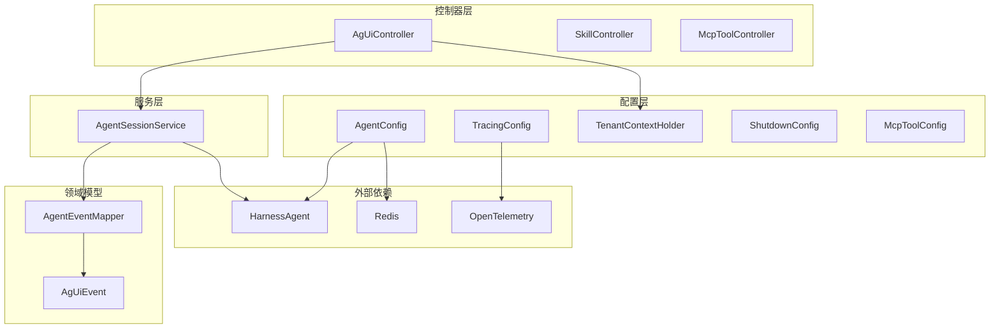
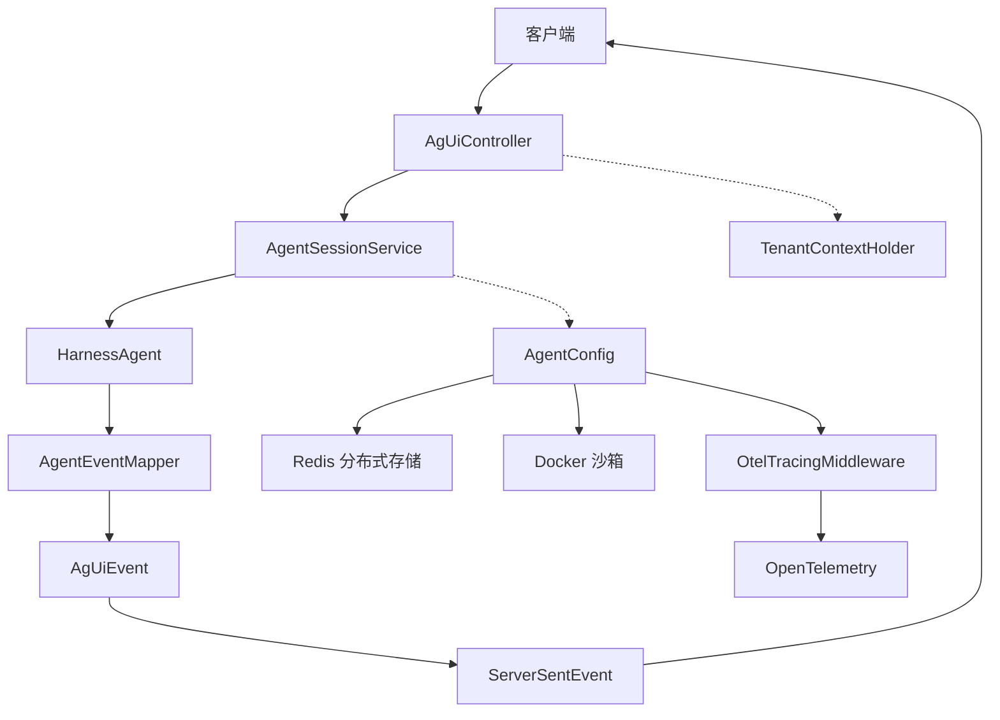
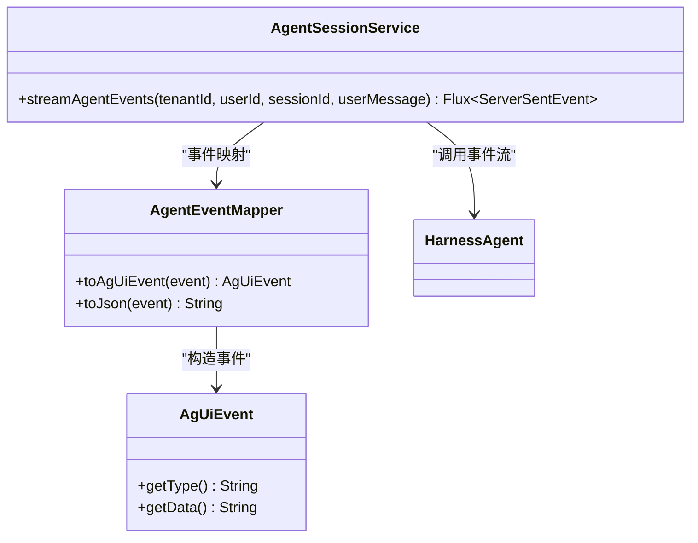
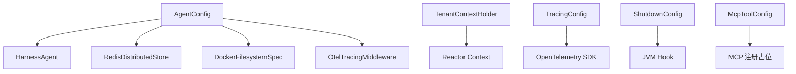
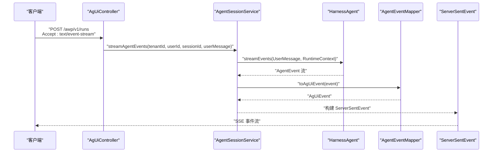
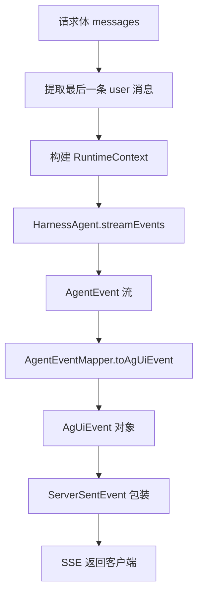
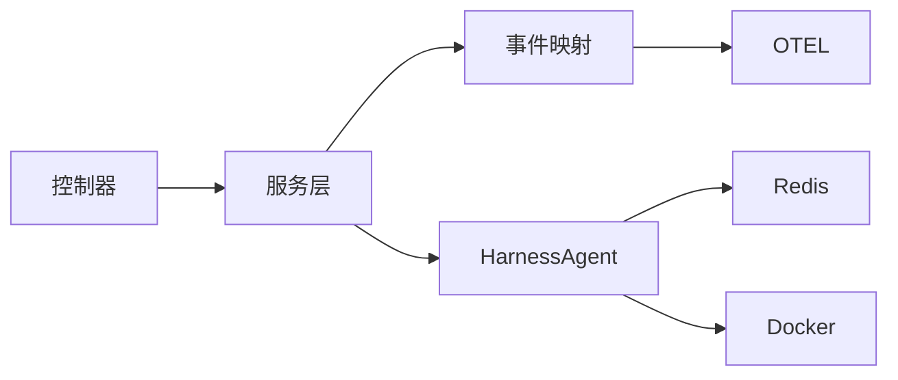

# 组件交互

<cite>
**本文引用的文件**
- [AgenticApplication.java](file://src/main/java/com/example/agentic/AgenticApplication.java)
- [AgUiController.java](file://src/main/java/com/example/agentic/controller/AgUiController.java)
- [McpToolController.java](file://src/main/java/com/example/agentic/controller/McpToolController.java)
- [SkillController.java](file://src/main/java/com/example/agentic/controller/SkillController.java)
- [AgentSessionService.java](file://src/main/java/com/example/agentic/agent/AgentSessionService.java)
- [AgUiEvent.java](file://src/main/java/com/example/agentic/agent/AgUiEvent.java)
- [AgentEventMapper.java](file://src/main/java/com/example/agentic/agent/AgentEventMapper.java)
- [AgentConfig.java](file://src/main/java/com/example/agentic/config/AgentConfig.java)
- [McpToolConfig.java](file://src/main/java/com/example/agentic/config/McpToolConfig.java)
- [TenantContextHolder.java](file://src/main/java/com/example/agentic/tenant/TenantContextHolder.java)
- [ShutdownConfig.java](file://src/main/java/com/example/agentic/config/ShutdownConfig.java)
- [TracingConfig.java](file://src/main/java/com/example/agentic/config/TracingConfig.java)
- [application.yml](file://src/main/resources/application.yml)
- [AGENTS.md](file://src/main/resources/workspace/AGENTS.md)
</cite>

## 目录
1. [简介](#简介)
2. [项目结构](#项目结构)
3. [核心组件](#核心组件)
4. [架构总览](#架构总览)
5. [详细组件分析](#详细组件分析)
6. [依赖分析](#依赖分析)
7. [性能考虑](#性能考虑)
8. [故障排查指南](#故障排查指南)
9. [结论](#结论)
10. [附录](#附录)

## 简介
本文件面向智能代理平台的组件交互，聚焦控制器、服务层、配置层之间的协作模式，系统化阐述以下主题：
- 控制器如何接收请求并驱动服务层处理
- 服务层如何封装 Agent 事件流并进行协议转换
- 配置层如何装配分布式存储、沙箱、中间件与遥测
- API 调用流程、事件传播机制与异步处理模式
- 响应式编程模型下的事件驱动架构实现

平台采用 Spring Boot WebFlux（响应式）、SSE 流式输出、Redis 分布式状态、AgentScope HarnessAgent 2.0 以及 OpenTelemetry 遥测。

## 项目结构
项目按功能分层组织，主要目录与职责如下：
- controller：REST 控制器，暴露 AG-UI 运行端点、技能 CRUD、MCP 工具注册接口
- agent：会话服务与事件映射，负责将 Agent 事件转换为 AG-UI SSE 事件
- config：应用配置，包括 Agent 装配、Redis 存储、Tracing、优雅停机等
- tenant：多租户上下文过滤器，将租户信息注入到响应式上下文中
- resources：应用配置与工作区资源（技能、知识、工具清单）

图表来源
- [AgUiController.java:22-75](file://src/main/java/com/example/agentic/controller/AgUiController.java#L22-L75)
- [SkillController.java:28-104](file://src/main/java/com/example/agentic/controller/SkillController.java#L28-L104)
- [McpToolController.java:17-69](file://src/main/java/com/example/agentic/controller/McpToolController.java#L17-L69)
- [AgentSessionService.java:23-63](file://src/main/java/com/example/agentic/agent/AgentSessionService.java#L23-L63)
- [AgentEventMapper.java:30-120](file://src/main/java/com/example/agentic/agent/AgentEventMapper.java#L30-L120)
- [AgentConfig.java:28-87](file://src/main/java/com/example/agentic/config/AgentConfig.java#L28-L87)
- [TracingConfig.java:22-45](file://src/main/java/com/example/agentic/config/TracingConfig.java#L22-L45)
- [TenantContextHolder.java:16-59](file://src/main/java/com/example/agentic/tenant/TenantContextHolder.java#L16-L59)

章节来源
- [AgenticApplication.java:1-23](file://src/main/java/com/example/agentic/AgenticApplication.java#L1-L23)
- [application.yml:1-30](file://src/main/resources/application.yml#L1-L30)

## 核心组件
- 控制器层
  - AgUiController：接收 AG-UI 标准运行请求，解析多租户与会话信息，驱动事件流输出
  - SkillController：工作区级技能的 CRUD 管理
  - McpToolController：MCP 工具的动态注册/查询/注销
- 服务层
  - AgentSessionService：封装 HarnessAgent 事件流，生成 AG-UI SSE 事件
- 领域模型
  - AgentEventMapper：将 Agent 事件映射为 AG-UI 事件
  - AgUiEvent：AG-UI 事件载体
- 配置层
  - AgentConfig：装配 HarnessAgent、Redis 分布式存储、沙箱、压缩与遥测中间件
  - TracingConfig：OTEL SDK 初始化与导出
  - TenantContextHolder：多租户上下文注入
  - ShutdownConfig：优雅停机配置
  - McpToolConfig：静态/动态 MCP 注册配置占位

章节来源
- [AgUiController.java:22-75](file://src/main/java/com/example/agentic/controller/AgUiController.java#L22-L75)
- [SkillController.java:28-104](file://src/main/java/com/example/agentic/controller/SkillController.java#L28-L104)
- [McpToolController.java:17-69](file://src/main/java/com/example/agentic/controller/McpToolController.java#L17-L69)
- [AgentSessionService.java:23-63](file://src/main/java/com/example/agentic/agent/AgentSessionService.java#L23-L63)
- [AgentEventMapper.java:30-120](file://src/main/java/com/example/agentic/agent/AgentEventMapper.java#L30-L120)
- [AgUiEvent.java:6-24](file://src/main/java/com/example/agentic/agent/AgUiEvent.java#L6-L24)
- [AgentConfig.java:28-87](file://src/main/java/com/example/agentic/config/AgentConfig.java#L28-L87)
- [TracingConfig.java:22-45](file://src/main/java/com/example/agentic/config/TracingConfig.java#L22-L45)
- [TenantContextHolder.java:16-59](file://src/main/java/com/example/agentic/tenant/TenantContextHolder.java#L16-L59)
- [ShutdownConfig.java:14-21](file://src/main/java/com/example/agentic/config/ShutdownConfig.java#L14-L21)
- [McpToolConfig.java:14-25](file://src/main/java/com/example/agentic/config/McpToolConfig.java#L14-L25)

## 架构总览
平台采用“控制器-服务-配置”三层协作：
- 控制器负责请求接入与参数解析，将多租户与会话信息传递给服务层
- 服务层基于 RuntimeContext 隔离会话，调用 HarnessAgent 产生事件流，并通过 AgentEventMapper 转换为 AG-UI 事件
- 配置层统一装配分布式存储、沙箱隔离、内存压缩与遥测中间件
- 响应式链路贯穿整个调用，使用 Reactor Flux/Mono 与 SSE 输出

图表来源
- [AgUiController.java:43-56](file://src/main/java/com/example/agentic/controller/AgUiController.java#L43-L56)
- [AgentSessionService.java:43-61](file://src/main/java/com/example/agentic/agent/AgentSessionService.java#L43-L61)
- [AgentEventMapper.java:45-97](file://src/main/java/com/example/agentic/agent/AgentEventMapper.java#L45-L97)
- [AgentConfig.java:47-84](file://src/main/java/com/example/agentic/config/AgentConfig.java#L47-L84)
- [TenantContextHolder.java:25-41](file://src/main/java/com/example/agentic/tenant/TenantContextHolder.java#L25-L41)
- [TracingConfig.java:25-43](file://src/main/java/com/example/agentic/config/TracingConfig.java#L25-L43)

## 详细组件分析

### 控制器层
- AgUiController
  - 路由：POST /awp/v1/runs，Accept: text/event-stream
  - 参数：请求体包含 thread_id、run_id、messages；Header 包含 X-Tenant-Id、X-User-Id
  - 处理：提取最后一条用户消息，交由 AgentSessionService 生成 SSE 事件流
- SkillController
  - 路由：/api/skills，支持列出、创建、更新、删除工作区技能
  - 数据：基于本地文件系统（workspace/skills/）持久化
- McpToolController
  - 路由：/api/tools/mcp，支持动态注册、查询、注销 MCP Server
  - 状态：当前以内存 Map 记录注册状态（TODO：集成实际 McpClient）

章节来源
- [AgUiController.java:22-75](file://src/main/java/com/example/agentic/controller/AgUiController.java#L22-L75)
- [SkillController.java:28-104](file://src/main/java/com/example/agentic/controller/SkillController.java#L28-L104)
- [McpToolController.java:17-69](file://src/main/java/com/example/agentic/controller/McpToolController.java#L17-L69)

### 服务层
- AgentSessionService
  - 作用：构建 RuntimeContext（多租户+会话隔离），调用 HarnessAgent.streamEvents，映射为 AG-UI SSE
  - 关键点：每次调用必须传入 RuntimeContext，避免会话串台；使用 agent.getWorkspaceManager() 管理工作区（非 NIO 文件写入）
- AgentEventMapper
  - 作用：将 Agent 事件映射为 AG-UI 事件类型，仅输出对外可见事件，其余内部事件忽略
  - 映射表：AgentStartEvent→RUN_STARTED、TextBlockDeltaEvent→TEXT_MESSAGE_CONTENT、TextBlockEndEvent→TEXT_MESSAGE_END、ToolCallStartEvent→TOOL_CALL_START、ToolCallEndEvent→TOOL_CALL_END、ToolResultEndEvent→TOOL_CALL_RESULT、AgentEndEvent→RUN_FINISHED

图表来源
- [AgentSessionService.java:23-63](file://src/main/java/com/example/agentic/agent/AgentSessionService.java#L23-L63)
- [AgentEventMapper.java:30-120](file://src/main/java/com/example/agentic/agent/AgentEventMapper.java#L30-L120)
- [AgUiEvent.java:6-24](file://src/main/java/com/example/agentic/agent/AgUiEvent.java#L6-L24)

章节来源
- [AgentSessionService.java:13-63](file://src/main/java/com/example/agentic/agent/AgentSessionService.java#L13-L63)
- [AgentEventMapper.java:15-120](file://src/main/java/com/example/agentic/agent/AgentEventMapper.java#L15-L120)
- [AgUiEvent.java:3-24](file://src/main/java/com/example/agentic/agent/AgUiEvent.java#L3-L24)

### 配置层
- AgentConfig
  - 装配：HarnessAgent、OpenAI Chat Model、Redis 分布式存储、Docker 沙箱、内存压缩、大工具结果卸载、OTEL 中间件
  - 隔离：IsolationScope.SESSION，工作区投射根目录包含 AGENTS.md、skills、knowledge、tools.json
- TracingConfig
  - 初始化 OpenTelemetry SDK，批量导出到指定 endpoint（兼容 OTEL HTTP 协议）
- TenantContextHolder
  - 从 Header 提取 X-Tenant-Id、X-User-Id，注入 Reactor Context，供下游响应式链路使用
- ShutdownConfig
  - 与 Spring Boot 优雅停机配合，默认注册 JVM hook，等待在途请求完成
- McpToolConfig
  - 静态/动态 MCP 注册配置占位（TODO：启用静态注册或动态注册逻辑）

图表来源
- [AgentConfig.java:28-87](file://src/main/java/com/example/agentic/config/AgentConfig.java#L28-L87)
- [TracingConfig.java:22-45](file://src/main/java/com/example/agentic/config/TracingConfig.java#L22-L45)
- [TenantContextHolder.java:16-59](file://src/main/java/com/example/agentic/tenant/TenantContextHolder.java#L16-L59)
- [ShutdownConfig.java:14-21](file://src/main/java/com/example/agentic/config/ShutdownConfig.java#L14-L21)
- [McpToolConfig.java:14-25](file://src/main/java/com/example/agentic/config/McpToolConfig.java#L14-L25)

章节来源
- [AgentConfig.java:28-87](file://src/main/java/com/example/agentic/config/AgentConfig.java#L28-L87)
- [TracingConfig.java:22-45](file://src/main/java/com/example/agentic/config/TracingConfig.java#L22-L45)
- [TenantContextHolder.java:16-59](file://src/main/java/com/example/agentic/tenant/TenantContextHolder.java#L16-L59)
- [ShutdownConfig.java:14-21](file://src/main/java/com/example/agentic/config/ShutdownConfig.java#L14-L21)
- [McpToolConfig.java:14-25](file://src/main/java/com/example/agentic/config/McpToolConfig.java#L14-L25)

### API 调用流程与事件传播
- AG-UI 运行端点调用序列
  - 客户端发送 POST /awp/v1/runs，携带 AG-UI RunAgentInput 与 SSE Accept
  - AgUiController 解析 Header 与请求体，提取最后一条用户消息
  - AgUiController 调用 AgentSessionService.streamAgentEvents
  - AgentSessionService 构建 RuntimeContext，调用 HarnessAgent.streamEvents
  - AgentEventMapper 将 Agent 事件映射为 AG-UI 事件，包装为 ServerSentEvent
  - SSE 流式返回至客户端

图表来源
- [AgUiController.java:43-56](file://src/main/java/com/example/agentic/controller/AgUiController.java#L43-L56)
- [AgentSessionService.java:43-61](file://src/main/java/com/example/agentic/agent/AgentSessionService.java#L43-L61)
- [AgentEventMapper.java:45-97](file://src/main/java/com/example/agentic/agent/AgentEventMapper.java#L45-L97)

章节来源
- [AgUiController.java:32-75](file://src/main/java/com/example/agentic/controller/AgUiController.java#L32-L75)
- [AgentSessionService.java:34-61](file://src/main/java/com/example/agentic/agent/AgentSessionService.java#L34-L61)
- [AgentEventMapper.java:39-97](file://src/main/java/com/example/agentic/agent/AgentEventMapper.java#L39-L97)

### 异步处理与事件驱动
- 响应式链路
  - 控制器返回 Flux<ServerSentEvent<String>>，底层由 WebFlux 驱动
  - TenantContextHolder 将租户信息注入 Reactor Context，确保下游可感知多租户
  - Agent 事件流经 AgentEventMapper 转换，逐条推送至客户端
- 异常与边界
  - 未映射事件直接忽略，避免向客户端暴露内部细节
  - 多租户隔离通过 RuntimeContext.userId/sessionId 维护，防止会话串台

章节来源
- [AgUiController.java:43-75](file://src/main/java/com/example/agentic/controller/AgUiController.java#L43-L75)
- [AgentSessionService.java:43-61](file://src/main/java/com/example/agentic/agent/AgentSessionService.java#L43-L61)
- [TenantContextHolder.java:25-59](file://src/main/java/com/example/agentic/tenant/TenantContextHolder.java#L25-L59)

### 数据流图
- 输入：AG-UI RunAgentInput（thread_id、run_id、messages）
- 处理：RuntimeContext 构建、HarnessAgent 事件流、事件映射、SSE 序列化
- 输出：text/event-stream，事件类型遵循 AG-UI 协议

图表来源
- [AgUiController.java:52-56](file://src/main/java/com/example/agentic/controller/AgUiController.java#L52-L56)
- [AgentSessionService.java:43-61](file://src/main/java/com/example/agentic/agent/AgentSessionService.java#L43-L61)
- [AgentEventMapper.java:45-97](file://src/main/java/com/example/agentic/agent/AgentEventMapper.java#L45-L97)

## 依赖分析
- 组件耦合
  - 控制器仅依赖服务层接口，降低对具体实现的耦合
  - 服务层依赖 AgentEventMapper 与 HarnessAgent，事件映射解耦控制器与 Agent 内部事件模型
  - 配置层集中装配外部依赖（Redis、Docker、OTEL），提升可替换性
- 外部依赖
  - Redis：分布式状态、快照、执行保护
  - Docker：多租户隔离与脚本执行沙箱
  - OpenTelemetry：全链路追踪，Span 层级覆盖 /awp/v1/runs → agent.run → model.call → tool.call

图表来源
- [AgentConfig.java:47-84](file://src/main/java/com/example/agentic/config/AgentConfig.java#L47-L84)
- [TracingConfig.java:25-43](file://src/main/java/com/example/agentic/config/TracingConfig.java#L25-L43)

章节来源
- [AgentConfig.java:28-87](file://src/main/java/com/example/agentic/config/AgentConfig.java#L28-L87)
- [TracingConfig.java:22-45](file://src/main/java/com/example/agentic/config/TracingConfig.java#L22-L45)

## 性能考虑
- 流式输出：SSE 与 Reactor Flux 降低内存峰值，适合长会话与大文本
- 内存压缩：上下文压缩策略减少历史消息占用，提高吞吐
- 大工具结果卸载：超过阈值的结果落盘并以占位符替代，控制内存压力
- 沙箱隔离：按会话隔离，避免跨租户干扰，同时限制资源消耗
- 遥测：OTEL 中间件提供端到端性能指标，便于定位瓶颈

## 故障排查指南
- SSE 无输出
  - 检查控制器路由与 Accept 头是否正确
  - 确认 Agent 事件流是否正常产生与映射
- 会话串台
  - 确保每次调用均传入 RuntimeContext，且 userId/sessionId 构建合理
- MCP 工具不可用
  - 动态注册接口仅维护内存状态，需补充实际 McpClient 注册逻辑
- 多租户隔离异常
  - 核验 TenantContextHolder 是否正确注入 Reactor Context
- 遥测缺失
  - 检查 OTEL endpoint 配置与导出器设置

章节来源
- [AgUiController.java:43-75](file://src/main/java/com/example/agentic/controller/AgUiController.java#L43-L75)
- [AgentSessionService.java:43-61](file://src/main/java/com/example/agentic/agent/AgentSessionService.java#L43-L61)
- [McpToolController.java:30-67](file://src/main/java/com/example/agentic/controller/McpToolController.java#L30-L67)
- [TenantContextHolder.java:25-59](file://src/main/java/com/example/agentic/tenant/TenantContextHolder.java#L25-L59)
- [TracingConfig.java:25-43](file://src/main/java/com/example/agentic/config/TracingConfig.java#L25-L43)

## 结论
本平台通过清晰的三层架构与响应式设计，实现了 AG-UI 协议的 SSE 事件流输出。控制器负责接入与参数解析，服务层封装会话与事件映射，配置层统一装配分布式存储、沙箱与遥测。多租户隔离与内存压缩策略保障了性能与稳定性；MCP 工具的动态注册为后续扩展预留空间。

## 附录
- 工作区资源
  - AGENTS.md 描述通用 Agent 能力与行为准则，作为会话上下文的一部分
- 配置要点
  - application.yml 提供 Redis、Agent 模型、工作区路径、OTEL 导出端点与服务器端口等关键参数

章节来源
- [AGENTS.md:1-19](file://src/main/resources/workspace/AGENTS.md#L1-L19)
- [application.yml:1-30](file://src/main/resources/application.yml#L1-L30)