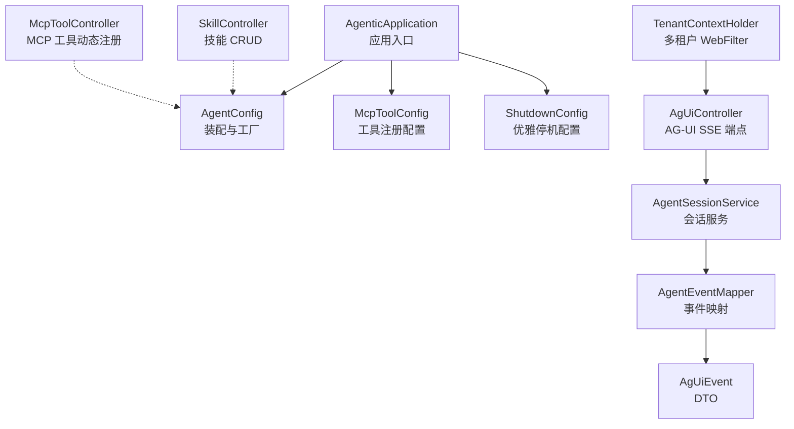
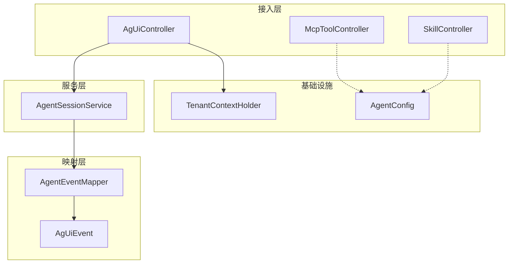
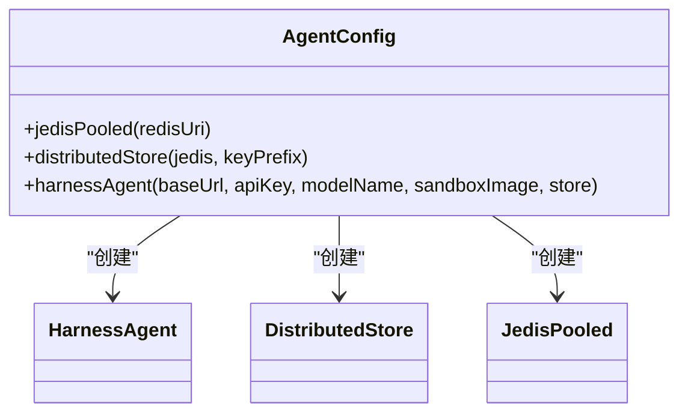
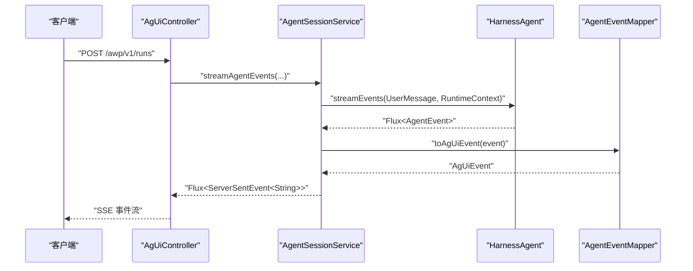
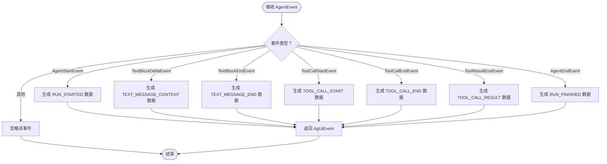
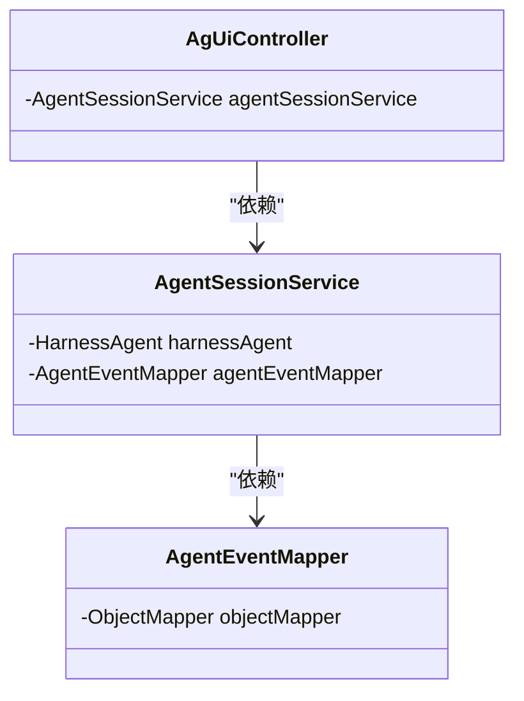
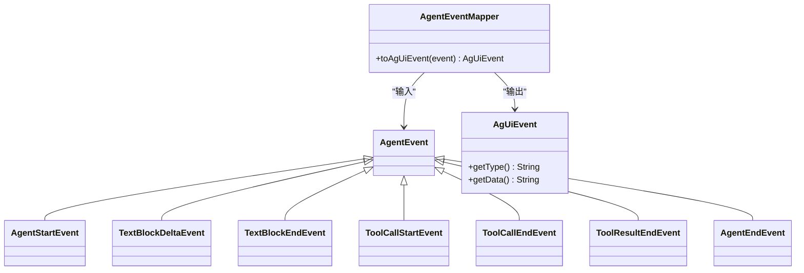
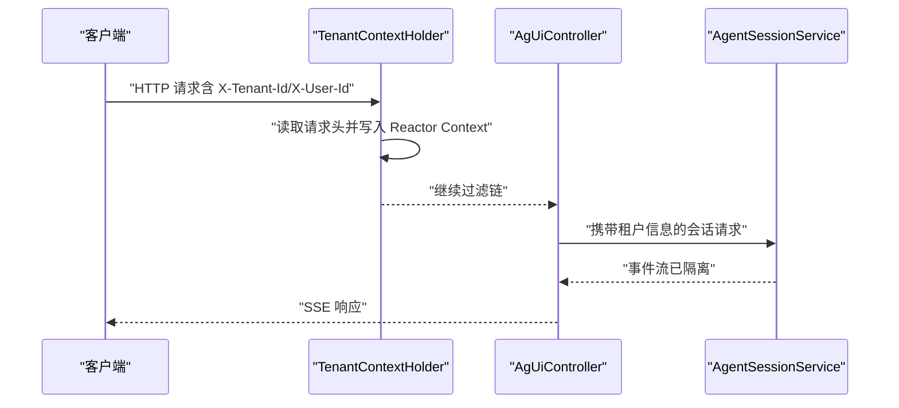
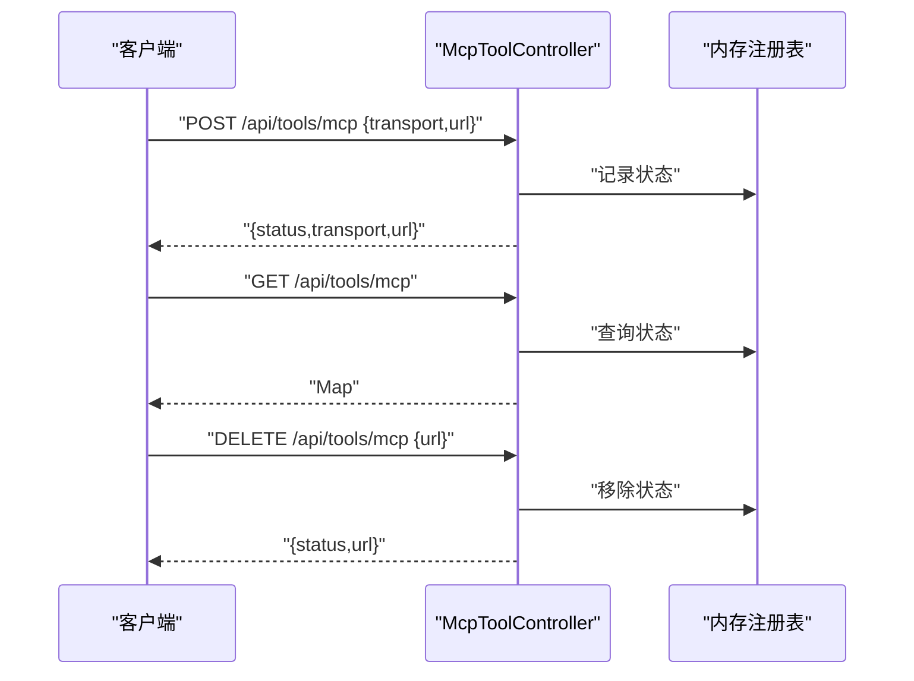
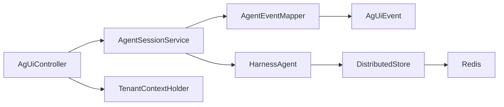

# 设计模式

<cite>
**本文引用的文件**
- [AgenticApplication.java](file://src/main/java/com/example/agentic/AgenticApplication.java)
- [AgentConfig.java](file://src/main/java/com/example/agentic/config/AgentConfig.java)
- [McpToolConfig.java](file://src/main/java/com/example/agentic/config/McpToolConfig.java)
- [ShutdownConfig.java](file://src/main/java/com/example/agentic/config/ShutdownConfig.java)
- [TenantContextHolder.java](file://src/main/java/com/example/agentic/tenant/TenantContextHolder.java)
- [AgUiController.java](file://src/main/java/com/example/agentic/controller/AgUiController.java)
- [McpToolController.java](file://src/main/java/com/example/agentic/controller/McpToolController.java)
- [SkillController.java](file://src/main/java/com/example/agentic/controller/SkillController.java)
- [AgentSessionService.java](file://src/main/java/com/example/agentic/agent/AgentSessionService.java)
- [AgentEventMapper.java](file://src/main/java/com/example/agentic/agent/AgentEventMapper.java)
- [AgUiEvent.java](file://src/main/java/com/example/agentic/agent/AgUiEvent.java)
- [application.yml](file://src/main/resources/application.yml)
</cite>

## 目录
1. [引言](#引言)
2. [项目结构](#项目结构)
3. [核心组件](#核心组件)
4. [架构总览](#架构总览)
5. [详细组件分析](#详细组件分析)
6. [依赖分析](#依赖分析)
7. [性能考虑](#性能考虑)
8. [故障排查指南](#故障排查指南)
9. [结论](#结论)
10. [附录](#附录)

## 引言
本设计模式文档聚焦于智能代理平台中的设计模式实践，涵盖工厂模式、观察者模式、策略模式、依赖注入模式以及适配器模式等。通过对代码结构、控制流与数据流的深入分析，解释这些模式在系统中的应用场景、实现方式与带来的可扩展性与可维护性收益，并辅以类图与时序图帮助读者快速把握关键实现。

## 项目结构
项目采用基于功能域的分层组织方式，结合 Spring Boot 的模块化特性：
- 应用入口与配置：AgenticApplication、各配置类（AgentConfig、McpToolConfig、ShutdownConfig、TracingConfig）
- 控制器层：AgUiController、McpToolController、SkillController
- 业务服务层：AgentSessionService
- 映射与事件：AgentEventMapper、AgUiEvent
- 多租户上下文：TenantContextHolder
- 资源与环境：application.yml

图表来源
- [AgenticApplication.java:16-22](file://src/main/java/com/example/agentic/AgenticApplication.java#L16-L22)
- [AgentConfig.java:28-86](file://src/main/java/com/example/agentic/config/AgentConfig.java#L28-L86)
- [AgUiController.java:22-75](file://src/main/java/com/example/agentic/controller/AgUiController.java#L22-L75)
- [AgentSessionService.java:23-63](file://src/main/java/com/example/agentic/agent/AgentSessionService.java#L23-L63)
- [AgentEventMapper.java:30-120](file://src/main/java/com/example/agentic/agent/AgentEventMapper.java#L30-L120)
- [AgUiEvent.java:6-24](file://src/main/java/com/example/agentic/agent/AgUiEvent.java#L6-L24)
- [TenantContextHolder.java:17-59](file://src/main/java/com/example/agentic/tenant/TenantContextHolder.java#L17-L59)
- [McpToolController.java:17-69](file://src/main/java/com/example/agentic/controller/McpToolController.java#L17-L69)
- [SkillController.java:28-104](file://src/main/java/com/example/agentic/controller/SkillController.java#L28-L104)

章节来源
- [AgenticApplication.java:16-22](file://src/main/java/com/example/agentic/AgenticApplication.java#L16-L22)
- [application.yml:1-30](file://src/main/resources/application.yml#L1-L30)

## 核心组件
- 应用入口与引导：AgenticApplication 作为 Spring Boot 启动类，负责加载配置与启动 Web 容器。
- 配置与装配：AgentConfig 通过 @Configuration/@Bean 组织“工厂式”装配，集中管理模型、存储、沙箱、中间件等组件；McpToolConfig 提供 MCP 工具注册的配置扩展点；ShutdownConfig 提供优雅停机的扩展能力。
- 控制器层：AgUiController 对外暴露 AG-UI SSE 端点；McpToolController 支持运行时动态注册 MCP 工具；SkillController 管理工作区级技能资源。
- 业务服务层：AgentSessionService 封装会话与事件流，确保多租户隔离与事件转换。
- 映射与事件：AgentEventMapper 将 AgentScope 事件映射为 AG-UI 事件；AgUiEvent 作为传输 DTO。
- 多租户上下文：TenantContextHolder 通过 WebFilter 将租户信息注入到响应式上下文，贯穿请求链路。

章节来源
- [AgenticApplication.java:16-22](file://src/main/java/com/example/agentic/AgenticApplication.java#L16-L22)
- [AgentConfig.java:28-86](file://src/main/java/com/example/agentic/config/AgentConfig.java#L28-L86)
- [McpToolConfig.java:14-25](file://src/main/java/com/example/agentic/config/McpToolConfig.java#L14-L25)
- [ShutdownConfig.java:14-21](file://src/main/java/com/example/agentic/config/ShutdownConfig.java#L14-L21)
- [AgUiController.java:22-75](file://src/main/java/com/example/agentic/controller/AgUiController.java#L22-L75)
- [McpToolController.java:17-69](file://src/main/java/com/example/agentic/controller/McpToolController.java#L17-L69)
- [SkillController.java:28-104](file://src/main/java/com/example/agentic/controller/SkillController.java#L28-L104)
- [AgentSessionService.java:23-63](file://src/main/java/com/example/agentic/agent/AgentSessionService.java#L23-L63)
- [AgentEventMapper.java:30-120](file://src/main/java/com/example/agentic/agent/AgentEventMapper.java#L30-L120)
- [AgUiEvent.java:6-24](file://src/main/java/com/example/agentic/agent/AgUiEvent.java#L6-L24)
- [TenantContextHolder.java:17-59](file://src/main/java/com/example/agentic/tenant/TenantContextHolder.java#L17-L59)

## 架构总览
系统采用“配置即工厂”的装配风格，结合响应式 WebFlux 与事件驱动的 AgentScope 事件流，形成“控制器-服务-映射-底层引擎”的清晰分层。多租户通过 WebFilter 注入上下文，确保每个会话的隔离与持久化。

图表来源
- [AgUiController.java:22-75](file://src/main/java/com/example/agentic/controller/AgUiController.java#L22-L75)
- [AgentSessionService.java:23-63](file://src/main/java/com/example/agentic/agent/AgentSessionService.java#L23-L63)
- [AgentEventMapper.java:30-120](file://src/main/java/com/example/agentic/agent/AgentEventMapper.java#L30-L120)
- [AgUiEvent.java:6-24](file://src/main/java/com/example/agentic/agent/AgUiEvent.java#L6-L24)
- [TenantContextHolder.java:17-59](file://src/main/java/com/example/agentic/tenant/TenantContextHolder.java#L17-L59)
- [AgentConfig.java:28-86](file://src/main/java/com/example/agentic/config/AgentConfig.java#L28-L86)

## 详细组件分析

### 工厂模式（Factory Pattern）
- 应用场景
  - 在 AgentConfig 中，使用 @Configuration + @Bean 组合实现“对象工厂”，统一创建与装配 HarnessAgent、DistributedStore、JedisPooled 等组件，集中管理依赖关系与生命周期。
  - 在 McpToolConfig 中预留静态注册的工厂式扩展点，便于未来通过配置文件一次性装配多个 MCP 客户端。
- 实现方式
  - 通过 @Bean 方法返回具体实例，配合 @Value 注入外部配置，形成“配置驱动的工厂”。
  - 依赖注入由 Spring 容器管理，避免硬编码构造逻辑。
- 带来的好处
  - 解耦上层调用与底层实例创建细节，提升可测试性与可替换性。
  - 统一配置入口，降低重复装配成本。
- 代码示例路径
  - [AgentConfig.java:34-85](file://src/main/java/com/example/agentic/config/AgentConfig.java#L34-L85)
  - [McpToolConfig.java:17-23](file://src/main/java/com/example/agentic/config/McpToolConfig.java#L17-L23)

图表来源
- [AgentConfig.java:34-85](file://src/main/java/com/example/agentic/config/AgentConfig.java#L34-L85)

章节来源
- [AgentConfig.java:28-86](file://src/main/java/com/example/agentic/config/AgentConfig.java#L28-L86)
- [McpToolConfig.java:14-25](file://src/main/java/com/example/agentic/config/McpToolConfig.java#L14-L25)

### 观察者模式（Observer Pattern）
- 应用场景
  - AgentScope 产生事件流（如 AgentStartEvent、TextBlockDeltaEvent、ToolCallStartEvent 等），系统通过订阅这些事件进行处理与转换。
- 实现方式
  - 控制器层通过响应式流接收事件，服务层将事件映射为 AG-UI 事件并通过 SSE 返回客户端。
  - AgentEventMapper 对不同类型的 AgentEvent 进行分支处理，相当于“观察者”对不同事件类型做出差异化响应。
- 带来的好处
  - 事件驱动解耦，便于扩展新的事件类型与处理逻辑。
  - 保持前端协议与后端引擎的松耦合。
- 代码示例路径
  - [AgentSessionService.java:43-61](file://src/main/java/com/example/agentic/agent/AgentSessionService.java#L43-L61)
  - [AgentEventMapper.java:45-97](file://src/main/java/com/example/agentic/agent/AgentEventMapper.java#L45-L97)

图表来源
- [AgUiController.java:43-56](file://src/main/java/com/example/agentic/controller/AgUiController.java#L43-L56)
- [AgentSessionService.java:43-61](file://src/main/java/com/example/agentic/agent/AgentSessionService.java#L43-L61)
- [AgentEventMapper.java:45-97](file://src/main/java/com/example/agentic/agent/AgentEventMapper.java#L45-L97)

章节来源
- [AgUiController.java:22-75](file://src/main/java/com/example/agentic/controller/AgUiController.java#L22-L75)
- [AgentSessionService.java:23-63](file://src/main/java/com/example/agentic/agent/AgentSessionService.java#L23-L63)
- [AgentEventMapper.java:30-120](file://src/main/java/com/example/agentic/agent/AgentEventMapper.java#L30-L120)

### 策略模式（Strategy Pattern）
- 应用场景
  - AgentEventMapper 对不同 AgentEvent 类型采用不同的映射策略，根据事件类型选择对应的 AG-UI 事件结构与字段填充。
- 实现方式
  - 使用条件判断或分支处理（if/else 或 switch）对事件类型进行分流，每种类型对应一个“策略”分支。
- 带来的好处
  - 易于新增事件类型与映射规则，无需修改既有分支逻辑。
  - 逻辑清晰，便于测试与维护。
- 代码示例路径
  - [AgentEventMapper.java:45-97](file://src/main/java/com/example/agentic/agent/AgentEventMapper.java#L45-L97)

图表来源
- [AgentEventMapper.java:45-97](file://src/main/java/com/example/agentic/agent/AgentEventMapper.java#L45-L97)

章节来源
- [AgentEventMapper.java:30-120](file://src/main/java/com/example/agentic/agent/AgentEventMapper.java#L30-L120)

### 依赖注入模式（Dependency Injection）
- 应用场景
  - 控制器、服务、映射器均通过构造函数注入所需依赖，避免硬编码与全局状态。
- 实现方式
  - 使用 @Service、@RestController、@Component 等注解声明组件，Spring 自动完成依赖解析与注入。
- 带来的好处
  - 明确的依赖关系，便于单元测试与替换实现。
  - 降低耦合度，提升可维护性与可扩展性。
- 代码示例路径
  - [AgUiController.java:26-30](file://src/main/java/com/example/agentic/controller/AgUiController.java#L26-L30)
  - [AgentSessionService.java:29-32](file://src/main/java/com/example/agentic/agent/AgentSessionService.java#L29-L32)
  - [AgentEventMapper.java:35-37](file://src/main/java/com/example/agentic/agent/AgentEventMapper.java#L35-L37)

图表来源
- [AgUiController.java:26-30](file://src/main/java/com/example/agentic/controller/AgUiController.java#L26-L30)
- [AgentSessionService.java:29-32](file://src/main/java/com/example/agentic/agent/AgentSessionService.java#L29-L32)
- [AgentEventMapper.java:35-37](file://src/main/java/com/example/agentic/agent/AgentEventMapper.java#L35-L37)

章节来源
- [AgUiController.java:22-75](file://src/main/java/com/example/agentic/controller/AgUiController.java#L22-L75)
- [AgentSessionService.java:23-63](file://src/main/java/com/example/agentic/agent/AgentSessionService.java#L23-L63)
- [AgentEventMapper.java:30-120](file://src/main/java/com/example/agentic/agent/AgentEventMapper.java#L30-L120)

### 适配器模式（Adapter Pattern）
- 应用场景
  - AgentEventMapper 将 AgentScope 的内部事件类型适配为 AG-UI 协议事件，屏蔽底层引擎变化对上层的影响。
- 实现方式
  - 通过统一的 toAgUiEvent 接口，将多种 AgentEvent 子类型转换为 AgUiEvent。
- 带来的好处
  - 保护上层协议不受底层事件模型演化的冲击。
  - 便于未来引入新的事件类型或协议版本。
- 代码示例路径
  - [AgentEventMapper.java:45-97](file://src/main/java/com/example/agentic/agent/AgentEventMapper.java#L45-L97)
  - [AgUiEvent.java:6-24](file://src/main/java/com/example/agentic/agent/AgUiEvent.java#L6-L24)

图表来源
- [AgentEventMapper.java:45-97](file://src/main/java/com/example/agentic/agent/AgentEventMapper.java#L45-L97)
- [AgUiEvent.java:6-24](file://src/main/java/com/example/agentic/agent/AgUiEvent.java#L6-L24)

章节来源
- [AgentEventMapper.java:30-120](file://src/main/java/com/example/agentic/agent/AgentEventMapper.java#L30-L120)
- [AgUiEvent.java:6-24](file://src/main/java/com/example/agentic/agent/AgUiEvent.java#L6-L24)

### 多租户上下文传播（Context Propagation）
- 应用场景
  - 通过 WebFilter 将 X-Tenant-Id、X-User-Id 注入到响应式上下文，确保后续链路（如会话服务）能读取租户与用户信息。
- 实现方式
  - TenantContextHolder 在 filter 中读取请求头，写入 Reactor Context；提供静态方法从上下文中读取。
- 带来的好处
  - 透明地传递多租户上下文，避免在每个方法签名中显式传递。
  - 与响应式链路无缝集成，减少侵入性。
- 代码示例路径
  - [TenantContextHolder.java:25-57](file://src/main/java/com/example/agentic/tenant/TenantContextHolder.java#L25-L57)
  - [AgUiController.java:46-55](file://src/main/java/com/example/agentic/controller/AgUiController.java#L46-L55)
  - [AgentSessionService.java:48-51](file://src/main/java/com/example/agentic/agent/AgentSessionService.java#L48-L51)

图表来源
- [TenantContextHolder.java:25-57](file://src/main/java/com/example/agentic/tenant/TenantContextHolder.java#L25-L57)
- [AgUiController.java:46-55](file://src/main/java/com/example/agentic/controller/AgUiController.java#L46-L55)
- [AgentSessionService.java:48-51](file://src/main/java/com/example/agentic/agent/AgentSessionService.java#L48-L51)

章节来源
- [TenantContextHolder.java:17-59](file://src/main/java/com/example/agentic/tenant/TenantContextHolder.java#L17-L59)
- [AgUiController.java:22-75](file://src/main/java/com/example/agentic/controller/AgUiController.java#L22-L75)
- [AgentSessionService.java:23-63](file://src/main/java/com/example/agentic/agent/AgentSessionService.java#L23-L63)

### 运行时工具注册（动态扩展）
- 应用场景
  - 通过 McpToolController 支持运行时动态注册/注销 MCP 工具，满足业务动态扩展需求。
- 实现方式
  - 使用内存 Map 记录已注册的 MCP 服务器状态，提供 REST API 进行增删查操作。
- 带来的好处
  - 无需重启即可扩展工具集，提升系统灵活性。
  - 与 AgentConfig 的工厂装配形成互补：静态装配用于稳定依赖，动态注册用于运行时扩展。
- 代码示例路径
  - [McpToolController.java:30-67](file://src/main/java/com/example/agentic/controller/McpToolController.java#L30-L67)
  - [McpToolConfig.java:17-23](file://src/main/java/com/example/agentic/config/McpToolConfig.java#L17-L23)

图表来源
- [McpToolController.java:30-67](file://src/main/java/com/example/agentic/controller/McpToolController.java#L30-L67)

章节来源
- [McpToolController.java:17-69](file://src/main/java/com/example/agentic/controller/McpToolController.java#L17-L69)
- [McpToolConfig.java:14-25](file://src/main/java/com/example/agentic/config/McpToolConfig.java#L14-L25)

## 依赖分析
- 组件内聚与耦合
  - 控制器仅依赖服务接口，服务依赖映射器与引擎，形成清晰的单向依赖。
  - AgentEventMapper 与 AgentScope 事件类型强相关，但通过适配器对外暴露统一接口，降低上层耦合。
- 外部依赖
  - Redis 用于分布式存储与会话持久化；AgentScope 提供模型、沙箱与事件流；WebFlux 提供 SSE 支持。
- 配置与环境
  - application.yml 提供统一的外部化配置入口，便于在不同环境切换模型、存储与导出器参数。

图表来源
- [AgUiController.java:26-30](file://src/main/java/com/example/agentic/controller/AgUiController.java#L26-L30)
- [AgentSessionService.java:29-32](file://src/main/java/com/example/agentic/agent/AgentSessionService.java#L29-L32)
- [AgentEventMapper.java:35-37](file://src/main/java/com/example/agentic/agent/AgentEventMapper.java#L35-L37)
- [AgUiEvent.java:6-24](file://src/main/java/com/example/agentic/agent/AgUiEvent.java#L6-L24)
- [TenantContextHolder.java:25-57](file://src/main/java/com/example/agentic/tenant/TenantContextHolder.java#L25-L57)
- [AgentConfig.java:56-84](file://src/main/java/com/example/agentic/config/AgentConfig.java#L56-L84)

章节来源
- [application.yml:1-30](file://src/main/resources/application.yml#L1-L30)

## 性能考虑
- 响应式与背压
  - 使用 WebFlux 与响应式流处理事件，有利于在高并发场景下维持稳定的吞吐与延迟。
- 事件压缩与结果卸载
  - AgentConfig 中配置上下文压缩与大工具结果卸载策略，有助于控制内存占用与网络带宽。
- 缓存与存储
  - Redis 作为分布式存储，建议合理设置 key 前缀与过期策略，避免热点与碎片。
- SSE 流式输出
  - 通过 ServerSentEvent 逐步推送事件，降低首字节延迟，改善用户体验。

## 故障排查指南
- 事件未映射
  - 若发现某些事件未出现在 SSE 输出中，检查 AgentEventMapper 是否覆盖该事件类型。
  - 参考路径：[AgentEventMapper.java:45-97](file://src/main/java/com/example/agentic/agent/AgentEventMapper.java#L45-L97)
- 多租户串台
  - 确认 TenantContextHolder 已正确注入上下文，且 AgentSessionService 使用了正确的 RuntimeContext。
  - 参考路径：[TenantContextHolder.java:25-57](file://src/main/java/com/example/agentic/tenant/TenantContextHolder.java#L25-L57)，[AgentSessionService.java:48-51](file://src/main/java/com/example/agentic/agent/AgentSessionService.java#L48-L51)
- MCP 工具未生效
  - 检查 McpToolController 的注册状态与 URL，确认后续是否真正接入到 Agent 的工具包。
  - 参考路径：[McpToolController.java:30-67](file://src/main/java/com/example/agentic/controller/McpToolController.java#L30-L67)
- 优雅停机异常
  - 检查 ShutdownConfig 与 application.yml 的 server.shutdown 配置，必要时扩展自定义停机钩子。
  - 参考路径：[ShutdownConfig.java:14-21](file://src/main/java/com/example/agentic/config/ShutdownConfig.java#L14-L21)，[application.yml:27-29](file://src/main/resources/application.yml#L27-L29)

章节来源
- [AgentEventMapper.java:30-120](file://src/main/java/com/example/agentic/agent/AgentEventMapper.java#L30-L120)
- [TenantContextHolder.java:17-59](file://src/main/java/com/example/agentic/tenant/TenantContextHolder.java#L17-L59)
- [AgentSessionService.java:23-63](file://src/main/java/com/example/agentic/agent/AgentSessionService.java#L23-L63)
- [McpToolController.java:17-69](file://src/main/java/com/example/agentic/controller/McpToolController.java#L17-L69)
- [ShutdownConfig.java:14-21](file://src/main/java/com/example/agentic/config/ShutdownConfig.java#L14-L21)
- [application.yml:27-29](file://src/main/resources/application.yml#L27-L29)

## 结论
本项目通过“配置即工厂”的装配风格、响应式事件驱动与适配器映射，有效实现了多租户隔离、运行时扩展与协议解耦。工厂模式保证了依赖装配的集中化与可替换性；观察者模式与适配器模式共同保障了事件流的可扩展与协议稳定性；策略模式使事件映射易于演进；依赖注入模式提升了整体的可测试性与可维护性。这些设计模式协同作用，为系统的可扩展性与可维护性提供了坚实基础。

## 附录
- 配置要点
  - Redis 连接与 key 前缀：参考 [application.yml:4-10](file://src/main/resources/application.yml#L4-L10)
  - 模型参数与工作区路径：参考 [application.yml:12-19](file://src/main/resources/application.yml#L12-L19)
  - OTEL 导出端点：参考 [application.yml:22-26](file://src/main/resources/application.yml#L22-L26)
- 工厂装配要点
  - AgentConfig 中的模型、沙箱、压缩与中间件配置：参考 [AgentConfig.java:56-84](file://src/main/java/com/example/agentic/config/AgentConfig.java#L56-L84)