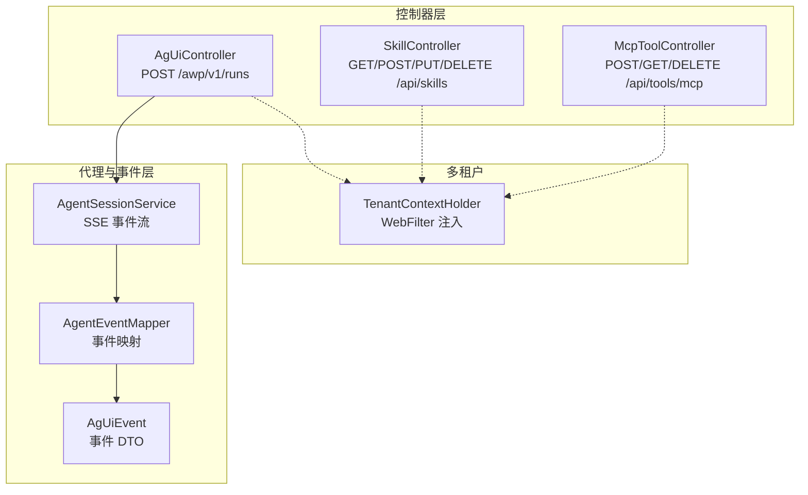
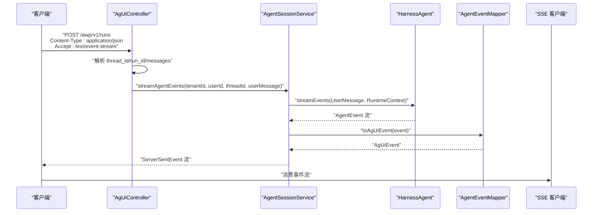
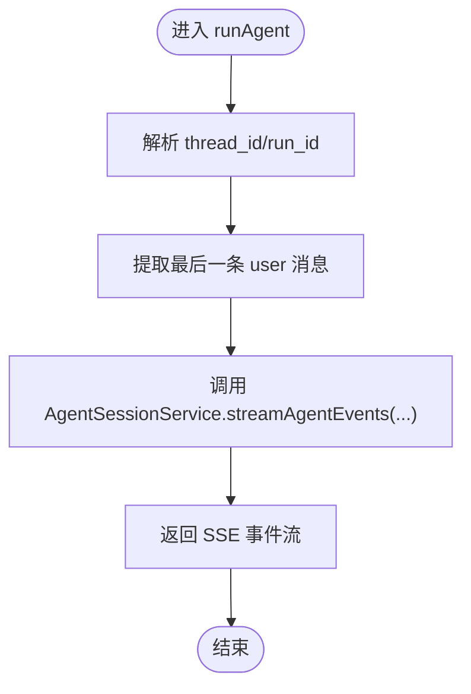
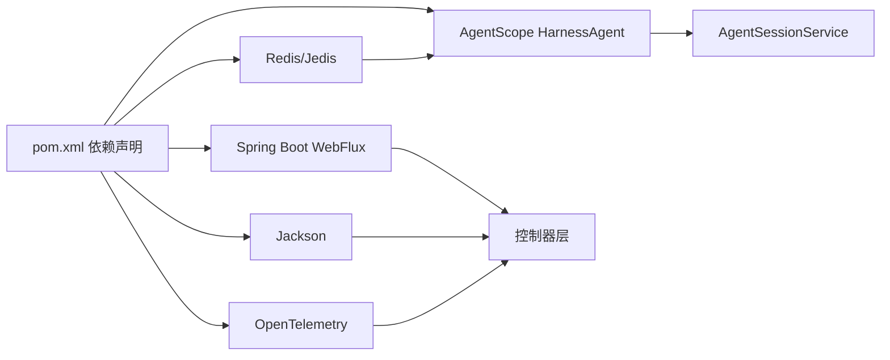

# API 接口模块

<cite>
**本文引用的文件**
- [AgUiController.java](file://src/main/java/com/example/agentic/controller/AgUiController.java)
- [SkillController.java](file://src/main/java/com/example/agentic/controller/SkillController.java)
- [McpToolController.java](file://src/main/java/com/example/agentic/controller/McpToolController.java)
- [AgentSessionService.java](file://src/main/java/com/example/agentic/agent/AgentSessionService.java)
- [AgentEventMapper.java](file://src/main/java/com/example/agentic/agent/AgentEventMapper.java)
- [AgUiEvent.java](file://src/main/java/com/example/agentic/agent/AgUiEvent.java)
- [TenantContextHolder.java](file://src/main/java/com/example/agentic/tenant/TenantContextHolder.java)
- [application.yml](file://src/main/resources/application.yml)
- [pom.xml](file://pom.xml)
- [AGENTS.md](file://src/main/resources/workspace/AGENTS.md)
</cite>

## 目录
1. [简介](#简介)
2. [项目结构](#项目结构)
3. [核心组件](#核心组件)
4. [架构总览](#架构总览)
5. [详细组件分析](#详细组件分析)
6. [依赖分析](#依赖分析)
7. [性能考虑](#性能考虑)
8. [故障排查指南](#故障排查指南)
9. [结论](#结论)
10. [附录](#附录)

## 简介
本文件面向 API 接口模块，系统性阐述 AG-UI 协议的实现与扩展，包括：
- AG-UI 标准运行端点的 HTTP 设计与 SSE 事件流处理
- 技能（Skill）管理的 CRUD 操作
- MCP 工具的动态注册与生命周期管理
- 多租户上下文注入与隔离
- 完整的 API 端点清单、请求/响应格式、错误码说明
- 实际调用示例与客户端集成建议

## 项目结构
该模块采用基于功能分层的组织方式：
- 控制器层：AgUiController、SkillController、McpToolController
- 代理与事件层：AgentSessionService、AgentEventMapper、AgUiEvent
- 多租户过滤器：TenantContextHolder
- 配置与资源：application.yml、pom.xml、AGENTS.md

图表来源
- [AgUiController.java:22-56](file://src/main/java/com/example/agentic/controller/AgUiController.java#L22-L56)
- [SkillController.java:28-103](file://src/main/java/com/example/agentic/controller/SkillController.java#L28-L103)
- [McpToolController.java:17-68](file://src/main/java/com/example/agentic/controller/McpToolController.java#L17-L68)
- [AgentSessionService.java:23-62](file://src/main/java/com/example/agentic/agent/AgentSessionService.java#L23-L62)
- [AgentEventMapper.java:30-120](file://src/main/java/com/example/agentic/agent/AgentEventMapper.java#L30-L120)
- [AgUiEvent.java:6-24](file://src/main/java/com/example/agentic/agent/AgUiEvent.java#L6-L24)
- [TenantContextHolder.java:16-58](file://src/main/java/com/example/agentic/tenant/TenantContextHolder.java#L16-L58)

章节来源
- [AgUiController.java:12-21](file://src/main/java/com/example/agentic/controller/AgUiController.java#L12-L21)
- [SkillController.java:17-27](file://src/main/java/com/example/agentic/controller/SkillController.java#L17-L27)
- [McpToolController.java:11-16](file://src/main/java/com/example/agentic/controller/McpToolController.java#L11-L16)
- [TenantContextHolder.java:10-15](file://src/main/java/com/example/agentic/tenant/TenantContextHolder.java#L10-L15)

## 核心组件
- AgUiController：实现 AG-UI 标准运行端点，接收 JSON 请求体，解析用户消息，通过 AgentSessionService 生成 SSE 事件流。
- AgentSessionService：封装 HarnessAgent 的事件流，构建 RuntimeContext 实现多租户隔离，并将事件映射为 SSE。
- AgentEventMapper：将 AgentScope 事件转换为 AG-UI 事件，仅暴露需要的事件类型。
- AgUiEvent：AG-UI 事件的数据传输对象。
- SkillController：工作区级别技能的 CRUD 管理。
- McpToolController：MCP 工具的动态注册/查询/注销。
- TenantContextHolder：从 HTTP 头注入租户上下文到响应式链路。

章节来源
- [AgUiController.java:22-56](file://src/main/java/com/example/agentic/controller/AgUiController.java#L22-L56)
- [AgentSessionService.java:23-62](file://src/main/java/com/example/agentic/agent/AgentSessionService.java#L23-L62)
- [AgentEventMapper.java:30-120](file://src/main/java/com/example/agentic/agent/AgentEventMapper.java#L30-L120)
- [AgUiEvent.java:6-24](file://src/main/java/com/example/agentic/agent/AgUiEvent.java#L6-L24)
- [SkillController.java:28-103](file://src/main/java/com/example/agentic/controller/SkillController.java#L28-L103)
- [McpToolController.java:17-68](file://src/main/java/com/example/agentic/controller/McpToolController.java#L17-L68)
- [TenantContextHolder.java:16-58](file://src/main/java/com/example/agentic/tenant/TenantContextHolder.java#L16-L58)

## 架构总览
下图展示 AG-UI 运行端点从请求到事件流的关键交互路径。

图表来源
- [AgUiController.java:43-56](file://src/main/java/com/example/agentic/controller/AgUiController.java#L43-L56)
- [AgentSessionService.java:43-61](file://src/main/java/com/example/agentic/agent/AgentSessionService.java#L43-L61)
- [AgentEventMapper.java:45-97](file://src/main/java/com/example/agentic/agent/AgentEventMapper.java#L45-L97)

## 详细组件分析

### AgUiController（AG-UI 标准运行端点）
- 路径与方法
  - POST /awp/v1/runs
- 请求头
  - X-Tenant-Id：租户标识，默认值 default
  - X-User-Id：用户标识，默认值 anonymous
- 请求体（RunAgentInput）
  - thread_id：会话标识（可选）
  - run_id：运行标识（可选）
  - messages：消息数组，取最后一条 role=user 的 content 作为用户输入
  - state：运行状态（可选）
- 响应
  - Content-Type: text/event-stream
  - 返回 ServerSentEvent 流，事件类型由 AgentEventMapper 映射
- 错误处理
  - 当 messages 缺失或非数组时，视为空消息
  - 未显式抛出异常，SSE 流在上游中断时由框架处理

图表来源
- [AgUiController.java:43-56](file://src/main/java/com/example/agentic/controller/AgUiController.java#L43-L56)
- [AgUiController.java:61-73](file://src/main/java/com/example/agentic/controller/AgUiController.java#L61-L73)

章节来源
- [AgUiController.java:12-21](file://src/main/java/com/example/agentic/controller/AgUiController.java#L12-L21)
- [AgUiController.java:32-42](file://src/main/java/com/example/agentic/controller/AgUiController.java#L32-L42)
- [AgUiController.java:43-56](file://src/main/java/com/example/agentic/controller/AgUiController.java#L43-L56)
- [AgUiController.java:61-73](file://src/main/java/com/example/agentic/controller/AgUiController.java#L61-L73)

### AgentSessionService（SSE 事件流生成）
- 多租户隔离
  - userId = X-Tenant-Id + ":" + X-User-Id
  - sessionId = "universal-agent" + ":" + thread_id
- 事件流
  - 调用 HarnessAgent.streamEvents(UserMessage, RuntimeContext)
  - 逐个事件映射为 AG-UI 事件
  - 过滤掉未映射事件
  - 构造 ServerSentEvent，事件名即 AG-UI 事件类型，数据为 JSON 字符串

章节来源
- [AgentSessionService.java:13-22](file://src/main/java/com/example/agentic/agent/AgentSessionService.java#L13-L22)
- [AgentSessionService.java:43-61](file://src/main/java/com/example/agentic/agent/AgentSessionService.java#L43-L61)

### AgentEventMapper（事件映射）
- 映射规则（依据 agentscope-core 2.0.0-RC3）
  - AgentStartEvent → RUN_STARTED
  - TextBlockDeltaEvent → TEXT_MESSAGE_CONTENT
  - TextBlockEndEvent → TEXT_MESSAGE_END
  - ToolCallStartEvent → TOOL_CALL_START
  - ToolCallEndEvent → TOOL_CALL_END
  - ToolResultEndEvent → TOOL_CALL_RESULT
  - AgentEndEvent → RUN_FINISHED
- 其他事件忽略
- 输出为 AgUiEvent，包含 type 与 data（JSON 字符串）

章节来源
- [AgentEventMapper.java:15-29](file://src/main/java/com/example/agentic/agent/AgentEventMapper.java#L15-L29)
- [AgentEventMapper.java:45-97](file://src/main/java/com/example/agentic/agent/AgentEventMapper.java#L45-L97)
- [AgUiEvent.java:6-24](file://src/main/java/com/example/agentic/agent/AgUiEvent.java#L6-L24)

### SkillController（技能管理）
- 路径与方法
  - GET /api/skills：列出工作区技能文件
  - POST /api/skills：创建技能（写入 workspace/skills/{name}.md）
  - PUT /api/skills/{name}：更新技能
  - DELETE /api/skills/{name}：删除技能
- 请求体
  - POST/PUT：{ name: string, content: string }
- 响应
  - 成功返回字符串提示
  - 失败抛出 IllegalArgumentException（技能不存在）
- 目录
  - 读写目录由 agent.workspace 配置决定，默认 workspace/skills

章节来源
- [SkillController.java:46-56](file://src/main/java/com/example/agentic/controller/SkillController.java#L46-L56)
- [SkillController.java:61-71](file://src/main/java/com/example/agentic/controller/SkillController.java#L61-L71)
- [SkillController.java:76-87](file://src/main/java/com/example/agentic/controller/SkillController.java#L76-L87)
- [SkillController.java:92-102](file://src/main/java/com/example/agentic/controller/SkillController.java#L92-L102)
- [application.yml:16-17](file://src/main/resources/application.yml#L16-L17)

### McpToolController（MCP 工具动态注册）
- 路径与方法
  - POST /api/tools/mcp：注册 MCP Server
  - GET /api/tools/mcp：列出已注册服务器
  - DELETE /api/tools/mcp：注销 MCP Server
- 请求体
  - POST：{ transport: string, url: string }
  - DELETE：{ url: string }
- 响应
  - 注册成功返回 { status, transport, url }
  - 列表返回 Map 形式
- 注意
  - 当前为占位实现，未真正连接 MCP；后续可接入工具包注册到 HarnessAgent Toolkit

章节来源
- [McpToolController.java:24-46](file://src/main/java/com/example/agentic/controller/McpToolController.java#L24-L46)
- [McpToolController.java:50-54](file://src/main/java/com/example/agentic/controller/McpToolController.java#L50-L54)
- [McpToolController.java:59-67](file://src/main/java/com/example/agentic/controller/McpToolController.java#L59-L67)

### TenantContextHolder（多租户上下文注入）
- 作用
  - 从 HTTP 头 X-Tenant-Id、X-User-Id 提取并注入到 Reactor Context
  - 提供静态方法从上下文中读取租户信息
- 适用场景
  - 在响应式链路中需要租户隔离时使用

章节来源
- [TenantContextHolder.java:16-58](file://src/main/java/com/example/agentic/tenant/TenantContextHolder.java#L16-L58)

## 依赖分析
- Spring WebFlux：提供响应式 HTTP 与 SSE 支持
- AgentScope HarnessAgent：事件驱动的智能体运行时
- Jackson：JSON 解析与序列化
- Redis/Jedis：分布式存储与会话持久化（用于 AgentScope 扩展）
- OpenTelemetry：可观测性导出

图表来源
- [pom.xml:57-119](file://pom.xml#L57-L119)

章节来源
- [pom.xml:20-26](file://pom.xml#L20-L26)
- [pom.xml:57-119](file://pom.xml#L57-L119)

## 性能考虑
- SSE 流式输出：使用响应式链路避免阻塞，适合长连接与实时事件推送
- 事件映射：仅映射必要事件，减少无关事件对客户端的影响
- 多租户隔离：通过 RuntimeContext 实现，避免跨租户数据串扰
- 文件 I/O：技能 CRUD 使用本地文件系统，建议在生产环境配合工作区管理器或远程存储

## 故障排查指南
- SSE 无法接收事件
  - 检查客户端是否设置 Accept: text/event-stream
  - 确认后端是否正确返回 ServerSentEvent
- 事件类型缺失
  - 确认 AgentEventMapper 是否支持对应事件类型
- 租户隔离异常
  - 检查 X-Tenant-Id、X-User-Id 是否正确传递
  - 确认 RuntimeContext 构建逻辑
- 技能 CRUD 失败
  - 检查 agent.workspace 配置与 workspace/skills 目录权限
  - 确认文件名与扩展名（.md）

章节来源
- [AgUiController.java:12-21](file://src/main/java/com/example/agentic/controller/AgUiController.java#L12-L21)
- [AgentEventMapper.java:15-29](file://src/main/java/com/example/agentic/agent/AgentEventMapper.java#L15-L29)
- [AgentSessionService.java:18-22](file://src/main/java/com/example/agentic/agent/AgentSessionService.java#L18-L22)
- [application.yml:16-17](file://src/main/resources/application.yml#L16-L17)

## 结论
本模块完整实现了 AG-UI 协议的运行端点，结合事件映射与 SSE 流，为前端提供了实时、细粒度的交互体验。同时，技能与 MCP 工具的管理接口为工作区与外部工具生态提供了扩展能力。多租户上下文注入确保了在共享基础设施下的安全隔离。

## 附录

### API 端点清单
- AG-UI 运行端点
  - POST /awp/v1/runs
    - 请求头：X-Tenant-Id（默认 default）、X-User-Id（默认 anonymous）
    - 请求体：RunAgentInput（thread_id、run_id、messages、state）
    - 响应：text/event-stream，事件类型参考“事件映射”章节
- 技能管理
  - GET /api/skills：返回工作区技能文件名列表
  - POST /api/skills：创建技能（name、content）
  - PUT /api/skills/{name}：更新技能（content）
  - DELETE /api/skills/{name}：删除技能
- MCP 工具管理
  - POST /api/tools/mcp：注册 MCP（transport、url）
  - GET /api/tools/mcp：列出已注册服务器
  - DELETE /api/tools/mcp：注销 MCP（url）

章节来源
- [AgUiController.java:43-56](file://src/main/java/com/example/agentic/controller/AgUiController.java#L43-L56)
- [SkillController.java:46-56](file://src/main/java/com/example/agentic/controller/SkillController.java#L46-L56)
- [SkillController.java:61-71](file://src/main/java/com/example/agentic/controller/SkillController.java#L61-L71)
- [SkillController.java:76-87](file://src/main/java/com/example/agentic/controller/SkillController.java#L76-L87)
- [SkillController.java:92-102](file://src/main/java/com/example/agentic/controller/SkillController.java#L92-L102)
- [McpToolController.java:30-46](file://src/main/java/com/example/agentic/controller/McpToolController.java#L30-L46)
- [McpToolController.java:50-54](file://src/main/java/com/example/agentic/controller/McpToolController.java#L50-L54)
- [McpToolController.java:59-67](file://src/main/java/com/example/agentic/controller/McpToolController.java#L59-L67)

### 请求/响应格式与错误码
- 请求体
  - RunAgentInput：{ thread_id, run_id, messages[], state }
  - Skill CRUD：{ name, content }
  - MCP 注册：{ transport, url }
- 响应
  - AG-UI 运行：SSE 事件流，事件名为 AG-UI 事件类型，数据为 JSON
  - 技能 CRUD：字符串提示或列表
  - MCP：注册返回 { status, transport, url }
- 错误
  - 技能更新/删除不存在：抛出 IllegalArgumentException
  - SSE 事件映射缺失：忽略（不返回）

章节来源
- [AgUiController.java:32-42](file://src/main/java/com/example/agentic/controller/AgUiController.java#L32-L42)
- [SkillController.java:76-87](file://src/main/java/com/example/agentic/controller/SkillController.java#L76-L87)
- [SkillController.java:92-102](file://src/main/java/com/example/agentic/controller/SkillController.java#L92-L102)

### 事件映射（AG-UI 事件类型）
- RUN_STARTED
- TEXT_MESSAGE_CONTENT
- TEXT_MESSAGE_END
- TOOL_CALL_START
- TOOL_CALL_END
- TOOL_CALL_RESULT
- RUN_FINISHED

章节来源
- [AgentEventMapper.java:15-29](file://src/main/java/com/example/agentic/agent/AgentEventMapper.java#L15-L29)

### 客户端集成指南
- 认证与租户
  - 设置 X-Tenant-Id、X-User-Id 请求头
- SSE 客户端
  - 使用浏览器或第三方库订阅 text/event-stream
  - 逐条解析事件名与数据
- 技能管理
  - 通过 /api/skills 列表、创建、更新、删除
- MCP 工具
  - 通过 /api/tools/mcp 注册、查询、注销

章节来源
- [AgUiController.java:43-56](file://src/main/java/com/example/agentic/controller/AgUiController.java#L43-L56)
- [SkillController.java:46-56](file://src/main/java/com/example/agentic/controller/SkillController.java#L46-L56)
- [McpToolController.java:30-46](file://src/main/java/com/example/agentic/controller/McpToolController.java#L30-L46)