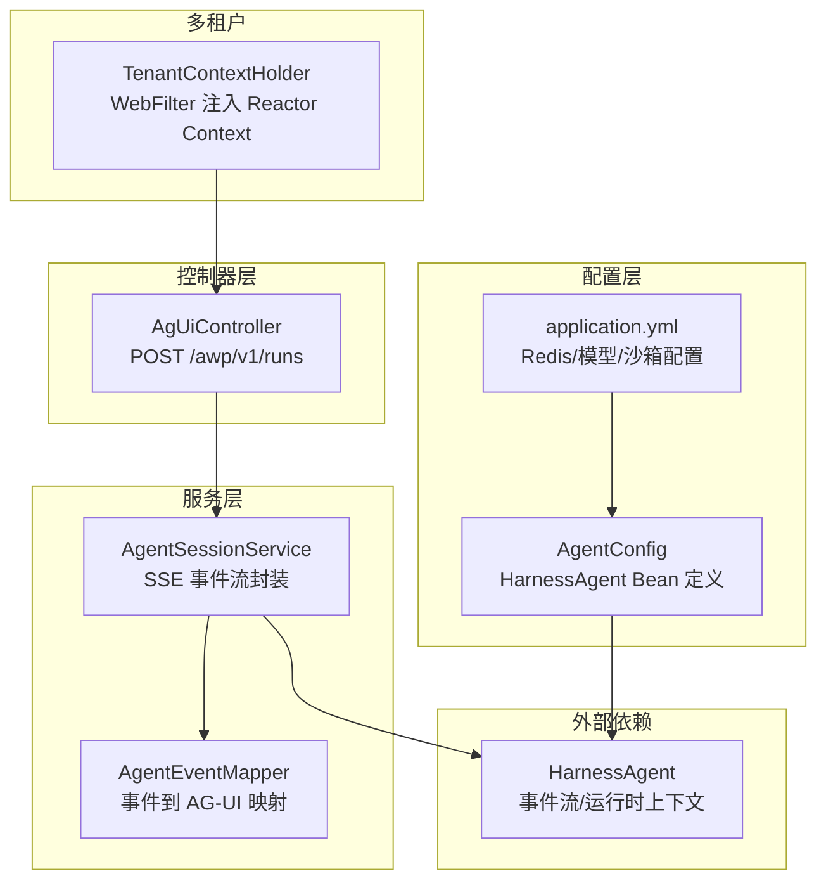
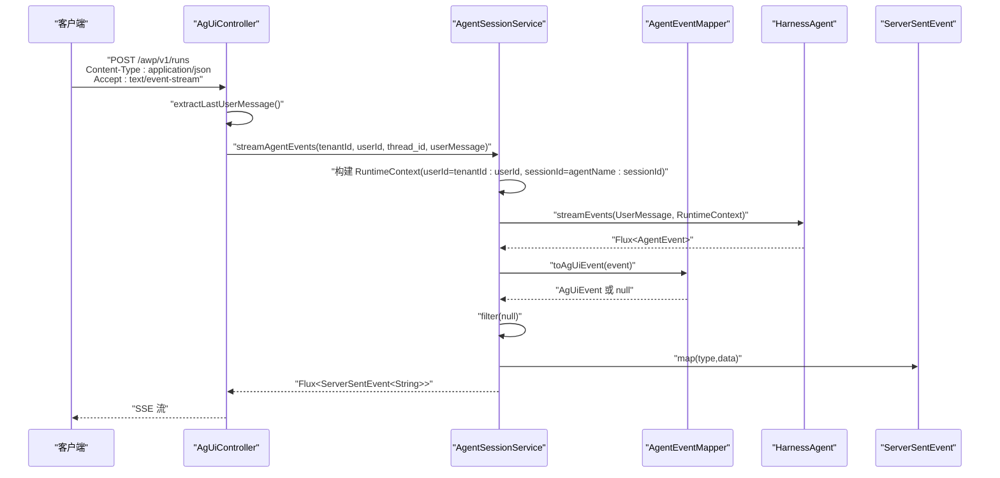
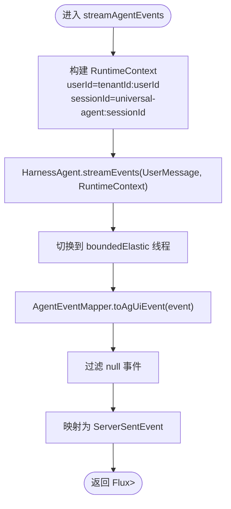
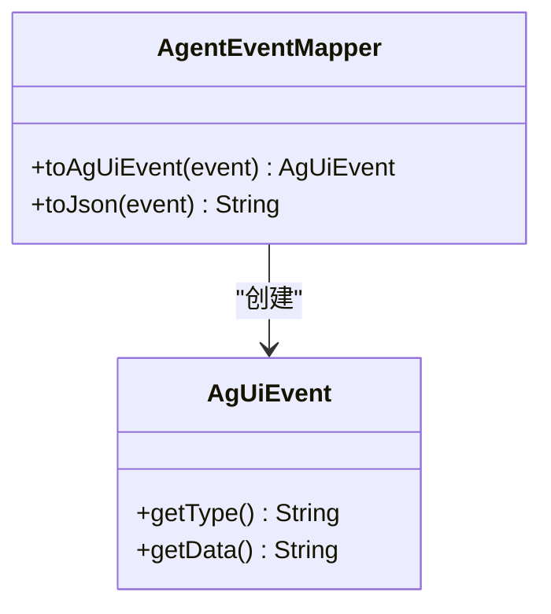
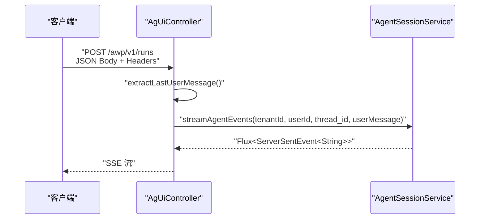
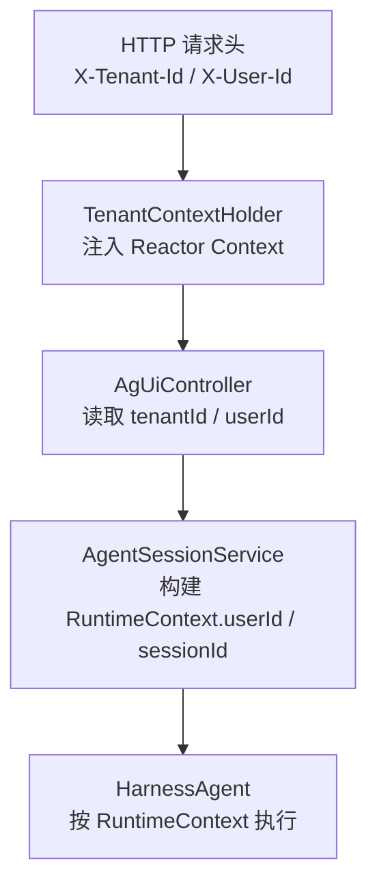
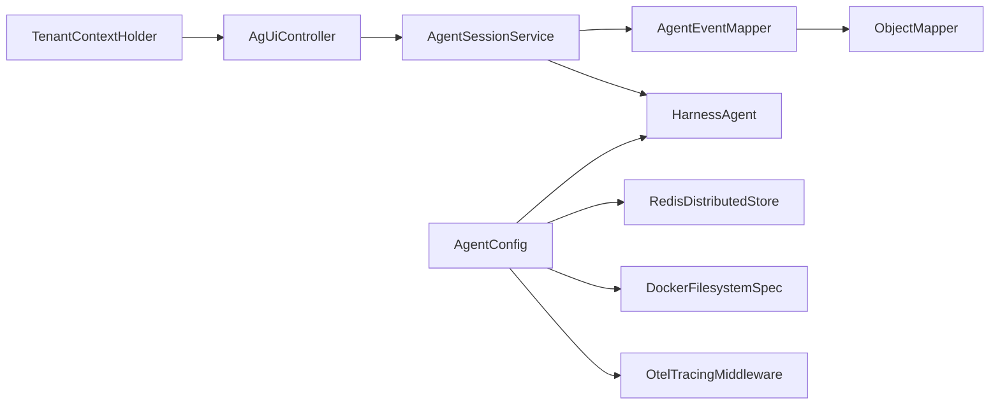

# 代理管理模块

<cite>
**本文档引用的文件**
- [AgentSessionService.java](file://src/main/java/com/example/agentic/agent/AgentSessionService.java)
- [AgentEventMapper.java](file://src/main/java/com/example/agentic/agent/AgentEventMapper.java)
- [AgUiEvent.java](file://src/main/java/com/example/agentic/agent/AgUiEvent.java)
- [AgUiController.java](file://src/main/java/com/example/agentic/controller/AgUiController.java)
- [TenantContextHolder.java](file://src/main/java/com/example/agentic/tenant/TenantContextHolder.java)
- [AgentConfig.java](file://src/main/java/com/example/agentic/config/AgentConfig.java)
- [application.yml](file://src/main/resources/application.yml)
</cite>

## 目录
1. [简介](#简介)
2. [项目结构](#项目结构)
3. [核心组件](#核心组件)
4. [架构总览](#架构总览)
5. [详细组件分析](#详细组件分析)
6. [依赖分析](#依赖分析)
7. [性能考虑](#性能考虑)
8. [故障排查指南](#故障排查指南)
9. [结论](#结论)
10. [附录](#附录)

## 简介
本文件面向代理管理模块，聚焦以下目标：
- 深入解析 AgentSessionService 的实现原理，包括代理会话生命周期管理、RuntimeContext 构建、HarnessAgent 集成等核心机制
- 详解 AG-UI 事件格式转换、SSE 流式输出处理、事件过滤和映射过程
- 说明多租户隔离的具体实现方式，包括用户标识拼接、会话 ID 组合策略
- 提供实际代码示例展示如何创建和管理代理会话，以及常见的使用模式和最佳实践

## 项目结构
该模块采用分层设计，围绕 Spring WebFlux 响应式栈组织，核心位于 agent、controller、tenant、config 四个包：
- agent：会话服务、事件模型与映射器
- controller：对外暴露 AG-UI 协议的 HTTP SSE 端点
- tenant：多租户上下文传递与提取
- config：HarnessAgent 与运行环境的生产级配置

**图表来源**
- [AgUiController.java:1-75](file://src/main/java/com/example/agentic/controller/AgUiController.java#L1-L75)
- [AgentSessionService.java:1-68](file://src/main/java/com/example/agentic/agent/AgentSessionService.java#L1-L68)
- [AgentEventMapper.java:1-120](file://src/main/java/com/example/agentic/agent/AgentEventMapper.java#L1-L120)
- [TenantContextHolder.java:1-79](file://src/main/java/com/example/agentic/tenant/TenantContextHolder.java#L1-L79)
- [AgentConfig.java:1-87](file://src/main/java/com/example/agentic/config/AgentConfig.java#L1-L87)
- [application.yml:1-37](file://src/main/resources/application.yml#L1-L37)

**章节来源**
- [AgUiController.java:1-75](file://src/main/java/com/example/agentic/controller/AgUiController.java#L1-L75)
- [AgentSessionService.java:1-68](file://src/main/java/com/example/agentic/agent/AgentSessionService.java#L1-L68)
- [AgentEventMapper.java:1-120](file://src/main/java/com/example/agentic/agent/AgentEventMapper.java#L1-L120)
- [TenantContextHolder.java:1-79](file://src/main/java/com/example/agentic/tenant/TenantContextHolder.java#L1-L79)
- [AgentConfig.java:1-87](file://src/main/java/com/example/agentic/config/AgentConfig.java#L1-L87)
- [application.yml:1-37](file://src/main/resources/application.yml#L1-L37)

## 核心组件
- AgentSessionService：封装 HarnessAgent.streamEvents()，每次调用传入 RuntimeContext，确保多租户隔离；将事件映射为 AG-UI SSE 格式并输出。
- AgentEventMapper：将 AgentScope 事件转换为 AG-UI 事件，过滤掉不对外暴露的内部事件。
- AgUiEvent：AG-UI 协议事件的数据传输对象（DTO）。
- AgUiController：对外暴露 AG-UI 协议端点，接收请求体中的 thread_id、run_id、messages，并提取 X-Tenant-Id、X-User-Id 构建 RuntimeContext。
- TenantContextHolder：WebFilter，从 HTTP 请求头提取 X-Tenant-Id、X-User-Id，注入到 Reactor Context，便于后续链路使用。
- AgentConfig：生产级配置，定义 HarnessAgent Bean，启用 Redis 分布式存储、Docker 沙箱隔离、上下文压缩与大工具结果卸载、OTel Tracing 中间件等。
- application.yml：集中配置 Redis、模型、沙箱镜像、工作区路径、OTLP 导出端点等。

**章节来源**
- [AgentSessionService.java:1-68](file://src/main/java/com/example/agentic/agent/AgentSessionService.java#L1-L68)
- [AgentEventMapper.java:1-120](file://src/main/java/com/example/agentic/agent/AgentEventMapper.java#L1-L120)
- [AgUiEvent.java:1-24](file://src/main/java/com/example/agentic/agent/AgUiEvent.java#L1-L24)
- [AgUiController.java:1-75](file://src/main/java/com/example/agentic/controller/AgUiController.java#L1-L75)
- [TenantContextHolder.java:1-79](file://src/main/java/com/example/agentic/tenant/TenantContextHolder.java#L1-L79)
- [AgentConfig.java:1-87](file://src/main/java/com/example/agentic/config/AgentConfig.java#L1-L87)
- [application.yml:1-37](file://src/main/resources/application.yml#L1-L37)

## 架构总览
下图展示了从客户端到事件流的完整调用链，包括多租户隔离、事件映射与 SSE 输出。

**图表来源**
- [AgUiController.java:43-56](file://src/main/java/com/example/agentic/controller/AgUiController.java#L43-L56)
- [AgentSessionService.java:44-66](file://src/main/java/com/example/agentic/agent/AgentSessionService.java#L44-L66)
- [AgentEventMapper.java:45-97](file://src/main/java/com/example/agentic/agent/AgentEventMapper.java#L45-L97)

## 详细组件分析

### AgentSessionService：会话生命周期与 RuntimeContext 构建
- 作用：封装 HarnessAgent.streamEvents()，确保每次调用都传入 RuntimeContext，避免多租户串台；将事件转换为 AG-UI SSE 格式。
- 关键点：
  - 多租户隔离策略：将 X-Tenant-Id 与 X-User-Id 拼接作为 userId；将 agentName 与 thread_id 组合作为 sessionId，支持多 agent 场景隔离。
  - 事件过滤：仅保留映射到 AG-UI 的事件，其余内部事件直接丢弃。
  - SSE 输出：将 AG-UI 事件转换为 ServerSentEvent，设置 event 类型与 data。
  - 线程调度：使用 boundedElastic 调度器避免在 Reactor NIO 线程上执行阻塞操作。
- 性能与可靠性：
  - 使用响应式链路，避免阻塞；事件在内存中按需转换，减少 IO。
  - 通过 RuntimeContext 强约束，确保上下文与会话边界清晰，降低并发冲突风险。

**图表来源**
- [AgentSessionService.java:44-66](file://src/main/java/com/example/agentic/agent/AgentSessionService.java#L44-L66)

**章节来源**
- [AgentSessionService.java:14-23](file://src/main/java/com/example/agentic/agent/AgentSessionService.java#L14-L23)
- [AgentSessionService.java:44-66](file://src/main/java/com/example/agentic/agent/AgentSessionService.java#L44-L66)

### AgentEventMapper：事件格式转换与过滤
- 作用：将 AgentScope 的 AgentEvent 转换为 AG-UI 事件，仅暴露对外协议所需的事件类型。
- 映射规则（基于 agentscope-core 2.0.0-RC3 实际事件类型）：
  - AgentStartEvent → RUN_STARTED
  - TextBlockDeltaEvent → TEXT_MESSAGE_CONTENT
  - TextBlockEndEvent → TEXT_MESSAGE_END
  - ToolCallStartEvent → TOOL_CALL_START
  - ToolCallEndEvent → TOOL_CALL_END
  - ToolResultEndEvent → TOOL_CALL_RESULT
  - AgentEndEvent → RUN_FINISHED
- 过滤策略：其他内部事件（如 ModelCallStart/End、ToolResultStart、ThinkingBlock 等）忽略不返回。
- 数据安全：对空值进行安全兜底，避免 null 导致的序列化异常。

**图表来源**
- [AgentEventMapper.java:31-97](file://src/main/java/com/example/agentic/agent/AgentEventMapper.java#L31-L97)
- [AgUiEvent.java:6-23](file://src/main/java/com/example/agentic/agent/AgUiEvent.java#L6-L23)

**章节来源**
- [AgentEventMapper.java:15-29](file://src/main/java/com/example/agentic/agent/AgentEventMapper.java#L15-L29)
- [AgentEventMapper.java:45-97](file://src/main/java/com/example/agentic/agent/AgentEventMapper.java#L45-L97)
- [AgUiEvent.java:1-24](file://src/main/java/com/example/agentic/agent/AgUiEvent.java#L1-L24)

### AgUiController：AG-UI 协议端点与消息提取
- 端点：POST /awp/v1/runs，Accept: text/event-stream，Content-Type: application/json。
- 输入：AG-UI RunAgentInput（thread_id、run_id、messages、state）。
- 头部：X-Tenant-Id、X-User-Id 用于多租户识别。
- 行为：提取最后一条 role=user 的消息内容，调用 AgentSessionService 生成 SSE 事件流。
- 默认值：thread_id 缺省为 default-session；run_id 缺省为随机 UUID。

**图表来源**
- [AgUiController.java:43-56](file://src/main/java/com/example/agentic/controller/AgUiController.java#L43-L56)
- [AgentSessionService.java:44-66](file://src/main/java/com/example/agentic/agent/AgentSessionService.java#L44-L66)

**章节来源**
- [AgUiController.java:12-21](file://src/main/java/com/example/agentic/controller/AgUiController.java#L12-L21)
- [AgUiController.java:43-73](file://src/main/java/com/example/agentic/controller/AgUiController.java#L43-L73)

### 多租户隔离：用户标识拼接与会话组合策略
- 用户标识拼接：tenantId + ":" + userId，形成唯一用户维度标识，避免跨租户数据串扰。
- 会话 ID 组合：agentName + ":" + sessionId，确保在多 agent 场景下会话边界清晰。
- 上下文注入：TenantContextHolder 从 HTTP 头提取 X-Tenant-Id、X-User-Id，注入到 Reactor Context，便于链路中按需读取。
- 隔离范围：配置中通过 IsolationScope.SESSION 设置沙箱隔离级别，每个会话独立容器/命名空间，进一步强化隔离。

**图表来源**
- [TenantContextHolder.java:32-51](file://src/main/java/com/example/agentic/tenant/TenantContextHolder.java#L32-L51)
- [AgUiController.java:46-47](file://src/main/java/com/example/agentic/controller/AgUiController.java#L46-L47)
- [AgentSessionService.java:49-52](file://src/main/java/com/example/agentic/agent/AgentSessionService.java#L49-L52)
- [AgentConfig.java:70-74](file://src/main/java/com/example/agentic/config/AgentConfig.java#L70-L74)

**章节来源**
- [AgentSessionService.java:47-52](file://src/main/java/com/example/agentic/agent/AgentSessionService.java#L47-L52)
- [TenantContextHolder.java:16-79](file://src/main/java/com/example/agentic/tenant/TenantContextHolder.java#L16-L79)
- [AgentConfig.java:70-74](file://src/main/java/com/example/agentic/config/AgentConfig.java#L70-L74)

### SSE 流式输出处理与事件过滤
- 流式输出：使用 Spring WebFlux 的 Flux<ServerSentEvent<String>>，逐条推送事件，客户端以 text/event-stream 接收。
- 过滤与映射：仅保留映射到 AG-UI 的事件，其余内部事件丢弃；将事件类型与数据分别设置为 SSE 的 event 与 data 字段。
- 错误处理：未映射事件返回 null，由上游 filter 过滤；空值通过安全兜底函数处理，避免序列化失败。

**章节来源**
- [AgentSessionService.java:54-66](file://src/main/java/com/example/agentic/agent/AgentSessionService.java#L54-L66)
- [AgentEventMapper.java:95-97](file://src/main/java/com/example/agentic/agent/AgentEventMapper.java#L95-L97)

### HarnessAgent 集成与运行时上下文
- 运行时上下文：RuntimeContext.builder() 提供 userId 与 sessionId，确保事件与会话边界一致。
- 中间件与监控：通过 OtelTracingMiddleware 注入，Span 层级覆盖 /awp/v1/runs → agent.run → model.call → tool.call。
- 存储与状态：使用 RedisDistributedStore 一键配置 stateStore/baseStore/snapshotSpec/executionGuard，实现分布式状态与快照管理。
- 沙箱隔离：DockerFilesystemSpec + IsolationScope.SESSION，每个会话独立沙箱，控制工作区种子文件投射，保障资源隔离与可审计性。
- 上下文压缩与大结果卸载：定期压缩历史消息，超过阈值的工具结果落盘并以占位符替代，优化内存占用。

**章节来源**
- [AgentSessionService.java:3-22](file://src/main/java/com/example/agentic/agent/AgentSessionService.java#L3-L22)
- [AgentConfig.java:47-84](file://src/main/java/com/example/agentic/config/AgentConfig.java#L47-L84)
- [application.yml:12-21](file://src/main/resources/application.yml#L12-L21)

## 依赖分析
- 组件耦合：
  - AgUiController 依赖 AgentSessionService
  - AgentSessionService 依赖 AgentEventMapper 与 HarnessAgent
  - AgentEventMapper 依赖 Jackson ObjectMapper
  - TenantContextHolder 依赖 Spring WebFlux Reactor Context
  - AgentConfig 定义 HarnessAgent Bean，依赖 Redis/Jedis、DockerFilesystemSpec、OtelTracingMiddleware
- 外部依赖：
  - Agentscope Core/HarnessAgent：事件流、运行时上下文、中间件链
  - Spring WebFlux：响应式 HTTP 与 SSE
  - Redis：分布式状态与快照存储
  - Docker：沙箱隔离

**图表来源**
- [AgUiController.java:22-30](file://src/main/java/com/example/agentic/controller/AgUiController.java#L22-L30)
- [AgentSessionService.java:27-33](file://src/main/java/com/example/agentic/agent/AgentSessionService.java#L27-L33)
- [AgentEventMapper.java:33-37](file://src/main/java/com/example/agentic/agent/AgentEventMapper.java#L33-L37)
- [AgentConfig.java:47-84](file://src/main/java/com/example/agentic/config/AgentConfig.java#L47-L84)
- [TenantContextHolder.java:16-41](file://src/main/java/com/example/agentic/tenant/TenantContextHolder.java#L16-L41)

**章节来源**
- [AgUiController.java:1-75](file://src/main/java/com/example/agentic/controller/AgUiController.java#L1-L75)
- [AgentSessionService.java:1-68](file://src/main/java/com/example/agentic/agent/AgentSessionService.java#L1-L68)
- [AgentEventMapper.java:1-120](file://src/main/java/com/example/agentic/agent/AgentEventMapper.java#L1-L120)
- [AgentConfig.java:1-87](file://src/main/java/com/example/agentic/config/AgentConfig.java#L1-L87)
- [TenantContextHolder.java:1-79](file://src/main/java/com/example/agentic/tenant/TenantContextHolder.java#L1-L79)

## 性能考虑
- 响应式链路：全程使用 Reactor Flux/Mono，避免阻塞 IO，提升吞吐与延迟表现。
- 事件过滤：仅映射对外协议所需事件，减少无效事件的序列化与网络传输。
- 上下文压缩：定期压缩历史消息，降低上下文长度，提高模型调用效率。
- 大工具结果卸载：超过阈值的结果落盘并以占位符替代，缓解内存压力。
- 沙箱隔离：SESSION 级别隔离，避免跨会话资源竞争，同时控制工作区种子文件投射，减少不必要的文件同步开销。
- Redis 分布式存储：统一的状态与快照管理，避免重复计算与状态丢失。
- 线程调度：使用 boundedElastic 调度器避免在 Reactor NIO 线程上执行阻塞操作。

## 故障排查指南
- SSE 无输出或断流
  - 检查请求头是否包含 X-Tenant-Id、X-User-Id，以及 Accept 是否为 text/event-stream。
  - 确认 AgentSessionService 的 RuntimeContext 构建是否正确（userId 与 sessionId 组合）。
  - 核对 AgentEventMapper 是否存在未映射事件导致过滤为空。
- 事件类型不匹配
  - 对照映射表确认事件类型是否属于对外协议所需事件。
  - 检查 AgentEventMapper 的安全兜底逻辑，确保空值不会导致序列化异常。
- 多租户串台
  - 确保每次调用都传入 RuntimeContext，且 userId 为 tenantId:userId 组合。
  - 检查 IsolationScope 是否为 SESSION，避免跨会话共享状态。
- Redis 连接问题
  - 检查 spring.data.redis.url 与 agentic.redis.key-prefix 配置，确保 Redis 可达且 key 前缀一致。
- 沙箱执行异常
  - 确认 Docker 镜像与隔离范围配置正确，工作区种子文件已正确投射。
- OTEL 链路缺失
  - 检查 OtelTracingMiddleware 是否注入到 HarnessAgent 中间件链，以及 OTLP 导出端点配置。
- 线程调度问题
  - 确认 boundedElastic 调度器正常工作，避免在 Reactor NIO 线程上执行阻塞操作。

**章节来源**
- [AgentSessionService.java:18-23](file://src/main/java/com/example/agentic/agent/AgentSessionService.java#L18-L23)
- [AgentEventMapper.java:15-29](file://src/main/java/com/example/agentic/agent/AgentEventMapper.java#L15-L29)
- [AgentConfig.java:70-84](file://src/main/java/com/example/agentic/config/AgentConfig.java#L70-L84)
- [application.yml:1-37](file://src/main/resources/application.yml#L1-L37)

## 结论
代理管理模块通过明确的多租户隔离策略、严谨的事件映射与过滤、以及生产级的 HarnessAgent 配置，实现了稳定、可观测、可扩展的 AG-UI 协议 SSE 事件流服务。其响应式架构与分布式存储、沙箱隔离、上下文压缩等特性共同保障了高并发场景下的性能与可靠性。新增的 AgentSessionService 和 AgentEventMapper 组件进一步增强了系统的模块化程度和可维护性。

## 附录

### AG-UI 事件映射对照表
- AgentStartEvent → RUN_STARTED
- TextBlockDeltaEvent → TEXT_MESSAGE_CONTENT
- TextBlockEndEvent → TEXT_MESSAGE_END
- ToolCallStartEvent → TOOL_CALL_START
- ToolCallEndEvent → TOOL_CALL_END
- ToolResultEndEvent → TOOL_CALL_RESULT
- AgentEndEvent → RUN_FINISHED

**章节来源**
- [AgentEventMapper.java:18-28](file://src/main/java/com/example/agentic/agent/AgentEventMapper.java#L18-L28)

### 示例：创建与管理代理会话（步骤说明）
- 步骤 1：客户端发送 POST /awp/v1/runs，携带 X-Tenant-Id、X-User-Id、thread_id、run_id、messages。
- 步骤 2：AgUiController 提取消息数组中的最后一条 user 消息。
- 步骤 3：AgentSessionService 构建 RuntimeContext（userId=tenantId:userId，sessionId=universal-agent:sessionId）。
- 步骤 4：HarnessAgent.streamEvents 产生事件流，AgentEventMapper 转换为 AG-UI 事件。
- 步骤 5：AgentSessionService 过滤并映射为 SSE，AgUiController 返回流式响应。

**章节来源**
- [AgUiController.java:43-56](file://src/main/java/com/example/agentic/controller/AgUiController.java#L43-L56)
- [AgentSessionService.java:44-66](file://src/main/java/com/example/agentic/agent/AgentSessionService.java#L44-L66)
- [AgentEventMapper.java:45-97](file://src/main/java/com/example/agentic/agent/AgentEventMapper.java#L45-L97)

### 最佳实践
- 每次调用必须传入 RuntimeContext，避免多租户串台。
- 使用 RedisDistributedStore 管理分布式状态与快照，确保一致性与可恢复性。
- 合理配置上下文压缩与大结果卸载，平衡内存占用与性能。
- 严格控制沙箱隔离范围，避免跨会话资源污染。
- 通过 OTEL Tracing 中间件与 Span 层级，建立完整的可观测性链路。
- 在生产环境使用绝对路径的工作区与稳定的 Redis 实例，避免相对路径与连接抖动带来的不确定性。
- 使用 boundedElastic 调度器处理可能的阻塞操作，确保响应式链路的稳定性。