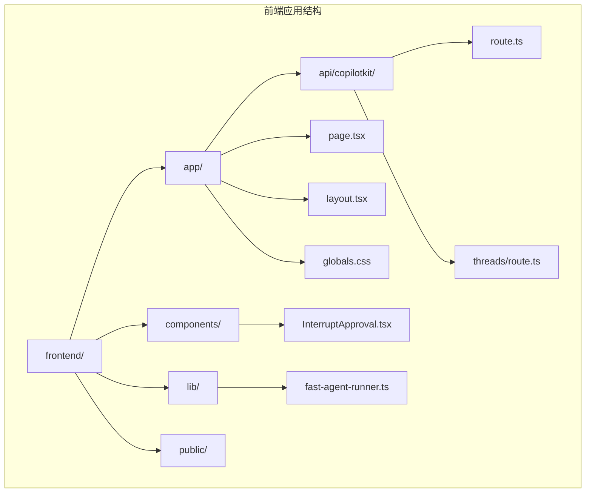
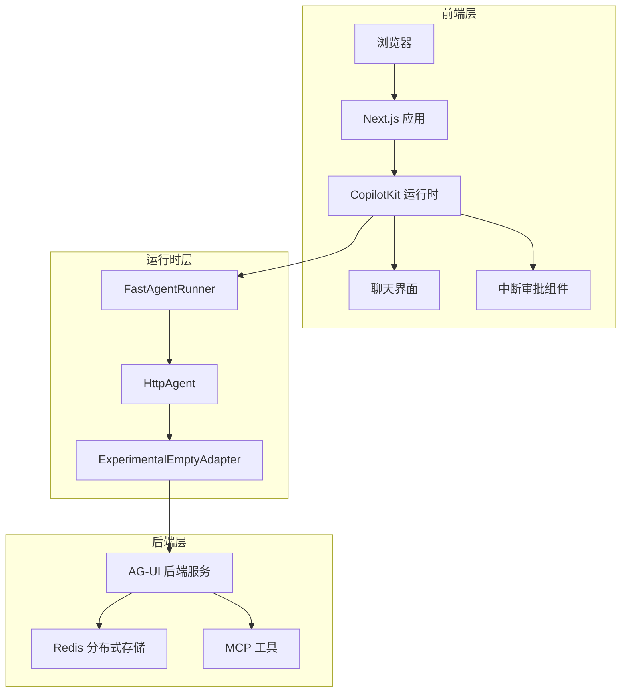
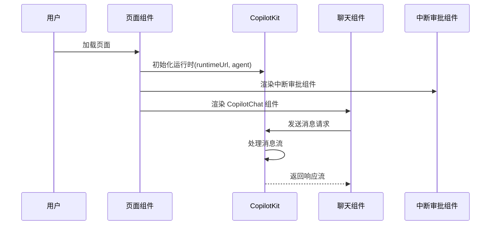
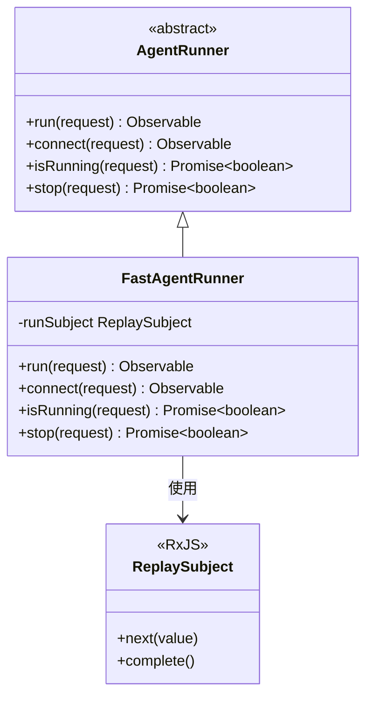
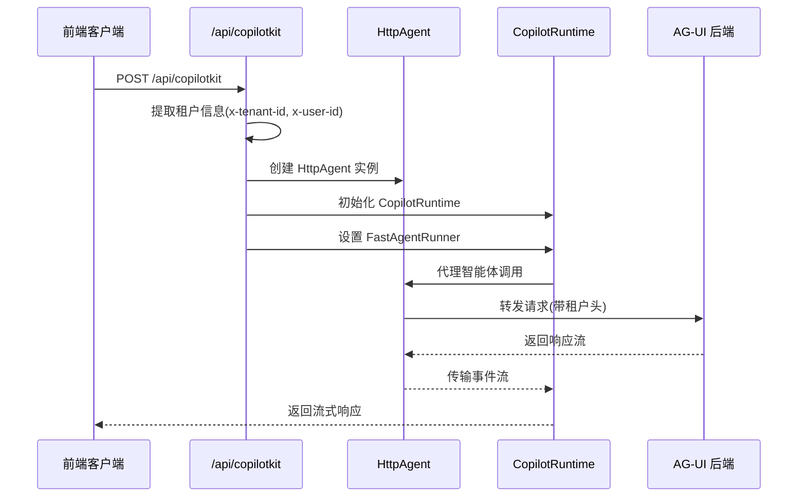
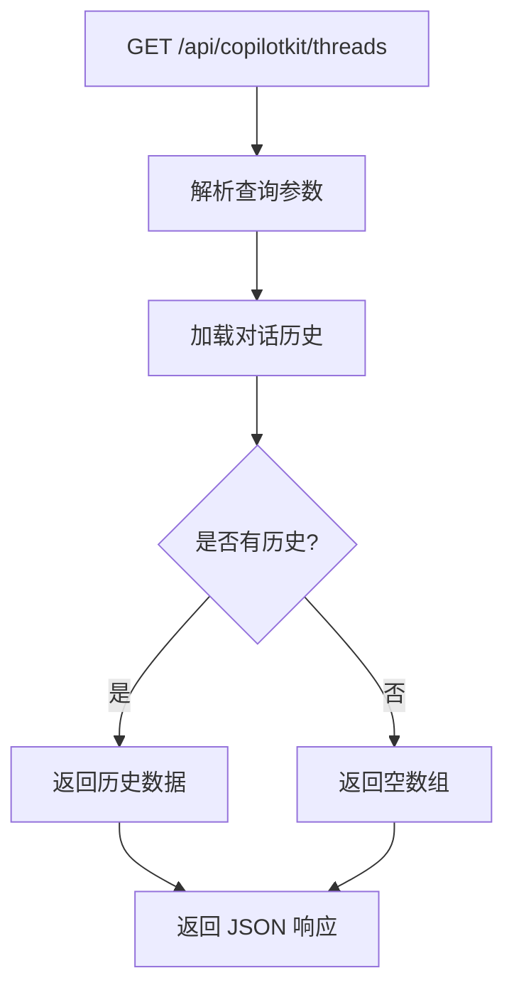
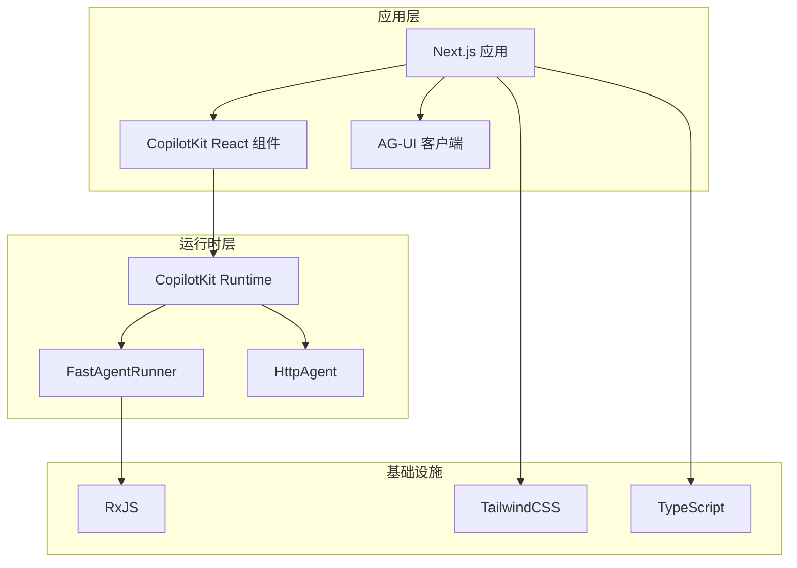

# 前端集成

<cite>
**本文档引用的文件**
- [frontend/package.json](file://frontend/package.json)
- [frontend/README.md](file://frontend/README.md)
- [frontend/app/layout.tsx](file://frontend/app/layout.tsx)
- [frontend/app/page.tsx](file://frontend/app/page.tsx)
- [frontend/lib/fast-agent-runner.ts](file://frontend/lib/fast-agent-runner.ts)
- [frontend/components/InterruptApproval.tsx](file://frontend/components/InterruptApproval.tsx)
- [frontend/app/api/copilotkit/route.ts](file://frontend/app/api/copilotkit/route.ts)
- [frontend/app/api/copilotkit/threads/route.ts](file://frontend/app/api/copilotkit/threads/route.ts)
- [frontend/tsconfig.json](file://frontend/tsconfig.json)
- [frontend/next.config.ts](file://frontend/next.config.ts)
- [frontend/app/globals.css](file://frontend/app/globals.css)
- [frontend/AGENTS.md](file://frontend/AGENTS.md)
- [frontend/CLAUDE.md](file://frontend/CLAUDE.md)
- [src/main/java/com/example/agentic/config/CorsConfig.java](file://src/main/java/com/example/agentic/config/CorsConfig.java)
- [src/main/java/com/example/agentic/tenant/TenantContextHolder.java](file://src/main/java/com/example/agentic/tenant/TenantContextHolder.java)
- [src/main/java/com/example/agentic/config/AgentConfig.java](file://src/main/java/com/example/agentic/config/AgentConfig.java)
- [pom.xml](file://pom.xml)
</cite>

## 目录
1. [简介](#简介)
2. [项目结构](#项目结构)
3. [核心组件](#核心组件)
4. [架构概览](#架构概览)
5. [详细组件分析](#详细组件分析)
6. [依赖关系分析](#依赖关系分析)
7. [性能考虑](#性能考虑)
8. [故障排除指南](#故障排除指南)
9. [结论](#结论)

## 简介

这是一个基于 Next.js 16.2.9 构建的前端应用，集成了 CopilotKit 运行时和 AG-UI 客户端，为通用智能体平台提供聊天界面。该前端应用通过 HTTP 代理的方式与后端智能体服务进行通信，实现了中断审批、流式响应和多租户支持等功能。

## 项目结构

前端项目采用标准的 Next.js 13+ App Router 结构，主要包含以下目录：



**图表来源**
- [frontend/package.json:1-31](file://frontend/package.json#L1-L31)
- [frontend/app/layout.tsx:1-34](file://frontend/app/layout.tsx#L1-L34)
- [frontend/app/page.tsx:1-31](file://frontend/app/page.tsx#L1-L31)

**章节来源**
- [frontend/package.json:1-31](file://frontend/package.json#L1-L31)
- [frontend/README.md:1-37](file://frontend/README.md#L1-L37)

## 核心组件

### 依赖管理

前端项目使用以下关键技术栈：

| 技术 | 版本 | 用途 |
|------|------|------|
| Next.js | 16.2.9 | Web 应用框架 |
| React | 19.2.4 | 用户界面库 |
| @copilotkit/react-core | ^1.60.1 | CopilotKit 核心功能 |
| @copilotkit/react-ui | ^1.60.1 | 聊天界面组件 |
| @copilotkit/runtime | ^1.60.1 | 运行时环境 |
| @ag-ui/client | ^0.0.57 | 后端智能体客户端 |

### TypeScript 配置

项目采用严格的 TypeScript 配置，支持现代 JavaScript 特性和路径别名：

- 目标 ES2017
- 模块系统：ESNext
- 路径映射：@/* -> ./*
- JSX 支持：react-jsx

**章节来源**
- [frontend/package.json:11-29](file://frontend/package.json#L11-L29)
- [frontend/tsconfig.json:2-24](file://frontend/tsconfig.json#L2-L24)

## 架构概览

前端应用采用客户端-服务器架构，通过 CopilotKit 运行时与后端智能体服务进行交互：



**图表来源**
- [frontend/app/page.tsx:8-30](file://frontend/app/page.tsx#L8-L30)
- [frontend/lib/fast-agent-runner.ts:14-71](file://frontend/lib/fast-agent-runner.ts#L14-L71)
- [frontend/app/api/copilotkit/route.ts:17-34](file://frontend/app/api/copilotkit/route.ts#L17-L34)

## 详细组件分析

### 主页面组件

主页面组件负责初始化 CopilotKit 运行时环境和渲染聊天界面：



**图表来源**
- [frontend/app/page.tsx:8-30](file://frontend/app/page.tsx#L8-L30)

**章节来源**
- [frontend/app/page.tsx:8-30](file://frontend/app/page.tsx#L8-L30)

### FastAgentRunner 自定义运行器

FastAgentRunner 是一个优化的 AgentRunner 实现，专门针对 CopilotKit 的性能需求进行了定制：



**图表来源**
- [frontend/lib/fast-agent-runner.ts:14-71](file://frontend/lib/fast-agent-runner.ts#L14-L71)

#### 性能优化特性

FastAgentRunner 主要解决了以下性能问题：

1. **跳过事件压缩**：绕过默认 InMemoryAgentRunner 的 `compactEvents()` 处理
2. **即时完成**：在 agent run 完成后立即 complete，避免明显延迟
3. **内存优化**：由于后端使用 RedisDistributedStore 管理状态，不需要内存中的事件历史

**章节来源**
- [frontend/lib/fast-agent-runner.ts:1-10](file://frontend/lib/fast-agent-runner.ts#L1-L10)

### 中断审批组件

InterruptApproval 组件处理智能体的中断请求，提供用户确认机制：

```mermaid
flowchart TD
Start([收到中断事件]) --> CheckEnabled{检查是否启用}
CheckEnabled --> |是| RenderUI[渲染中断界面]
CheckEnabled --> |否| WaitEvent[等待下一个事件]
RenderUI --> ShowTools[显示工具信息]
ShowTools --> ShowParams[显示参数详情]
ShowParams --> ShowMessage[显示说明信息]
ShowMessage --> UserAction{用户操作}
UserAction --> |批准| Approve[调用 resolve(true)]
UserAction --> |拒绝| Reject[调用 resolve(false)]
Approve --> Complete[完成中断处理]
Reject --> Complete
WaitEvent --> End([结束])
Complete --> End
```

**图表来源**
- [frontend/components/InterruptApproval.tsx:26-87](file://frontend/components/InterruptApproval.tsx#L26-L87)

#### 中断处理流程

组件支持多种中断类型，包括工具调用中断和其他自定义中断：

- **工具调用中断**：需要用户确认工具执行
- **自定义中断**：后端发送的其他中断类型
- **元数据支持**：支持工具名称和参数显示

**章节来源**
- [frontend/components/InterruptApproval.tsx:26-87](file://frontend/components/InterruptApproval.tsx#L26-L87)

### CopilotKit API 路由

API 路由处理前端与后端的通信，实现租户信息传递和代理转发：



**图表来源**
- [frontend/app/api/copilotkit/route.ts:12-34](file://frontend/app/api/copilotkit/route.ts#L12-L34)

**章节来源**
- [frontend/app/api/copilotkit/route.ts:12-34](file://frontend/app/api/copilotkit/route.ts#L12-L34)

### 线程持久化 API

线程持久化 API 提供对话历史管理功能：



**图表来源**
- [frontend/app/api/copilotkit/threads/route.ts:7-9](file://frontend/app/api/copilotkit/threads/route.ts#L7-L9)

**章节来源**
- [frontend/app/api/copilotkit/threads/route.ts:7-9](file://frontend/app/api/copilotkit/threads/route.ts#L7-L9)

## 依赖关系分析

### 前端依赖图



**图表来源**
- [frontend/package.json:11-29](file://frontend/package.json#L11-L29)
- [frontend/lib/fast-agent-runner.ts:11-12](file://frontend/lib/fast-agent-runner.ts#L11-L12)

### 后端集成点

前端与后端的关键集成点包括：

1. **CORS 配置**：允许前端开发服务器跨域访问
2. **租户信息传递**：通过 HTTP 头部传递多租户上下文
3. **SSE 流式响应**：支持实时消息流传输

**章节来源**
- [src/main/java/com/example/agentic/config/CorsConfig.java:15-23](file://src/main/java/com/example/agentic/config/CorsConfig.java#L15-L23)
- [frontend/app/api/copilotkit/route.ts:13-20](file://frontend/app/api/copilotkit/route.ts#L13-L20)

## 性能考虑

### 流式响应优化

前端实现了多项性能优化措施：

1. **即时 UI 解锁**：通过 FastAgentRunner 跳过事件压缩，确保 UI 及时响应
2. **内存效率**：利用后端 Redis 存储，避免前端内存占用
3. **中断处理**：提供用户控制的中断机制，避免不必要的计算

### 缓存策略

- **字体优化**：使用 Next.js 内置字体优化
- **样式缓存**：TailwindCSS 生成的样式可被浏览器缓存
- **组件缓存**：React 组件按需渲染，减少不必要的重新渲染

## 故障排除指南

### 常见问题及解决方案

#### 1. 跨域问题
**症状**：前端无法访问后端 API
**解决方案**：
- 确认后端 CORS 配置允许前端地址
- 检查开发服务器端口 (localhost:3000)

#### 2. 中断审批不显示
**症状**：智能体发出中断但界面无反应
**解决方案**：
- 检查 InterruptApproval 组件是否正确渲染
- 验证后端是否正确发送中断事件

#### 3. 聊天界面无响应
**症状**：消息发送后无响应
**解决方案**：
- 检查 CopilotKit 运行时初始化
- 验证 API 路由配置

**章节来源**
- [src/main/java/com/example/agentic/config/CorsConfig.java:15-23](file://src/main/java/com/example/agentic/config/CorsConfig.java#L15-L23)
- [frontend/components/InterruptApproval.tsx:26-32](file://frontend/components/InterruptApproval.tsx#L26-L32)

## 结论

该前端集成项目成功实现了现代化的智能体聊天界面，具有以下特点：

1. **高性能架构**：通过 FastAgentRunner 优化了响应速度
2. **用户体验友好**：提供直观的聊天界面和中断审批功能
3. **可扩展性**：基于 CopilotKit 和 AG-UI 的模块化设计
4. **多租户支持**：完整的租户信息传递和隔离机制

项目采用的技术栈成熟稳定，架构设计合理，为后续的功能扩展和性能优化奠定了良好基础。