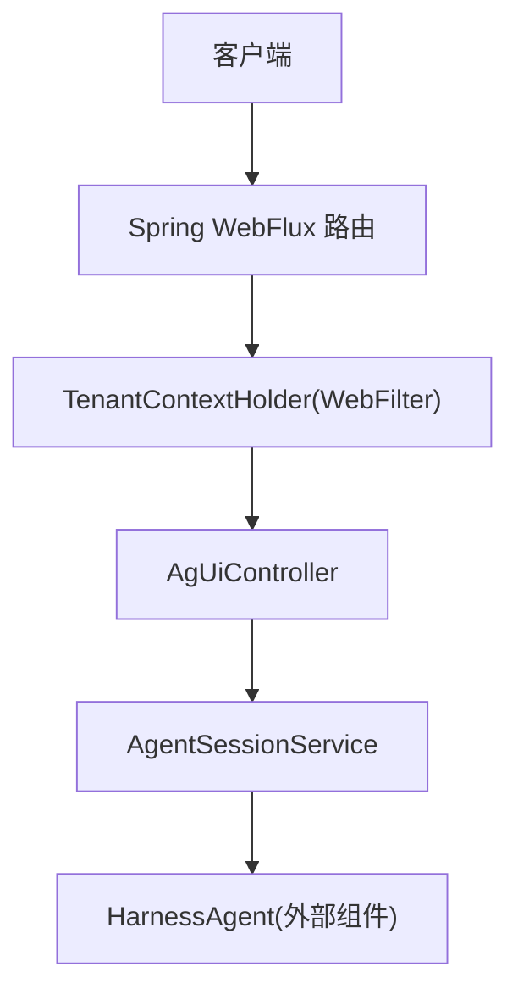
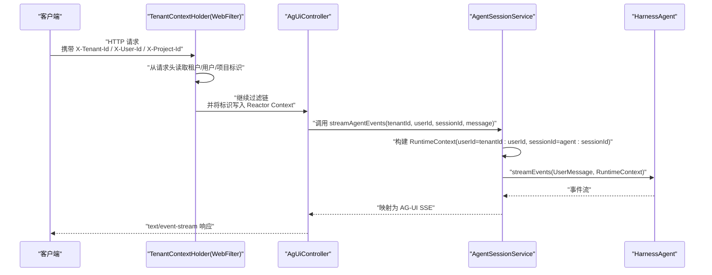
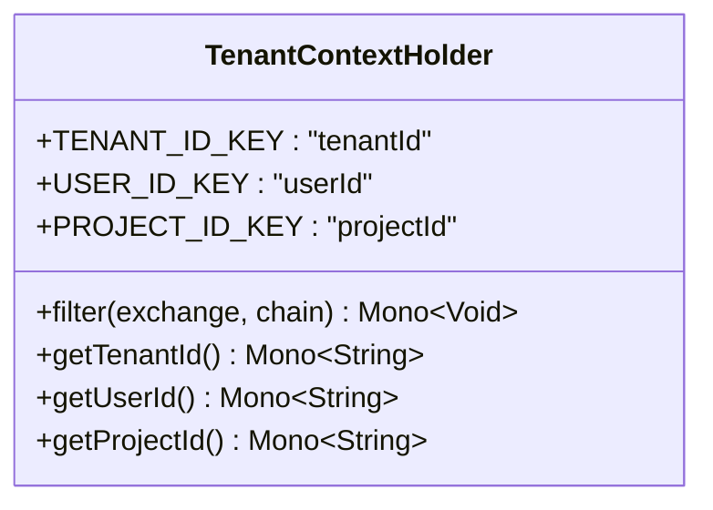
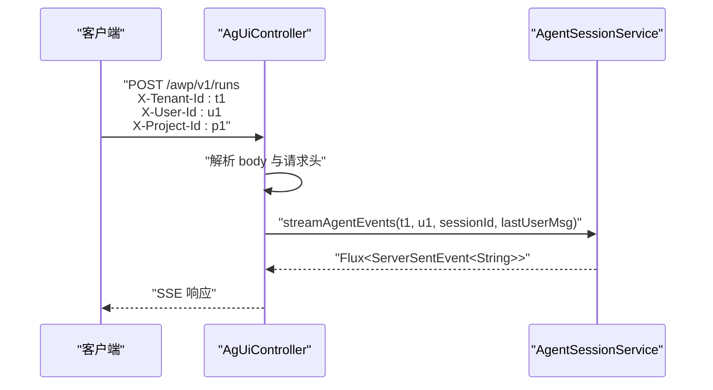
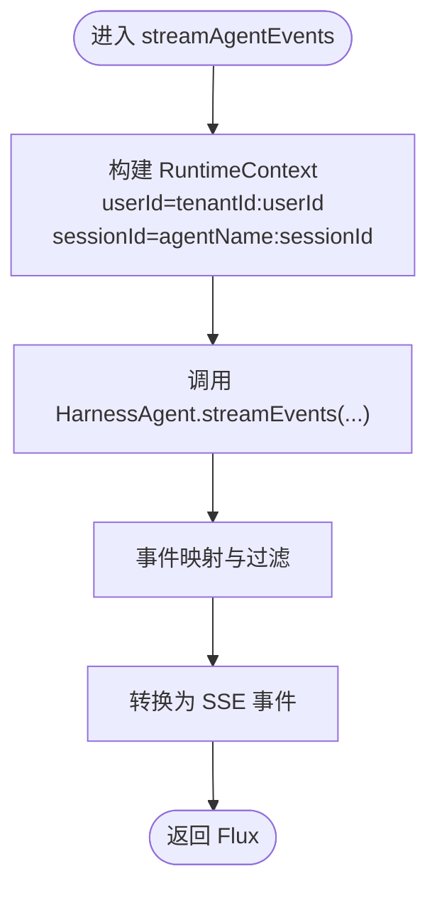
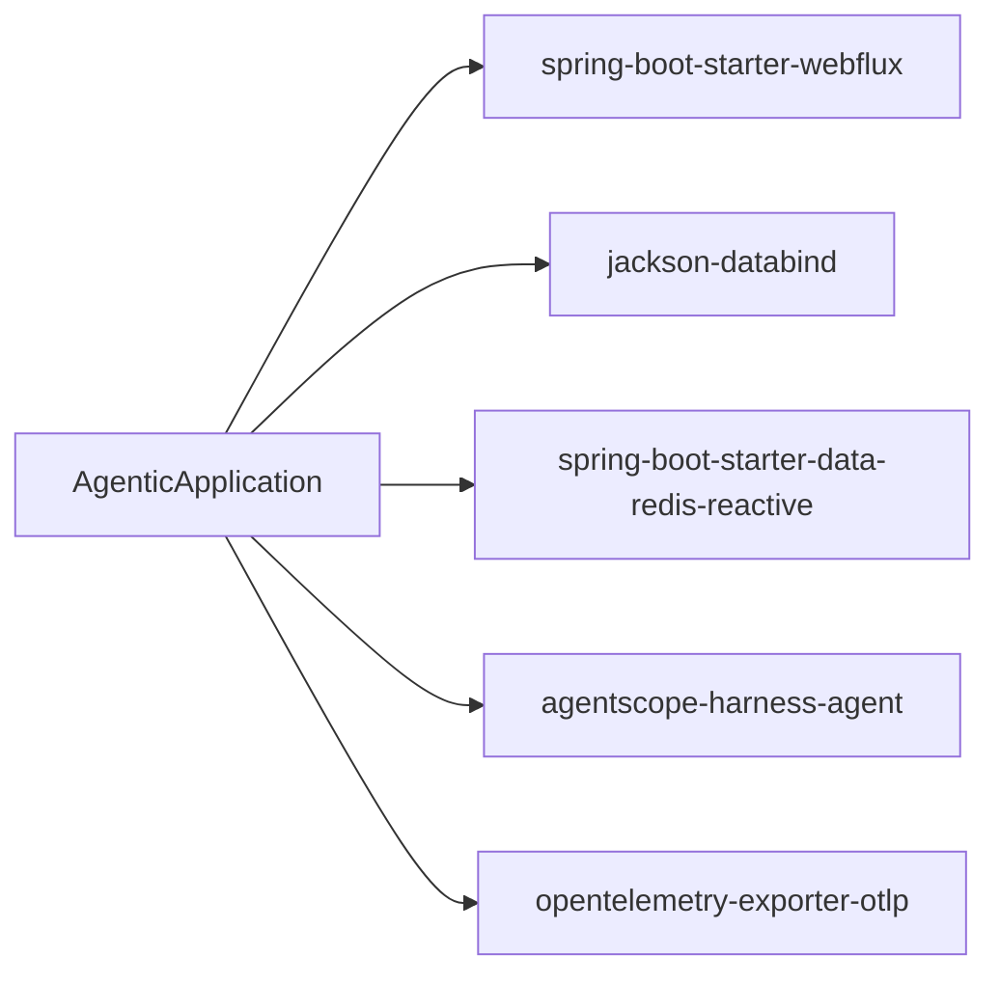

# 多租户支持模块

<cite>
**本文档引用的文件**
- [TenantContextHolder.java](file://src/main/java/com/example/agentic/tenant/TenantContextHolder.java)
- [AgUiController.java](file://src/main/java/com/example/agentic/controller/AgUiController.java)
- [AgentSessionService.java](file://src/main/java/com/example/agentic/agent/AgentSessionService.java)
- [AgenticApplication.java](file://src/main/java/com/example/agentic/AgenticApplication.java)
- [application.yml](file://src/main/resources/application.yml)
</cite>

## 目录
1. [简介](#简介)
2. [项目结构](#项目结构)
3. [核心组件](#核心组件)
4. [架构总览](#架构总览)
5. [详细组件分析](#详细组件分析)
6. [依赖分析](#依赖分析)
7. [性能考虑](#性能考虑)
8. [故障排查指南](#故障排查指南)
9. [结论](#结论)
10. [附录](#附录)

## 简介
本文件围绕多租户支持模块进行系统化说明，重点阐述 TenantContextHolder 的实现机制与集成方式，涵盖租户上下文管理、WebFilter 注入流程、租户标识提取与传递过程；同时给出多租户隔离的设计原理与最佳实践，并提供跨组件传递示例（控制器、服务层、数据访问层思路），以及常见问题与解决方案。

## 项目结构
该模块位于响应式 WebFlux 应用中，采用"请求头提取 + Reactor Context 注入"的轻量级多租户方案。核心文件如下：
- TenantContextHolder：负责从 HTTP 请求头提取租户、用户与项目标识，并注入到 Reactor Context，供后续响应式链路使用
- AgUiController：对外暴露 AG-UI SSE 端点，接收 X-Tenant-Id、X-User-Id 与 X-Project-Id 请求头，驱动会话服务
- AgentSessionService：封装运行时上下文构建与事件流输出，确保多租户隔离
- AgenticApplication：应用入口（用于确认 WebFlux 启动与自动装配）
- application.yml：声明 Redis 连接、代理配置等基础设施

图表来源
- [AgUiController.java:43-56](file://src/main/java/com/example/agentic/controller/AgUiController.java#L43-L56)
- [TenantContextHolder.java:32-52](file://src/main/java/com/example/agentic/tenant/TenantContextHolder.java#L32-L52)
- [AgentSessionService.java:44-66](file://src/main/java/com/example/agentic/agent/AgentSessionService.java#L44-L66)

章节来源
- [AgUiController.java:12-75](file://src/main/java/com/example/agentic/controller/AgUiController.java#L12-L75)
- [TenantContextHolder.java:10-78](file://src/main/java/com/example/agentic/tenant/TenantContextHolder.java#L10-L78)
- [AgentSessionService.java:14-68](file://src/main/java/com/example/agentic/agent/AgentSessionService.java#L14-L68)
- [AgenticApplication.java](file://src/main/java/com/example/agentic/AgenticApplication.java)
- [application.yml:1-37](file://src/main/resources/application.yml#L1-L37)

## 核心组件
- TenantContextHolder（WebFilter）
  - 作用：从请求头提取 X-Tenant-Id、X-User-Id 与 X-Project-Id，注入到 Reactor Context，使下游响应式操作可读取
  - 关键点：使用 deferContextual 读取上下文；默认值分别为 default、anonymous 与 null；支持项目级隔离预留
- AgUiController
  - 作用：接收 AG-UI 规范的 SSE 请求，解析请求体与请求头，调用服务层生成事件流
  - 关键点：显式声明 X-Tenant-Id、X-User-Id 与 X-Project-Id 的默认值，作为兜底
- AgentSessionService
  - 作用：构建 RuntimeContext，拼接 tenantId 与 userId 形成唯一用户标识，隔离不同租户与会话
  - 关键点：明确注释强调"每次调用必须传入 RuntimeContext"，避免串台

章节来源
- [TenantContextHolder.java:10-78](file://src/main/java/com/example/agentic/tenant/TenantContextHolder.java#L10-L78)
- [AgUiController.java:43-56](file://src/main/java/com/example/agentic/controller/AgUiController.java#L43-L56)
- [AgentSessionService.java:14-68](file://src/main/java/com/example/agentic/agent/AgentSessionService.java#L14-L68)

## 架构总览
下图展示一次请求从进入 WebFlux 到最终事件流输出的全链路，突出 TenantContextHolder 在其中的上下文注入角色。

图表来源
- [TenantContextHolder.java:32-52](file://src/main/java/com/example/agentic/tenant/TenantContextHolder.java#L32-L52)
- [AgUiController.java:43-56](file://src/main/java/com/example/agentic/controller/AgUiController.java#L43-L56)
- [AgentSessionService.java:44-66](file://src/main/java/com/example/agentic/agent/AgentSessionService.java#L44-L66)

## 详细组件分析

### TenantContextHolder 组件分析
- 设计要点
  - 通过 WebFilter 在请求进入阶段读取请求头，将租户、用户与项目标识写入 Reactor Context
  - 提供静态方法以响应式方式从上下文中读取标识，带有合理的默认值
  - 支持项目级隔离预留，为后续 Project 级工作区功能做准备
- 数据结构与复杂度
  - 请求头读取为 O(1)，上下文写入为 O(1)，整体为常数级
- 错误处理与边界
  - 当请求头缺失时，使用默认值（default/anonymous/null），避免空指针或异常传播
  - 项目标识为 null 时不会参与隔离，保持向后兼容性
- 性能影响
  - 仅在请求进入时执行一次，对吞吐影响极小

图表来源
- [TenantContextHolder.java:21-78](file://src/main/java/com/example/agentic/tenant/TenantContextHolder.java#L21-L78)

章节来源
- [TenantContextHolder.java:10-78](file://src/main/java/com/example/agentic/tenant/TenantContextHolder.java#L10-L78)

### 控制器集成分析（AgUiController）
- 设计要点
  - 显式声明 X-Tenant-Id、X-User-Id 与 X-Project-Id 请求头，默认值分别为 default、anonymous 与 null
  - 从请求体提取最后一条用户消息，组合参数后调用服务层
- 集成点
  - 与 TenantContextHolder 的协作：即使控制器未直接读取请求头，也可通过后续服务层从 Reactor Context 获取
  - 与 AgentSessionService 的协作：将租户/用户/会话信息传递给运行时上下文

图表来源
- [AgUiController.java:43-56](file://src/main/java/com/example/agentic/controller/AgUiController.java#L43-L56)
- [AgentSessionService.java:44-66](file://src/main/java/com/example/agentic/agent/AgentSessionService.java#L44-L66)

章节来源
- [AgUiController.java:43-56](file://src/main/java/com/example/agentic/controller/AgUiController.java#L43-L56)

### 服务层集成分析（AgentSessionService）
- 设计要点
  - 构建 RuntimeContext，将 tenantId 与 userId 拼接形成唯一用户标识
  - 使用复合 sessionId 隔离多 agent 场景
  - 明确注释强调"每次调用必须传入 RuntimeContext"，防止租户串扰
- 隔离策略
  - 用户维度：tenantId:userId
  - 会话维度：agentName:sessionId
- 与外部组件协作
  - 通过 HarnessAgent.streamEvents 输出事件流，服务层负责映射与过滤

图表来源
- [AgentSessionService.java:44-66](file://src/main/java/com/example/agentic/agent/AgentSessionService.java#L44-L66)

章节来源
- [AgentSessionService.java:14-68](file://src/main/java/com/example/agentic/agent/AgentSessionService.java#L14-L68)

### 数据访问层集成建议
- 隔离策略
  - 业务数据层面：在查询条件中强制加入 tenantId，避免跨租户数据泄露
  - 缓存与会话：以 tenantId 为前缀或分片键，确保缓存隔离
- 会话状态管理
  - 使用 Redis Reactive 或其他响应式存储，按 tenantId:userId 维度组织键空间
  - 结合应用的优雅停机配置，确保在停机期间完成正在处理的租户请求
- 与多租户上下文的衔接
  - 在数据访问层读取 Reactor Context 中的 tenantId/userId，作为查询与写入的上下文参数

章节来源
- [TenantContextHolder.java:57-77](file://src/main/java/com/example/agentic/tenant/TenantContextHolder.java#L57-L77)
- [application.yml:12-26](file://src/main/resources/application.yml#L12-L26)

## 依赖分析
- WebFlux 响应式栈
  - Spring Boot Starter WebFlux：提供响应式 Web 能力与 SSE 支持
  - Jackson：JSON 解析与序列化
- 多租户扩展
  - AgentScope HarnessAgent 2.0.0-RC3：为会话与状态持久化提供 Redis 响应式能力
- 基础设施
  - Redis：用于多租户会话持久化
  - OpenTelemetry：全链路追踪

图表来源
- [application.yml:1-37](file://src/main/resources/application.yml#L1-L37)

章节来源
- [application.yml:1-37](file://src/main/resources/application.yml#L1-L37)

## 性能考虑
- 请求头读取与上下文写入均为常数时间，对延迟影响可忽略
- SSE 流式输出天然适合高并发场景，结合响应式数据库访问可进一步提升吞吐
- 建议在网关层统一校验与清洗请求头，减少下游重复处理
- 对于高频查询，可在数据访问层引入基于 tenantId 的索引与分区策略

## 故障排查指南
- 现象：租户标识为空或为默认值
  - 可能原因：客户端未携带 X-Tenant-Id、X-User-Id 或 X-Project-Id 请求头
  - 处理建议：检查客户端请求头设置；确认 TenantContextHolder 是否生效
- 现象：多租户数据交叉或会话串扰
  - 可能原因：未在 RuntimeContext 中传入租户信息，或 sessionId 构造不唯一
  - 处理建议：严格遵循"每次调用必须传入 RuntimeContext"的原则；确保 userId 与 sessionId 构造包含 tenantId
- 现象：SSE 响应中断或延迟
  - 可能原因：上游阻塞或下游映射异常
  - 处理建议：检查事件映射与过滤逻辑；确认上游事件源稳定
- 现象：项目级隔离未生效
  - 可能原因：X-Project-Id 头部存在但当前不参与隔离逻辑
  - 处理建议：确认项目级隔离功能已启用；检查后续版本的集成情况

章节来源
- [TenantContextHolder.java:57-77](file://src/main/java/com/example/agentic/tenant/TenantContextHolder.java#L57-L77)
- [AgentSessionService.java:19-23](file://src/main/java/com/example/agentic/agent/AgentSessionService.java#L19-L23)

## 结论
本模块通过"请求头提取 + Reactor Context 注入"的轻量设计，实现了多租户上下文在响应式链路中的透明传递。新增的 X-Project-Id 支持为未来的项目级隔离奠定了基础。配合服务层严格的 RuntimeContext 构建与事件流映射，有效保障了租户隔离与会话一致性。建议在数据访问层延续相同理念，以 tenantId 为关键隔离因子，确保数据与状态层面的完整隔离。

## 附录
- 最佳实践清单
  - 客户端：始终携带 X-Tenant-Id、X-User-Id 与 X-Project-Id 请求头
  - 控制器：保留显式请求头参数，便于调试与兼容
  - 服务层：每次调用均传入 RuntimeContext，避免复用导致串台
  - 数据访问层：查询条件强制包含 tenantId；缓存键以 tenantId 前缀化
  - 网关/中间件：统一校验与清洗请求头，确保上下文一致性
- 常见问题速查
  - 问：如何在非 Web 层获取租户标识？
    - 答：使用 TenantContextHolder 提供的静态方法从 Reactor Context 读取
  - 问：是否需要在每个响应式操作中都读取上下文？
    - 答：建议在关键节点（如数据访问、外部调用）显式读取并传入，确保上下文贯穿全程
  - 问：X-Project-Id 头部的作用是什么？
    - 答：当前主要用于预留项目级隔离功能，不直接参与运行时路由；后续版本将启用项目级工作区隔离