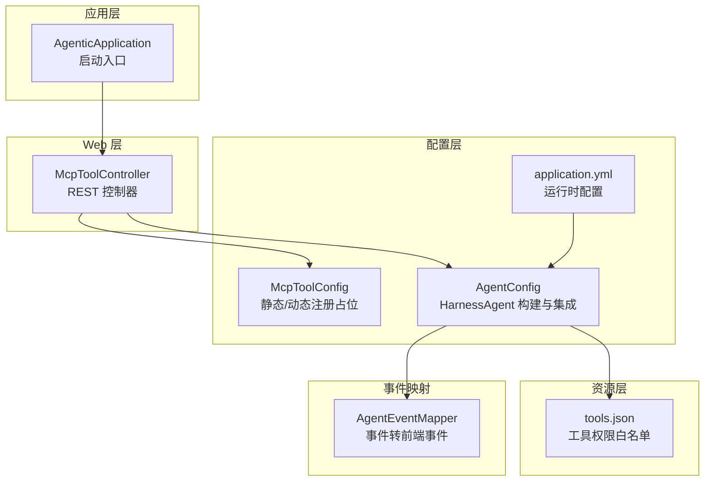
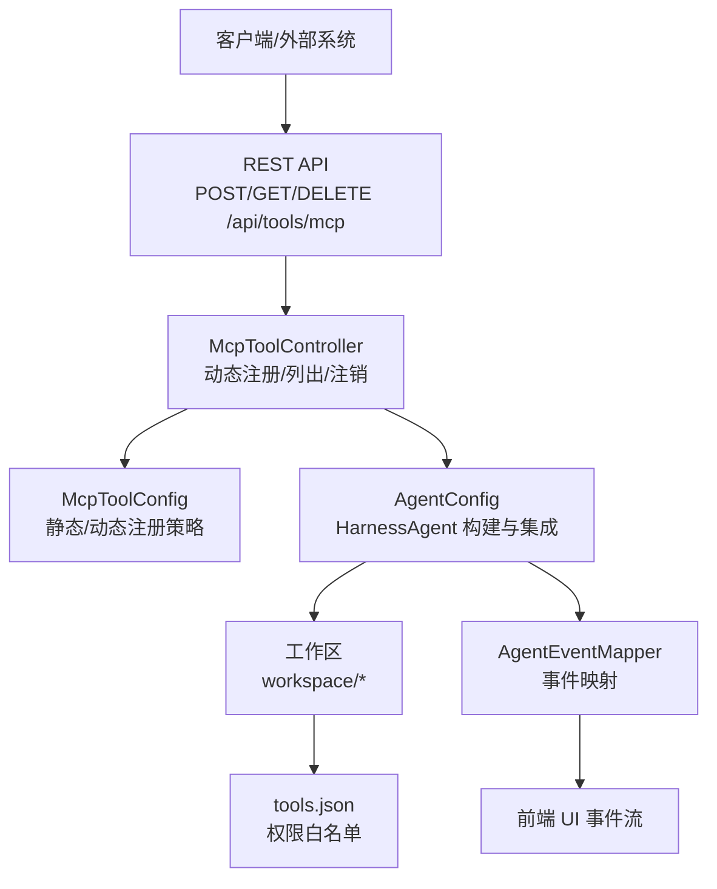
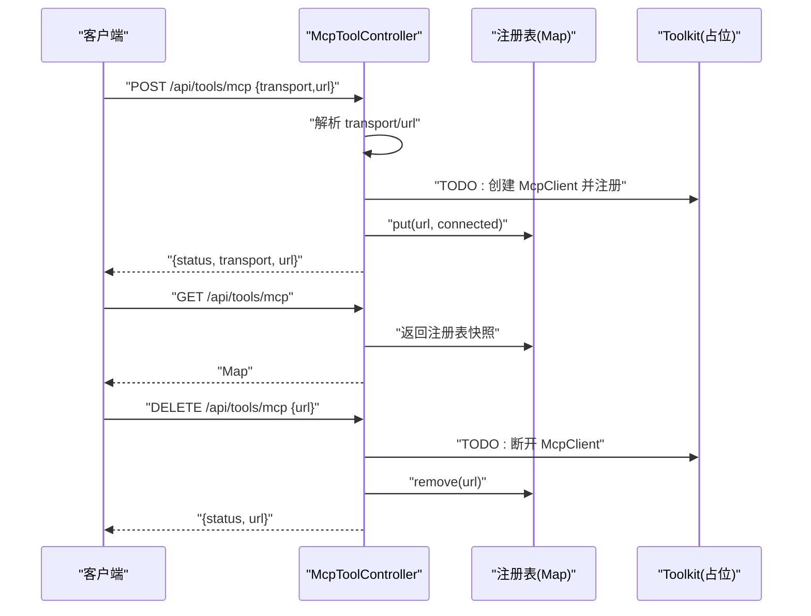
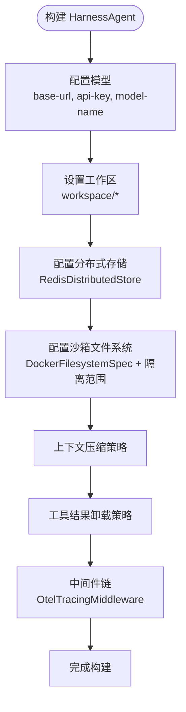
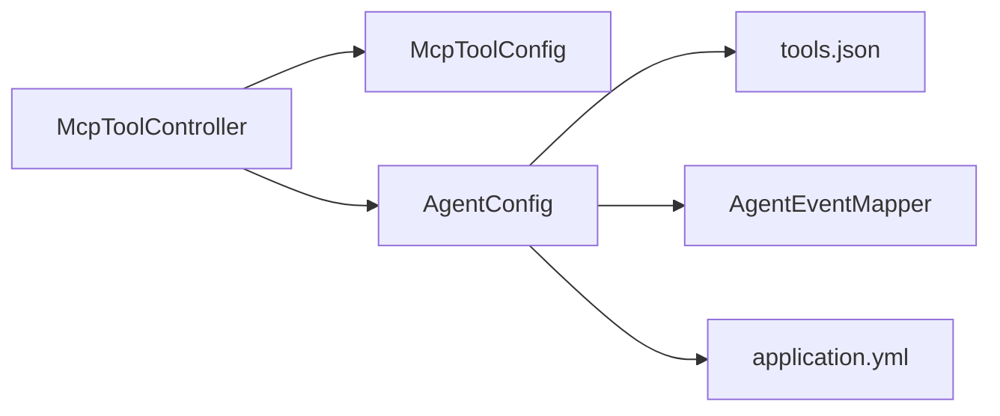

# 工具集成模块

<cite>
**本文引用的文件**
- [McpToolController.java](file://src/main/java/com/example/agentic/controller/McpToolController.java)
- [McpToolConfig.java](file://src/main/java/com/example/agentic/config/McpToolConfig.java)
- [AgentConfig.java](file://src/main/java/com/example/agentic/config/AgentConfig.java)
- [AgentEventMapper.java](file://src/main/java/com/example/agentic/agent/AgentEventMapper.java)
- [tools.json](file://src/main/resources/workspace/tools.json)
- [application.yml](file://src/main/resources/application.yml)
- [AgenticApplication.java](file://src/main/java/com/example/agentic/AgenticApplication.java)
</cite>

## 目录
1. [简介](#简介)
2. [项目结构](#项目结构)
3. [核心组件](#核心组件)
4. [架构总览](#架构总览)
5. [详细组件分析](#详细组件分析)
6. [依赖分析](#依赖分析)
7. [性能考虑](#性能考虑)
8. [故障排除指南](#故障排除指南)
9. [结论](#结论)
10. [附录](#附录)

## 简介
本文件面向“工具集成模块”，聚焦于 MCP（Model Context Protocol）工具的动态注册与集成机制。当前仓库提供了 MCP 工具的 REST 接口控制器、静态/动态注册配置占位、以及与 HarnessAgent 的集成配置。本文将从系统架构、组件职责、数据流与处理逻辑、权限控制策略、开发与集成指南等方面进行系统化说明，并给出可操作的排障建议。

## 项目结构
围绕工具集成的关键目录与文件如下：
- 控制层：McpToolController 提供动态注册/列出/注销 MCP Server 的 REST API
- 配置层：McpToolConfig 定义静态/动态注册策略；AgentConfig 将工具能力与 Agent 运行时集成
- 资源层：tools.json 定义工具权限白名单
- 应用层：AgenticApplication 作为启动入口，排除特定自动配置以适配非 DashScope 的模型后端
- 映射层：AgentEventMapper 将 Agent 事件转换为前端 UI 事件，便于观察工具调用生命周期

图表来源
- [AgenticApplication.java:1-43](file://src/main/java/com/example/agentic/AgenticApplication.java#L1-L43)
- [McpToolController.java:1-69](file://src/main/java/com/example/agentic/controller/McpToolController.java#L1-L69)
- [McpToolConfig.java:1-25](file://src/main/java/com/example/agentic/config/McpToolConfig.java#L1-L25)
- [AgentConfig.java:1-87](file://src/main/java/com/example/agentic/config/AgentConfig.java#L1-L87)
- [AgentEventMapper.java:1-120](file://src/main/java/com/example/agentic/agent/AgentEventMapper.java#L1-L120)
- [application.yml:1-30](file://src/main/resources/application.yml#L1-L30)
- [tools.json:1-12](file://src/main/resources/workspace/tools.json#L1-L12)

章节来源
- [AgenticApplication.java:1-43](file://src/main/java/com/example/agentic/AgenticApplication.java#L1-L43)
- [McpToolController.java:1-69](file://src/main/java/com/example/agentic/controller/McpToolController.java#L1-L69)
- [McpToolConfig.java:1-25](file://src/main/java/com/example/agentic/config/McpToolConfig.java#L1-L25)
- [AgentConfig.java:1-87](file://src/main/java/com/example/agentic/config/AgentConfig.java#L1-L87)
- [AgentEventMapper.java:1-120](file://src/main/java/com/example/agentic/agent/AgentEventMapper.java#L1-L120)
- [application.yml:1-30](file://src/main/resources/application.yml#L1-L30)
- [tools.json:1-12](file://src/main/resources/workspace/tools.json#L1-L12)

## 核心组件
- McpToolController：提供动态注册/列出/注销 MCP Server 的 REST API，当前实现为占位，核心逻辑留待后续接入具体 McpClient 与 Toolkit
- McpToolConfig：声明支持静态与动态两种注册方式，静态注册示例以注释形式提供
- AgentConfig：构建 HarnessAgent，配置工作区、沙箱隔离、上下文压缩、工具结果卸载、分布式存储与中间件（含 OTEL Tracing）
- AgentEventMapper：将 Agent 生命周期事件映射为前端 UI 事件，便于观测工具调用开始/结束与结果
- tools.json：定义允许的工具清单，支持通配符“mcp:*”用于授权 MCP 类型工具
- application.yml：提供运行时配置项，如 Redis 连接、工作区路径、模型基础地址与密钥、OTEL 导出端点等

章节来源
- [McpToolController.java:1-69](file://src/main/java/com/example/agentic/controller/McpToolController.java#L1-L69)
- [McpToolConfig.java:1-25](file://src/main/java/com/example/agentic/config/McpToolConfig.java#L1-L25)
- [AgentConfig.java:1-87](file://src/main/java/com/example/agentic/config/AgentConfig.java#L1-L87)
- [AgentEventMapper.java:1-120](file://src/main/java/com/example/agentic/agent/AgentEventMapper.java#L1-L120)
- [tools.json:1-12](file://src/main/resources/workspace/tools.json#L1-L12)
- [application.yml:1-30](file://src/main/resources/application.yml#L1-L30)

## 架构总览
MCP 工具集成采用“控制器 + 配置 + 资源 + 事件映射”的分层设计。McpToolController 作为入口，接收外部请求并协调注册/注销；AgentConfig 将工具能力注入到 HarnessAgent 运行时；tools.json 提供权限白名单；AgentEventMapper 将工具调用事件转化为前端可观测事件。

图表来源
- [McpToolController.java:1-69](file://src/main/java/com/example/agentic/controller/McpToolController.java#L1-L69)
- [McpToolConfig.java:1-25](file://src/main/java/com/example/agentic/config/McpToolConfig.java#L1-L25)
- [AgentConfig.java:1-87](file://src/main/java/com/example/agentic/config/AgentConfig.java#L1-L87)
- [AgentEventMapper.java:1-120](file://src/main/java/com/example/agentic/agent/AgentEventMapper.java#L1-L120)
- [tools.json:1-12](file://src/main/resources/workspace/tools.json#L1-L12)

## 详细组件分析

### McpToolController 组件分析
- 职责与接口
  - 动态注册：接收 transport 与 url，返回注册状态
  - 列出注册：返回当前已注册的 MCP Server 映射
  - 注销：根据 url 移除注册记录
- 当前实现要点
  - 使用并发 Map 记录 transport URL → 状态
  - 注册/注销为占位实现，核心的 McpClient 创建与 Toolkit 注册逻辑以 TODO 形式预留
- 数据结构与复杂度
  - Map 存储为 O(1) 查找/插入/删除
  - 返回值为轻量 Map，序列化成本低
- 错误处理与边界
  - 请求体缺失字段时将抛出解析异常，需在上层统一处理
  - 注销不存在的 URL 不会产生副作用

图表来源
- [McpToolController.java:24-67](file://src/main/java/com/example/agentic/controller/McpToolController.java#L24-L67)

章节来源
- [McpToolController.java:1-69](file://src/main/java/com/example/agentic/controller/McpToolController.java#L1-L69)

### McpToolConfig 组件分析
- 职责与策略
  - 声明支持静态注册（启动时）与动态注册（运行时）两种方式
  - 静态注册示例以注释形式提供，便于快速启用
- 与控制器的关系
  - 控制器负责运行时动态注册；该配置为静态注册占位
- 扩展建议
  - 可结合环境变量或配置中心实现动态切换注册模式

章节来源
- [McpToolConfig.java:1-25](file://src/main/java/com/example/agentic/config/McpToolConfig.java#L1-L25)

### AgentConfig 组件分析
- 职责与集成点
  - 构建 HarnessAgent，注入模型、工作区、分布式存储、沙箱隔离、上下文压缩、工具结果卸载与 OTEL 中间件
  - 将 tools.json 作为工作区种子文件之一，确保权限白名单生效
- 与工具集成的关系
  - 工具能力最终由运行时的 Toolkit/Agent 能力决定；此处完成基础设施准备
- 关键配置项
  - 模型基础地址、API Key、模型名
  - 沙箱镜像与隔离范围
  - Redis key 前缀与连接信息
  - 上下文压缩与工具结果卸载策略

图表来源
- [AgentConfig.java:47-84](file://src/main/java/com/example/agentic/config/AgentConfig.java#L47-L84)

章节来源
- [AgentConfig.java:1-87](file://src/main/java/com/example/agentic/config/AgentConfig.java#L1-L87)

### AgentEventMapper 组件分析
- 职责与映射关系
  - 将 Agent 生命周期事件映射为前端 UI 事件，覆盖运行开始、文本增量、文本结束、工具调用开始/结束、工具结果、运行结束等
- 与工具集成的关系
  - 工具调用的开始/结束与结果可通过该映射在前端实时呈现
- 边界与注意事项
  - 对部分事件类型使用反射获取字段，若版本不匹配可能导致空值，已在映射中做安全处理

章节来源
- [AgentEventMapper.java:1-120](file://src/main/java/com/example/agentic/agent/AgentEventMapper.java#L1-L120)

### tools.json 权限控制分析
- 结构与字段
  - allow：允许的工具名称列表，支持通配符“mcp:*”
- 作用与影响
  - 作为工作区种子文件被加载至沙箱，影响 Agent 运行时对工具的可见性与调用权限
  - “mcp:*”通配符可用于授权 MCP 类型工具集合
- 最佳实践
  - 严格最小授权原则，避免过度开放通配符
  - 在生产环境通过配置中心或 CI/CD 管理变更

章节来源
- [tools.json:1-12](file://src/main/resources/workspace/tools.json#L1-L12)

### application.yml 运行时配置分析
- 关键配置项
  - Redis 连接与 key 前缀
  - Agent 工作区路径
  - 模型基础地址、API Key、模型名
  - OTEL 导出端点
  - 服务器端口与优雅停机
- 与工具集成的关系
  - Redis 与分布式存储相关配置直接影响 Agent 的状态一致性与并发能力
  - 模型配置决定 Agent 的推理能力，间接影响工具调用策略

章节来源
- [application.yml:1-30](file://src/main/resources/application.yml#L1-L30)

## 依赖分析
- 组件耦合
  - McpToolController 与 McpToolConfig 之间为弱耦合（策略声明与实现分离）
  - AgentConfig 与 tools.json 通过工作区种子文件形成运行时依赖
  - AgentEventMapper 与 AgentConfig 通过事件流与中间件链间接关联
- 外部依赖
  - Spring WebFlux（Reactor）、Jackson（JSON 处理）
  - Redis（分布式存储）
  - OTEL（链路追踪）

图表来源
- [McpToolController.java:1-69](file://src/main/java/com/example/agentic/controller/McpToolController.java#L1-L69)
- [McpToolConfig.java:1-25](file://src/main/java/com/example/agentic/config/McpToolConfig.java#L1-L25)
- [AgentConfig.java:1-87](file://src/main/java/com/example/agentic/config/AgentConfig.java#L1-L87)
- [AgentEventMapper.java:1-120](file://src/main/java/com/example/agentic/agent/AgentEventMapper.java#L1-L120)
- [tools.json:1-12](file://src/main/resources/workspace/tools.json#L1-L12)
- [application.yml:1-30](file://src/main/resources/application.yml#L1-L30)

章节来源
- [McpToolController.java:1-69](file://src/main/java/com/example/agentic/controller/McpToolController.java#L1-L69)
- [McpToolConfig.java:1-25](file://src/main/java/com/example/agentic/config/McpToolConfig.java#L1-L25)
- [AgentConfig.java:1-87](file://src/main/java/com/example/agentic/config/AgentConfig.java#L1-L87)
- [AgentEventMapper.java:1-120](file://src/main/java/com/example/agentic/agent/AgentEventMapper.java#L1-L120)
- [tools.json:1-12](file://src/main/resources/workspace/tools.json#L1-L12)
- [application.yml:1-30](file://src/main/resources/application.yml#L1-L30)

## 性能考虑
- 注册表查询与更新
  - 使用并发 Map，注册/注销均为 O(1)，适合高并发场景
- 事件映射与序列化
  - 事件映射为轻量 JSON 构造，序列化成本较低；建议在上游控制事件频率
- 工具结果卸载
  - 工具结果超过阈值将落盘并返回占位符，降低内存压力，提升长会话稳定性
- 上下文压缩
  - 触发条件与保留条数可按业务负载调整，平衡记忆质量与性能

## 故障排除指南
- 注册失败或无响应
  - 检查请求体是否包含 transport 与 url 字段
  - 确认目标 MCP Server 可达且支持 SSE/HTTP 传输
  - 查看控制器日志，确认占位逻辑是否被替换为真实 McpClient 注册
- 列表为空
  - 确认是否已完成注册，或注册后是否发生异常导致回滚
- 注销无效
  - 确认传入的 url 是否与注册时一致；检查是否存在并发竞态
- 工具不可见或无法调用
  - 检查 tools.json 中是否包含对应工具名或“mcp:*”通配符
  - 确认 Agent 工作区种子文件已正确加载
- 事件流异常
  - 检查 AgentEventMapper 的事件映射是否与 AgentScope 版本兼容
  - 关注 OTEL 导出端点连通性与权限

章节来源
- [McpToolController.java:24-67](file://src/main/java/com/example/agentic/controller/McpToolController.java#L24-L67)
- [AgentConfig.java:70-84](file://src/main/java/com/example/agentic/config/AgentConfig.java#L70-L84)
- [AgentEventMapper.java:39-97](file://src/main/java/com/example/agentic/agent/AgentEventMapper.java#L39-L97)
- [tools.json:1-12](file://src/main/resources/workspace/tools.json#L1-L12)

## 结论
本模块以 McpToolController 为核心入口，结合 McpToolConfig 的注册策略与 AgentConfig 的运行时集成，形成了 MCP 工具的动态注册与权限控制闭环。tools.json 提供细粒度的权限白名单，AgentEventMapper 则保障工具调用过程的可观测性。当前实现以占位为主，后续应完善 McpClient 与 Toolkit 的对接，确保注册/断开连接的完整链路与稳定运行。

## 附录

### MCP 工具开发与集成指南
- 工具接口规范
  - 传输协议：支持 SSE/HTTP 等常见传输
  - 工具元数据：名称、描述、参数 Schema、权限标识
- 消息格式
  - 请求/响应遵循 MCP 协议的消息结构；工具调用结果建议支持分片与占位符
- 权限控制
  - 在 tools.json 中显式列出允许的工具名，必要时使用“mcp:*”授权 MCP 工具集合
- 错误处理
  - 对网络异常、超时、认证失败等情况返回标准错误码与错误信息
  - 在 AgentEventMapper 中映射工具调用失败事件，便于前端展示
- 集成步骤
  - 启动 MCP Server 并验证连通性
  - 通过 REST API 注册 MCP Server（transport/url）
  - 在 Agent 运行时调用工具，观察事件流与结果
  - 如需动态移除，通过 DELETE 接口注销

章节来源
- [McpToolController.java:24-67](file://src/main/java/com/example/agentic/controller/McpToolController.java#L24-L67)
- [McpToolConfig.java:8-12](file://src/main/java/com/example/agentic/config/McpToolConfig.java#L8-L12)
- [AgentConfig.java:70-84](file://src/main/java/com/example/agentic/config/AgentConfig.java#L70-L84)
- [AgentEventMapper.java:39-97](file://src/main/java/com/example/agentic/agent/AgentEventMapper.java#L39-L97)
- [tools.json:1-12](file://src/main/resources/workspace/tools.json#L1-L12)