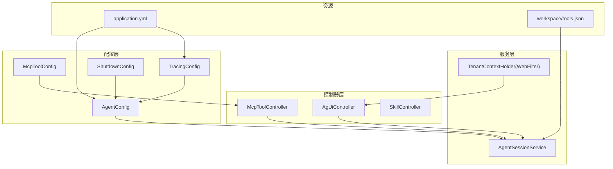
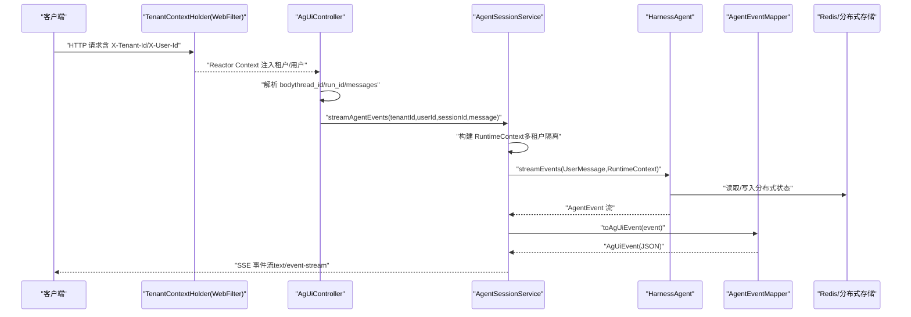
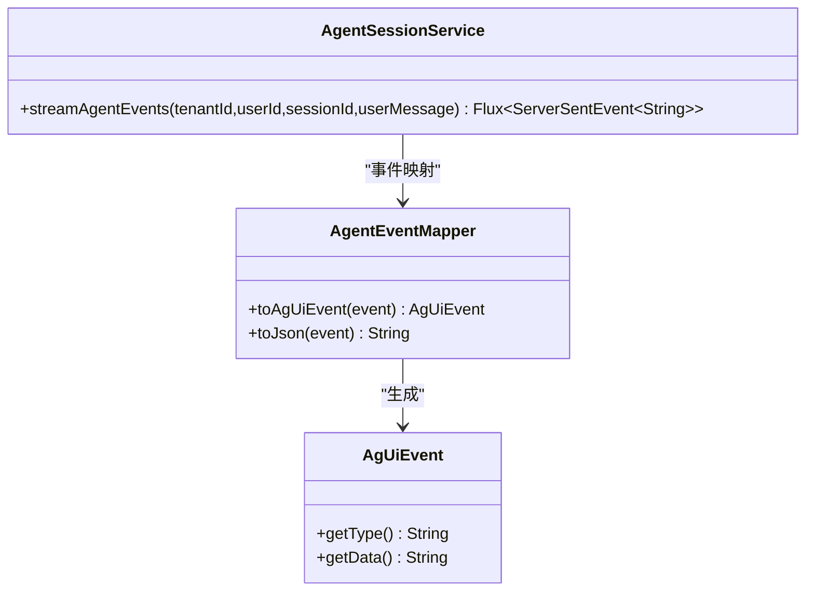
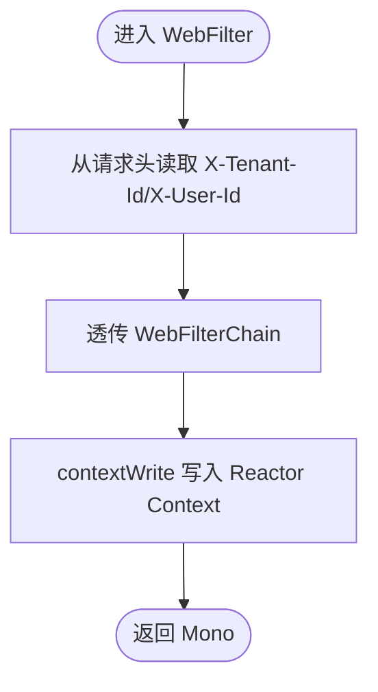
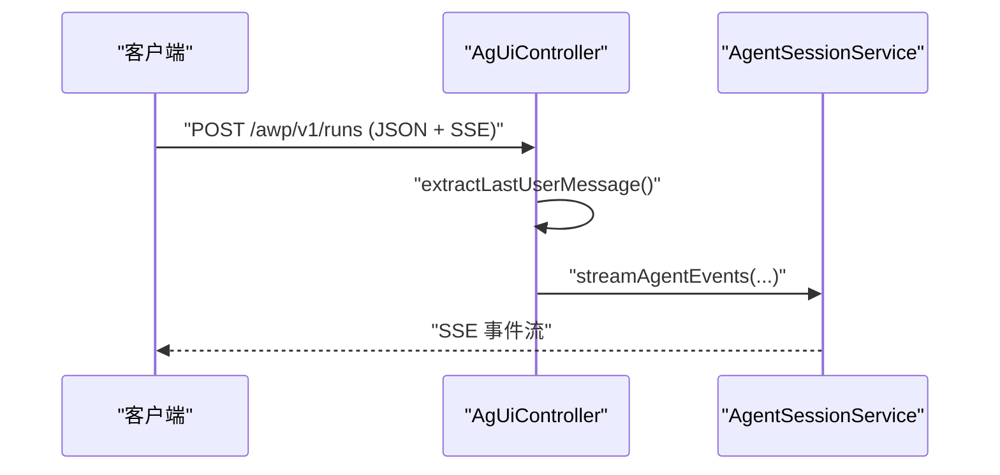
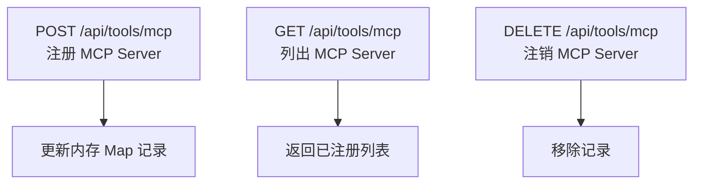
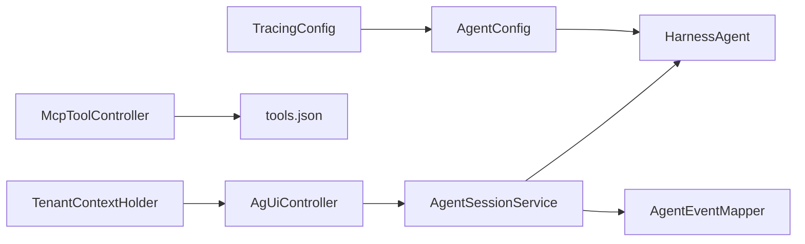

# 核心模块

<cite>
**本文档引用的文件**
- [AgenticApplication.java](file://src/main/java/com/example/agentic/AgenticApplication.java)
- [AgentSessionService.java](file://src/main/java/com/example/agentic/agent/AgentSessionService.java)
- [TenantContextHolder.java](file://src/main/java/com/example/agentic/tenant/TenantContextHolder.java)
- [McpToolController.java](file://src/main/java/com/example/agentic/controller/McpToolController.java)
- [AgentConfig.java](file://src/main/java/com/example/agentic/config/AgentConfig.java)
- [McpToolConfig.java](file://src/main/java/com/example/agentic/config/McpToolConfig.java)
- [AgUiEvent.java](file://src/main/java/com/example/agentic/agent/AgUiEvent.java)
- [AgentEventMapper.java](file://src/main/java/com/example/agentic/agent/AgentEventMapper.java)
- [AgUiController.java](file://src/main/java/com/example/agentic/controller/AgUiController.java)
- [SkillController.java](file://src/main/java/com/example/agentic/controller/SkillController.java)
- [TracingConfig.java](file://src/main/java/com/example/agentic/config/TracingConfig.java)
- [ShutdownConfig.java](file://src/main/java/com/example/agentic/config/ShutdownConfig.java)
- [application.yml](file://src/main/resources/application.yml)
- [tools.json](file://src/main/resources/workspace/tools.json)
</cite>

## 更新摘要
**所做更改**
- 新增完整的智能代理平台核心模块架构分析
- 补充多租户支持、代理管理、技能控制、配置管理等模块的综合实现
- 更新架构总览图和组件交互流程
- 完善故障排查指南和最佳实践建议

## 目录
1. [简介](#简介)
2. [项目结构](#项目结构)
3. [核心组件](#核心组件)
4. [架构总览](#架构总览)
5. [详细组件分析](#详细组件分析)
6. [依赖分析](#依赖分析)
7. [性能考虑](#性能考虑)
8. [故障排查指南](#故障排查指南)
9. [结论](#结论)
10. [附录](#附录)

## 简介
本文件面向"核心模块"的综合技术文档，聚焦以下关键能力：
- 代理管理：基于 HarnessAgent 的代理生命周期与事件流式输出，支持多租户隔离与沙箱执行
- 多租户支持：通过 WebFilter 将租户与用户上下文注入到响应式链路，贯穿请求处理全链路
- 工具集成：MCP 工具的动态注册与查询，结合工具白名单策略，确保安全可控的工具调用
- API 接口：AG-UI 协议端点与技能管理接口，提供标准 SSE 事件流与工作区技能 CRUD

文档以"职责分工、实现原理、相互关系"为主线，并辅以可视化图示与最佳实践建议，帮助读者快速理解并正确使用这些核心模块。

## 项目结构
项目采用按功能域分层的组织方式：
- agent：代理会话与事件映射
- controller：对外 API 控制器（AG-UI、MCP 工具、技能）
- tenant：多租户上下文过滤器
- config：Spring Bean 配置（Agent、MCP、Tracing、Shutdown）

**图表来源**
- [AgUiController.java:22-75](file://src/main/java/com/example/agentic/controller/AgUiController.java#L22-L75)
- [AgentSessionService.java:24-62](file://src/main/java/com/example/agentic/agent/AgentSessionService.java#L24-L62)
- [TenantContextHolder.java:17-58](file://src/main/java/com/example/agentic/tenant/TenantContextHolder.java#L17-L58)
- [AgentConfig.java:29-82](file://src/main/java/com/example/agentic/config/AgentConfig.java#L29-L82)
- [McpToolController.java:17-68](file://src/main/java/com/example/agentic/controller/McpToolController.java#L17-L68)
- [McpToolConfig.java:14-24](file://src/main/java/com/example/agentic/config/McpToolConfig.java#L14-L24)
- [TracingConfig.java:22-44](file://src/main/java/com/example/agentic/config/TracingConfig.java#L22-L44)
- [ShutdownConfig.java:14-20](file://src/main/java/com/example/agentic/config/ShutdownConfig.java#L14-L20)
- [application.yml:1-25](file://src/main/resources/application.yml#L1-L25)
- [tools.json:1-12](file://src/main/resources/workspace/tools.json#L1-L12)

**章节来源**
- [AgUiController.java:22-75](file://src/main/java/com/example/agentic/controller/AgUiController.java#L22-L75)
- [AgentSessionService.java:24-62](file://src/main/java/com/example/agentic/agent/AgentSessionService.java#L24-L62)
- [TenantContextHolder.java:17-58](file://src/main/java/com/example/agentic/tenant/TenantContextHolder.java#L17-L58)
- [AgentConfig.java:29-82](file://src/main/java/com/example/agentic/config/AgentConfig.java#L29-L82)
- [McpToolController.java:17-68](file://src/main/java/com/example/agentic/controller/McpToolController.java#L17-L68)
- [McpToolConfig.java:14-24](file://src/main/java/com/example/agentic/config/McpToolConfig.java#L14-L24)
- [TracingConfig.java:22-44](file://src/main/java/com/example/agentic/config/TracingConfig.java#L22-L44)
- [ShutdownConfig.java:14-20](file://src/main/java/com/example/agentic/config/ShutdownConfig.java#L14-L20)
- [application.yml:1-25](file://src/main/resources/application.yml#L1-L25)
- [tools.json:1-12](file://src/main/resources/workspace/tools.json#L1-L12)

## 核心组件
- AgentSessionService：封装代理事件流，负责将 Agent 事件转换为 AG-UI SSE 事件，实现多租户隔离与会话维度的事件输出
- TenantContextHolder：WebFilter，从 HTTP 头提取租户与用户标识，注入到 Reactor Context，供后续响应式逻辑读取
- McpToolController：提供 MCP 工具的动态注册、查询与注销 REST API，支持运行时热插拔
- AgentConfig：集中配置 HarnessAgent，包括模型、工作区、Redis 分布式存储、Docker 沙箱、内存压缩与大工具结果卸载、OTel 中间件等
- AgUiController：实现 AG-UI 协议的 SSE 端点，接收 AG-UI 输入并委托 AgentSessionService 输出事件流
- SkillController：工作区级技能 CRUD，支撑多层技能合成优先级中的工作区层
- 配置与资源：application.yml 定义运行参数；tools.json 提供工具白名单策略

**章节来源**
- [AgentSessionService.java:24-62](file://src/main/java/com/example/agentic/agent/AgentSessionService.java#L24-L62)
- [TenantContextHolder.java:17-58](file://src/main/java/com/example/agentic/tenant/TenantContextHolder.java#L17-L58)
- [McpToolController.java:17-68](file://src/main/java/com/example/agentic/controller/McpToolController.java#L17-L68)
- [AgentConfig.java:29-82](file://src/main/java/com/example/agentic/config/AgentConfig.java#L29-L82)
- [AgUiController.java:22-75](file://src/main/java/com/example/agentic/controller/AgUiController.java#L22-L75)
- [SkillController.java:28-103](file://src/main/java/com/example/agentic/controller/SkillController.java#L28-L103)
- [application.yml:1-25](file://src/main/resources/application.yml#L1-L25)
- [tools.json:1-12](file://src/main/resources/workspace/tools.json#L1-L12)

## 架构总览
整体架构围绕"控制器—服务—配置—外部系统"展开，关键交互如下：
- 外部客户端通过 AG-UI 协议向 /awp/v1/runs 发起请求，携带 X-Tenant-Id 与 X-User-Id 头
- TenantContextHolder 将租户与用户信息写入 Reactor Context
- AgUiController 从请求体解析 thread_id、run_id 与最后一条用户消息
- AgentSessionService 基于 RuntimeContext 构建多租户隔离的上下文，调用 HarnessAgent 的事件流
- AgentEventMapper 将 Agent 事件映射为 AG-UI 事件，最终以 ServerSentEvent 形式输出
- MCP 工具通过 McpToolController 动态注册，配合 tools.json 的 allow 白名单生效
- AgentConfig 统一装配模型、工作区、分布式存储、沙箱与中间件，保障跨会话一致性与可观测性

**图表来源**
- [AgUiController.java:43-56](file://src/main/java/com/example/agentic/controller/AgUiController.java#L43-L56)
- [AgentSessionService.java:43-61](file://src/main/java/com/example/agentic/agent/AgentSessionService.java#L43-L61)
- [AgentEventMapper.java:45-97](file://src/main/java/com/example/agentic/agent/AgentEventMapper.java#L45-L97)
- [AgentConfig.java:44-82](file://src/main/java/com/example/agentic/config/AgentConfig.java#L44-L82)
- [TenantContextHolder.java:25-41](file://src/main/java/com/example/agentic/tenant/TenantContextHolder.java#L25-L41)

## 详细组件分析

### 代理会话与事件映射（AgentSessionService 与 AgentEventMapper）
- 职责分工
  - AgentSessionService：负责根据租户与用户标识构建 RuntimeContext，调用 HarnessAgent 的事件流，并将事件映射为 AG-UI SSE 事件
  - AgentEventMapper：将 AgentScope 的具体事件类型映射为 AG-UI 事件类型，仅暴露必要的事件给前端
- 实现要点
  - 多租户隔离：通过 userId=tenantId:userId 与 sessionId=agentName:sessionId，确保不同租户与会话互不干扰
  - 事件映射表：明确 AgentScope 事件与 AG-UI 事件的对应关系，其余内部事件被过滤
  - SSE 输出：将映射后的事件包装为 ServerSentEvent，事件名与数据分别来自事件类型与 JSON 数据
- 性能与可靠性
  - 使用响应式流式输出，避免阻塞；事件过滤减少前端负担
  - 通过分布式存储与内存压缩降低长对话的内存压力

**图表来源**
- [AgentSessionService.java:24-62](file://src/main/java/com/example/agentic/agent/AgentSessionService.java#L24-L62)
- [AgentEventMapper.java:30-120](file://src/main/java/com/example/agentic/agent/AgentEventMapper.java#L30-L120)
- [AgUiEvent.java:6-24](file://src/main/java/com/example/agentic/agent/AgUiEvent.java#L6-L24)

**章节来源**
- [AgentSessionService.java:13-62](file://src/main/java/com/example/agentic/agent/AgentSessionService.java#L13-L62)
- [AgentEventMapper.java:15-120](file://src/main/java/com/example/agentic/agent/AgentEventMapper.java#L15-L120)
- [AgUiEvent.java:3-24](file://src/main/java/com/example/agentic/agent/AgUiEvent.java#L3-L24)

### 多租户上下文管理（TenantContextHolder）
- 职责分工
  - 作为 WebFilter，从 HTTP 请求头提取 X-Tenant-Id 与 X-User-Id，并注入到 Reactor Context
  - 提供静态方法从上下文中读取租户与用户标识，便于后续组件使用
- 实现要点
  - 在 filter 方法中，先透传链路，再 contextWrite 写入上下文，确保下游可读
  - 默认值：tenantId 默认 "default"，userId 默认 "anonymous"，避免空值传播
- 最佳实践
  - 所有需要区分租户/用户的响应式逻辑应在 filter 之后执行
  - 若业务需要更严格的校验，可在后续控制器或服务中显式检查上下文

**图表来源**
- [TenantContextHolder.java:25-41](file://src/main/java/com/example/agentic/tenant/TenantContextHolder.java#L25-L41)

**章节来源**
- [TenantContextHolder.java:10-58](file://src/main/java/com/example/agentic/tenant/TenantContextHolder.java#L10-L58)

### AG-UI 协议端点（AgUiController）
- 职责分工
  - 实现 AG-UI 标准运行端点 /awp/v1/runs，接收 AG-UI 输入并输出 SSE 事件流
  - 从请求体提取 thread_id、run_id 与最后一条用户消息，委托 AgentSessionService 处理
- 实现要点
  - 支持标准 AG-UI 输入格式，自动从 messages 数组中提取最后一条用户消息
  - 通过 X-Tenant-Id 与 X-User-Id 构建多租户上下文
  - 返回类型为 text/event-stream，符合 SSE 规范
- 最佳实践
  - 建议前端在 UI 层维护 thread_id 与 run_id，以便 AG-UI 侧进行会话与运行追踪
  - 对异常输入（如缺少 messages）应返回空消息而非报错，保持兼容性

**图表来源**
- [AgUiController.java:43-56](file://src/main/java/com/example/agentic/controller/AgUiController.java#L43-L56)
- [AgentSessionService.java:43-61](file://src/main/java/com/example/agentic/agent/AgentSessionService.java#L43-L61)

**章节来源**
- [AgUiController.java:12-75](file://src/main/java/com/example/agentic/controller/AgUiController.java#L12-L75)

### MCP 工具动态注册（McpToolController 与 McpToolConfig）
- 职责分工
  - McpToolController：提供动态注册、查询与注销 MCP Server 的 REST API
  - McpToolConfig：预留静态注册与动态注册的配置入口说明
- 实现要点
  - 注册接口：接收 transport 与 url，当前示例中仅记录状态，后续可接入真实 McpClient 并注册到 Toolkit
  - 查询接口：返回已注册的 MCP Server 列表
  - 注销接口：移除记录并预留断开连接的扩展点
- 安全与策略
  - 结合 tools.json 的 allow 白名单，确保只有允许的工具（含 mcp:*）可被调用
  - 建议在生产环境对 transport 与 url 做白名单校验与鉴权控制

**图表来源**
- [McpToolController.java:24-67](file://src/main/java/com/example/agentic/controller/McpToolController.java#L24-L67)
- [McpToolConfig.java:5-24](file://src/main/java/com/example/agentic/config/McpToolConfig.java#L5-L24)
- [tools.json:1-12](file://src/main/resources/workspace/tools.json#L1-L12)

**章节来源**
- [McpToolController.java:11-68](file://src/main/java/com/example/agentic/controller/McpToolController.java#L11-L68)
- [McpToolConfig.java:5-24](file://src/main/java/com/example/agentic/config/McpToolConfig.java#L5-L24)
- [tools.json:1-12](file://src/main/resources/workspace/tools.json#L1-L12)

### 技能管理（SkillController）
- 职责分工
  - 管理工作区级别的技能文件，提供 CRUD 操作
  - 与多层技能合成优先级协作，形成从项目全局到用户隔离的技能覆盖
- 实现要点
  - 技能目录位于 agent.workspace/skills，启动时自动创建
  - 支持列出、创建、更新、删除技能文件
- 最佳实践
  - 建议统一使用 Markdown 格式，便于渲染与版本管理
  - 对外暴露的 API 应结合鉴权与配额限制，防止滥用

**章节来源**
- [SkillController.java:17-103](file://src/main/java/com/example/agentic/controller/SkillController.java#L17-L103)

### Agent 配置（AgentConfig）
- 职责分工
  - 统一装配 HarnessAgent，涵盖模型、工作区、分布式存储、沙箱、内存压缩、大工具结果卸载与中间件
- 实现要点
  - Redis 分布式存储：一键注入 stateStore/baseStore/snapshotSpec/executionGuard，实现无状态 Agent
  - Docker 沙箱：按会话隔离，限定工作区投射根目录，确保安全与可审计
  - 内存压缩：定期压缩历史消息，降低长对话内存占用
  - 大工具结果卸载：超过阈值的结果落盘并以占位符替代，提升稳定性
  - 中间件：集成 OTel Tracing，便于端到端观测
- 最佳实践
  - 生产环境建议使用绝对路径的工作区，避免相对路径带来的部署不确定性
  - 沙箱镜像与隔离范围需与安全策略一致，避免越权访问

**章节来源**
- [AgentConfig.java:21-82](file://src/main/java/com/example/agentic/config/AgentConfig.java#L21-L82)

### 配置与资源
- application.yml
  - 定义 Redis 连接、Agent 工作区、模型参数、沙箱镜像、隔离范围、OTEL 导出端点与服务器端口
- tools.json
  - 工具白名单，含基础工具与 MCP 通配符，确保工具调用受控

**章节来源**
- [application.yml:1-25](file://src/main/resources/application.yml#L1-L25)
- [tools.json:1-12](file://src/main/resources/workspace/tools.json#L1-L12)

## 依赖分析
- 组件耦合
  - AgUiController 依赖 AgentSessionService；AgentSessionService 依赖 HarnessAgent 与 AgentEventMapper
  - TenantContextHolder 作为 WebFilter，对上游控制器透明，但对后续响应式链路可见
  - McpToolController 与工具白名单协同，工具实际注册逻辑预留于配置类
  - AgentConfig 为全局 Bean，被 AgentSessionService 间接依赖
- 外部依赖
  - Spring Boot WebFlux（SSE）、Redis/Jedis、OpenTelemetry SDK、AgentScope HarnessAgent 与扩展

**图表来源**
- [AgUiController.java:26-30](file://src/main/java/com/example/agentic/controller/AgUiController.java#L26-L30)
- [AgentSessionService.java:26-32](file://src/main/java/com/example/agentic/agent/AgentSessionService.java#L26-L32)
- [AgentConfig.java:44-82](file://src/main/java/com/example/agentic/config/AgentConfig.java#L44-L82)
- [McpToolController.java:17-68](file://src/main/java/com/example/agentic/controller/McpToolController.java#L17-L68)
- [tools.json:1-12](file://src/main/resources/workspace/tools.json#L1-L12)
- [TracingConfig.java:25-43](file://src/main/java/com/example/agentic/config/TracingConfig.java#L25-L43)

**章节来源**
- [pom.xml:57-118](file://pom.xml#L57-L118)

## 性能考虑
- 响应式流式输出：SSE 事件逐条推送，避免一次性大块数据传输，降低内存峰值
- 内存压缩与大结果卸载：通过压缩与落盘策略，显著降低长对话与复杂工具调用的内存占用
- 分布式存储：Redis 存储状态与快照，支持水平扩展与会话恢复
- 沙箱隔离：按会话隔离，避免跨会话污染，同时限制工作区投射根目录，减少不必要的文件访问
- 中间件开销：OTel 中间件带来可观测性收益，但需关注导出端点延迟与带宽

## 故障排查指南
- SSE 无事件输出
  - 检查 AgUiController 是否正确解析 thread_id/run_id 与最后一条用户消息
  - 确认 TenantContextHolder 是否成功注入租户/用户上下文
  - 核对 AgentSessionService 的 RuntimeContext 构建是否正确
- 事件类型缺失
  - 检查 AgentEventMapper 的映射表，确认事件类型是否被过滤
- MCP 工具未生效
  - 确认 tools.json 的 allow 白名单包含相应工具或 mcp:*
  - 检查 McpToolController 的注册状态与后续接入逻辑
- 沙箱权限问题
  - 确认 DockerFilesystemSpec 的隔离范围与工作区投射根目录设置
- Redis 连接失败
  - 检查 application.yml 中的 REDIS_URI 与数据库索引
- OTEL 导出异常
  - 检查 LANGFUSE_OTEL_ENDPOINT 与网络连通性

**章节来源**
- [AgUiController.java:43-73](file://src/main/java/com/example/agentic/controller/AgUiController.java#L43-L73)
- [AgentSessionService.java:43-61](file://src/main/java/com/example/agentic/agent/AgentSessionService.java#L43-L61)
- [AgentEventMapper.java:45-97](file://src/main/java/com/example/agentic/agent/AgentEventMapper.java#L45-L97)
- [McpToolController.java:24-67](file://src/main/java/com/example/agentic/controller/McpToolController.java#L24-L67)
- [tools.json:1-12](file://src/main/resources/workspace/tools.json#L1-L12)
- [application.yml:1-25](file://src/main/resources/application.yml#L1-L25)
- [TracingConfig.java:25-43](file://src/main/java/com/example/agentic/config/TracingConfig.java#L25-L43)

## 结论
本核心模块以"响应式事件流 + 多租户隔离 + 工具白名单 + 分布式存储"为基础，提供了稳定、可观测且可扩展的智能体平台能力。通过清晰的职责划分与配置化装配，既满足开发期的灵活性，又兼顾生产环境的安全与性能要求。建议在生产落地时，结合企业安全策略完善 MCP 注册鉴权、工具白名单校验与沙箱权限收敛，并持续优化内存压缩与大结果卸载策略以适配业务负载。

## 附录
- 最佳实践清单
  - 明确 X-Tenant-Id 与 X-User-Id 的来源与命名规范，确保多租户隔离有效
  - 在工具注册环节增加鉴权与白名单校验，避免任意 MCP Server 被接入
  - 对长对话场景启用内存压缩与大结果卸载，监控内存与磁盘使用
  - 使用绝对路径配置 agent.workspace，避免部署差异导致的问题
  - 结合 OTel 导出端点与日志策略，建立端到端可观测性
- 参考配置
  - application.yml：Redis、模型、沙箱、OTEL 端点与端口
  - tools.json：工具白名单，含 mcp:* 通配符