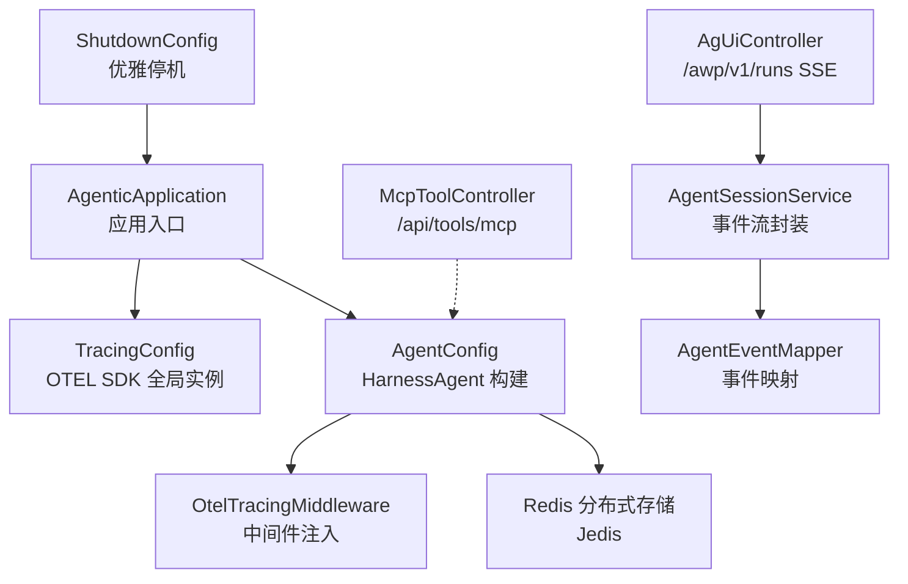
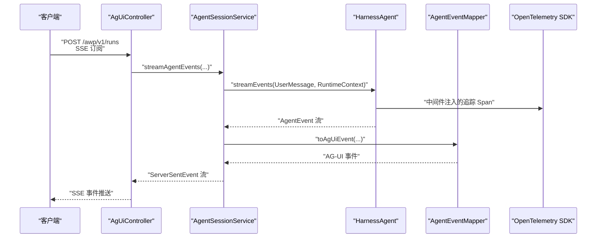
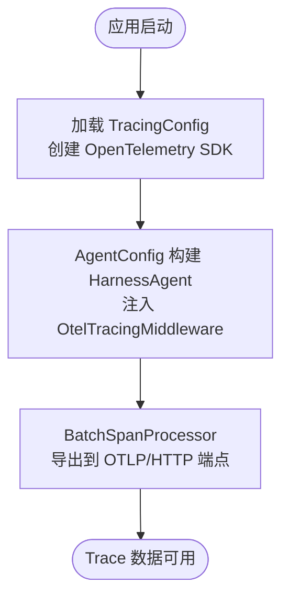
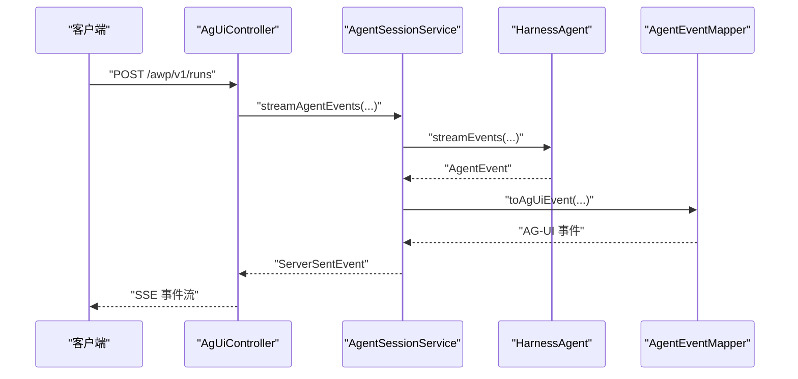
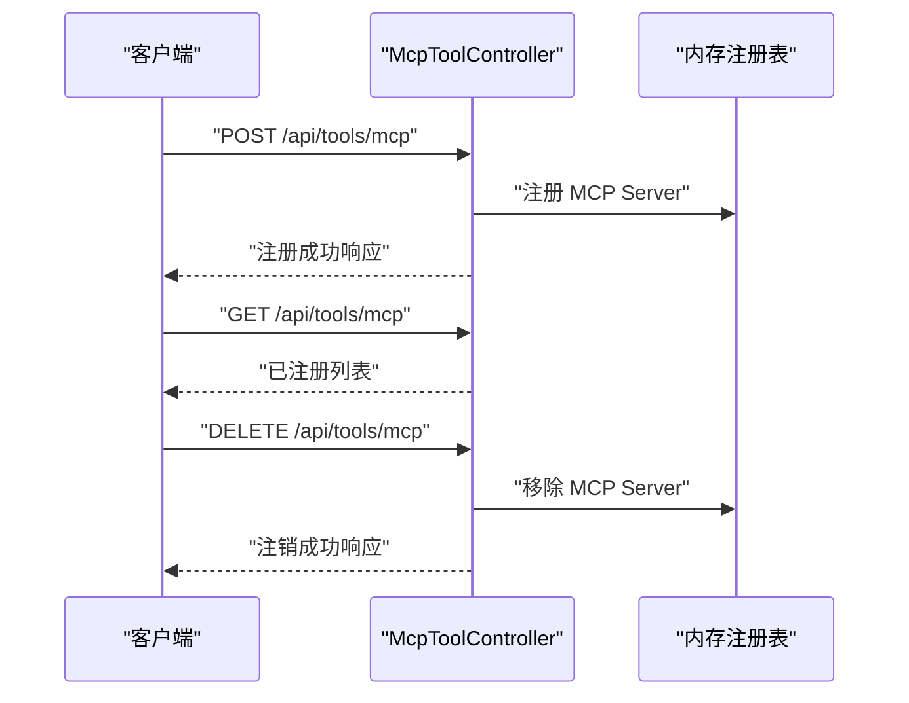
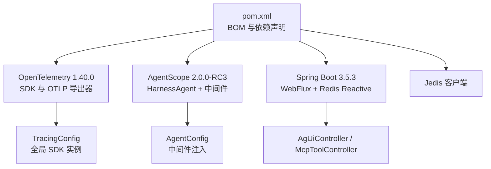

# 监控与追踪

<cite>
**本文引用的文件**
- [AgenticApplication.java](file://src/main/java/com/example/agentic/AgenticApplication.java)
- [application.yml](file://src/main/resources/application.yml)
- [pom.xml](file://pom.xml)
- [TracingConfig.java](file://src/main/java/com/example/agentic/config/TracingConfig.java)
- [AgentConfig.java](file://src/main/java/com/example/agentic/config/AgentConfig.java)
- [ShutdownConfig.java](file://src/main/java/com/example/agentic/config/ShutdownConfig.java)
- [AgUiController.java](file://src/main/java/com/example/agentic/controller/AgUiController.java)
- [AgentSessionService.java](file://src/main/java/com/example/agentic/agent/AgentSessionService.java)
- [AgentEventMapper.java](file://src/main/java/com/example/agentic/agent/AgentEventMapper.java)
- [McpToolController.java](file://src/main/java/com/example/agentic/controller/McpToolController.java)
- [AgUiEvent.java](file://src/main/java/com/example/agentic/agent/AgUiEvent.java)
</cite>

## 更新摘要
**变更内容**
- 新增 OTLP/HTTP 导出器配置，替代原有的 gRPC 导出器
- 完善分布式追踪配置，实现从应用启动到 AgentScope 中间件的完整链路
- 增强追踪后端支持，包括通用 OTLP HTTP collector 和 Langfuse
- 优化配置管理，通过 application.yml 统一管理 OTLP 端点设置

## 目录
1. [简介](#简介)
2. [项目结构](#项目结构)
3. [核心组件](#核心组件)
4. [架构总览](#架构总览)
5. [详细组件分析](#详细组件分析)
6. [依赖分析](#依赖分析)
7. [性能考虑](#性能考虑)
8. [故障排查指南](#故障排查指南)
9. [结论](#结论)
10. [附录](#附录)

## 简介
本文件面向"监控与追踪系统"的落地实现，聚焦于 OpenTelemetry 1.40.0 的集成与分布式追踪配置，覆盖以下主题：
- 追踪链路建立与 Span 数据采集
- 性能监控指标与日志管理
- 健康检查机制
- 监控仪表板配置、告警规则与故障诊断
- 生产环境最佳实践与性能优化建议

当前代码库已实现：
- 基于 Spring Boot 的应用启动入口
- OpenTelemetry SDK 的全局实例化与 OTLP/HTTP 导出器配置
- AgentScope HarnessAgent 的中间件级追踪接入
- AG-UI 协议的 SSE 流式输出与事件映射
- MCP 工具动态注册接口
- 优雅停机配置

## 项目结构
项目采用 Spring Boot 与 AgentScope HarnessAgent 的组合，核心模块如下：
- 应用入口与配置：AgenticApplication、application.yml、pom.xml
- 追踪配置：TracingConfig（OTEL SDK + BatchSpanProcessor + OTLP/HTTP 导出器）
- Agent 配置：AgentConfig（HarnessAgent 构建、Redis 分布式存储、OtelTracingMiddleware）
- 控制层：AgUiController（SSE 端点）、McpToolController（动态注册）
- 服务层：AgentSessionService（事件流封装）、AgentEventMapper（事件映射）
- 优雅停机：ShutdownConfig

**图表来源**
- [AgenticApplication.java:16-22](file://src/main/java/com/example/agentic/AgenticApplication.java#L16-L22)
- [TracingConfig.java:25-43](file://src/main/java/com/example/agentic/config/TracingConfig.java#L25-L43)
- [AgentConfig.java:44-82](file://src/main/java/com/example/agentic/config/AgentConfig.java#L44-L82)
- [AgUiController.java:22-30](file://src/main/java/com/example/agentic/controller/AgUiController.java#L22-L30)
- [AgentSessionService.java:23-62](file://src/main/java/com/example/agentic/agent/AgentSessionService.java#L23-L62)
- [AgentEventMapper.java:39-67](file://src/main/java/com/example/agentic/agent/AgentEventMapper.java#L39-L67)
- [McpToolController.java:17-68](file://src/main/java/com/example/agentic/controller/McpToolController.java#L17-L68)
- [ShutdownConfig.java:14-20](file://src/main/java/com/example/agentic/config/ShutdownConfig.java#L14-L20)

**章节来源**
- [AgenticApplication.java:16-22](file://src/main/java/com/example/agentic/AgenticApplication.java#L16-L22)
- [application.yml:1-30](file://src/main/resources/application.yml#L1-L30)
- [pom.xml:20-55](file://pom.xml#L20-L55)

## 核心组件
- OpenTelemetry SDK 全局实例：通过 TracingConfig 创建并注册全局 OpenTelemetry，使用 BatchSpanProcessor 批量导出至 OTLP/HTTP 端点，默认导出到本地或环境变量指定的地址。
- AgentScope 中间件：在 AgentConfig 中将 OtelTracingMiddleware 注入到 HarnessAgent 的中间件链，确保从会话开始到模型调用再到工具调用的完整链路被追踪。
- SSE 事件流：AgUiController 对外暴露 AG-UI 协议端点，AgentSessionService 将 HarnessAgent 的事件流映射为 ServerSentEvent，便于前端实时展示。
- MCP 工具动态注册：McpToolController 提供运行时热插拔 MCP Server 的 REST API，便于动态扩展工具集。
- 优雅停机：ShutdownConfig 与 application.yml 的 graceful shutdown 配置协同，保障请求处理完成后再停止。

**章节来源**
- [TracingConfig.java:25-43](file://src/main/java/com/example/agentic/config/TracingConfig.java#L25-L43)
- [AgentConfig.java:79-81](file://src/main/java/com/example/agentic/config/AgentConfig.java#L79-L81)
- [AgUiController.java:22-30](file://src/main/java/com/example/agentic/controller/AgUiController.java#L22-L30)
- [AgentSessionService.java:43-61](file://src/main/java/com/example/agentic/agent/AgentSessionService.java#L43-L61)
- [McpToolController.java:30-67](file://src/main/java/com/example/agentic/controller/McpToolController.java#L30-L67)
- [ShutdownConfig.java:14-20](file://src/main/java/com/example/agentic/config/ShutdownConfig.java#L14-L20)
- [application.yml:27-29](file://src/main/resources/application.yml#L27-L29)

## 架构总览
下图展示了从客户端请求到事件流输出与追踪上报的整体流程，以及关键组件之间的交互关系。

**图表来源**
- [AgUiController.java:22-30](file://src/main/java/com/example/agentic/controller/AgUiController.java#L22-L30)
- [AgentSessionService.java:43-61](file://src/main/java/com/example/agentic/agent/AgentSessionService.java#L43-L61)
- [AgentEventMapper.java:39-67](file://src/main/java/com/example/agentic/agent/AgentEventMapper.java#L39-L67)
- [AgentConfig.java:79-81](file://src/main/java/com/example/agentic/config/AgentConfig.java#L79-L81)
- [TracingConfig.java:25-43](file://src/main/java/com/example/agentic/config/TracingConfig.java#L25-L43)

## 详细组件分析

### 追踪配置与 Span 层级
- TracingConfig 负责创建 OpenTelemetry SDK 实例，并通过 BatchSpanProcessor 将 Span 导出到 OTLP/HTTP 端点；默认服务名为"agentic-platform"。
- AgentConfig 在 HarnessAgent 构建时注入 OtelTracingMiddleware，使追踪贯穿会话、模型调用与工具调用等关键阶段。
- 配置项来源：application.yml 中的 otel.exporter.otlp.endpoint 作为导出端点，支持通过环境变量覆盖。

**更新** 新增 OTLP/HTTP 导出器配置，替代原有的 gRPC 导出器，提供更好的兼容性和部署灵活性

**图表来源**
- [TracingConfig.java:25-43](file://src/main/java/com/example/agentic/config/TracingConfig.java#L25-L43)
- [AgentConfig.java:79-81](file://src/main/java/com/example/agentic/config/AgentConfig.java#L79-L81)
- [application.yml:22-25](file://src/main/resources/application.yml#L22-L25)

**章节来源**
- [TracingConfig.java:13-21](file://src/main/java/com/example/agentic/config/TracingConfig.java#L13-L21)
- [TracingConfig.java:25-43](file://src/main/java/com/example/agentic/config/TracingConfig.java#L25-L43)
- [AgentConfig.java:79-81](file://src/main/java/com/example/agentic/config/AgentConfig.java#L79-L81)
- [application.yml:22-25](file://src/main/resources/application.yml#L22-L25)

### SSE 事件流与 AG-UI 映射
- AgUiController 暴露 AG-UI 协议端点，接收用户消息并返回 ServerSentEvent 流。
- AgentSessionService 将 HarnessAgent 的事件流映射为 AG-UI 事件格式，确保前端能够正确解析事件类型与数据。
- 事件映射覆盖会话开始、文本增量、文本结束、工具调用等关键事件类型。

**图表来源**
- [AgUiController.java:22-30](file://src/main/java/com/example/agentic/controller/AgUiController.java#L22-L30)
- [AgentSessionService.java:43-61](file://src/main/java/com/example/agentic/agent/AgentSessionService.java#L43-L61)
- [AgentEventMapper.java:39-67](file://src/main/java/com/example/agentic/agent/AgentEventMapper.java#L39-L67)

**章节来源**
- [AgUiController.java:12-21](file://src/main/java/com/example/agentic/controller/AgUiController.java#L12-L21)
- [AgentSessionService.java:34-61](file://src/main/java/com/example/agentic/agent/AgentSessionService.java#L34-L61)
- [AgentEventMapper.java:39-67](file://src/main/java/com/example/agentic/agent/AgentEventMapper.java#L39-L67)

### MCP 工具动态注册
- McpToolController 提供动态注册、查询与注销 MCP Server 的 REST API，便于在运行时热插拔工具。
- 当前实现为占位，后续可将注册逻辑与 HarnessAgent Toolkit 绑定，实现工具的动态发现与调用。

**图表来源**
- [McpToolController.java:30-67](file://src/main/java/com/example/agentic/controller/McpToolController.java#L30-L67)

**章节来源**
- [McpToolController.java:11-13](file://src/main/java/com/example/agentic/controller/McpToolController.java#L11-L13)
- [McpToolController.java:30-67](file://src/main/java/com/example/agentic/controller/McpToolController.java#L30-L67)

### 优雅停机与健康检查
- ShutdownConfig 与 application.yml 的 server.shutdown=graceful 配置共同作用，确保在收到关闭信号后等待进行中的请求完成。
- 健康检查可通过 Spring Boot Actuator 暴露的健康端点进行验证（需在生产环境按需启用）。

**章节来源**
- [ShutdownConfig.java:14-20](file://src/main/java/com/example/agentic/config/ShutdownConfig.java#L14-L20)
- [application.yml:27-29](file://src/main/resources/application.yml#L27-L29)

## 依赖分析
- OpenTelemetry 1.40.0 通过 Maven BOM 管理版本，引入 opentelemetry-sdk 与 opentelemetry-exporter-otlp。
- AgentScope 2.0.0-RC3 提供 HarnessAgent 与 OtelTracingMiddleware，支撑中间件级追踪。
- Spring Boot 3.5.3 提供 WebFlux（SSE）、Redis Reactive Starter、测试 Starter 等能力。
- Jedis 用于 Redis 分布式存储扩展。

**图表来源**
- [pom.xml:28-55](file://pom.xml#L28-L55)
- [pom.xml:97-105](file://pom.xml#L97-L105)
- [TracingConfig.java:25-43](file://src/main/java/com/example/agentic/config/TracingConfig.java#L25-L43)
- [AgentConfig.java:79-81](file://src/main/java/com/example/agentic/config/AgentConfig.java#L79-L81)

**章节来源**
- [pom.xml:20-55](file://pom.xml#L20-L55)
- [pom.xml:97-105](file://pom.xml#L97-L105)

## 性能考虑
- 追踪导出批处理：BatchSpanProcessor 默认批量导出，建议结合生产环境吞吐量调整批大小与超时参数，降低网络与 CPU 开销。
- Span 层级设计：遵循"/awp/v1/runs → agent.run → model.call → tool.call"的层级，避免过度细分导致 Span 数量爆炸。
- SSE 流式输出：保持事件映射与序列化的轻量化，避免在事件流中传输大体积数据。
- Redis 存储：使用 Jedis 连接池，合理设置 key 前缀与过期策略，避免内存膨胀。
- 优雅停机：根据业务场景调整等待时间，确保在停机窗口内完成剩余请求处理。

## 故障排查指南
- 追踪不可见或延迟高
  - 检查 OTLP/HTTP 端点是否可达，确认 application.yml 中 otel.exporter.otlp.endpoint 配置正确。
  - 核对 BatchSpanProcessor 是否正常初始化，观察导出器日志。
  - **更新** 确认使用正确的 OTLP/HTTP 端点格式，包含/v1/traces路径
  - **章节来源**
    - [TracingConfig.java:25-43](file://src/main/java/com/example/agentic/config/TracingConfig.java#L25-L43)
    - [application.yml:22-25](file://src/main/resources/application.yml#L22-L25)
- SSE 事件流异常
  - 确认 AgUiController 的端点与请求头符合 AG-UI 规范，检查 AgentSessionService 的事件映射逻辑。
  - **章节来源**
    - [AgUiController.java:12-21](file://src/main/java/com/example/agentic/controller/AgUiController.java#L12-L21)
    - [AgentSessionService.java:34-61](file://src/main/java/com/example/agentic/agent/AgentSessionService.java#L34-L61)
    - [AgentEventMapper.java:39-67](file://src/main/java/com/example/agentic/agent/AgentEventMapper.java#L39-L67)
- MCP 工具无法调用
  - 确认 McpToolController 的注册接口已调用且注册状态有效，后续可绑定到 HarnessAgent Toolkit。
  - **章节来源**
    - [McpToolController.java:30-67](file://src/main/java/com/example/agentic/controller/McpToolController.java#L30-L67)
- 优雅停机未生效
  - 检查 application.yml 的 server.shutdown=graceful 配置，必要时在 ShutdownConfig 中扩展自定义等待时间。
  - **章节来源**
    - [application.yml:27-29](file://src/main/resources/application.yml#L27-L29)
    - [ShutdownConfig.java:14-20](file://src/main/java/com/example/agentic/config/ShutdownConfig.java#L14-L20)

## 结论
本项目基于 OpenTelemetry 1.40.0 与 AgentScope HarnessAgent 实现了端到端的分布式追踪，结合 SSE 事件流与动态工具注册，形成了可观测、可扩展的智能体平台基础能力。通过合理的批处理导出、清晰的 Span 层级与优雅停机策略，可在生产环境中稳定运行并持续优化性能。

**更新** 新的 OTLP/HTTP 导出器配置提供了更好的部署灵活性，支持多种追踪后端，包括通用 OTLP HTTP collector 和 Langfuse，为不同环境需求提供了更多选择。

## 附录
- 监控仪表板配置建议
  - 使用兼容 OTLP 的后端（如 Langfuse、AgentScope Studio），在 application.yml 中配置 otel.exporter.otlp.endpoint。
  - 在后端侧按服务名"agentic-platform"筛选 Trace 数据，构建会话到模型调用到工具调用的链路视图。
  - **更新** 支持通用 OTLP HTTP collector（http://localhost:4318/v1/traces）和 Langfuse（http://localhost:3000/api/public/otel/v1/traces）
- 告警规则建议
  - 链路耗时：对"model.call"与"tool.call"设置 P95/P99 耗时阈值告警。
  - 错误率：对非 2xx 的 SSE 响应与工具调用失败进行统计告警。
  - 追踪丢失：对 BatchSpanProcessor 导出失败次数进行告警。
- 生产环境最佳实践
  - 使用环境变量覆盖 OTLP 端点与服务名，避免硬编码。
  - 在高并发场景下，适当增大 BatchSpanProcessor 的批大小与超时，平衡延迟与资源占用。
  - 对 SSE 事件流进行限速与背压控制，防止下游阻塞。
  - 定期清理 Redis 中的过期键，避免缓存膨胀。
  - 启用健康检查端点与日志聚合，统一观测与告警。
  - **更新** 根据部署环境选择合适的 OTLP/HTTP 端点，通用 collector 适合开发环境，Langfuse 适合生产观测