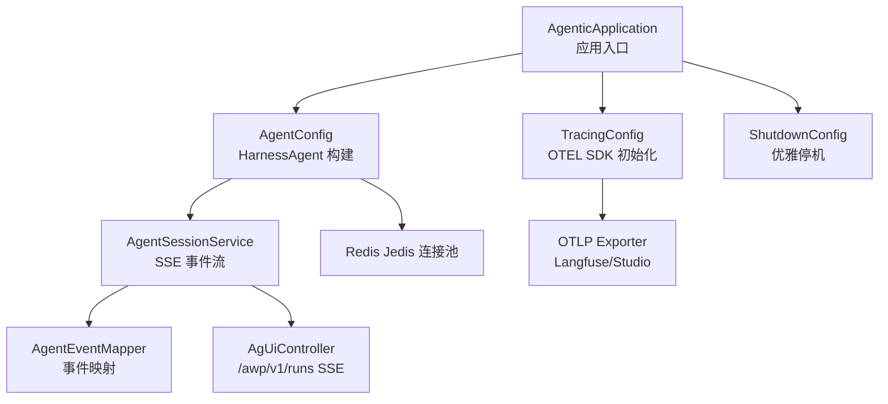
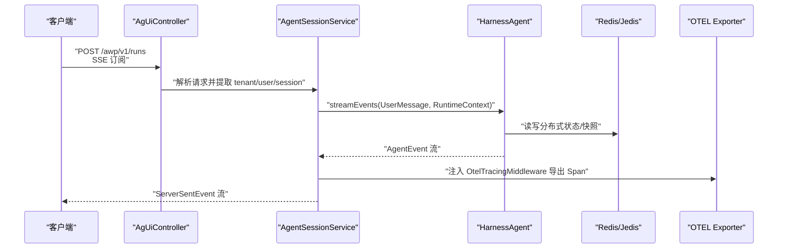
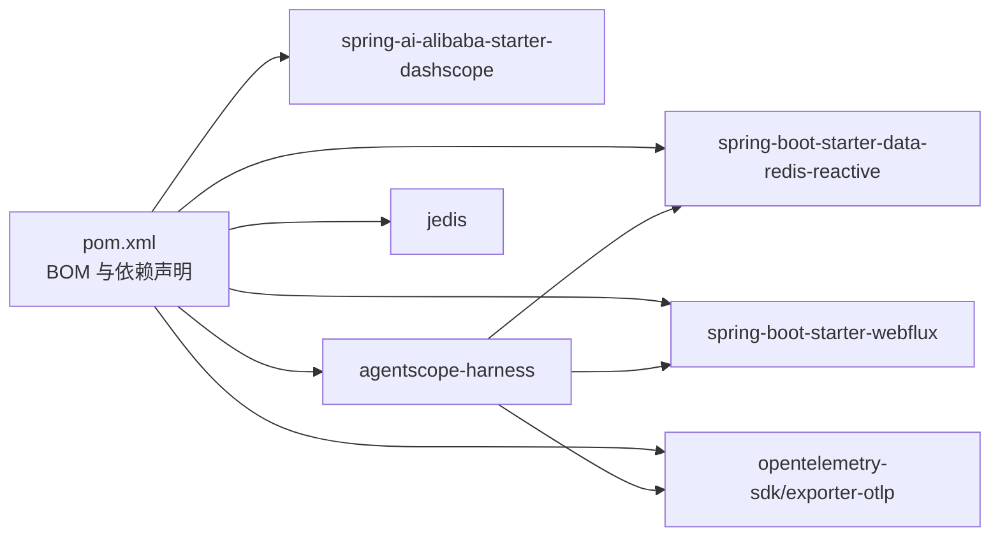

# 部署指南

<cite>
**本文引用的文件**
- [AgenticApplication.java](file://src/main/java/com/example/agentic/AgenticApplication.java)
- [application.yml](file://src/main/resources/application.yml)
- [pom.xml](file://pom.xml)
- [AgentConfig.java](file://src/main/java/com/example/agentic/config/AgentConfig.java)
- [TracingConfig.java](file://src/main/java/com/example/agentic/config/TracingConfig.java)
- [ShutdownConfig.java](file://src/main/java/com/example/agentic/config/ShutdownConfig.java)
- [McpToolConfig.java](file://src/main/java/com/example/agentic/config/McpToolConfig.java)
- [AgUiController.java](file://src/main/java/com/example/agentic/controller/AgUiController.java)
- [AgentSessionService.java](file://src/main/java/com/example/agentic/agent/AgentSessionService.java)
- [AgentEventMapper.java](file://src/main/java/com/example/agentic/agent/AgentEventMapper.java)
</cite>

## 目录
1. [简介](#简介)
2. [项目结构](#项目结构)
3. [核心组件](#核心组件)
4. [架构总览](#架构总览)
5. [详细组件分析](#详细组件分析)
6. [依赖分析](#依赖分析)
7. [性能考虑](#性能考虑)
8. [故障排查指南](#故障排查指南)
9. [结论](#结论)
10. [附录](#附录)

## 简介
本指南面向智能代理平台的部署与运维，覆盖以下场景：
- Docker 容器化部署
- Kubernetes 集群部署
- 传统服务器部署
- 生产环境配置要点、性能优化参数与安全加固
- 负载均衡、数据库连接池与缓存策略
- 部署验证清单、故障恢复流程与运维监控
- 不同环境的部署最佳实践

该应用基于 Spring Boot 3 + Spring WebFlux（SSE）、AgentScope HarnessAgent、Redis 分布式存储、OpenTelemetry（OTLP）导出等技术栈实现，提供 AG-UI 协议的流式对话能力。

## 项目结构
应用采用标准 Spring Boot 结构，核心模块包括：
- 应用入口与配置：AgenticApplication、application.yml、pom.xml
- Agent 核心配置：AgentConfig（HarnessAgent 构建、Redis 存储、沙箱与中间件）
- 追踪配置：TracingConfig（OTLP 导出至 Langfuse/Studio）
- 优雅停机：ShutdownConfig（结合 server.shutdown=graceful）
- 控制器与会话服务：AgUiController、AgentSessionService、AgentEventMapper
- MCP 工具注册：McpToolConfig（静态/动态注册）

图表来源
- [AgenticApplication.java:1-23](file://src/main/java/com/example/agentic/AgenticApplication.java#L1-L23)
- [AgentConfig.java:1-87](file://src/main/java/com/example/agentic/config/AgentConfig.java#L1-L87)
- [TracingConfig.java:1-45](file://src/main/java/com/example/agentic/config/TracingConfig.java#L1-L45)
- [ShutdownConfig.java:1-21](file://src/main/java/com/example/agentic/config/ShutdownConfig.java#L1-L21)
- [AgentSessionService.java:1-63](file://src/main/java/com/example/agentic/agent/AgentSessionService.java#L1-L63)
- [AgentEventMapper.java:1-120](file://src/main/java/com/example/agentic/agent/AgentEventMapper.java#L1-L120)
- [AgUiController.java:1-75](file://src/main/java/com/example/agentic/controller/AgUiController.java#L1-L75)

章节来源
- [AgenticApplication.java:1-23](file://src/main/java/com/example/agentic/AgenticApplication.java#L1-L23)
- [application.yml:1-30](file://src/main/resources/application.yml#L1-L30)
- [pom.xml:1-131](file://pom.xml#L1-L131)

## 核心组件
- 应用入口与启动：应用通过 Spring Boot 启动，主类位于包 com.example.agentic 下。
- 配置中心：application.yml 提供 Redis、Agent 工作区、模型参数、OTEL 导出端点、HTTP 服务端口与优雅停机等关键配置。
- Agent 核心：AgentConfig 构建 HarnessAgent，集成 Redis 分布式存储、Docker 沙箱、上下文压缩、工具结果卸载与 OTEL 中间件。
- SSE 控制器：AgUiController 对外暴露 AG-UI 协议端点，使用 WebFlux 提供 Server-Sent Events。
- 追踪系统：TracingConfig 创建 OpenTelemetry SDK，并将 Span 导出到 OTLP 端点（默认指向本地 4318）。
- 优雅停机：ShutdownConfig 与 application.yml 的 server.shutdown=graceful 配合，确保请求处理完成后再关闭。

章节来源
- [AgenticApplication.java:1-23](file://src/main/java/com/example/agentic/AgenticApplication.java#L1-L23)
- [application.yml:1-30](file://src/main/resources/application.yml#L1-L30)
- [AgentConfig.java:1-87](file://src/main/java/com/example/agentic/config/AgentConfig.java#L1-L87)
- [AgUiController.java:1-75](file://src/main/java/com/example/agentic/controller/AgUiController.java#L1-L75)
- [TracingConfig.java:1-45](file://src/main/java/com/example/agentic/config/TracingConfig.java#L1-L45)
- [ShutdownConfig.java:1-21](file://src/main/java/com/example/agentic/config/ShutdownConfig.java#L1-L21)

## 架构总览
应用整体由“控制器层（SSE）—会话服务—Agent 核心—分布式存储/追踪”构成，数据与控制流如下：

图表来源
- [AgUiController.java:32-56](file://src/main/java/com/example/agentic/controller/AgUiController.java#L32-L56)
- [AgentSessionService.java:43-61](file://src/main/java/com/example/agentic/agent/AgentSessionService.java#L43-L61)
- [AgentConfig.java:47-84](file://src/main/java/com/example/agentic/config/AgentConfig.java#L47-L84)
- [TracingConfig.java:25-43](file://src/main/java/com/example/agentic/config/TracingConfig.java#L25-L43)

## 详细组件分析

### 组件一：容器化部署（Docker）
- 基础镜像与 JDK：Java 17（见 pom.properties），建议使用官方 OpenJDK 17 基础镜像。
- 构建产物：使用 Maven 插件生成可执行 jar，可通过 spring-boot-maven-plugin 打包。
- 运行参数：
  - 端口：容器内暴露 8080（application.yml server.port）
  - 环境变量：REDIS_URI、AGENTIC_REDIS_KEY_PREFIX、AGENT_WORKSPACE、DEEPSEEK_*、LANGFUSE_OTEL_ENDPOINT
  - 健康检查：建议基于 /actuator/health（如启用）或直接探测 8080 端口
- 示例命令（不展示具体命令内容）：参考 [AgenticApplication.java:19-21](file://src/main/java/com/example/agentic/AgenticApplication.java#L19-L21) 与 [application.yml:27-29](file://src/main/resources/application.yml#L27-L29)

章节来源
- [pom.xml:121-128](file://pom.xml#L121-L128)
- [application.yml:1-30](file://src/main/resources/application.yml#L1-L30)
- [AgenticApplication.java:19-21](file://src/main/java/com/example/agentic/AgenticApplication.java#L19-L21)

### 组件二：Kubernetes 部署
- Deployment：副本数、资源限制与请求、滚动更新策略
- Service：ClusterIP/LoadBalancer，端口 8080
- ConfigMap：挂载 application.yml 或通过环境变量覆盖
- Secret：敏感配置（如 DEEPSEEK_API_KEY、Redis 密码）
- Pod 规格建议：
  - CPU/内存：根据并发会话与模型调用频率评估
  - 探针：livenessProbe/readinessProbe 基于 8080 端口
- Sidecar/InitContainer：如需预热 Redis 连接或准备 Agent 工作区目录

章节来源
- [application.yml:1-30](file://src/main/resources/application.yml#L1-L30)
- [pom.xml:20-26](file://pom.xml#L20-L26)

### 组件三：传统服务器部署
- 系统要求：Linux/Unix，JDK 17+，Redis 服务，可选 Langfuse/Studio（OTEL 导出端点）
- 步骤概览：
  - 编译打包：使用 Maven 生成可执行 jar
  - 准备环境变量与配置文件
  - 启动应用：前台运行或 systemd 守护进程
  - 验证：访问 /awp/v1/runs（SSE）与健康端点
- 日志与监控：stdout/stderr 输出，结合系统日志收集与 APM

章节来源
- [pom.xml:121-128](file://pom.xml#L121-L128)
- [application.yml:1-30](file://src/main/resources/application.yml#L1-L30)

### 组件四：生产环境配置
- Redis 连接与键空间：
  - REDIS_URI：指向生产 Redis 实例
  - AGENTIC_REDIS_KEY_PREFIX：统一前缀，便于运维与清理
  - 建议使用 Redis Sentinel/Cluster 与密码认证
- Agent 工作区：
  - AGENT_WORKSPACE：生产环境使用绝对路径，具备读写权限
- 模型接入：
  - DEEPSEEK_BASE_URL、DEEPSEEK_API_KEY、DEEPSEEK_MODEL：按供应商要求配置
- 追踪导出：
  - LANGFUSE_OTEL_ENDPOINT：指向生产 OTLP 接收端（如 Langfuse）
- 服务端口与优雅停机：
  - server.port=8080；server.shutdown=graceful 已在配置中启用

章节来源
- [application.yml:1-30](file://src/main/resources/application.yml#L1-L30)
- [AgentConfig.java:34-45](file://src/main/java/com/example/agentic/config/AgentConfig.java#L34-L45)

### 组件五：性能优化参数
- SSE 与背压：
  - 使用 WebFlux 的响应式流，避免阻塞 IO；合理设置缓冲与背压策略
- Agent 上下文压缩：
  - 触发阈值与保留条数已在 AgentConfig 中配置，可根据对话长度调优
- 工具结果卸载：
  - 大体积工具结果自动落盘与占位符替换，降低内存占用
- Redis 连接池：
  - JedisPooled 默认参数适用于小规模；生产建议显式配置最大连接数、超时与空闲检测
- 模型调用：
  - 合理设置并发与重试策略，避免上游限流

章节来源
- [AgentConfig.java:76-84](file://src/main/java/com/example/agentic/config/AgentConfig.java#L76-L84)
- [AgentConfig.java:34-37](file://src/main/java/com/example/agentic/config/AgentConfig.java#L34-L37)

### 组件六：安全加固
- 网络与访问控制：
  - 仅对 /awp/v1/runs 暴露必要的端口与路径
  - 使用反向代理（Nginx/Traefik）进行 TLS 终止与速率限制
- 敏感信息管理：
  - 通过 Secret/ConfigMap 注入，避免硬编码
- 身份与租户隔离：
  - 通过 X-Tenant-Id、X-User-Id 构造 RuntimeContext，确保会话隔离
- 追踪与审计：
  - OTEL 导出到受控的遥测平台，避免泄露业务数据

章节来源
- [AgUiController.java:46-47](file://src/main/java/com/example/agentic/controller/AgUiController.java#L46-L47)
- [AgentSessionService.java:48-51](file://src/main/java/com/example/agentic/agent/AgentSessionService.java#L48-L51)

### 组件七：负载均衡配置
- 反向代理：
  - Nginx/Traefik/Envoy：开启长连接与 SSE 支持，转发 X-Tenant-Id、X-User-Id
- 会话亲和：
  - 会话级隔离（SESSION 级别沙箱）不依赖粘性会话；但建议在网关层做健康检查与熔断
- 并发与队列：
  - 根据模型与 Redis 性能设定最大并发，必要时引入队列或限流

章节来源
- [application.yml:18-20](file://src/main/resources/application.yml#L18-L20)
- [AgentConfig.java:70-74](file://src/main/java/com/example/agentic/config/AgentConfig.java#L70-L74)

### 组件八：数据库连接池与缓存策略
- Redis 连接池：
  - 使用 JedisPooled，默认参数适用于小规模；生产建议显式配置
  - 建议开启连接池最小空闲、最大空闲、最大连接、超时与测试策略
- 缓存键设计：
  - AGENTIC_REDIS_KEY_PREFIX 统一前缀，便于运维与清理
- 工作区缓存：
  - Agent 工作区目录（绝对路径）用于沙箱文件投射，建议持久化到高性能磁盘

章节来源
- [AgentConfig.java:34-45](file://src/main/java/com/example/agentic/config/AgentConfig.java#L34-L45)
- [application.yml:7-10](file://src/main/resources/application.yml#L7-L10)
- [application.yml:12-13](file://src/main/resources/application.yml#L12-L13)

### 组件九：MCP 工具注册
- 静态注册：可在启动时通过配置连接 MCP Server（示例注释已给出）
- 动态注册：通过 REST API 热插拔（当前配置类预留接口）
- 使用建议：在生产中优先静态注册，动态注册用于灰度与快速迭代

章节来源
- [McpToolConfig.java:1-24](file://src/main/java/com/example/agentic/config/McpToolConfig.java#L1-L24)

### 组件十：部署验证清单
- 基础连通性
  - 8080 端口可达，SSE 订阅成功
- 配置校验
  - REDIS_URI、AGENTIC_REDIS_KEY_PREFIX、AGENT_WORKSPACE、DEEPSEEK_*、LANGFUSE_OTEL_ENDPOINT 正确
- 功能验证
  - 发送 AG-UI 请求，接收 RUN_STARTED → TEXT_MESSAGE_CONTENT → RUN_FINISHED 完整事件流
- 追踪验证
  - OTLP 导出端点可接收 Span
- 优雅停机
  - 发送 SIGTERM，应用在请求完成后退出

章节来源
- [AgUiController.java:43-56](file://src/main/java/com/example/agentic/controller/AgUiController.java#L43-L56)
- [TracingConfig.java:25-43](file://src/main/java/com/example/agentic/config/TracingConfig.java#L25-L43)
- [application.yml:27-29](file://src/main/resources/application.yml#L27-L29)

### 组件十一：故障恢复流程
- 常见问题定位
  - Redis 连接失败：检查 REDIS_URI 与网络连通性
  - 模型调用异常：核对 DEEPSEEK_API_KEY 与网络策略
  - SSE 断流：确认反向代理对长连接与缓冲的配置
- 自愈与回滚
  - K8s：滚动更新与就绪探针；失败时回滚至上一版本
  - 传统服务器：使用 systemd 管理，配合日志与告警自动重启

章节来源
- [application.yml:1-30](file://src/main/resources/application.yml#L1-L30)
- [AgentConfig.java:34-37](file://src/main/java/com/example/agentic/config/AgentConfig.java#L34-L37)

### 组件十二：运维监控配置
- 指标与日志
  - 暴露 /actuator/*（如启用）或通过外部 APM 收集
  - 日志输出到 stdout/stderr，结合集中式日志系统
- 追踪
  - OTEL 导出到 Langfuse/Studio，建立跨服务调用链
- 告警
  - 基于延迟、错误率、连接池使用率、Redis 延迟等指标设置告警

章节来源
- [TracingConfig.java:25-43](file://src/main/java/com/example/agentic/config/TracingConfig.java#L25-L43)
- [application.yml:22-25](file://src/main/resources/application.yml#L22-L25)

## 依赖分析
应用依赖关系围绕 Spring Boot、AgentScope、Redis、OTEL 与 WebFlux 展开，核心依赖如下：

图表来源
- [pom.xml:28-118](file://pom.xml#L28-L118)

章节来源
- [pom.xml:28-118](file://pom.xml#L28-L118)

## 性能考虑
- 响应式编程：使用 WebFlux 与 Reactor，避免阻塞，提升吞吐
- Redis 优化：连接池参数、键空间隔离、命令批量化
- Agent 优化：上下文压缩与工具结果卸载减少内存压力
- 模型侧：合理并发与重试，避免上游限流
- 网络层：反向代理对 SSE 的支持与缓冲配置

章节来源
- [AgentConfig.java:76-84](file://src/main/java/com/example/agentic/config/AgentConfig.java#L76-L84)
- [AgentConfig.java:34-37](file://src/main/java/com/example/agentic/config/AgentConfig.java#L34-L37)
- [application.yml:18-20](file://src/main/resources/application.yml#L18-L20)

## 故障排查指南
- SSE 无法订阅
  - 检查反向代理是否正确转发 Accept: text/event-stream
  - 核对 /awp/v1/runs 路径与方法
- 事件缺失
  - 确认 X-Tenant-Id、X-User-Id 是否正确传递
  - 检查 AgentEventMapper 是否过滤了内部事件
- 追踪未生效
  - 核对 LANGFUSE_OTEL_ENDPOINT 与网络连通性
- Redis 异常
  - 检查 REDIS_URI、密码与网络策略
- 优雅停机无效
  - 确认 server.shutdown=graceful 与 SIGTERM 处理

章节来源
- [AgUiController.java:43-56](file://src/main/java/com/example/agentic/controller/AgUiController.java#L43-L56)
- [AgentEventMapper.java:15-29](file://src/main/java/com/example/agentic/agent/AgentEventMapper.java#L15-L29)
- [TracingConfig.java:25-43](file://src/main/java/com/example/agentic/config/TracingConfig.java#L25-L43)
- [application.yml:1-30](file://src/main/resources/application.yml#L1-L30)
- [ShutdownConfig.java:17-19](file://src/main/java/com/example/agentic/config/ShutdownConfig.java#L17-L19)

## 结论
本指南提供了从容器化到 Kubernetes、再到传统服务器的完整部署路径，结合生产配置、性能优化与安全加固建议，帮助团队稳定交付智能代理平台。建议在上线前完成部署验证清单与演练，并持续完善监控与告警体系。

## 附录
- 环境变量一览（示例）
  - REDIS_URI、AGENTIC_REDIS_KEY_PREFIX、AGENT_WORKSPACE、DEEPSEEK_BASE_URL、DEEPSEEK_API_KEY、DEEPSEEK_MODEL、LANGFUSE_OTEL_ENDPOINT
- 端口与协议
  - 8080 TCP（HTTP/SSE）
- 健康检查
  - 建议基于 8080 端口探测，或启用 /actuator/health（如启用）

章节来源
- [application.yml:1-30](file://src/main/resources/application.yml#L1-L30)