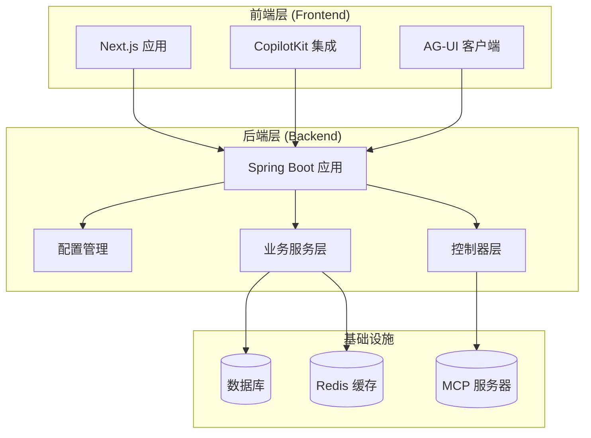
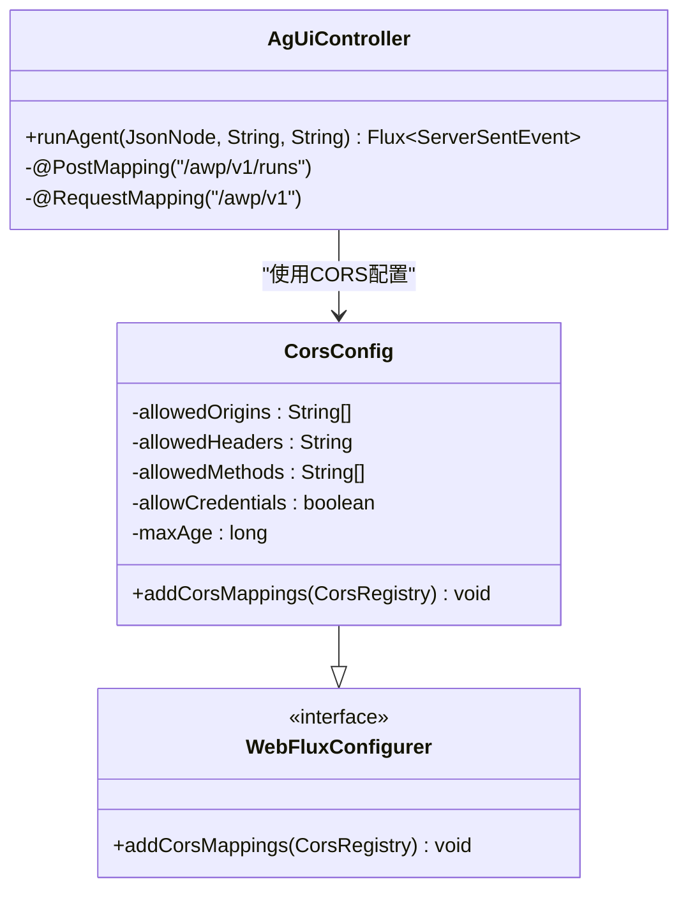
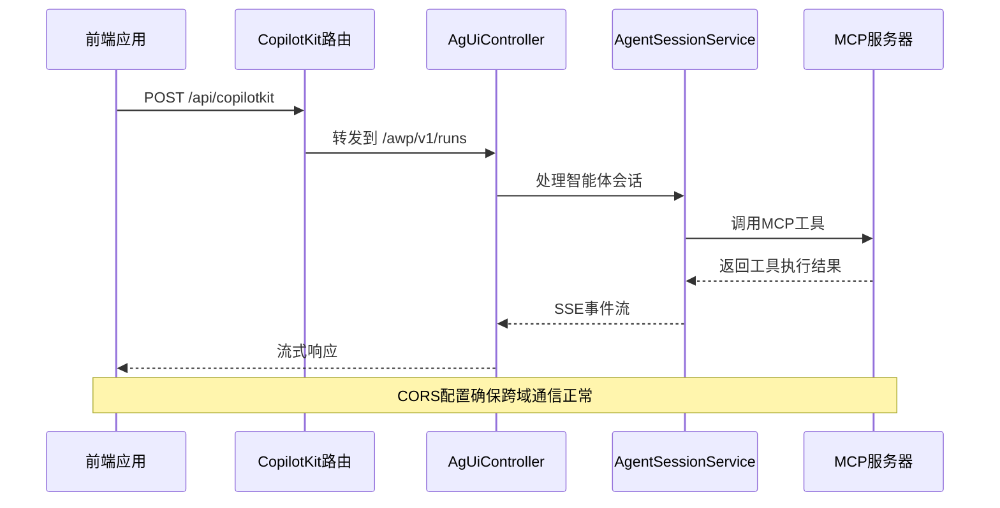
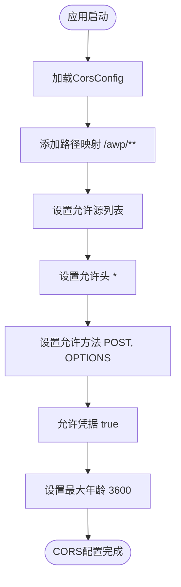
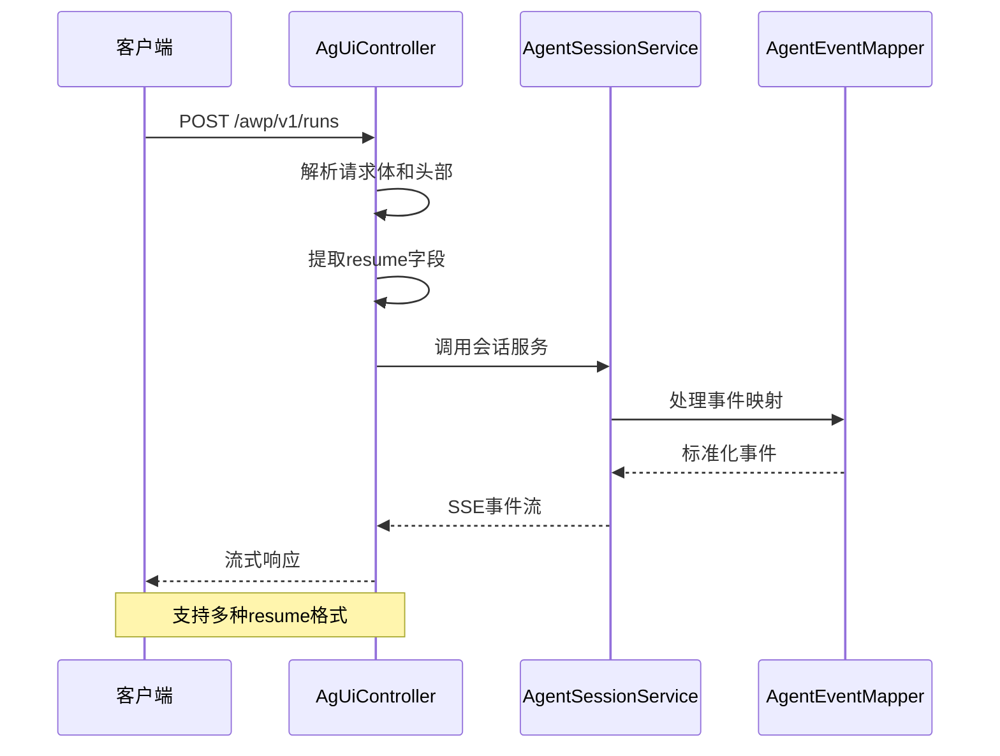

# CORS配置

<cite>
**本文档引用的文件**
- [CorsConfig.java](file://src/main/java/com/example/agentic/config/CorsConfig.java)
- [AgUiController.java](file://src/main/java/com/example/agentic/controller/AgUiController.java)
- [McpToolController.java](file://src/main/java/com/example/agentic/controller/McpToolController.java)
- [SkillController.java](file://src/main/java/com/example/agentic/controller/SkillController.java)
- [route.ts](file://frontend/app/api/copilotkit/route.ts)
- [route.ts](file://frontend/app/api/copilotkit/threads/route.ts)
- [application.yml](file://src/main/resources/application.yml)
- [AgenticApplication.java](file://src/main/java/com/example/agentic/AgenticApplication.java)
</cite>

## 目录
1. [简介](#简介)
2. [项目结构](#项目结构)
3. [核心组件](#核心组件)
4. [架构概览](#架构概览)
5. [详细组件分析](#详细组件分析)
6. [依赖关系分析](#依赖关系分析)
7. [性能考虑](#性能考虑)
8. [故障排除指南](#故障排除指南)
9. [结论](#结论)

## 简介

本文档详细分析了该智能体平台中的CORS（跨域资源共享）配置实现。该项目采用Spring Boot + Spring WebFlux技术栈，实现了前后端分离的架构模式。前端使用Next.js框架，后端提供REST API和Server-Sent Events（SSE）流式接口。

系统的核心功能是通过AG-UI协议实现智能体交互，支持实时流式响应和多种工具调用机制。CORS配置对于确保前端开发服务器与后端API之间的正常通信至关重要。

## 项目结构

该项目采用典型的分层架构设计，包含以下主要模块：



**图表来源**
- [AgenticApplication.java:19-24](file://src/main/java/com/example/agentic/AgenticApplication.java#L19-L24)
- [application.yml:1-37](file://src/main/resources/application.yml#L1-L37)

**章节来源**
- [AgenticApplication.java:1-26](file://src/main/java/com/example/agentic/AgenticApplication.java#L1-L26)
- [application.yml:1-37](file://src/main/resources/application.yml#L1-L37)

## 核心组件

### CORS配置组件

系统的核心CORS配置由`CorsConfig`类实现，该类继承自`WebFluxConfigurer`接口，专门处理WebFlux环境下的跨域请求。



**图表来源**
- [CorsConfig.java:12-24](file://src/main/java/com/example/agentic/config/CorsConfig.java#L12-L24)
- [AgUiController.java:35-45](file://src/main/java/com/example/agentic/controller/AgUiController.java#L35-L45)

### 控制器组件

系统包含多个控制器，每个控制器负责不同的业务功能：

| 控制器名称 | 路径前缀 | 主要功能 | CORS影响 |
|-----------|----------|----------|----------|
| AgUiController | `/awp/v1` | AG-UI协议端点，SSE流式响应 | 受CORS配置直接影响 |
| McpToolController | `/api/tools/mcp` | MCP工具动态注册 | 不受CORS限制 |
| SkillController | `/api/skills` | 技能CRUD操作 | 不受CORS限制 |

**章节来源**
- [CorsConfig.java:15-23](file://src/main/java/com/example/agentic/config/CorsConfig.java#L15-L23)
- [AgUiController.java:35-45](file://src/main/java/com/example/agentic/controller/AgUiController.java#L35-L45)
- [McpToolController.java:27-37](file://src/main/java/com/example/agentic/controller/McpToolController.java#L27-L37)
- [SkillController.java:36-51](file://src/main/java/com/example/agentic/controller/SkillController.java#L36-L51)

## 架构概览

系统采用前后端分离架构，前端通过HTTP请求与后端进行通信，后端通过Server-Sent Events提供实时流式响应。



**图表来源**
- [route.ts:12-34](file://frontend/app/api/copilotkit/route.ts#L12-L34)
- [AgUiController.java:59-83](file://src/main/java/com/example/agentic/controller/AgUiController.java#L59-L83)

**章节来源**
- [route.ts:12-34](file://frontend/app/api/copilotkit/route.ts#L12-L34)
- [AgUiController.java:20-34](file://src/main/java/com/example/agentic/controller/AgUiController.java#L20-L34)

## 详细组件分析

### CORS配置实现

`CorsConfig`类提供了精确的跨域配置策略：

#### 配置参数详解

| 参数 | 值 | 说明 |
|------|-----|------|
| 路径匹配 | `/awp/**` | 仅对AG-UI协议端点启用CORS |
| 允许源 | `localhost:3000, localhost:3001, 127.0.0.1:3000, 127.0.0.1:3001` | 支持多种本地开发端口 |
| 允许头 | `*` | 允许所有请求头 |
| 允许方法 | `POST, OPTIONS` | 仅允许POST和预检请求 |
| 凭据 | `true` | 允许携带Cookie和认证信息 |
| 最大年龄 | `3600秒` | 预检请求缓存时间 |

#### 配置流程图



**图表来源**
- [CorsConfig.java:15-23](file://src/main/java/com/example/agentic/config/CorsConfig.java#L15-L23)

**章节来源**
- [CorsConfig.java:1-25](file://src/main/java/com/example/agentic/config/CorsConfig.java#L1-L25)

### AG-UI控制器分析

`AgUiController`是系统的核心控制器，处理AG-UI协议的所有请求：

#### 请求处理流程



**图表来源**
- [AgUiController.java:59-83](file://src/main/java/com/example/agentic/controller/AgUiController.java#L59-L83)
- [AgUiController.java:94-136](file://src/main/java/com/example/agentic/controller/AgUiController.java#L94-L136)

#### 支持的resume格式

| 格式类型 | 字段结构 | 用途 | 兼容性 |
|---------|----------|------|--------|
| AG-UI标准 | `{"resume": [{"interruptId": "...", "status": "...", "payload": {...}}]}` | 推荐格式 | ✅ 新版本 |
| CopilotKit | `{"forwardedProps": {"command": {"resume": "...", "interruptEvent": [...]}}}` | 兼容旧版 | ⚠️ 渐进淘汰 |
| 旧版confirm_results | `[{"tool_call_id": "...", "tool_name": "...", "confirmed": true, "input": {...}}]` | 兼容Python测试 | ❌ 已废弃 |

**章节来源**
- [AgUiController.java:20-34](file://src/main/java/com/example/agentic/controller/AgUiController.java#L20-L34)
- [AgUiController.java:85-207](file://src/main/java/com/example/agentic/controller/AgUiController.java#L85-L207)

### 前端集成分析

前端通过CopilotKit与后端进行集成，主要涉及两个关键文件：

#### CopilotKit路由配置

前端路由文件负责将请求转发到后端的AG-UI端点：

| 组件 | 功能 | 关键配置 |
|------|------|----------|
| HttpAgent | HTTP代理客户端 | URL指向后端 `/awp/v1/runs` |
| CopilotRuntime | 运行时环境 | 集成FastAgentRunner |
| 环境变量 | 后端地址配置 | `AGENTIC_BACKEND_URL` |

#### 线程持久化API

前端还提供了线程持久化API的占位实现，用于支持历史对话恢复功能。

**章节来源**
- [route.ts:12-34](file://frontend/app/api/copilotkit/route.ts#L12-L34)
- [route.ts:1-10](file://frontend/app/api/copilotkit/threads/route.ts#L1-L10)

## 依赖关系分析

系统各组件之间的依赖关系如下：

```mermaid
graph TB
subgraph "外部依赖"
NextJS[Next.js 14]
AGUI[@ag-ui/client]
CopilotKit[@copilotkit/runtime]
end
subgraph "后端核心"
SpringBoot[Spring Boot]
WebFlux[Spring WebFlux]
Jackson[Jackson]
end
subgraph "业务组件"
AgUiController[AgUiController]
McpToolController[McpToolController]
SkillController[SkillController]
AgentSessionService[AgentSessionService]
end
subgraph "配置"
CorsConfig[CorsConfig]
ApplicationYml[application.yml]
end
NextJS --> AGUI
NextJS --> CopilotKit
AGUI --> SpringBoot
CopilotKit --> SpringBoot
SpringBoot --> WebFlux
SpringBoot --> Jackson
SpringBoot --> CorsConfig
SpringBoot --> ApplicationYml
WebFlux --> AgUiController
WebFlux --> McpToolController
WebFlux --> SkillController
AgUiController --> AgentSessionService
AgentSessionService --> SpringBoot
```

**图表来源**
- [AgenticApplication.java:9-17](file://src/main/java/com/example/agentic/AgenticApplication.java#L9-L17)
- [application.yml:1-37](file://src/main/resources/application.yml#L1-L37)

**章节来源**
- [AgenticApplication.java:1-26](file://src/main/java/com/example/agentic/AgenticApplication.java#L1-L26)
- [application.yml:1-37](file://src/main/resources/application.yml#L1-L37)

## 性能考虑

### CORS性能优化

1. **精确的路径匹配**：仅对`/awp/**`路径启用CORS，减少不必要的跨域检查
2. **合理的缓存策略**：3600秒的预检请求缓存时间平衡了性能和安全性
3. **最小权限原则**：仅允许必要的HTTP方法和请求头

### SSE流式传输优化

1. **背压处理**：使用Reactor框架的背压机制防止内存溢出
2. **事件序列化**：采用高效的JSON序列化策略
3. **连接池管理**：合理配置Tomcat连接池参数

## 故障排除指南

### 常见CORS问题及解决方案

| 问题症状 | 可能原因 | 解决方案 |
|----------|----------|----------|
| Access to fetch at 'http://localhost:8080/awp/v1/runs' from origin 'http://localhost:3000' has been blocked by CORS policy | CORS配置不正确 | 检查allowedOrigins配置 |
| No 'Access-Control-Allow-Origin' header present on the requested resource | 路径不匹配 | 确认请求URL符合`/awp/**`模式 |
| Preflight request fails with 403 status | 方法不受支持 | 确保使用POST或OPTIONS方法 |
| Credentials not supported | 凭据配置错误 | 检查allowCredentials设置 |

### 调试步骤

1. **验证CORS配置**：确认`CorsConfig`类正确加载
2. **检查请求头**：确保包含正确的租户和用户标识头
3. **监控网络请求**：使用浏览器开发者工具查看CORS响应头
4. **日志分析**：检查后端日志中的CORS处理信息

**章节来源**
- [CorsConfig.java:15-23](file://src/main/java/com/example/agentic/config/CorsConfig.java#L15-L23)
- [AgUiController.java:62-63](file://src/main/java/com/example/agentic/controller/AgUiController.java#L62-L63)

## 结论

该系统的CORS配置设计体现了"最小权限"和"精确控制"的原则。通过针对特定API路径的CORS配置，既保证了前端开发的便利性，又维护了系统的安全性。

关键设计要点包括：
- **精确的路径匹配**：仅对AG-UI协议端点启用CORS
- **灵活的开发支持**：支持多种本地开发端口
- **安全的凭据处理**：允许携带认证信息但限制范围
- **清晰的错误处理**：提供明确的CORS错误信息

这种配置策略为后续的功能扩展和部署提供了良好的基础，同时保持了系统的简洁性和可维护性。