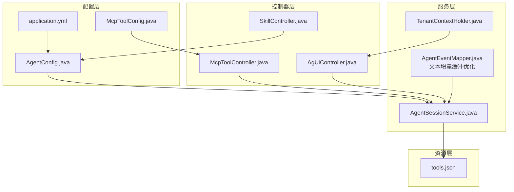
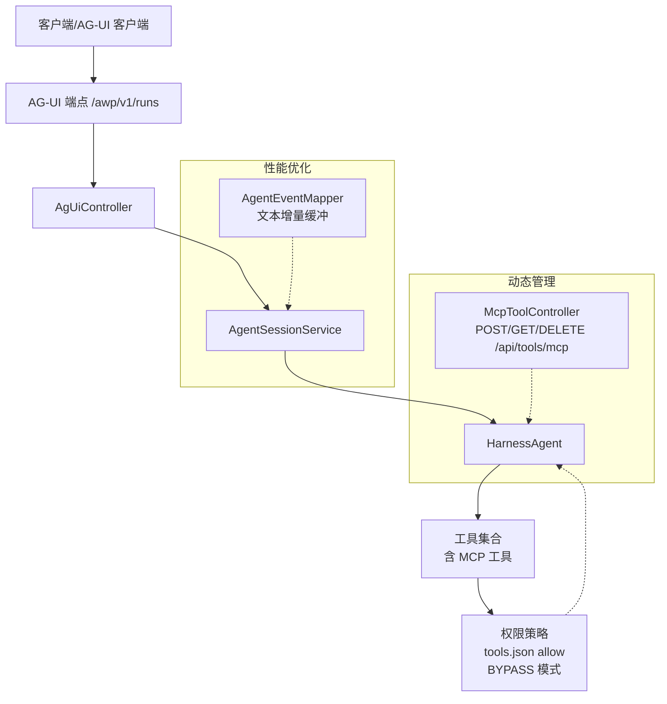
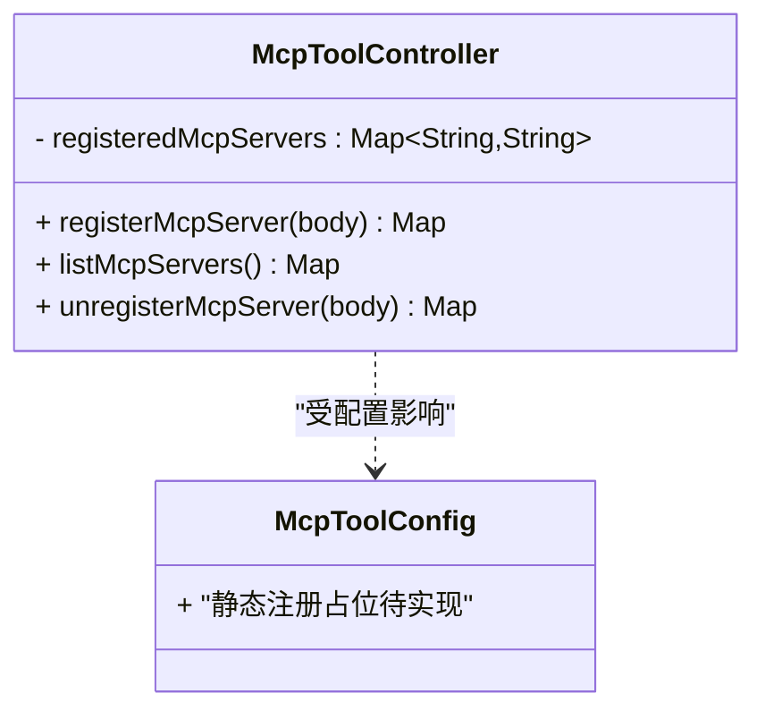
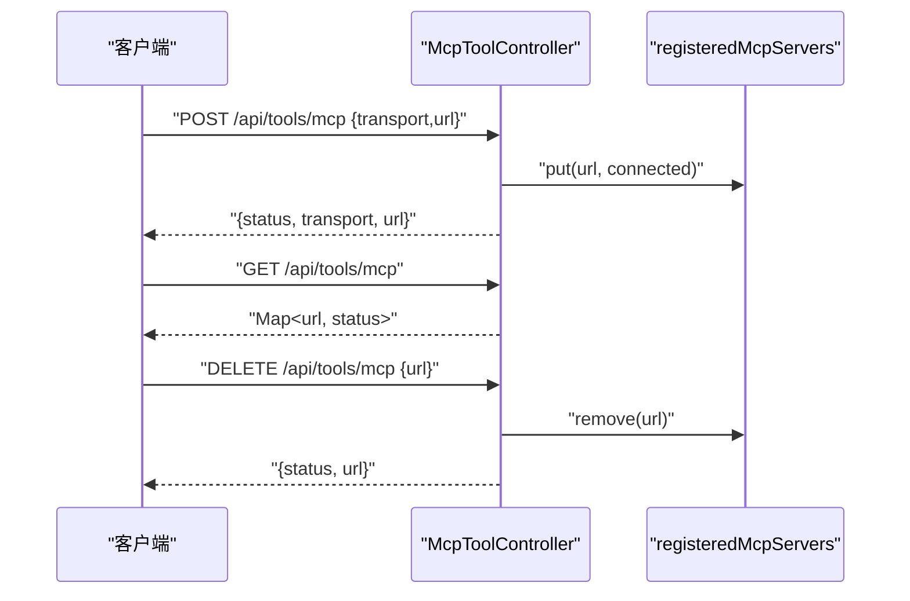
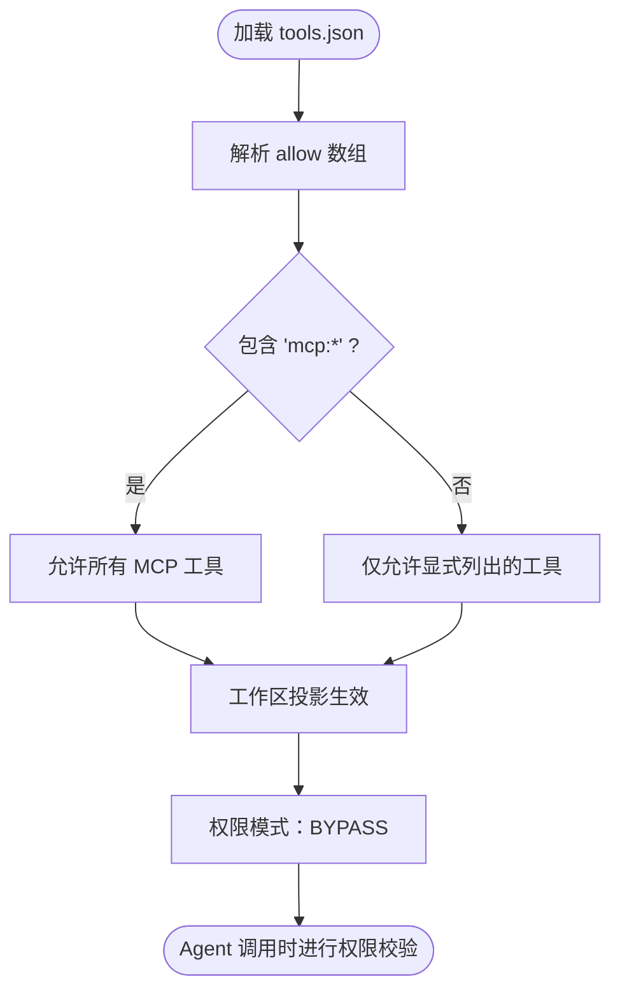
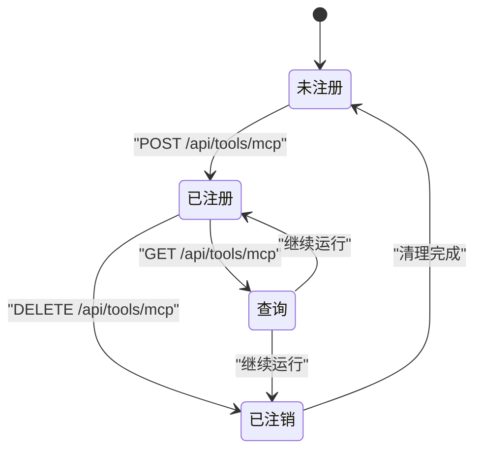
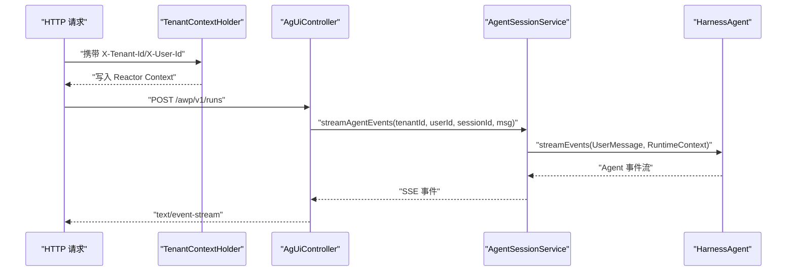
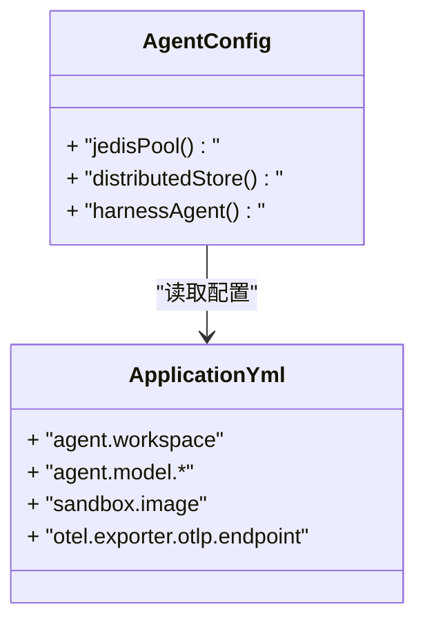
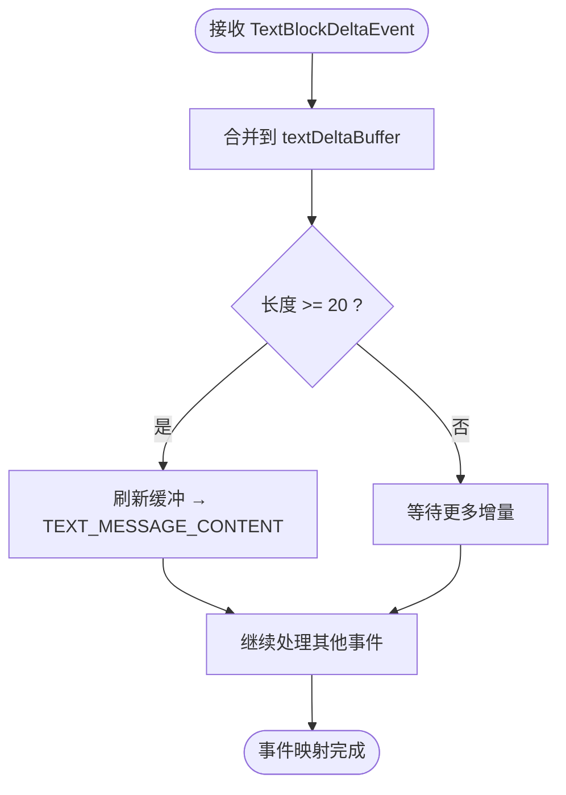
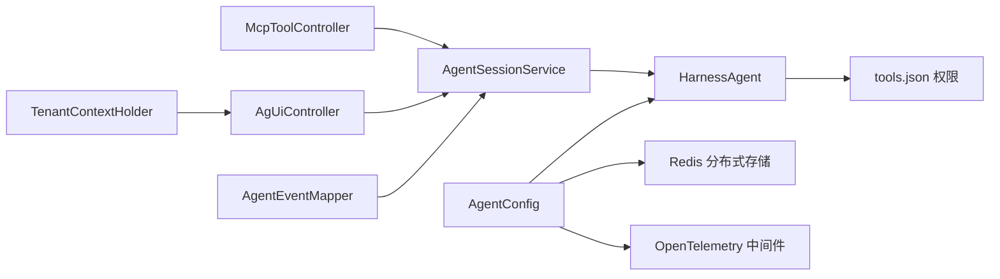

# MCP 工具配置

<cite>
**本文引用的文件**
- [McpToolConfig.java](file://src/main/java/com/example/agentic/config/McpToolConfig.java)
- [McpToolController.java](file://src/main/java/com/example/agentic/controller/McpToolController.java)
- [tools.json](file://src/main/resources/workspace/tools.json)
- [AgentConfig.java](file://src/main/java/com/example/agentic/config/AgentConfig.java)
- [application.yml](file://src/main/resources/application.yml)
- [AgentSessionService.java](file://src/main/java/com/example/agentic/agent/AgentSessionService.java)
- [TenantContextHolder.java](file://src/main/java/com/example/agentic/tenant/TenantContextHolder.java)
- [SkillController.java](file://src/main/java/com/example/agentic/controller/SkillController.java)
- [AgUiController.java](file://src/main/java/com/example/agentic/controller/AgUiController.java)
- [AgentEventMapper.java](file://src/main/java/com/example/agentic/agent/AgentEventMapper.java)
</cite>

## 更新摘要
**变更内容**
- 更新权限模式从 ACCEPT_EDITS 到 BYPASS 的配置说明
- 新增 AgentEventMapper 中文本增量缓冲系统的性能优化说明
- 更新工具权限控制策略的最新实现细节

## 目录
1. [简介](#简介)
2. [项目结构](#项目结构)
3. [核心组件](#核心组件)
4. [架构总览](#架构总览)
5. [详细组件分析](#详细组件分析)
6. [依赖分析](#依赖分析)
7. [性能考虑](#性能考虑)
8. [故障排除指南](#故障排除指南)
9. [结论](#结论)
10. [附录](#附录)

## 简介
本文件面向 MCP（Model Context Protocol）工具配置与管理，围绕以下目标展开：
- tools.json 的工具权限配置格式与生效范围
- McpToolConfig 的工具注册机制与静态/动态两种接入方式
- 动态工具管理流程（注册、查询、注销）
- 工具权限控制策略与工具连接管理
- 工具生命周期控制与多租户隔离
- 新工具集成指南、性能监控与故障排除建议

## 项目结构
该模块位于 Spring Boot 应用中，核心涉及配置类、控制器与资源文件：
- 配置层：MCP 工具注册配置、Agent 全局配置、多租户上下文注入
- 控制器层：MCP 工具动态注册接口、技能 CRUD 接口、AG-UI 协议端点
- 服务层：事件映射器，负责性能优化的文本增量缓冲
- 资源层：工作区 tools.json 权限清单；应用配置 application.yml

**图表来源**
- [McpToolConfig.java:1-24](file://src/main/java/com/example/agentic/config/McpToolConfig.java#L1-L24)
- [AgentConfig.java:1-93](file://src/main/java/com/example/agentic/config/AgentConfig.java#L1-L93)
- [application.yml:1-30](file://src/main/resources/application.yml#L1-L30)
- [McpToolController.java:1-69](file://src/main/java/com/example/agentic/controller/McpToolController.java#L1-L69)
- [SkillController.java:1-41](file://src/main/java/com/example/agentic/controller/SkillController.java#L1-L41)
- [AgUiController.java:1-30](file://src/main/java/com/example/agentic/controller/AgUiController.java#L1-L30)
- [AgentSessionService.java:1-63](file://src/main/java/com/example/agentic/agent/AgentSessionService.java#L1-L63)
- [TenantContextHolder.java:1-59](file://src/main/java/com/example/agentic/tenant/TenantContextHolder.java#L1-L59)
- [tools.json:1-12](file://src/main/resources/workspace/tools.json#L1-L12)
- [AgentEventMapper.java:1-369](file://src/main/java/com/example/agentic/agent/AgentEventMapper.java#L1-L369)

**章节来源**
- [McpToolConfig.java:1-24](file://src/main/java/com/example/agentic/config/McpToolConfig.java#L1-L24)
- [AgentConfig.java:1-93](file://src/main/java/com/example/agentic/config/AgentConfig.java#L1-L93)
- [application.yml:1-30](file://src/main/resources/application.yml#L1-L30)
- [McpToolController.java:1-69](file://src/main/java/com/example/agentic/controller/McpToolController.java#L1-L69)
- [SkillController.java:1-41](file://src/main/java/com/example/agentic/controller/SkillController.java#L1-L41)
- [AgUiController.java:1-30](file://src/main/java/com/example/agentic/controller/AgUiController.java#L1-L30)
- [AgentSessionService.java:1-63](file://src/main/java/com/example/agentic/agent/AgentSessionService.java#L1-L63)
- [TenantContextHolder.java:1-59](file://src/main/java/com/example/agentic/tenant/TenantContextHolder.java#L1-L59)
- [tools.json:1-12](file://src/main/resources/workspace/tools.json#L1-L12)
- [AgentEventMapper.java:1-369](file://src/main/java/com/example/agentic/agent/AgentEventMapper.java#L1-L369)

## 核心组件
- MCP 工具注册配置（静态/动态）
  - 静态注册：通过配置类声明 Bean，启动时连接 MCP Server（当前为占位注释，待实现）
  - 动态注册：通过 REST API 在运行时热插拔 MCP Server
- MCP 工具动态注册控制器
  - 提供注册、查询、注销接口，维护已注册服务器映射
- 工具权限清单（tools.json）
  - allow 数组定义允许的工具集，支持通配符"mcp:*"
- Agent 全局配置
  - 绑定工作区、沙箱隔离、分布式存储、中间件等
  - **更新**：权限模式已调整为 BYPASS，提供更宽松的工具执行环境
- 多租户上下文
  - 从请求头注入租户与用户标识，贯穿响应式链路
- **新增**：事件映射器与性能优化
  - AgentEventMapper 实现文本增量缓冲系统，优化前端性能

**章节来源**
- [McpToolConfig.java:1-24](file://src/main/java/com/example/agentic/config/McpToolConfig.java#L1-L24)
- [McpToolController.java:1-69](file://src/main/java/com/example/agentic/controller/McpToolController.java#L1-L69)
- [tools.json:1-12](file://src/main/resources/workspace/tools.json#L1-L12)
- [AgentConfig.java:1-93](file://src/main/java/com/example/agentic/config/AgentConfig.java#L1-L93)
- [TenantContextHolder.java:1-59](file://src/main/java/com/example/agentic/tenant/TenantContextHolder.java#L1-L59)
- [AgentEventMapper.java:1-369](file://src/main/java/com/example/agentic/agent/AgentEventMapper.java#L1-L369)

## 架构总览
MCP 工具在系统中的位置与交互如下：

**图表来源**
- [AgUiController.java:1-30](file://src/main/java/com/example/agentic/controller/AgUiController.java#L1-L30)
- [AgentSessionService.java:1-63](file://src/main/java/com/example/agentic/agent/AgentSessionService.java#L1-L63)
- [AgentConfig.java:1-93](file://src/main/java/com/example/agentic/config/AgentConfig.java#L1-L93)
- [McpToolController.java:1-69](file://src/main/java/com/example/agentic/controller/McpToolController.java#L1-L69)
- [tools.json:1-12](file://src/main/resources/workspace/tools.json#L1-L12)
- [AgentEventMapper.java:1-369](file://src/main/java/com/example/agentic/agent/AgentEventMapper.java#L1-L369)

## 详细组件分析

### MCP 工具注册配置（静态/动态）
- 静态注册
  - 通过配置类声明 Bean，使用传输层（如 SSE HTTP）连接 MCP Server
  - 当存在可用 MCP Server 时启用，作为启动阶段的默认连接
- 动态注册
  - 通过 REST API 在运行时注册/注销 MCP Server
  - 维护 transport URL 到状态的映射，便于查询与运维

**图表来源**
- [McpToolConfig.java:1-24](file://src/main/java/com/example/agentic/config/McpToolConfig.java#L1-L24)
- [McpToolController.java:1-69](file://src/main/java/com/example/agentic/controller/McpToolController.java#L1-L69)

**章节来源**
- [McpToolConfig.java:1-24](file://src/main/java/com/example/agentic/config/McpToolConfig.java#L1-L24)
- [McpToolController.java:1-69](file://src/main/java/com/example/agentic/controller/McpToolController.java#L1-L69)

### MCP 工具动态注册 REST API
- 接口设计
  - POST /api/tools/mcp：注册 MCP Server（transport、url）
  - GET /api/tools/mcp：列出已注册服务器
  - DELETE /api/tools/mcp：按 url 注销并移除
- 数据结构
  - 请求体：transport（传输类型）、url（MCP 服务地址）
  - 返回体：状态、transport、url
- 并发安全
  - 使用线程安全的并发映射保存注册状态

**图表来源**
- [McpToolController.java:1-69](file://src/main/java/com/example/agentic/controller/McpToolController.java#L1-L69)

**章节来源**
- [McpToolController.java:1-69](file://src/main/java/com/example/agentic/controller/McpToolController.java#L1-L69)

### 工具权限控制策略（tools.json）
- allow 数组定义允许的工具名称
- 支持通配符"mcp:*"，用于授权所有 MCP 工具
- 工作区挂载与权限生效
  - AgentConfig 将 tools.json 投影到沙箱工作区，确保工具权限在运行期生效
- 权限模式变更
  - **更新**：权限模式已从 ACCEPT_EDITS 调整为 BYPASS
  - BYPASS 模式提供更宽松的工具执行环境，减少不必要的确认步骤
- 权限与工具调用的关系
  - 未在 allow 中声明的工具不会被 Agent 调用

**图表来源**
- [tools.json:1-12](file://src/main/resources/workspace/tools.json#L1-L12)
- [AgentConfig.java:84-88](file://src/main/java/com/example/agentic/config/AgentConfig.java#L84-L88)

**章节来源**
- [tools.json:1-12](file://src/main/resources/workspace/tools.json#L1-L12)
- [AgentConfig.java:84-88](file://src/main/java/com/example/agentic/config/AgentConfig.java#L84-L88)

### 工具连接管理与生命周期
- 生命周期阶段
  - 注册：POST /api/tools/mcp
  - 运行：Agent 在对话中根据权限与上下文调用
  - 查询：GET /api/tools/mcp
  - 注销：DELETE /api/tools/mcp
- 连接状态
  - 使用并发映射维护 transport URL → 状态（connected/unregistered）
- 与 Agent 的集成
  - 注册成功后，MCP 工具应可被 HarnessAgent 工具集发现与调用（当前控制器为占位，实际注册逻辑在 TODO 中）

**图表来源**
- [McpToolController.java:1-69](file://src/main/java/com/example/agentic/controller/McpToolController.java#L1-L69)

**章节来源**
- [McpToolController.java:1-69](file://src/main/java/com/example/agentic/controller/McpToolController.java#L1-L69)

### 多租户隔离与会话服务
- 多租户上下文
  - 从请求头提取租户与用户标识，注入到 Reactor Context
- 会话服务
  - 为每次会话构造 RuntimeContext，确保 userId 与 sessionId 的隔离
  - 将 Agent 事件映射为 AG-UI SSE 格式输出

**图表来源**
- [TenantContextHolder.java:1-59](file://src/main/java/com/example/agentic/tenant/TenantContextHolder.java#L1-L59)
- [AgUiController.java:1-30](file://src/main/java/com/example/agentic/controller/AgUiController.java#L1-L30)
- [AgentSessionService.java:1-63](file://src/main/java/com/example/agentic/agent/AgentSessionService.java#L1-L63)

**章节来源**
- [TenantContextHolder.java:1-59](file://src/main/java/com/example/agentic/tenant/TenantContextHolder.java#L1-L59)
- [AgUiController.java:1-30](file://src/main/java/com/example/agentic/controller/AgUiController.java#L1-L30)
- [AgentSessionService.java:1-63](file://src/main/java/com/example/agentic/agent/AgentSessionService.java#L1-L63)

### Agent 全局配置与工作区挂载
- 工作区与沙箱
  - 工作区路径由配置决定，沙箱镜像与隔离级别可配置
  - tools.json 被投影到工作区，作为工具权限的依据
- 分布式存储与中间件
  - 使用 Redis 分布式存储，统一配置 stateStore/baseStore/snapshotSpec/executionGuard
  - 注入 OpenTelemetry 中间件，支持链路追踪
- **更新**：权限模式配置
  - 权限模式设置为 BYPASS，提供更宽松的工具执行环境

**图表来源**
- [AgentConfig.java:1-93](file://src/main/java/com/example/agentic/config/AgentConfig.java#L1-L93)
- [application.yml:1-30](file://src/main/resources/application.yml#L1-L30)

**章节来源**
- [AgentConfig.java:1-93](file://src/main/java/com/example/agentic/config/AgentConfig.java#L1-L93)
- [application.yml:1-30](file://src/main/resources/application.yml#L1-L30)

### **新增**：事件映射器与文本增量缓冲优化
- **更新**：AgentEventMapper 实现了性能优化的文本增量缓冲系统
- 关键特性
  - 文本增量缓冲：减少前端事件数量，避免 AG-UI 开发模式下 structuredClone + Object.freeze 的 O(n²) 性能退化
  - 缓冲阈值：TEXT_BUFFER_FLUSH_THRESHOLD 设置为 20，达到阈值时自动刷新
  - 工具调用事件缓冲：Tool Call Start/Delta/End 事件在确认工具正常执行后才下发
  - 中断处理：被中断的工具事件缓冲会被丢弃，仅通过 CUSTOM 事件传递信息
- 设计原理
  - 无法在 ToolCallStart 时判断工具是否会被中断，因此采用缓冲机制
  - 当 ToolResultTextDelta 或 ToolResultEnd 到达时，工具正常执行，刷新缓冲
  - 当 RequireUserConfirmEvent 到达时，工具被中断，丢弃缓冲，仅发 CUSTOM 中断事件

**图表来源**
- [AgentEventMapper.java:84-179](file://src/main/java/com/example/agentic/agent/AgentEventMapper.java#L84-L179)

**章节来源**
- [AgentEventMapper.java:1-369](file://src/main/java/com/example/agentic/agent/AgentEventMapper.java#L1-L369)

## 依赖分析
- 组件耦合
  - McpToolController 与 AgentSessionService 解耦，通过 REST API 与 SSE 交互
  - AgentConfig 与工具权限、工作区挂载强相关
  - TenantContextHolder 为多租户提供上下文注入，贯穿上游控制器
  - **新增**：AgentEventMapper 与 AgentSessionService 协同优化事件传输性能
- 外部依赖
  - Redis：分布式存储
  - OpenTelemetry：链路追踪导出
  - MCP Server：外部传输协议（SSE/HTTP）

**图表来源**
- [McpToolController.java:1-69](file://src/main/java/com/example/agentic/controller/McpToolController.java#L1-L69)
- [AgentSessionService.java:1-63](file://src/main/java/com/example/agentic/agent/AgentSessionService.java#L1-L63)
- [AgentConfig.java:1-93](file://src/main/java/com/example/agentic/config/AgentConfig.java#L1-L93)
- [TenantContextHolder.java:1-59](file://src/main/java/com/example/agentic/tenant/TenantContextHolder.java#L1-L59)
- [tools.json:1-12](file://src/main/resources/workspace/tools.json#L1-L12)
- [AgentEventMapper.java:1-369](file://src/main/java/com/example/agentic/agent/AgentEventMapper.java#L1-L369)

**章节来源**
- [McpToolController.java:1-69](file://src/main/java/com/example/agentic/controller/McpToolController.java#L1-L69)
- [AgentSessionService.java:1-63](file://src/main/java/com/example/agentic/agent/AgentSessionService.java#L1-L63)
- [AgentConfig.java:1-93](file://src/main/java/com/example/agentic/config/AgentConfig.java#L1-L93)
- [TenantContextHolder.java:1-59](file://src/main/java/com/example/agentic/tenant/TenantContextHolder.java#L1-L59)
- [tools.json:1-12](file://src/main/resources/workspace/tools.json#L1-L12)
- [AgentEventMapper.java:1-369](file://src/main/java/com/example/agentic/agent/AgentEventMapper.java#L1-L369)

## 性能考虑
- 工具结果卸载
  - 对于大工具结果采用落盘与占位符策略，降低内存压力
- 上下文压缩
  - 定期压缩历史消息，减少上下文长度带来的延迟
- **更新**：文本增量缓冲优化
  - AgentEventMapper 实现了文本增量缓冲系统，减少前端事件数量
  - 阈值设置为 20，避免 AG-UI 开发模式下的 O(n²) 性能退化
  - 工具调用事件缓冲机制，确保前端不会看到错误的事件顺序
- 并发与线程模型
  - 使用响应式编程模型处理 SSE 与注册操作，避免阻塞
- 缓存与持久化
  - Redis 分布式存储提升状态一致性与可扩展性

**章节来源**
- [AgentConfig.java:82-83](file://src/main/java/com/example/agentic/config/AgentConfig.java#L82-L83)
- [AgentEventMapper.java:84-179](file://src/main/java/com/example/agentic/agent/AgentEventMapper.java#L84-L179)

## 故障排除指南
- 常见问题
  - 工具不可用或报错"tool not found"
    - 检查 tools.json 中是否包含对应工具名或"mcp:*"
    - 确认工作区已正确挂载 tools.json
  - 注册失败或状态异常
    - 使用 GET /api/tools/mcp 查看当前注册列表
    - 若需要重连，先 DELETE /api/tools/mcp 清理，再 POST 重新注册
  - 多租户串台
    - 确保请求头包含 X-Tenant-Id 与 X-User-Id
    - 会话服务会基于 userId 与 sessionId 构造 RuntimeContext，避免串台
  - **更新**：权限相关问题
    - 权限模式已调整为 BYPASS，如遇工具执行问题，请检查工具权限配置
    - 确认工具在 tools.json 的 allow 数组中正确声明
- 调试建议
  - 启用 OpenTelemetry 导出，观察 span 层级与耗时
  - 使用 SSE 流式输出定位事件卡顿点
  - **新增**：监控文本增量缓冲效果，观察前端事件数量变化
  - 结合 SkillController 与工作区目录结构排查本地工具可见性

**章节来源**
- [tools.json:1-12](file://src/main/resources/workspace/tools.json#L1-L12)
- [McpToolController.java:1-69](file://src/main/java/com/example/agentic/controller/McpToolController.java#L1-L69)
- [AgentSessionService.java:1-63](file://src/main/java/com/example/agentic/agent/AgentSessionService.java#L1-L63)
- [TenantContextHolder.java:1-59](file://src/main/java/com/example/agentic/tenant/TenantContextHolder.java#L1-L59)
- [SkillController.java:1-41](file://src/main/java/com/example/agentic/controller/SkillController.java#L1-L41)
- [AgentEventMapper.java:84-179](file://src/main/java/com/example/agentic/agent/AgentEventMapper.java#L84-L179)

## 结论
本文件梳理了 MCP 工具在系统中的配置与管理路径：从 tools.json 的权限声明，到 McpToolConfig 的静态/动态注册机制，再到 McpToolController 的运行时管理与 AgentSessionService 的多租户隔离。结合 AgentConfig 的工作区与中间件配置，形成一套可扩展、可观测且可运维的工具体系。**更新**：权限模式从 ACCEPT_EDITS 调整为 BYPASS，提供了更宽松的工具执行环境；同时新增的 AgentEventMapper 性能优化进一步提升了系统的整体性能表现。

## 附录

### 工具配置示例（路径参考）
- 权限清单示例：[tools.json:1-12](file://src/main/resources/workspace/tools.json#L1-L12)
- Agent 工作区与沙箱配置：[application.yml:12-21](file://src/main/resources/application.yml#L12-L21)
- 工具挂载与权限生效：[AgentConfig.java:55-74](file://src/main/java/com/example/agentic/config/AgentConfig.java#L55-L74)
- **更新**：权限模式配置：[AgentConfig.java:86-88](file://src/main/java/com/example/agentic/config/AgentConfig.java#L86-L88)

**章节来源**
- [tools.json:1-12](file://src/main/resources/workspace/tools.json#L1-L12)
- [application.yml:12-21](file://src/main/resources/application.yml#L12-L21)
- [AgentConfig.java:55-74](file://src/main/java/com/example/agentic/config/AgentConfig.java#L55-L74)
- [AgentConfig.java:86-88](file://src/main/java/com/example/agentic/config/AgentConfig.java#L86-L88)

### 权限验证规则
- 显式允许：工具名必须出现在 allow 数组
- 通配符允许：包含"mcp:*"可授权所有 MCP 工具
- **更新**：权限模式：BYPASS 模式提供更宽松的工具执行环境
- 生效范围：tools.json 投影至工作区后，由 Agent 在运行期进行权限校验

**章节来源**
- [tools.json:1-12](file://src/main/resources/workspace/tools.json#L1-L12)
- [AgentConfig.java:55-74](file://src/main/java/com/example/agentic/config/AgentConfig.java#L55-L74)
- [AgentConfig.java:86-88](file://src/main/java/com/example/agentic/config/AgentConfig.java#L86-L88)

### 工具调试方法
- SSE 观察：通过 AG-UI 端点 /awp/v1/runs 获取事件流，定位工具调用阶段
- 注册状态：使用 /api/tools/mcp 查询当前连接状态
- 多租户核对：确认请求头 X-Tenant-Id 与 X-User-Id 是否正确传递
- **新增**：性能监控：观察文本增量缓冲效果，监控前端事件数量变化

**章节来源**
- [AgUiController.java:1-30](file://src/main/java/com/example/agentic/controller/AgUiController.java#L1-L30)
- [McpToolController.java:1-69](file://src/main/java/com/example/agentic/controller/McpToolController.java#L1-L69)
- [TenantContextHolder.java:1-59](file://src/main/java/com/example/agentic/tenant/TenantContextHolder.java#L1-L59)
- [AgentEventMapper.java:84-179](file://src/main/java/com/example/agentic/agent/AgentEventMapper.java#L84-L179)

### 新工具集成指南
- 权限声明
  - 在 tools.json 的 allow 数组中添加工具名或"mcp:*"
- 工作区挂载
  - 确保 tools.json 被投影到工作区（AgentConfig 已配置）
- 注册与验证
  - 如为 MCP 工具，通过 /api/tools/mcp 注册并查询状态
  - 在 AG-UI 会话中触发工具调用，观察事件流与日志
- **更新**：权限模式适配
  - 新工具应符合 BYPASS 权限模式的要求
  - 如需更严格的权限控制，可考虑重新评估工具分类
- 性能与可观测性
  - 启用 OpenTelemetry，关注工具调用 span 与耗时
  - 对大结果启用工具结果卸载策略
  - **新增**：监控事件映射性能，观察文本增量缓冲效果

**章节来源**
- [tools.json:1-12](file://src/main/resources/workspace/tools.json#L1-L12)
- [AgentConfig.java:55-74](file://src/main/java/com/example/agentic/config/AgentConfig.java#L55-L74)
- [McpToolController.java:1-69](file://src/main/java/com/example/agentic/controller/McpToolController.java#L1-L69)
- [AgUiController.java:1-30](file://src/main/java/com/example/agentic/controller/AgUiController.java#L1-L30)
- [AgentEventMapper.java:84-179](file://src/main/java/com/example/agentic/agent/AgentEventMapper.java#L84-L179)