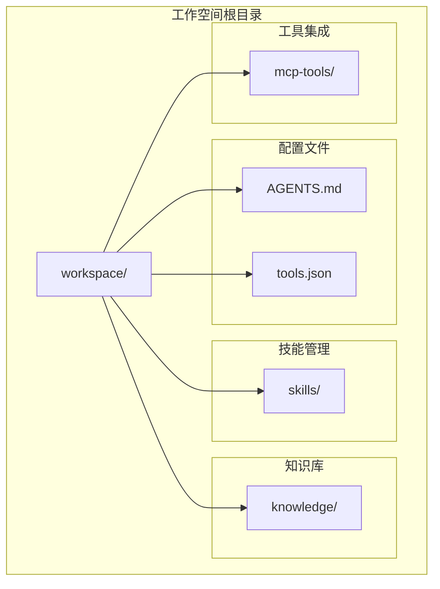
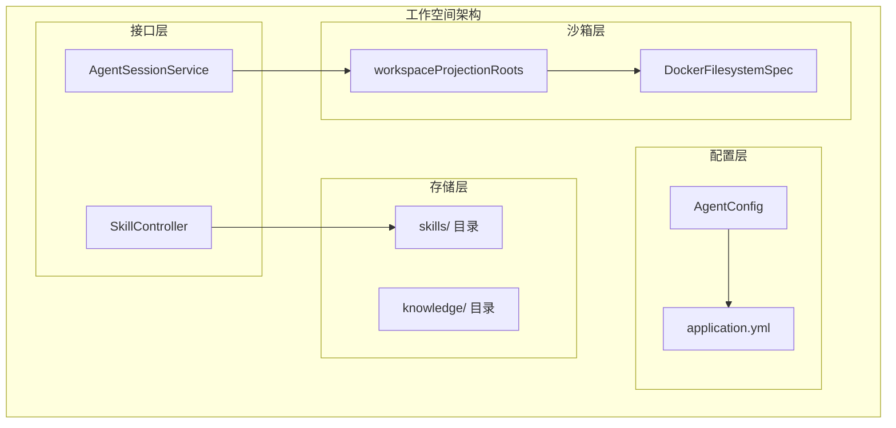
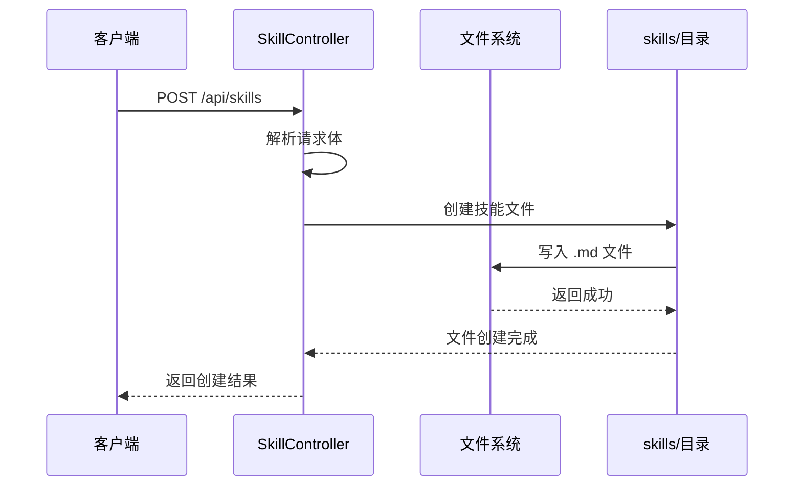
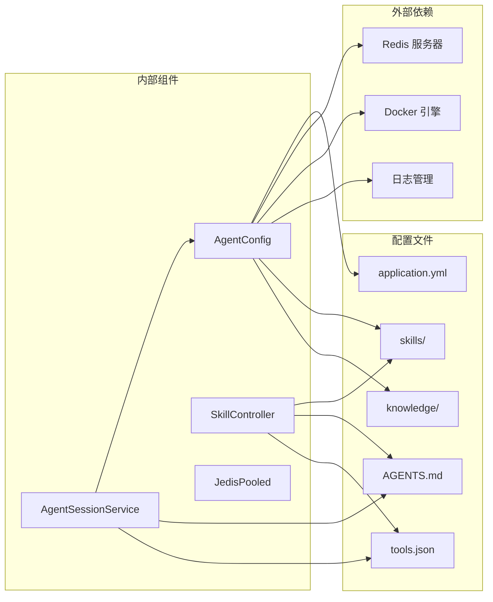

# 工作空间配置

<cite>
**本文档引用的文件**
- [application.yml](file://src/main/resources/application.yml)
- [AGENTS.md](file://src/main/resources/workspace/AGENTS.md)
- [tools.json](file://src/main/resources/workspace/tools.json)
- [SkillController.java](file://src/main/java/com/example/agentic/controller/SkillController.java)
- [AgentConfig.java](file://src/main/java/com/example/agentic/config/AgentConfig.java)
- [AgentSessionService.java](file://src/main/java/com/example/agentic/agent/AgentSessionService.java)
</cite>

## 目录
1. [简介](#简介)
2. [项目结构](#项目结构)
3. [核心组件](#核心组件)
4. [架构概览](#架构概览)
5. [详细组件分析](#详细组件分析)
6. [依赖关系分析](#依赖关系分析)
7. [性能考虑](#性能考虑)
8. [故障排除指南](#故障排除指南)
9. [结论](#结论)

## 简介

本文件详细说明了基于 AgentScope 框架的工作空间配置体系。工作空间作为智能体运行的核心环境，包含了代理配置、技能定义、知识库配置以及工具权限管理等关键要素。本文档将深入解析工作空间的目录结构、文件格式要求、配置模板以及最佳实践。

## 项目结构

工作空间位于应用资源目录下，采用分层组织结构，确保不同类型的配置文件相互独立且易于管理。

**图表来源**
- [application.yml:12-13](file://src/main/resources/application.yml#L12-L13)
- [AgentConfig.java:73-74](file://src/main/java/com/example/agentic/config/AgentConfig.java#L73-L74)

**章节来源**
- [application.yml:12-13](file://src/main/resources/application.yml#L12-L13)
- [AgentConfig.java:73-74](file://src/main/java/com/example/agentic/config/AgentConfig.java#L73-L74)

## 核心组件

### 工作空间配置基础

工作空间通过 Spring 配置属性进行管理，支持开发环境的相对路径和生产环境的绝对路径配置。

| 配置项 | 默认值 | 说明 |
|--------|--------|------|
| agent.workspace | workspace | 工作空间根目录路径 |
| agent.model.base-url | https://api.deepseek.com/v1 | 模型服务基础URL |
| agent.model.api-key | 环境变量 | 模型服务API密钥 |
| agent.model.model-name | deepseek-v4-flash | 默认模型名称 |
| agent.sandbox.image | python:3.12-slim | 沙箱容器镜像 |

**章节来源**
- [application.yml:12-20](file://src/main/resources/application.yml#L12-L20)

### 代理配置文件 (AGENTS.md)

AGENTS.md 文件定义了智能体的基本能力和行为准则，采用 Markdown 格式编写。

#### 核心能力说明

智能体具备以下核心能力：
- 问答信息提供
- 安全沙箱中的代码执行
- 知识搜索和管理
- MCP 工具调用
- 技能使用

#### 行为准则

智能体遵循严格的行为准则：
1. 保持友好和专业的态度
2. 对不确定的问题诚实告知
3. 执行代码前确认用户意图
4. 保护用户隐私，不泄露其他租户信息

**章节来源**
- [AGENTS.md:1-19](file://src/main/resources/workspace/AGENTS.md#L1-L19)

### 工具权限配置 (tools.json)

tools.json 文件控制智能体可使用的工具权限，采用 JSON 格式定义允许的工具列表。

#### 工具权限类型

| 工具类别 | 允许的工具 | 说明 |
|----------|------------|------|
| 文件操作 | read_file, write_file | 文件读写操作 |
| 系统命令 | run_command | 系统命令执行 |
| 内存搜索 | memory_search | 内存数据检索 |
| 代理管理 | agent_spawn | 新代理实例创建 |
| 技能访问 | read_skill | 技能内容读取 |
| MCP工具 | mcp:* | 所有MCP工具 |

**章节来源**
- [tools.json:1-12](file://src/main/resources/workspace/tools.json#L1-L12)

## 架构概览

工作空间架构采用分层设计，确保配置文件的独立性和可维护性。

**图表来源**
- [AgentConfig.java:28-78](file://src/main/java/com/example/agentic/config/AgentConfig.java#L28-L78)
- [SkillController.java:28-71](file://src/main/java/com/example/agentic/controller/SkillController.java#L28-L71)

## 详细组件分析

### 技能管理控制器

SkillController 实现了工作区级别技能的完整 CRUD 操作，支持技能的创建、查询和管理。

#### 技能四层合成优先级

技能系统采用四层优先级机制，确保技能的正确加载和覆盖：

1. **项目全局** (projectGlobalSkillsDir)
2. **市场仓库** (Marketplace skillRepository)
3. **工作区级别** (workspace/skills/)
4. **用户隔离** (userId/skills/)

#### 技能文件管理

控制器负责技能文件的生命周期管理：
- 自动创建 skills 目录
- 支持技能文件的上传和删除
- 提供技能列表查询功能

**图表来源**
- [SkillController.java:61-71](file://src/main/java/com/example/agentic/controller/SkillController.java#L61-L71)

**章节来源**
- [SkillController.java:17-71](file://src/main/java/com/example/agentic/controller/SkillController.java#L17-L71)

### 沙箱文件系统配置

AgentConfig 中的 DockerFilesystemSpec 配置确保了工作空间的安全隔离和文件访问控制。

#### 沙箱隔离机制

- **隔离范围**: SESSION 级别隔离，每个会话拥有独立的沙箱环境
- **文件投影**: 仅将指定的种子文件投影到沙箱中
- **容器镜像**: 使用 Python 3.12 基础镜像确保运行时一致性

#### 投影文件清单

沙箱中可访问的工作空间文件：
- AGENTS.md (代理配置)
- skills/ (技能目录)
- knowledge/ (知识库目录)
- tools.json (工具权限)

**章节来源**
- [AgentConfig.java:68-78](file://src/main/java/com/example/agentic/config/AgentConfig.java#L68-L78)

### 会话服务管理

AgentSessionService 负责处理 AG-UI 协议的会话管理，确保多租户环境下的隔离性。

#### 会话隔离特性

- **多租户支持**: 从 HTTP 头部提取租户和用户标识
- **上下文管理**: 每次调用必须传递 RuntimeContext
- **事件流式输出**: 支持 Server-Sent Events 流式响应

**章节来源**
- [AgentSessionService.java:13-32](file://src/main/java/com/example/agentic/agent/AgentSessionService.java#L13-L32)

## 依赖关系分析

工作空间配置涉及多个组件之间的复杂依赖关系。

**图表来源**
- [application.yml:1-30](file://src/main/resources/application.yml#L1-L30)
- [AgentConfig.java:34-45](file://src/main/java/com/example/agentic/config/AgentConfig.java#L34-L45)

### 组件耦合度分析

- **AgentConfig** 与 **application.yml** 存在强耦合关系
- **SkillController** 与 **skills/** 目录存在直接依赖
- **AgentSessionService** 依赖于 **HarnessAgent** 的配置

**章节来源**
- [application.yml:1-30](file://src/main/resources/application.yml#L1-L30)
- [AgentConfig.java:34-45](file://src/main/java/com/example/agentic/config/AgentConfig.java#L34-L45)

## 性能考虑

### 缓存策略

- **Redis 分布式存储**: 使用 Redis 进行状态持久化和分布式协调
- **键前缀管理**: 所有 Redis 键使用统一前缀便于管理和清理
- **上下文压缩**: 每50条消息触发压缩，保留最近20条消息

### 沙箱性能优化

- **容器镜像复用**: 使用预构建的 Python 3.12 镜像减少启动时间
- **文件系统隔离**: 通过 workspaceProjectionRoots 减少不必要的文件传输
- **会话隔离**: SESSION 级别的隔离确保资源的有效利用

## 故障排除指南

### 常见问题及解决方案

#### 工作空间目录权限问题

**症状**: 技能文件无法创建或保存
**原因**: skills/ 目录权限不足
**解决方案**: 
1. 确保应用进程对工作空间目录具有写权限
2. 检查目录是否存在，不存在则自动创建
3. 验证磁盘空间充足

#### 沙箱文件访问错误

**症状**: 智能体无法访问工作空间文件
**原因**: workspaceProjectionRoots 配置不正确
**解决方案**:
1. 确认 AGENTS.md、skills、knowledge、tools.json 文件存在
2. 检查文件路径是否相对于工作空间根目录
3. 验证文件权限设置

#### Redis 连接失败

**症状**: 应用启动时报 Redis 连接错误
**原因**: REDIS_URI 环境变量配置错误
**解决方案**:
1. 检查 REDIS_URI 环境变量设置
2. 确认 Redis 服务器正常运行
3. 验证网络连接和防火墙设置

**章节来源**
- [SkillController.java:36-40](file://src/main/java/com/example/agentic/controller/SkillController.java#L36-L40)
- [AgentConfig.java:34-37](file://src/main/java/com/example/agentic/config/AgentConfig.java#L34-L37)

## 结论

工作空间配置体系通过清晰的分层架构和严格的文件管理机制，为智能体提供了安全、可扩展的运行环境。该体系的关键优势包括：

1. **模块化设计**: 配置文件独立管理，便于维护和更新
2. **安全隔离**: 沙箱机制确保运行时安全
3. **灵活扩展**: 支持多种技能来源和工具集成
4. **生产就绪**: 提供完整的监控、缓存和分布式协调机制

通过遵循本文档的最佳实践和配置指南，开发者可以快速搭建稳定可靠的工作空间环境，为智能体应用的开发和部署奠定坚实基础。