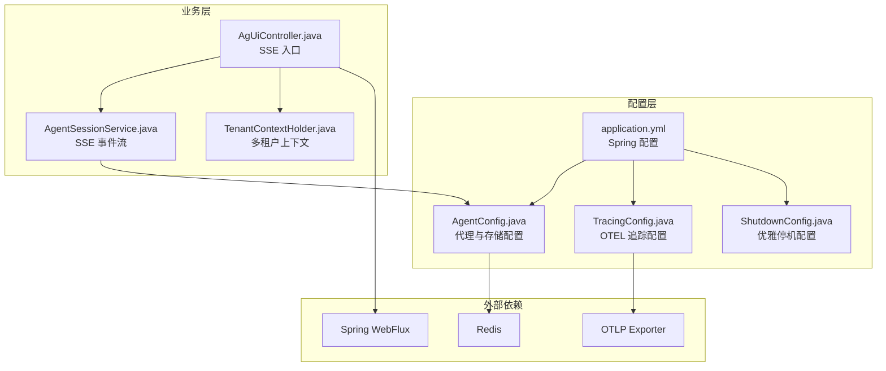
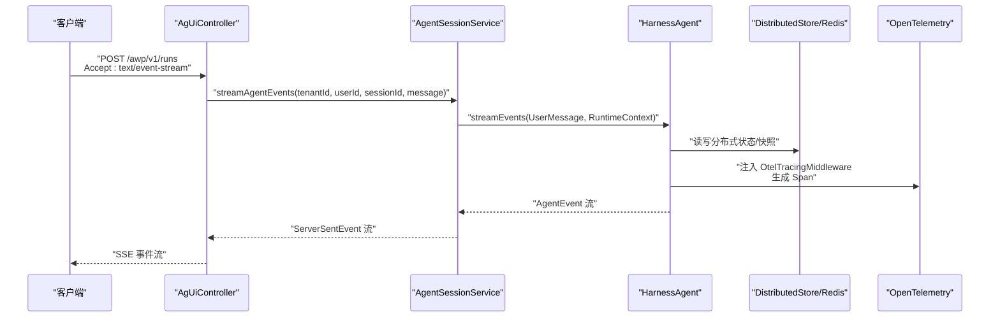
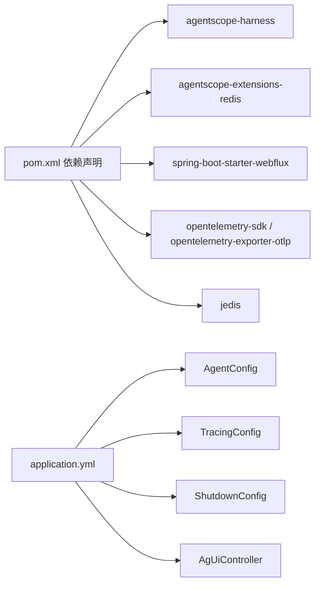

# 应用配置

<cite>
**本文引用的文件**
- [application.yml](file://src/main/resources/application.yml)
- [AgentConfig.java](file://src/main/java/com/example/agentic/config/AgentConfig.java)
- [TracingConfig.java](file://src/main/java/com/example/agentic/config/TracingConfig.java)
- [ShutdownConfig.java](file://src/main/java/com/example/agentic/config/ShutdownConfig.java)
- [AgUiController.java](file://src/main/java/com/example/agentic/controller/AgUiController.java)
- [AgentSessionService.java](file://src/main/java/com/example/agentic/agent/AgentSessionService.java)
- [TenantContextHolder.java](file://src/main/java/com/example/agentic/tenant/TenantContextHolder.java)
- [McpToolConfig.java](file://src/main/java/com/example/agentic/config/McpToolConfig.java)
- [McpToolController.java](file://src/main/java/com/example/agentic/controller/McpToolController.java)
- [pom.xml](file://pom.xml)
</cite>

## 目录
1. [简介](#简介)
2. [项目结构](#项目结构)
3. [核心组件](#核心组件)
4. [架构总览](#架构总览)
5. [详细组件分析](#详细组件分析)
6. [依赖分析](#依赖分析)
7. [性能考虑](#性能考虑)
8. [故障排查指南](#故障排查指南)
9. [结论](#结论)
10. [附录](#附录)

## 简介
本文件系统性梳理应用配置，覆盖以下方面：
- application.yml 中的配置项：Redis 连接、代理模型、SSE 服务器、OpenTelemetry 追踪
- AgentConfig 中的代理参数设置、TracingConfig 的分布式追踪配置、ShutdownConfig 的优雅停机配置
- 环境变量配置方法、配置优先级规则与配置验证机制
- 生产环境配置最佳实践与常见问题解决方案

## 项目结构
应用采用 Spring Boot + WebFlux（SSE）+ AgentScope 智能体框架的组合，关键配置集中在 application.yml 与 Spring 配置类中，并通过控制器暴露 SSE 接口。

图表来源
- [application.yml:1-30](file://src/main/resources/application.yml#L1-L30)
- [AgentConfig.java:28-87](file://src/main/java/com/example/agentic/config/AgentConfig.java#L28-L87)
- [TracingConfig.java:22-45](file://src/main/java/com/example/agentic/config/TracingConfig.java#L22-L45)
- [ShutdownConfig.java:14-21](file://src/main/java/com/example/agentic/config/ShutdownConfig.java#L14-L21)
- [AgUiController.java:22-75](file://src/main/java/com/example/agentic/controller/AgUiController.java#L22-L75)
- [AgentSessionService.java:23-63](file://src/main/java/com/example/agentic/agent/AgentSessionService.java#L23-L63)
- [TenantContextHolder.java:16-58](file://src/main/java/com/example/agentic/tenant/TenantContextHolder.java#L16-L58)

章节来源
- [application.yml:1-30](file://src/main/resources/application.yml#L1-L30)
- [AgentConfig.java:28-87](file://src/main/java/com/example/agentic/config/AgentConfig.java#L28-L87)
- [TracingConfig.java:22-45](file://src/main/java/com/example/agentic/config/TracingConfig.java#L22-L45)
- [ShutdownConfig.java:14-21](file://src/main/java/com/example/agentic/config/ShutdownConfig.java#L14-L21)
- [AgUiController.java:22-75](file://src/main/java/com/example/agentic/controller/AgUiController.java#L22-L75)
- [AgentSessionService.java:23-63](file://src/main/java/com/example/agentic/agent/AgentSessionService.java#L23-L63)
- [TenantContextHolder.java:16-58](file://src/main/java/com/example/agentic/tenant/TenantContextHolder.java#L16-L58)

## 核心组件
- Redis 连接与键前缀：通过 application.yml 的 spring.data.redis.url 与 agentic.redis.key-prefix 配置，AgentConfig 中使用 @Value 注入并创建 JedisPooled 与 RedisDistributedStore。
- 代理模型配置：application.yml 的 agent.model.* 与 agent.sandbox.image 等，由 AgentConfig 构建 OpenAIChatModel 与 DockerFilesystemSpec。
- SSE 服务器配置：application.yml 的 server.shutdown 与 server.port，控制器 AgUiController 暴露 /awp/v1/runs SSE 端点。
- OpenTelemetry 追踪：application.yml 的 otel.exporter.otlp.endpoint，TracingConfig 创建 OpenTelemetry SDK 并注册全局实例。
- 优雅停机：application.yml 的 server.shutdown=graceful，ShutdownConfig 作为扩展点预留自定义配置。

章节来源
- [application.yml:1-30](file://src/main/resources/application.yml#L1-L30)
- [AgentConfig.java:31-84](file://src/main/java/com/example/agentic/config/AgentConfig.java#L31-L84)
- [TracingConfig.java:25-43](file://src/main/java/com/example/agentic/config/TracingConfig.java#L25-L43)
- [AgUiController.java:43-56](file://src/main/java/com/example/agentic/controller/AgUiController.java#L43-L56)
- [ShutdownConfig.java:17-19](file://src/main/java/com/example/agentic/config/ShutdownConfig.java#L17-L19)

## 架构总览
应用配置贯穿“配置文件 → Spring Bean → 业务服务”的链路，SSE 通过 WebFlux 流式输出，Tracing 通过中间件注入到智能体执行链路。

图表来源
- [AgUiController.java:43-56](file://src/main/java/com/example/agentic/controller/AgUiController.java#L43-L56)
- [AgentSessionService.java:43-61](file://src/main/java/com/example/agentic/agent/AgentSessionService.java#L43-L61)
- [AgentConfig.java:48-84](file://src/main/java/com/example/agentic/config/AgentConfig.java#L48-L84)
- [TracingConfig.java:25-43](file://src/main/java/com/example/agentic/config/TracingConfig.java#L25-L43)

## 详细组件分析

### Redis 连接与键前缀配置
- application.yml
  - spring.data.redis.url：默认值为 redis://localhost:6379/1，建议生产使用带鉴权的 Redis 地址并指定数据库编号，避免与其它服务冲突。
  - agentic.redis.key-prefix：默认值为 agentic，所有 Redis 键均以该前缀开头，便于运维识别与清理。
- AgentConfig
  - 通过 @Value 注入 spring.data.redis.url 创建 JedisPooled。
  - 通过 @Value 注入 agentic.redis.key-prefix 创建 RedisDistributedStore，实现状态存储、基础存储、快照与执行保护的一键配置。
- 验证与排障
  - 若连接失败，检查 REDIS_URI 环境变量或容器网络；确认 Redis 数据库编号与其它服务不冲突。
  - 键前缀变更会影响历史数据可见性，上线前应评估迁移策略。

章节来源
- [application.yml:5-10](file://src/main/resources/application.yml#L5-L10)
- [AgentConfig.java:35-45](file://src/main/java/com/example/agentic/config/AgentConfig.java#L35-L45)

### 代理模型与沙箱配置
- application.yml
  - agent.workspace：开发使用相对路径，生产建议使用绝对路径指向持久化卷。
  - agent.model.base-url：默认 DeepSeek API 地址，可替换为其他兼容 OpenAI Chat 的服务。
  - agent.model.api-key：必填，建议通过环境变量注入。
  - agent.model.model-name：默认 deepseek-v4-flash，按需调整。
  - agent.sandbox.image：默认 python:3.12-slim，可替换为包含所需工具的镜像。
- AgentConfig
  - 构建 OpenAIChatModel 并启用流式输出。
  - DockerFilesystemSpec 配置隔离范围为 SESSION，投射种子文件目录，确保沙箱内可访问必要的资源。
  - 配置上下文压缩与大工具结果卸载，优化内存占用与性能。
  - 注入 OtelTracingMiddleware，使代理调用链可观测。
- 验证与排障
  - 模型密钥错误会导致认证失败；确认 base-url 与 model-name 与目标服务匹配。
  - 沙箱镜像缺少依赖会导致执行失败；建议预热镜像并测试常用命令。

章节来源
- [application.yml:12-21](file://src/main/resources/application.yml#L12-L21)
- [AgentConfig.java:48-84](file://src/main/java/com/example/agentic/config/AgentConfig.java#L48-L84)

### SSE 服务器配置与多租户
- application.yml
  - server.shutdown=graceful：启用优雅停机。
  - server.port：默认 8080，生产建议固定端口并配合反向代理。
- AgUiController
  - 暴露 /awp/v1/runs，接收 AG-UI 规范请求，返回 text/event-stream。
  - 从请求头 X-Tenant-Id 与 X-User-Id 提取多租户信息，构造 RuntimeContext。
- AgentSessionService
  - 将用户消息封装为 UserMessage，调用 HarnessAgent.streamEvents 获取事件流。
  - 将事件映射为 AG-UI SSE 格式，过滤空事件并发送。
- TenantContextHolder
  - WebFilter 从 HTTP 头部提取租户与用户标识，注入 Reactor Context，供后续链路使用。
- 验证与排障
  - 客户端需设置 Accept: text/event-stream；若未收到事件，检查控制器是否正确解析 thread_id 与消息数组。
  - 多租户隔离失败通常因未传递 X-Tenant-Id/X-User-Id 或未在 RuntimeContext 中正确拼接。

章节来源
- [application.yml:27-29](file://src/main/resources/application.yml#L27-L29)
- [AgUiController.java:43-56](file://src/main/java/com/example/agentic/controller/AgUiController.java#L43-L56)
- [AgentSessionService.java:43-61](file://src/main/java/com/example/agentic/agent/AgentSessionService.java#L43-L61)
- [TenantContextHolder.java:25-41](file://src/main/java/com/example/agentic/tenant/TenantContextHolder.java#L25-L41)

### OpenTelemetry 追踪配置
- application.yml
  - otel.exporter.otlp.endpoint：默认 http://localhost:4318，生产建议指向 Langfuse 或 AgentScope Studio 的 OTLP 端点。
- TracingConfig
  - 创建 OtlpGrpcSpanExporter 并注册 BatchSpanProcessor。
  - 设置 Resource(service.name)，构建 SdkTracerProvider 并注册为全局 OpenTelemetry 实例。
  - AgentConfig 中为 HarnessAgent 注入 OtelTracingMiddleware，形成 /awp/v1/runs → agent.run → model.call → tool.call 的层级。
- 验证与排障
  - 确认 OTLP 端点可达且协议匹配；若无数据，检查 exporter endpoint 与网络策略。
  - 服务名与 Span 层级有助于定位问题根因。

章节来源
- [application.yml:22-26](file://src/main/resources/application.yml#L22-L26)
- [TracingConfig.java:25-43](file://src/main/java/com/example/agentic/config/TracingConfig.java#L25-L43)
- [AgentConfig.java:82-84](file://src/main/java/com/example/agentic/config/AgentConfig.java#L82-L84)

### 优雅停机配置
- application.yml
  - server.shutdown=graceful：启用 Spring Boot 优雅停机。
- ShutdownConfig
  - 当前为空配置类，预留扩展点：如需自定义 inflight 等待时间或注册额外的 shutdown hook，可在该类中进行扩展。
- 验证与排障
  - 容器编排需发送 SIGTERM；若停机过快导致请求中断，可结合业务逻辑延长等待时间。

章节来源
- [application.yml:27-28](file://src/main/resources/application.yml#L27-L28)
- [ShutdownConfig.java:17-19](file://src/main/java/com/example/agentic/config/ShutdownConfig.java#L17-L19)

### MCP 工具注册（静态与动态）
- McpToolConfig
  - 提供静态注册示例注释，展示如何在启动时通过配置文件连接 MCP Server。
- McpToolController
  - 提供动态注册接口：POST /api/tools/mcp（创建）、GET /api/tools/mcp（列举）、DELETE /api/tools/mcp（移除）。
  - 当前为占位实现，实际注册逻辑需补充到 HarnessAgent Toolkit。
- 验证与排障
  - 动态注册成功后需确认 MCP Server 可达且返回规范响应；若工具未生效，检查注册 URL 与传输类型。

章节来源
- [McpToolConfig.java:14-24](file://src/main/java/com/example/agentic/config/McpToolConfig.java#L14-L24)
- [McpToolController.java:17-68](file://src/main/java/com/example/agentic/controller/McpToolController.java#L17-L68)

## 依赖分析
- Maven 依赖
  - AgentScope HarnessAgent 与 Redis 扩展：提供智能体核心能力与分布式存储。
  - Spring Boot WebFlux：提供 SSE 流式输出能力。
  - OpenTelemetry SDK 与 OTLP Exporter：提供分布式追踪导出能力。
  - Jedis：Redis 客户端，用于 agentscope-extensions-redis。
- 配置依赖
  - application.yml 的各配置项通过 @Value 注入到 Spring Bean，形成“配置 → 组件”的绑定关系。

图表来源
- [pom.xml:65-111](file://pom.xml#L65-L111)
- [application.yml:1-30](file://src/main/resources/application.yml#L1-L30)
- [AgentConfig.java:28-87](file://src/main/java/com/example/agentic/config/AgentConfig.java#L28-L87)
- [TracingConfig.java:22-45](file://src/main/java/com/example/agentic/config/TracingConfig.java#L22-L45)
- [ShutdownConfig.java:14-21](file://src/main/java/com/example/agentic/config/ShutdownConfig.java#L14-L21)
- [AgUiController.java:22-75](file://src/main/java/com/example/agentic/controller/AgUiController.java#L22-L75)

章节来源
- [pom.xml:65-111](file://pom.xml#L65-L111)

## 性能考虑
- Redis
  - 使用独立数据库编号与明确键前缀，降低冲突与清理成本。
  - 合理设置键 TTL 与内存淘汰策略，避免热点键造成阻塞。
- 沙箱
  - 预热镜像，减少首次拉取与初始化延迟。
  - 控制投射目录大小，避免不必要的文件进入沙箱。
- SSE
  - 保持长连接稳定，避免频繁重连；合理设置客户端缓冲与超时。
- 追踪
  - 使用批量导出与合适的采样率，平衡可观测性与性能。
- 优雅停机
  - 结合业务处理耗时，适当延长等待时间，确保请求完整处理。

## 故障排查指南
- Redis 连接失败
  - 检查 REDIS_URI 是否正确；确认容器网络与防火墙策略。
  - 核对数据库编号与其它服务是否冲突。
- 模型认证失败
  - 确认 DEEPSEEK_API_KEY 是否正确注入；核对 base-url 与 model-name。
- SSE 无事件输出
  - 确认客户端 Accept: text/event-stream；检查控制器是否正确解析 thread_id 与消息数组。
  - 核对 X-Tenant-Id 与 X-User-Id 是否传递。
- 追踪无数据
  - 检查 otel.exporter.otlp.endpoint 是否可达；确认 OTLP 协议与端口。
- 优雅停机异常
  - 确认容器编排发送 SIGTERM；必要时在 ShutdownConfig 中扩展自定义等待时间。

章节来源
- [application.yml:5-26](file://src/main/resources/application.yml#L5-L26)
- [AgentConfig.java:35-84](file://src/main/java/com/example/agentic/config/AgentConfig.java#L35-L84)
- [TracingConfig.java:25-43](file://src/main/java/com/example/agentic/config/TracingConfig.java#L25-L43)
- [AgUiController.java:43-73](file://src/main/java/com/example/agentic/controller/AgUiController.java#L43-L73)
- [ShutdownConfig.java:17-19](file://src/main/java/com/example/agentic/config/ShutdownConfig.java#L17-L19)

## 结论
本应用通过 application.yml 与 Spring 配置类实现了 Redis 存储、代理模型、SSE 服务器与 OpenTelemetry 追踪的统一配置。生产部署建议明确环境变量注入、固定端口与数据库编号、预热镜像与键前缀策略，并结合优雅停机与可观测性保障稳定性与可维护性。

## 附录

### 环境变量与配置优先级
- 环境变量注入
  - REDIS_URI：覆盖 spring.data.redis.url，默认值为 redis://localhost:6379/1。
  - AGENTIC_REDIS_KEY_PREFIX：覆盖 agentic.redis.key-prefix，默认值为 agentic。
  - AGENT_WORKSPACE：覆盖 agent.workspace，默认值为 workspace。
  - DEEPSEEK_BASE_URL：覆盖 agent.model.base-url，默认值为 https://api.deepseek.com/v1。
  - DEEPSEEK_API_KEY：覆盖 agent.model.api-key，必填。
  - DEEPSEEK_MODEL：覆盖 agent.model.model-name，默认值为 deepseek-v4-flash。
  - LANGFUSE_OTEL_ENDPOINT：覆盖 otel.exporter.otlp.endpoint，默认值为 http://localhost:4318。
- 配置优先级（Spring Boot）
  - 命令行参数 > 环境变量 > application.yml > 默认值
  - 建议生产使用环境变量注入，避免硬编码在配置文件中。

章节来源
- [application.yml:5-26](file://src/main/resources/application.yml#L5-L26)
- [AgentConfig.java:31-52](file://src/main/java/com/example/agentic/config/AgentConfig.java#L31-L52)
- [TracingConfig.java:27](file://src/main/java/com/example/agentic/config/TracingConfig.java#L27)