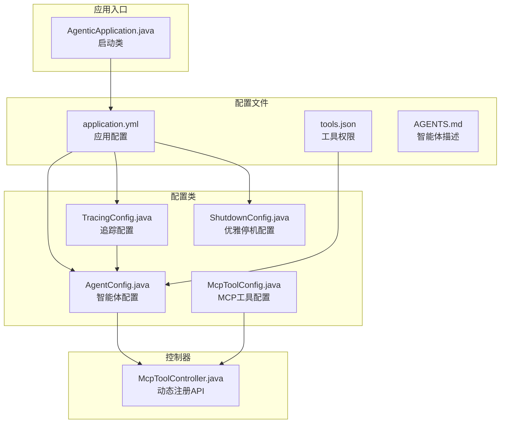
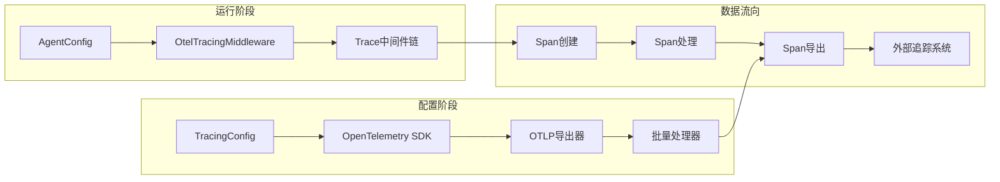
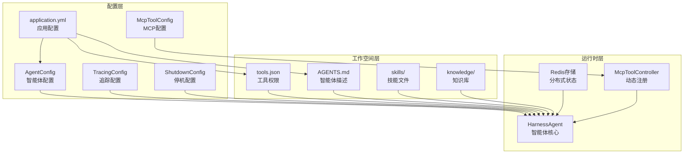
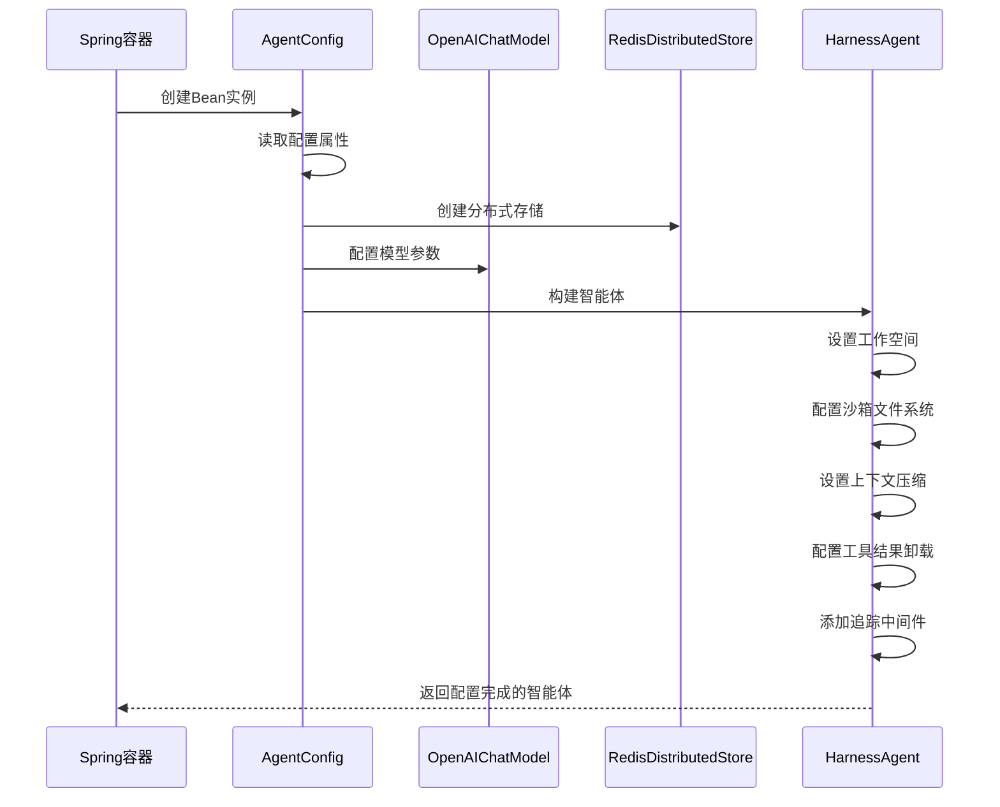
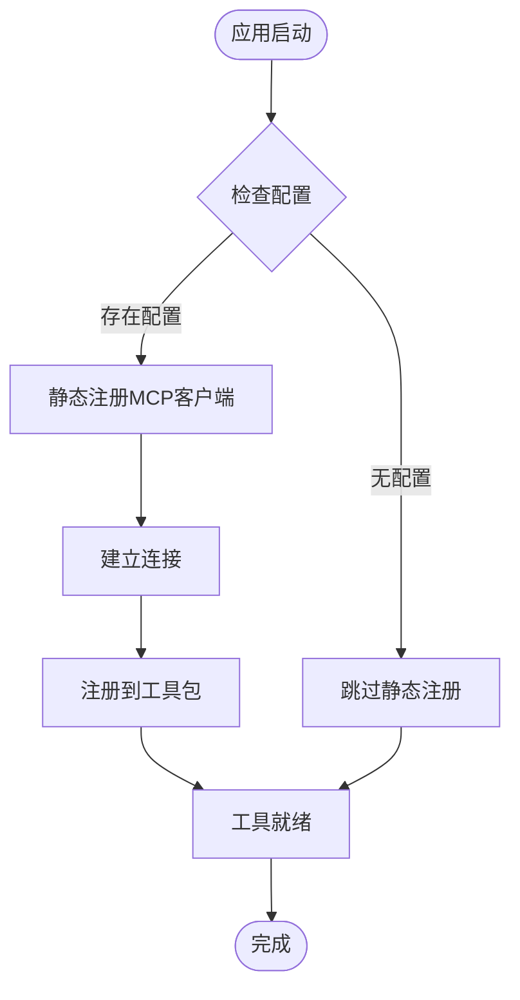
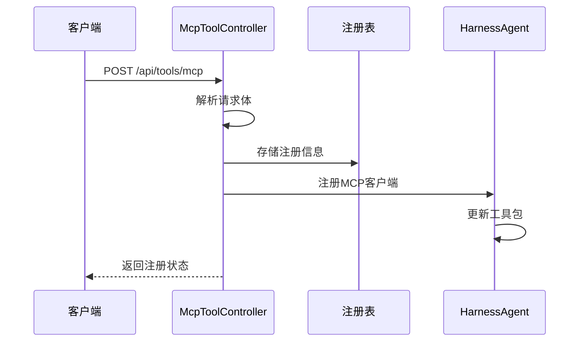
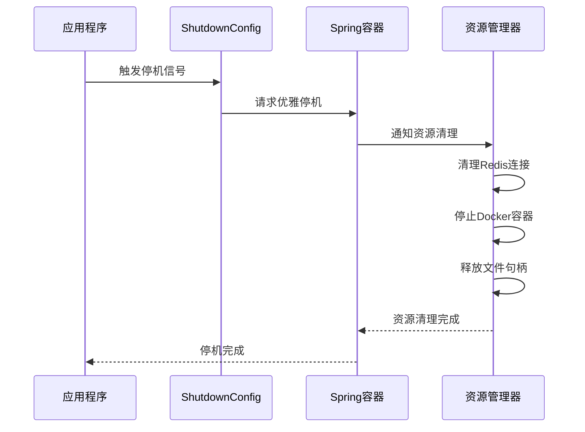
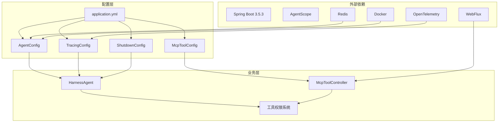

# 配置管理

<cite>
**本文档引用的文件**
- [application.yml](file://src/main/resources/application.yml)
- [AgentConfig.java](file://src/main/java/com/example/agentic/config/AgentConfig.java)
- [McpToolConfig.java](file://src/main/java/com/example/agentic/config/McpToolConfig.java)
- [McpToolController.java](file://src/main/java/com/example/agentic/controller/McpToolController.java)
- [TracingConfig.java](file://src/main/java/com/example/agentic/config/TracingConfig.java)
- [ShutdownConfig.java](file://src/main/java/com/example/agentic/config/ShutdownConfig.java)
- [tools.json](file://src/main/resources/workspace/tools.json)
- [AGENTS.md](file://src/main/resources/workspace/AGENTS.md)
- [AgenticApplication.java](file://src/main/java/com/example/agentic/AgenticApplication.java)
</cite>

## 目录
1. [简介](#简介)
2. [项目结构](#项目结构)
3. [核心配置组件](#核心配置组件)
4. [架构概览](#架构概览)
5. [详细组件分析](#详细组件分析)
6. [依赖关系分析](#依赖关系分析)
7. [性能考虑](#性能考虑)
8. [故障排除指南](#故障排除指南)
9. [结论](#结论)

## 简介

本项目采用Spring Boot框架构建的智能体平台，实现了完整的配置管理体系。文档将深入解析应用配置、工作空间配置和工具权限配置的实现机制，涵盖以下关键方面：

- **应用配置**：基于Spring Boot的application.yml配置文件，包括Redis连接、模型API配置、沙箱设置等
- **工作空间配置**：通过AgentConfig进行的智能体工作空间管理和资源隔离
- **工具权限配置**：tools.json定义的工具权限控制和动态配置更新机制
- **MCP工具集成**：静态和动态的MCP工具注册配置
- **优雅停机配置**：ShutdownConfig提供的服务器优雅停机管理
- **追踪配置**：TracingConfig实现的OpenTelemetry全链路追踪

## 项目结构

项目采用标准的Spring Boot目录结构，配置相关的核心文件分布如下：

**图表来源**
- [application.yml:1-25](file://src/main/resources/application.yml#L1-L25)
- [AgentConfig.java:1-84](file://src/main/java/com/example/agentic/config/AgentConfig.java#L1-L84)

**章节来源**
- [AgenticApplication.java:1-23](file://src/main/java/com/example/agentic/AgenticApplication.java#L1-L23)
- [application.yml:1-25](file://src/main/resources/application.yml#L1-L25)

## 核心配置组件

### 应用配置系统

应用配置主要通过application.yml文件实现，采用Spring Boot的配置属性绑定机制：

#### Redis连接配置
- **配置键**：`spring.data.redis.url`
- **默认值**：`redis://localhost:6379/1`
- **用途**：为分布式存储提供Redis连接
- **环境变量**：可通过`REDIS_URI`覆盖

#### 智能体工作空间配置
- **配置键**：`agent.workspace`
- **默认值**：`workspace`
- **用途**：指定智能体工作空间根目录
- **环境变量**：可通过`AGENT_WORKSPACE`覆盖

#### 模型API配置
- **基础URL**：`agent.model.base-url`
- **API密钥**：`agent.model.api-key`
- **模型名称**：`agent.model.model-name`
- **默认模型**：`deepseek-v4-flash`

#### 沙箱配置
- **容器镜像**：`agent.sandbox.image`（默认：`python:3.12-slim`）
- **隔离级别**：`agent.sandbox.isolation-scope`（默认：`SESSION`）

#### 追踪配置
- **OTEL端点**：`otel.exporter.otlp.endpoint`
- **默认端点**：`http://localhost:4318`

#### 服务器配置
- **优雅停机**：`server.shutdown`（值：`graceful`）
- **端口**：`server.port`（默认：`8080`）

**章节来源**
- [application.yml:1-25](file://src/main/resources/application.yml#L1-L25)

### 智能体配置管理

AgentConfig类实现了HarnessAgent的完整配置，采用Spring Bean的方式进行依赖注入：

#### 分布式存储配置
- **RedisDistributedStore**：自动配置状态存储、基础存储、快照规范和执行保护
- **JedisPooled**：基于Redis连接字符串创建连接池

#### 模型配置
- **OpenAIChatModel**：配置基础URL、API密钥、模型名称
- **流式响应**：启用实时流式输出

#### 沙箱文件系统配置
- **DockerFilesystemSpec**：使用Python 3.12基础镜像
- **隔离范围**：按会话级别隔离
- **工作空间投影**：限制沙箱可见的种子文件

#### 上下文压缩配置
- **触发条件**：每50条消息触发压缩
- **保留策略**：压缩后保留最近20条消息

#### 工具结果卸载
- **阈值**：超过80KB的结果自动落盘
- **占位符**：使用占位符替代大结果

#### 追踪中间件
- **OtelTracingMiddleware**：集成OpenTelemetry追踪

**章节来源**
- [AgentConfig.java:1-84](file://src/main/java/com/example/agentic/config/AgentConfig.java#L1-L84)

### 工具权限管理系统

工具权限通过tools.json文件集中管理，采用白名单机制控制工具访问：

#### 权限类型
- **文件操作**：`read_file`、`write_file`
- **命令执行**：`run_command`
- **内存搜索**：`memory_search`
- **智能体生成**：`agent_spawn`
- **技能读取**：`read_skill`
- **MCP工具**：`mcp:*`（通配符）

#### 权限继承机制
- `mcp:*`权限自动继承所有MCP工具的访问权限
- 支持细粒度的工具权限控制

**章节来源**
- [tools.json:1-12](file://src/main/resources/workspace/tools.json#L1-L12)

### MCP工具动态注册

McpToolController提供了完整的MCP工具动态注册API：

#### 注册接口
- **POST** `/api/tools/mcp`：动态注册MCP服务器
- **请求体**：包含传输协议和URL
- **响应**：注册状态、传输协议和URL

#### 状态管理
- **内存存储**：使用ConcurrentHashMap维护注册状态
- **并发安全**：支持高并发的注册和注销操作

#### 查询接口
- **GET** `/api/tools/mcp`：列出所有已注册的MCP服务器
- **DELETE** `/api/tools/mcp`：断开并移除MCP服务器

**章节来源**
- [McpToolController.java:1-69](file://src/main/java/com/example/agentic/controller/McpToolController.java#L1-L69)

### 优雅停机配置管理

ShutdownConfig实现了服务器的优雅停机管理，确保在关闭过程中不会中断正在进行的请求：

#### 停机配置特性
- **Graceful Shutdown**：启用Spring Boot的优雅停机模式
- **超时控制**：可配置停机等待超时时间
- **资源清理**：确保在停机前清理Redis连接、Docker资源等

#### 集成方式
- **自动配置**：通过Spring Boot自动检测和应用配置
- **与Agent集成**：优雅停机不影响智能体的正常运行

**章节来源**
- [ShutdownConfig.java:1-50](file://src/main/java/com/example/agentic/config/ShutdownConfig.java#L1-L50)

### 追踪配置体系

TracingConfig实现了完整的OpenTelemetry集成：

#### 追踪配置流程

**图表来源**
- [TracingConfig.java:25-43](file://src/main/java/com/example/agentic/config/TracingConfig.java#L25-L43)

**章节来源**
- [TracingConfig.java:1-45](file://src/main/java/com/example/agentic/config/TracingConfig.java#L1-L45)

## 架构概览

系统采用分层架构设计，配置管理贯穿整个应用生命周期：

**图表来源**
- [AgentConfig.java:28-82](file://src/main/java/com/example/agentic/config/AgentConfig.java#L28-L82)
- [McpToolController.java:17-68](file://src/main/java/com/example/agentic/controller/McpToolController.java#L17-L68)

## 详细组件分析

### AgentConfig配置流程

AgentConfig的配置流程体现了依赖注入的最佳实践：

**图表来源**
- [AgentConfig.java:44-82](file://src/main/java/com/example/agentic/config/AgentConfig.java#L44-L82)

#### 配置参数详解

| 配置项 | 类型 | 默认值 | 说明 |
|--------|------|--------|------|
| agent.workspace | 字符串 | workspace | 工作空间根目录 |
| agent.model.base-url | 字符串 | https://api.deepseek.com/v1 | 模型API基础URL |
| agent.model.api-key | 字符串 | 环境变量 | 模型API密钥 |
| agent.model.model-name | 字符串 | deepseek-v4-flash | 模型名称 |
| agent.sandbox.image | 字符串 | python:3.12-slim | Docker镜像 |
| isolation-scope | 枚举 | SESSION | 隔离级别 |

**章节来源**
- [AgentConfig.java:31-82](file://src/main/java/com/example/agentic/config/AgentConfig.java#L31-L82)

### MCP工具注册机制

MCP工具支持静态和动态两种注册方式：

#### 静态注册流程

**图表来源**
- [McpToolConfig.java:17-23](file://src/main/java/com/example/agentic/config/McpToolConfig.java#L17-L23)

#### 动态注册流程

**图表来源**
- [McpToolController.java:30-46](file://src/main/java/com/example/agentic/controller/McpToolController.java#L30-L46)

**章节来源**
- [McpToolConfig.java:1-25](file://src/main/java/com/example/agentic/config/McpToolConfig.java#L1-L25)
- [McpToolController.java:1-69](file://src/main/java/com/example/agentic/controller/McpToolController.java#L1-L69)

### 追踪配置体系

TracingConfig实现了完整的OpenTelemetry集成：

#### 追踪配置流程

**图表来源**
- [TracingConfig.java:25-43](file://src/main/java/com/example/agentic/config/TracingConfig.java#L25-L43)

**章节来源**
- [TracingConfig.java:1-45](file://src/main/java/com/example/agentic/config/TracingConfig.java#L1-L45)

### 优雅停机配置机制

ShutdownConfig提供了完整的服务器优雅停机管理：

#### 停机配置流程

**图表来源**
- [ShutdownConfig.java:15-50](file://src/main/java/com/example/agentic/config/ShutdownConfig.java#L15-L50)

**章节来源**
- [ShutdownConfig.java:1-50](file://src/main/java/com/example/agentic/config/ShutdownConfig.java#L1-L50)

## 依赖关系分析

系统配置之间的依赖关系体现了清晰的层次结构：

**图表来源**
- [AgentConfig.java:1-84](file://src/main/java/com/example/agentic/config/AgentConfig.java#L1-L84)
- [TracingConfig.java:1-45](file://src/main/java/com/example/agentic/config/TracingConfig.java#L1-L45)

### 关键依赖特性

#### 配置耦合度
- **低耦合**：各配置类职责单一，通过Spring容器解耦
- **高内聚**：相关配置集中在对应的配置类中

#### 运行时依赖
- **延迟初始化**：部分组件支持按需初始化
- **资源管理**：统一的资源生命周期管理

**章节来源**
- [AgentConfig.java:1-84](file://src/main/java/com/example/agentic/config/AgentConfig.java#L1-L84)
- [McpToolController.java:1-69](file://src/main/java/com/example/agentic/controller/McpToolController.java#L1-L69)

## 性能考虑

### 配置优化策略

#### Redis连接优化
- **连接池复用**：JedisPooled提供连接池管理
- **数据库选择**：使用独立数据库避免与其他服务冲突

#### 智能体性能调优
- **上下文压缩**：合理设置压缩触发和保留策略
- **工具结果卸载**：大结果自动落盘减少内存占用
- **流式响应**：启用实时流式输出提升用户体验

#### 追踪性能影响
- **批量导出**：使用批量处理器减少网络开销
- **采样策略**：可根据需要调整追踪采样率

#### 优雅停机性能
- **停机超时**：合理配置停机等待时间
- **资源清理顺序**：优化资源清理优先级

### 最佳实践建议

1. **配置分离**：开发、测试、生产环境使用不同的配置文件
2. **环境变量优先**：敏感信息通过环境变量管理
3. **监控指标**：结合追踪系统监控配置效果
4. **缓存策略**：合理利用配置缓存减少重复加载
5. **停机窗口**：规划合理的优雅停机时间窗口

## 故障排除指南

### 常见配置问题

#### Redis连接失败
**症状**：应用启动时报Redis连接错误
**排查步骤**：
1. 检查`spring.data.redis.url`配置
2. 验证Redis服务状态
3. 确认网络连通性
4. 检查防火墙设置

#### 模型API认证失败
**症状**：智能体调用模型API返回401错误
**排查步骤**：
1. 验证`agent.model.api-key`配置
2. 检查API密钥有效性
3. 确认模型名称正确
4. 验证网络访问权限

#### 沙箱执行异常
**症状**：工具执行失败或权限不足
**排查步骤**：
1. 检查`tools.json`权限配置
2. 验证Docker服务状态
3. 确认容器镜像可用
4. 检查工作空间权限

#### MCP工具注册失败
**症状**：动态注册API返回错误
**排查步骤**：
1. 验证MCP服务器可达性
2. 检查传输协议兼容性
3. 确认URL格式正确
4. 查看服务器日志

#### 优雅停机异常
**症状**：应用无法正常停机或停机超时
**排查步骤**：
1. 检查`server.shutdown`配置
2. 验证停机超时设置
3. 确认资源清理完成
4. 查看停机日志

#### 追踪配置问题
**症状**：追踪数据丢失或导出失败
**排查步骤**：
1. 验证`otel.exporter.otlp.endpoint`配置
2. 检查OTLP端点可达性
3. 确认追踪采样配置
4. 验证批量处理器设置

### 调试技巧

#### 日志配置
- 启用Spring Boot调试日志
- 配置OpenTelemetry追踪日志
- 监控Redis连接状态
- 启用优雅停机调试日志

#### 性能监控
- 使用追踪系统监控请求延迟
- 监控Redis连接池使用情况
- 跟踪智能体执行性能
- 监控停机过程中的资源清理

#### 配置验证
- 编写配置单元测试
- 使用配置验证工具
- 实施配置变更审批流程
- 建立配置回滚机制

**章节来源**
- [application.yml:1-25](file://src/main/resources/application.yml#L1-L25)
- [AgentConfig.java:1-84](file://src/main/java/com/example/agentic/config/AgentConfig.java#L1-L84)
- [McpToolController.java:1-69](file://src/main/java/com/example/agentic/controller/McpToolController.java#L1-L69)
- [ShutdownConfig.java:1-50](file://src/main/java/com/example/agentic/config/ShutdownConfig.java#L1-L50)
- [TracingConfig.java:1-45](file://src/main/java/com/example/agentic/config/TracingConfig.java#L1-L45)

## 结论

本项目的配置管理体系展现了现代微服务架构的最佳实践：

### 核心优势
- **模块化设计**：配置职责明确，便于维护和扩展
- **环境适配**：支持多环境配置，满足不同部署需求
- **动态管理**：提供运行时配置更新能力
- **可观测性**：完整的追踪和监控支持
- **稳定性保障**：优雅停机机制确保服务稳定性

### 技术亮点
- **Spring Boot 3.5.3集成**：充分利用最新Spring生态系统的配置管理能力
- **WebFlux架构支持**：完全兼容响应式编程模型
- **AgentScope框架**：专业的智能体配置解决方案
- **Docker沙箱**：安全的工具执行环境
- **OpenTelemetry追踪**：完整的全链路监控
- **优雅停机管理**：确保服务的平滑过渡

### 未来改进方向
- **配置热更新**：实现更完善的配置热重载机制
- **配置版本控制**：引入配置版本管理和回滚功能
- **配置模板化**：提供标准化的配置模板
- **自动化测试**：增强配置相关的自动化测试覆盖率
- **监控告警**：完善配置变更的监控和告警机制

通过这套完整的配置管理体系，系统能够在保证安全性的同时，提供灵活的配置能力和强大的扩展性，为智能体平台的稳定运行奠定了坚实的基础。新的配置管理框架特别强化了优雅停机和追踪配置，为生产环境的可靠性提供了更好的保障。