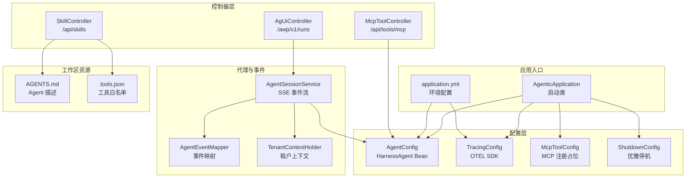
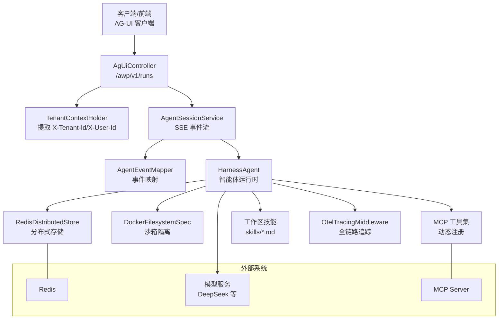
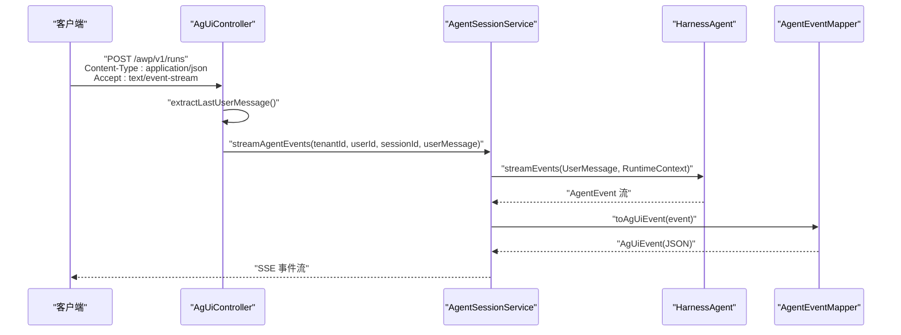
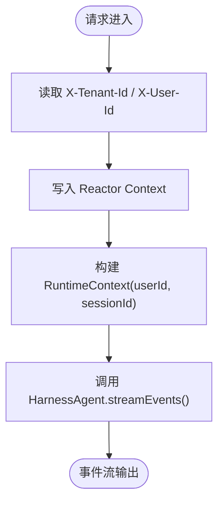
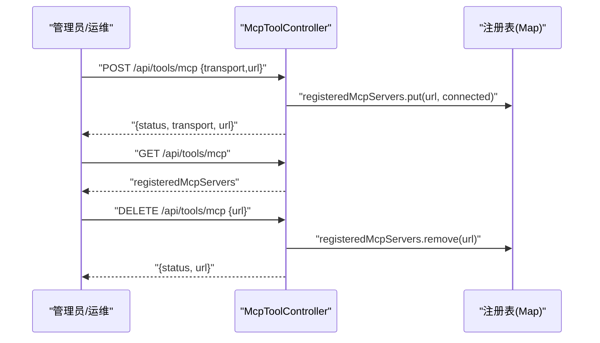
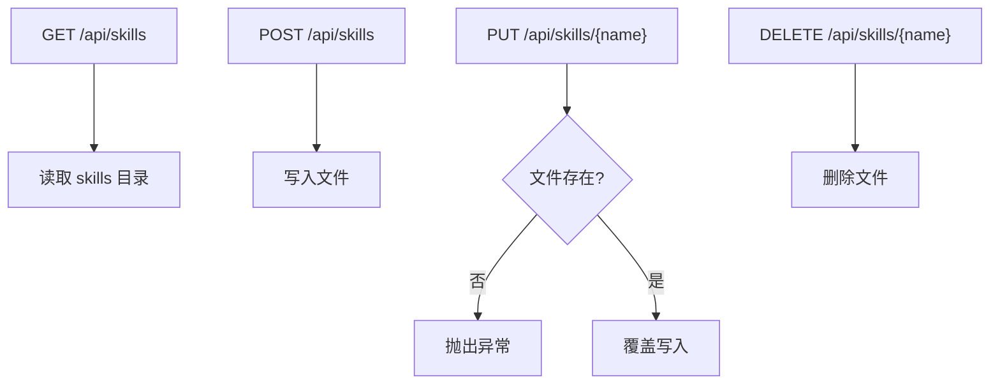
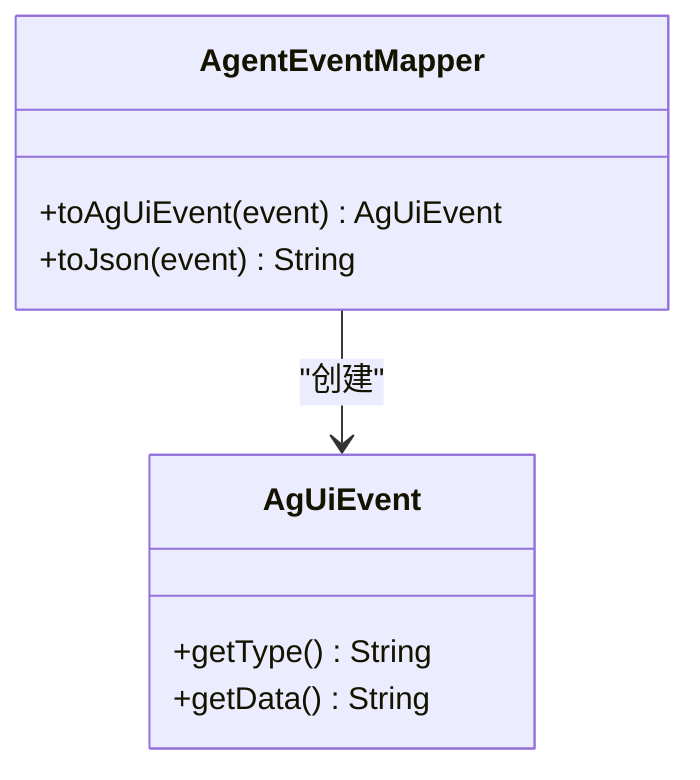
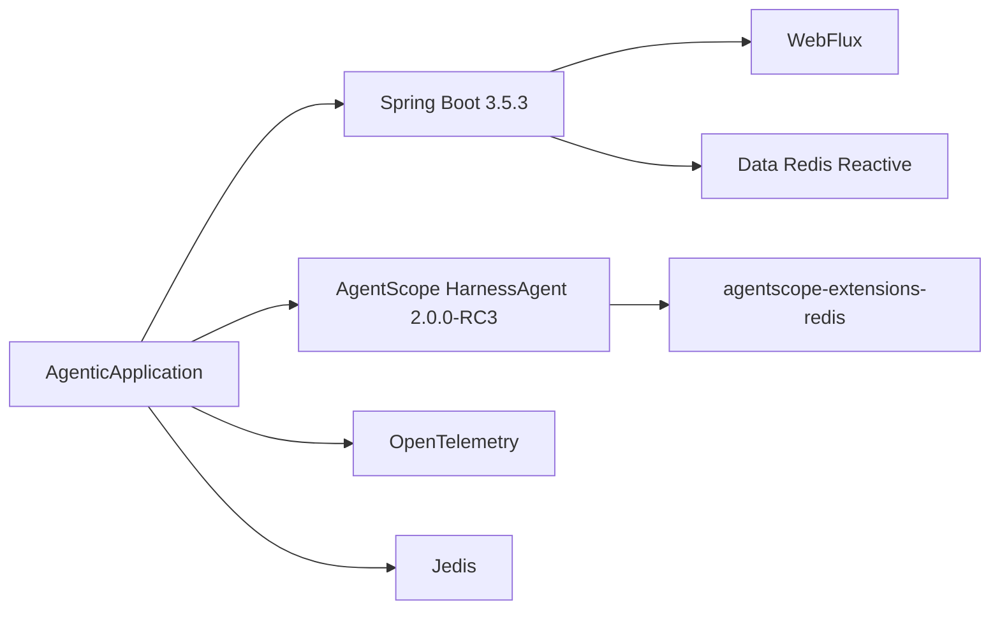

# 项目概述

<cite>
**本文档引用的文件**
- [pom.xml](file://pom.xml)
- [application.yml](file://src/main/resources/application.yml)
- [AgenticApplication.java](file://src/main/java/com/example/agentic/AgenticApplication.java)
- [AgUiEvent.java](file://src/main/java/com/example/agentic/agent/AgUiEvent.java)
- [AgentEventMapper.java](file://src/main/java/com/example/agentic/agent/AgentEventMapper.java)
- [AgentSessionService.java](file://src/main/java/com/example/agentic/agent/AgentSessionService.java)
- [AgUiController.java](file://src/main/java/com/example/agentic/controller/AgUiController.java)
- [McpToolController.java](file://src/main/java/com/example/agentic/controller/McpToolController.java)
- [SkillController.java](file://src/main/java/com/example/agentic/controller/SkillController.java)
- [TenantContextHolder.java](file://src/main/java/com/example/agentic/tenant/TenantContextHolder.java)
- [AgentConfig.java](file://src/main/java/com/example/agentic/config/AgentConfig.java)
- [McpToolConfig.java](file://src/main/java/com/example/agentic/config/McpToolConfig.java)
- [ShutdownConfig.java](file://src/main/java/com/example/agentic/config/ShutdownConfig.java)
- [TracingConfig.java](file://src/main/java/com/example/agentic/config/TracingConfig.java)
- [tools.json](file://src/main/resources/workspace/tools.json)
- [AGENTS.md](file://src/main/resources/workspace/AGENTS.md)
</cite>

## 目录
1. [引言](#引言)
2. [项目结构](#项目结构)
3. [核心组件](#核心组件)
4. [架构总览](#架构总览)
5. [详细组件分析](#详细组件分析)
6. [依赖关系分析](#依赖关系分析)
7. [性能考虑](#性能考虑)
8. [故障排除指南](#故障排除指南)
9. [结论](#结论)
10. [附录](#附录)

## 引言
本项目是一个基于 Spring Boot 3.5.3 的智能代理管理平台，以 AgentScope HarnessAgent 2.0.0-RC3 为核心，结合 Spring WebFlux 实现响应式代理交互，并通过 Redis 支持多租户会话持久化与隔离。平台提供 AG-UI 协议的 SSE 流式输出、MCP 工具动态注册、技能（Skill）工作区管理、以及 OpenTelemetry 全链路追踪能力。其目标是为多租户场景下的智能体应用提供统一的运行与管理界面，支持在安全沙箱中执行脚本与工具调用，同时具备良好的可观测性与可扩展性。

## 项目结构
项目采用典型的 Spring Boot 响应式架构组织，核心模块包括：
- 应用入口与配置：启动类、环境配置、Bean 定义
- 代理会话与事件：HarnessAgent 事件映射、SSE 输出
- 控制器层：AG-UI 运行端点、MCP 工具注册、技能 CRUD
- 多租户上下文：WebFilter 注入租户信息至响应式上下文
- 工作区资源：技能、知识、工具清单等静态资源

**图表来源**
- [AgenticApplication.java:1-23](file://src/main/java/com/example/agentic/AgenticApplication.java#L1-L23)
- [application.yml:1-24](file://src/main/resources/application.yml#L1-L24)
- [AgentConfig.java:1-84](file://src/main/java/com/example/agentic/config/AgentConfig.java#L1-L84)
- [TracingConfig.java:1-45](file://src/main/java/com/example/agentic/config/TracingConfig.java#L1-L45)
- [McpToolConfig.java:1-25](file://src/main/java/com/example/agentic/config/McpToolConfig.java#L1-L25)
- [ShutdownConfig.java:1-21](file://src/main/java/com/example/agentic/config/ShutdownConfig.java#L1-L21)
- [AgUiController.java:1-75](file://src/main/java/com/example/agentic/controller/AgUiController.java#L1-L75)
- [McpToolController.java:1-69](file://src/main/java/com/example/agentic/controller/McpToolController.java#L1-L69)
- [SkillController.java:1-104](file://src/main/java/com/example/agentic/controller/SkillController.java#L1-L104)
- [AgentEventMapper.java:1-120](file://src/main/java/com/example/agentic/agent/AgentEventMapper.java#L1-L120)
- [TenantContextHolder.java:1-59](file://src/main/java/com/example/agentic/tenant/TenantContextHolder.java#L1-L59)
- [AGENTS.md:1-19](file://src/main/resources/workspace/AGENTS.md#L1-L19)
- [tools.json:1-12](file://src/main/resources/workspace/tools.json#L1-L12)

**章节来源**
- [AgenticApplication.java:1-23](file://src/main/java/com/example/agentic/AgenticApplication.java#L1-L23)
- [application.yml:1-24](file://src/main/resources/application.yml#L1-L24)

## 核心组件
- AgentScope HarnessAgent 2.0.0-RC3：智能体核心，提供多租户隔离、分布式存储、上下文压缩、工具结果卸载、中间件链（含 OTEL Tracing）等能力。
- Spring Boot 3.5.3 + WebFlux：实现响应式 HTTP 与 SSE，支持长连接事件流输出。
- Redis 扩展：通过 RedisDistributedStore 实现状态、快照、执行保护等分布式能力，支撑多租户会话持久化。
- AG-UI 协议：标准化的 SSE 事件格式，适配前端交互与状态同步。
- MCP 工具集成：支持运行时动态注册/注销 MCP Server，工具能力可在对话中自动调用。
- 技能（Skill）管理：工作区级技能 CRUD，支持按优先级加载与隔离。
- 多租户上下文：通过 WebFilter 注入租户与用户标识，贯穿响应式链路。

**章节来源**
- [AgentConfig.java:1-84](file://src/main/java/com/example/agentic/config/AgentConfig.java#L1-L84)
- [AgentSessionService.java:1-63](file://src/main/java/com/example/agentic/agent/AgentSessionService.java#L1-L63)
- [AgUiController.java:1-75](file://src/main/java/com/example/agentic/controller/AgUiController.java#L1-L75)
- [McpToolController.java:1-69](file://src/main/java/com/example/agentic/controller/McpToolController.java#L1-L69)
- [SkillController.java:1-104](file://src/main/java/com/example/agentic/controller/SkillController.java#L1-L104)
- [TenantContextHolder.java:1-59](file://src/main/java/com/example/agentic/tenant/TenantContextHolder.java#L1-L59)

## 架构总览
系统采用“控制器-服务-代理-事件”分层，结合多租户上下文与分布式存储，形成可扩展的智能体运行时。

**图表来源**
- [AgUiController.java:1-75](file://src/main/java/com/example/agentic/controller/AgUiController.java#L1-L75)
- [AgentSessionService.java:1-63](file://src/main/java/com/example/agentic/agent/AgentSessionService.java#L1-L63)
- [AgentEventMapper.java:1-120](file://src/main/java/com/example/agentic/agent/AgentEventMapper.java#L1-L120)
- [AgentConfig.java:1-84](file://src/main/java/com/example/agentic/config/AgentConfig.java#L1-L84)
- [TenantContextHolder.java:1-59](file://src/main/java/com/example/agentic/tenant/TenantContextHolder.java#L1-L59)
- [McpToolController.java:1-69](file://src/main/java/com/example/agentic/controller/McpToolController.java#L1-L69)

## 详细组件分析

### AG-UI 协议与 SSE 事件流
- 控制器接收 AG-UI 标准请求，解析 thread_id、run_id 与最后一条用户消息。
- 通过 AgentSessionService 构建 RuntimeContext（包含租户与会话标识），调用 HarnessAgent.streamEvents() 获取事件流。
- AgentEventMapper 将 AgentScope 事件映射为 AG-UI 事件类型（如 RUN_STARTED、TEXT_MESSAGE_CONTENT、TOOL_CALL_START 等），并序列化为 SSE 数据。
- 最终以 ServerSentEvent 形式输出，前端可实时渲染。

**图表来源**
- [AgUiController.java:1-75](file://src/main/java/com/example/agentic/controller/AgUiController.java#L1-L75)
- [AgentSessionService.java:1-63](file://src/main/java/com/example/agentic/agent/AgentSessionService.java#L1-L63)
- [AgentEventMapper.java:1-120](file://src/main/java/com/example/agentic/agent/AgentEventMapper.java#L1-L120)

**章节来源**
- [AgUiController.java:1-75](file://src/main/java/com/example/agentic/controller/AgUiController.java#L1-L75)
- [AgentSessionService.java:1-63](file://src/main/java/com/example/agentic/agent/AgentSessionService.java#L1-L63)
- [AgentEventMapper.java:1-120](file://src/main/java/com/example/agentic/agent/AgentEventMapper.java#L1-L120)
- [AgUiEvent.java:1-24](file://src/main/java/com/example/agentic/agent/AgUiEvent.java#L1-L24)

### 多租户上下文与隔离
- WebFilter 从 HTTP 头部提取 X-Tenant-Id 与 X-User-Id，并注入到 Reactor Context。
- AgentSessionService 基于租户与用户标识构建 RuntimeContext，确保不同租户/用户的会话相互隔离。
- 沙箱隔离策略设置为 SESSION 级别，每个会话拥有独立容器或文件系统视图，避免交叉污染。

**图表来源**
- [TenantContextHolder.java:1-59](file://src/main/java/com/example/agentic/tenant/TenantContextHolder.java#L1-L59)
- [AgentSessionService.java:1-63](file://src/main/java/com/example/agentic/agent/AgentSessionService.java#L1-L63)

**章节来源**
- [TenantContextHolder.java:1-59](file://src/main/java/com/example/agentic/tenant/TenantContextHolder.java#L1-L59)
- [AgentSessionService.java:1-63](file://src/main/java/com/example/agentic/agent/AgentSessionService.java#L1-L63)

### MCP 工具动态注册
- 提供 REST API 用于动态注册/列出/注销 MCP Server，便于在运行时热插拔工具能力。
- 当前实现为占位，后续可接入 McpClient 并注册到 HarnessAgent Toolkit，使智能体在对话中自动发现与调用工具。

**图表来源**
- [McpToolController.java:1-69](file://src/main/java/com/example/agentic/controller/McpToolController.java#L1-L69)
- [McpToolConfig.java:1-25](file://src/main/java/com/example/agentic/config/McpToolConfig.java#L1-L25)

**章节来源**
- [McpToolController.java:1-69](file://src/main/java/com/example/agentic/controller/McpToolController.java#L1-L69)
- [McpToolConfig.java:1-25](file://src/main/java/com/example/agentic/config/McpToolConfig.java#L1-L25)

### 技能（Skill）工作区管理
- 提供工作区级技能 CRUD 接口，技能文件位于工作区的 skills 目录。
- 支持列出、创建、更新、删除技能文件；默认目录在 agent.workspace 下的 skills 子目录。

**图表来源**
- [SkillController.java:1-104](file://src/main/java/com/example/agentic/controller/SkillController.java#L1-L104)

**章节来源**
- [SkillController.java:1-104](file://src/main/java/com/example/agentic/controller/SkillController.java#L1-L104)

### 事件映射与 AG-UI 协议
- 将 AgentScope 的内部事件类型映射为 AG-UI 事件类型，仅暴露对外必要的事件，其余内部事件过滤。
- 支持的事件类型包括：RUN_STARTED、TEXT_MESSAGE_CONTENT、TEXT_MESSAGE_END、TOOL_CALL_START、TOOL_CALL_END、TOOL_CALL_RESULT、RUN_FINISHED。

**图表来源**
- [AgentEventMapper.java:1-120](file://src/main/java/com/example/agentic/agent/AgentEventMapper.java#L1-L120)
- [AgUiEvent.java:1-24](file://src/main/java/com/example/agentic/agent/AgUiEvent.java#L1-L24)

**章节来源**
- [AgentEventMapper.java:1-120](file://src/main/java/com/example/agentic/agent/AgentEventMapper.java#L1-L120)
- [AgUiEvent.java:1-24](file://src/main/java/com/example/agentic/agent/AgUiEvent.java#L1-L24)

### 配置与运行时参数
- 模型配置：基础 URL、API Key、模型名称，支持通过环境变量覆盖。
- 工作区：agent.workspace 指定工作区根目录，开发使用相对路径，生产建议绝对路径。
- 沙箱镜像：默认使用 Python 3.12 slim 镜像，隔离级别为 SESSION。
- Redis：通过 spring.data.redis.url 连接，用于分布式存储与会话持久化。
- OTEL：导出端点可通过环境变量配置，默认指向本地 OTLP 接收器。

**章节来源**
- [application.yml:1-24](file://src/main/resources/application.yml#L1-L24)
- [AgentConfig.java:1-84](file://src/main/java/com/example/agentic/config/AgentConfig.java#L1-L84)

## 依赖关系分析
项目依赖围绕 Spring Boot 3.5.3 与 AgentScope 2.0.0-RC3 构建，关键依赖包括：
- Spring AI Alibaba 与 Spring AI：模型接入与兼容层
- AgentScope HarnessAgent：智能体核心与分布式能力
- Spring Boot WebFlux：响应式 Web 与 SSE
- Redis Reactive Starter：响应式 Redis 访问
- OpenTelemetry：全链路追踪
- Jedis：AgentScope Redis 扩展所需

**图表来源**
- [pom.xml:1-131](file://pom.xml#L1-L131)
- [AgenticApplication.java:1-23](file://src/main/java/com/example/agentic/AgenticApplication.java#L1-L23)

**章节来源**
- [pom.xml:1-131](file://pom.xml#L1-L131)

## 性能考虑
- 响应式流式输出：使用 WebFlux 与 SSE，降低内存占用，提升吞吐。
- 上下文压缩：每 N 条消息触发压缩，保留最近 K 条，减少上下文长度与延迟。
- 工具结果卸载：大体积工具结果落盘并以占位符替代，控制内存峰值。
- 沙箱隔离：SESSION 级别隔离，避免跨会话干扰；DockerFilesystemSpec 控制工作区投影，限制不必要的文件暴露。
- 分布式存储：RedisDistributedStore 统一状态与快照管理，减少重复计算与数据冗余。

**章节来源**
- [AgentConfig.java:1-84](file://src/main/java/com/example/agentic/config/AgentConfig.java#L1-L84)

## 故障排除指南
- SSE 无事件输出
  - 检查控制器是否正确解析 thread_id 与最后一条用户消息
  - 确认租户头 X-Tenant-Id 与 X-User-Id 是否传递
  - 核对 AgentEventMapper 是否存在未映射事件导致过滤
- MCP 工具不可用
  - 确认已通过 /api/tools/mcp 注册 MCP Server
  - 检查 MCP Server 可达性与协议一致性
- 技能 CRUD 失败
  - 确认工作区目录存在且可写
  - 检查文件名与路径是否符合预期
- 多租户串台
  - 确保每次调用都传入正确的 RuntimeContext（包含租户与用户标识）
  - 沙箱隔离级别上线前固定，避免更改导致命名空间变化
- 优雅停机
  - 确认 application.yml 中 server.shutdown=graceful 已生效
  - 如需自定义等待时间，可在 ShutdownConfig 中扩展

**章节来源**
- [AgUiController.java:1-75](file://src/main/java/com/example/agentic/controller/AgUiController.java#L1-L75)
- [AgentSessionService.java:1-63](file://src/main/java/com/example/agentic/agent/AgentSessionService.java#L1-L63)
- [McpToolController.java:1-69](file://src/main/java/com/example/agentic/controller/McpToolController.java#L1-L69)
- [SkillController.java:1-104](file://src/main/java/com/example/agentic/controller/SkillController.java#L1-L104)
- [application.yml:1-24](file://src/main/resources/application.yml#L1-L24)
- [ShutdownConfig.java:1-21](file://src/main/java/com/example/agentic/config/ShutdownConfig.java#L1-L21)

## 结论
本项目以 AgentScope HarnessAgent 为核心，结合 Spring Boot WebFlux、Redis 与 OpenTelemetry，构建了面向多租户场景的智能体管理平台。通过 AG-UI 协议与 SSE 实现流畅的交互体验，配合 MCP 工具动态注册与工作区技能管理，满足复杂业务需求。配置层提供上下文压缩、工具结果卸载与沙箱隔离等优化手段，兼顾性能与安全性。对于初学者，可从 AG-UI 运行端点与技能 CRUD 入手；对于有经验的开发者，可深入分布式存储、事件映射与工具链扩展。

## 附录

### AG-UI 事件映射对照
- AgentStartEvent → RUN_STARTED
- TextBlockDeltaEvent → TEXT_MESSAGE_CONTENT
- TextBlockEndEvent → TEXT_MESSAGE_END
- ToolCallStartEvent → TOOL_CALL_START
- ToolCallEndEvent → TOOL_CALL_END
- ToolResultEndEvent → TOOL_CALL_RESULT
- AgentEndEvent → RUN_FINISHED

**章节来源**
- [AgentEventMapper.java:1-120](file://src/main/java/com/example/agentic/agent/AgentEventMapper.java#L1-L120)

### 工具白名单示例
- 允许工具：read_file、write_file、run_command、memory_search、agent_spawn、read_skill、mcp:*

**章节来源**
- [tools.json:1-12](file://src/main/resources/workspace/tools.json#L1-L12)

### Agent 能力说明
- 回答问题与提供信息
- 在安全沙箱中执行代码与脚本
- 搜索与管理知识
- 调用已注册的 MCP 工具
- 使用已注册的技能

**章节来源**
- [AGENTS.md:1-19](file://src/main/resources/workspace/AGENTS.md#L1-L19)